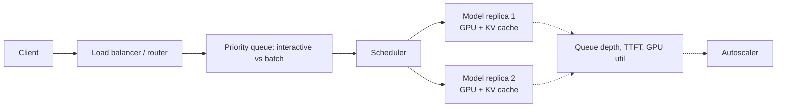

# Design an LLM inference serving platform at scale

## Where this actually gets asked

GPU scheduling, batching, and autoscaling for model serving is one of the most consistently
reported AI-infra system design topics across OpenAI, Anthropic, and Google DeepMind interview
loops — but treat it as a well-documented **archetype**, not a single verbatim question. The
best-attributed source: a Blind post on DeepMind's Applied AI Engineer loop names "efficiency
(quantization/distillation)" and "system architecture/scale" as explicit focus areas of its
ML-system-design round. Prep aggregators (designgurus.io, systemdesignhandbook.com) repeatedly
describe "serve a model like GPT-4/Claude to millions of users" as the framing at OpenAI and
Anthropic specifically, but I could not confirm a single verbatim quote from a primary source
(Glassdoor's own page for this was inaccessible to fetch directly). Write your answer assuming
the interviewer wants to see you reason from first principles about GPU memory and scheduling,
not recite a specific company's stack.

## Requirements

**Functional**
- Users should be able to send a prompt and receive a generated completion, streamed
  token-by-token.
- Support multiple model sizes/variants behind one API (e.g., a fast/cheap model and a
  slower/higher-quality model).
- Support both interactive (chat, low-latency) and batch (offline, throughput-optimized)
  workloads.

**Non-functional**
- Low time-to-first-token (TTFT) for interactive traffic — target under ~200ms P50.
- High aggregate throughput (tokens/sec across the fleet) without starving individual requests.
- GPU memory is the scarcest resource — a 70B-parameter model's KV cache alone can exceed the
  weights' own memory footprint at long context lengths and high concurrency.
- Graceful degradation under load — reject or queue, don't silently degrade quality or crash.

## Core entities

- **Request**: prompt, model, sampling params, arrival time, priority/tier.
- **Sequence**: a request's generation state — tokens generated so far, KV cache blocks it owns.
- **KV cache block**: a fixed-size chunk of GPU memory holding attention keys/values for some
  number of tokens, owned by exactly one sequence at a time (or shared, for prefix caching).
- **Model replica**: one loaded copy of model weights on one or more GPUs (tensor-parallel shards).

## API / interface

A single core method captures the essential complexity — everything else is routing and auth:

```text
POST /v1/completions
{ model, prompt, max_tokens, stream: bool, priority: "interactive" | "batch" }
→ stream of { token, finish_reason }
```

## High-level design



Requests land on a router that classifies them by model and priority tier, then a scheduler
decides which sequences to admit into the next forward pass on a given GPU replica. The single
highest-leverage design decision is **continuous batching**: instead of waiting for a fixed
batch to fully complete before starting new requests (static batching — the naive first
answer), the scheduler adds new sequences into the batch at every decode step as soon as GPU
memory allows, and removes completed sequences immediately. This is the difference between GPU
utilization in the 20-30% range and the 70-90%+ range real serving systems achieve.

## Deep dive 1: KV cache memory management (the actual bottleneck)

The naive approach — pre-allocate each sequence's maximum possible KV cache size contiguously —
wastes enormous memory to fragmentation and over-allocation for sequences that finish early.
**PagedAttention** (the real technique, not a toy simplification) treats the KV cache like an
OS virtual memory system: fixed-size blocks, a block table per sequence mapping logical
positions to physical blocks, allocated on demand as generation proceeds.

I built a real, working simulator of exactly this mechanism —
[vllm-architecture-lab](https://github.com/vpeetla-ai/vllm-architecture-lab)'s
`BlockSpaceManager` implements `allocate`/`free`/`swap`/copy-on-write, and its `Scheduler`
implements 3-queue (running/waiting/swapped) FCFS scheduling with real preemption — when GPU
memory runs out, the scheduler picks a preemption victim (typically lowest-priority or
newest-arrived sequence) and either swaps its KV cache to CPU memory or fully recomputes it
later, rather than the whole system falling over. The KV budget formulas
(`kv_bytes_per_token_per_layer`, `compute_memory_budget`) are real per-model-size math: for a
Llama-3 70B model, KV cache alone can consume more memory per token than the naive "just check
if weights fit" estimate accounts for — this is the number an interviewer is testing whether
you can actually derive, not just name-drop "PagedAttention."

| Approach | Memory efficiency | Complexity | When it's the right call |
|---|---|---|---|
| Static/contiguous pre-allocation | Poor — fragments badly at variable sequence lengths | Low | Never, for production interactive traffic |
| PagedAttention (block-based) | High — near-zero fragmentation | Medium | Default choice for any real serving system |
| Prefix caching on top of paging | Highest for shared-prefix workloads (system prompts, few-shot) | Medium-high | When many requests share a long common prefix (agents, RAG with a fixed system prompt) |

## Deep dive 2: scheduling and fairness under load

Continuous batching alone doesn't guarantee fairness — a scheduler that's purely FCFS can let
one long generation starve a queue of short interactive requests behind it. Real systems
separate interactive and batch traffic into different priority queues (as sketched above), and
within the interactive queue, cap how many decode steps a single sequence can hold before
yielding, so TTFT for new requests stays bounded even under high load from long-running
sequences.

**Common mistake at the mid/senior level:** proposing a single global queue with priority
scores as the entire fairness mechanism. This works until you have to explain what happens when
every request in the queue is "high priority" — the real answer needs an admission-control
layer (reject or queue-with-backpressure once GPU memory/queue depth crosses a threshold), not
just a smarter sort.

## Deep dive 3: cost and capacity planning

GPU-hours are the dominant cost line, so capacity planning is a first-class part of this
design, not an afterthought bolted on post-launch. This is exactly the discipline behind
[agent-finops](https://github.com/vpeetla-ai/agent-finops) — a real, standalone service built
after an audit found two other platforms in the same org computing "cost" from static seed data
or guessed token counts instead of real per-call usage. The same principle applies here at the
infra layer: real per-request token accounting (not estimated), aggregated per model/tenant,
feeding both a cost dashboard and a budget-enforcement gate — the same real vs. fabricated
distinction, one layer down the stack.

## What's expected at each level

- **Mid-level:** proposes a request queue + a pool of model replicas behind a load balancer;
  may not spontaneously bring up KV cache memory pressure without prompting.
- **Senior:** identifies continuous batching over static batching unprompted; can explain why
  KV cache, not weights, is often the binding memory constraint at high concurrency.
- **Staff+:** derives real numbers (KV bytes per token, memory budget vs. concurrent sequences),
  designs the preemption/swap policy explicitly, and separates interactive vs. batch scheduling
  with a stated fairness mechanism — not just "add priorities."
- **Principal:** additionally reasons about the cost model (GPU-hours per token per tier) as a
  design input from the start, and can name the trade-off between serving cost and quality
  (larger model vs. smaller model + speculative decoding, quantization vs. accuracy loss) with
  concrete numbers, not just "it depends."

## Follow-up questions to expect

- "What happens if a GPU dies mid-generation for an in-flight sequence?" (Answer: KV cache for
  in-flight sequences on that GPU is lost; the router needs to detect the failure and either
  fail the request cleanly or replay from the last checkpointed token if you support that.)
- "How would you support very long context (1M+ tokens) without the KV cache dominating
  everything?" (Answer: this is where sparse/sliding-window attention variants and more
  aggressive prefix caching or cache eviction policies come in — a real trade-off against
  quality, not free.)
- "How do you roll out a new model version without downtime?" (Answer: blue/green replica
  pools behind the router, drain old-version replicas of in-flight requests before removing
  them, not a hard cutover.)

## Related

- [vllm-architecture-lab](https://github.com/vpeetla-ai/vllm-architecture-lab) — real PagedAttention block manager + continuous-batching scheduler simulator
- [agent-finops](https://github.com/vpeetla-ai/agent-finops) — real per-call cost metering, the same "real vs. guessed" discipline applied to cost
- [scalability-governance-tradeoffs/01: Cost vs. latency vs. safety](../scalability-governance-tradeoffs/01-cost-vs-latency-vs-safety.md)
