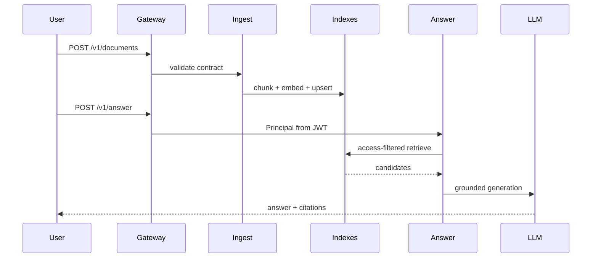
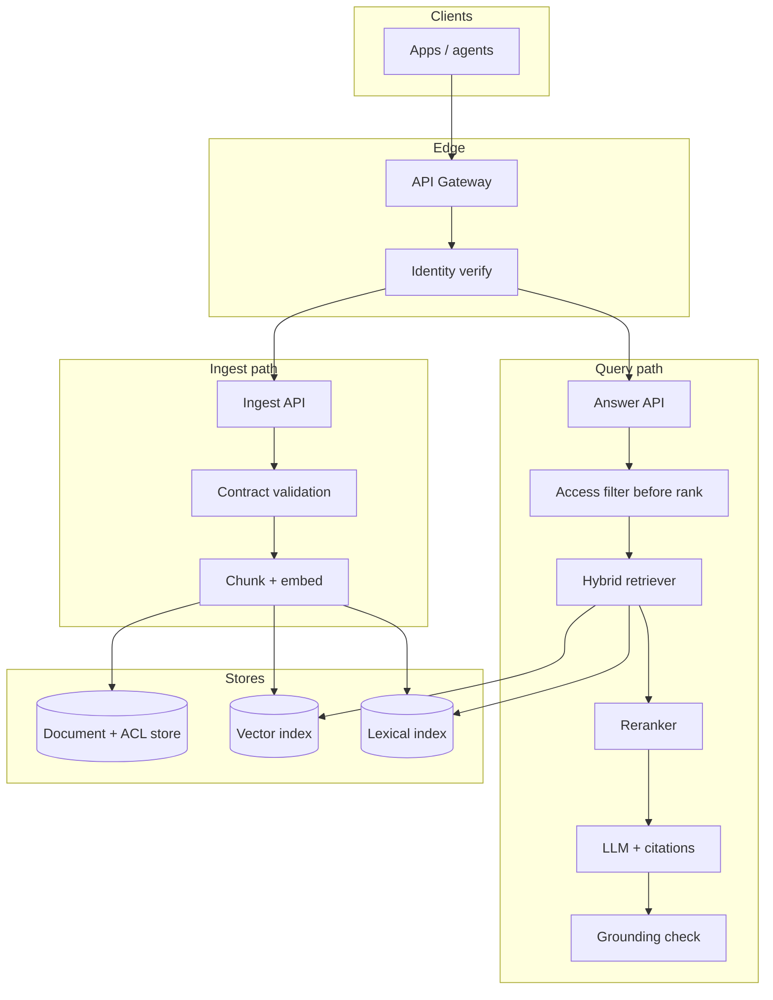

# Design a retrieval-augmented generation (RAG) platform at scale

## Where this actually gets asked

RAG is the best-attributed AI-infra system design topic in this whole set. A Blind post on
Google DeepMind's Applied AI Engineer loop names RAG (factuality/grounding) explicitly as a
focus area. Prep aggregators covering Microsoft AI-adjacent roles cite "RAG ranking and
retrieval pipelines" as a recurring theme. Treat the exact phrasing as company-specific, but
the underlying archetype — "design a system that answers questions grounded in a large,
access-controlled document corpus, at low latency, for millions of documents and thousands of
concurrent users" — as close to universal across every company in this list.

## Requirements

**Functional**
- Ingest documents from heterogeneous sources (uploads, crawlers, internal wikis).
- Answer natural-language queries with a grounded, cited response.
- Respect document-level access control — a user must never see content, or a citation to
  content, they aren't authorized to read.

**Non-functional**
- Billions of chunks indexed; sub-second retrieval latency (P99 under ~300ms for retrieval
  alone, leaving budget for generation).
- Freshness: newly ingested documents queryable within minutes, not hours.
- Grounding correctness matters more than raw retrieval recall — a wrong-but-confident answer
  is worse than a slow correct one.

## Core entities

- **Document**: raw source content, owner, classification/access-control metadata, version.
- **Chunk**: a retrievable unit of a document (embedding + text + lineage back to its source
  document).
- **Principal**: the querying identity — user, tenant, group memberships, clearance level.
- **Citation**: a chunk referenced in a generated answer, with a pointer back to its source.

## API / interface
Auth: verified JWT → server-derived `Principal` (never trust client-asserted ACLs alone).

```http
POST /v1/documents
Authorization: Bearer <token>
{
  "source_uri": "s3://corp-wiki/page-42",
  "owner": "team-platform",
  "classification": "internal",
  "allowed_groups": ["eng","support"],
  "content_hash": "sha256:..."
}
→ 202 {"document_id":"doc_...","ingestion_job_id":"job_...","status":"queued"}
→ 422 {"error":"ingestion_contract_failed","violations":["missing_owner"]}

GET /v1/documents/{document_id} → {"status":"indexed","chunk_count":128}
DELETE /v1/documents/{document_id} → 202 {"invalidation_job_id":"..."}

POST /v1/answer
Authorization: Bearer <token>
{"query":"...","top_k":8,"require_citations":true}
→ 200 {"answer":"...","citations":[...],"grounded":true,"declined":false,"trace_id":"tr_..."}
→ 200 {"answer":null,"declined":true,"reason":"insufficient_grounding","trace_id":"tr_..."}
```

Staff+ callout: ingest, answer, and invalidation are separate contracts — ACL changes after index time need an explicit API path.


## Data Flow


Two flows: ingest (write path) and answer (read path). Access filter runs **before** ranking on the answer path.



## High-level design

Maps to **functional** requirements from step 1 — the component architecture that makes the API and data flow real.



Query comes in with a claimed identity. Retrieval happens in two stages: a cheap, high-recall
first pass (hybrid lexical + dense/semantic search over a vector index) followed by a more
expensive reranker over a much smaller candidate set — this two-stage pattern is the standard
answer to "how do you get both recall and precision without running an expensive reranker over
millions of candidates."

Deep dives below target **non-functional** requirements (latency, scale, failure, cost, security).

## Deep dive 1: access control ordering (the detail that separates Staff+ from Senior)

The instinctive design retrieves the top-k most relevant chunks by score, generates an answer,
*then* checks whether the caller was allowed to see what got cited. That ordering is wrong: if
access control runs after ranking, an unauthorized chunk still enters the LLM's context window
even if its citation gets redacted afterward — the model has already read it, and a
sufficiently leading follow-up question can extract it anyway.

**Real decision, not a hypothetical**: [enterprise_rag_platform](https://github.com/vpeetla-ai/enterprise_rag_platform)'s
`AccessPolicy` filters chunks by the caller's `Principal` *before* they reach the retriever's
scoring step (ADR-002, "authorization before ranking") — an unauthorized chunk is never scored,
reranked, or assembled into context. This is the single most commonly missed detail in this
question, and it's exactly the kind of ordering bug that looks fine in a demo (where everyone
has the same access) and fails silently in production.

The guarantee is only as strong as the identity behind it, though: that same repo's own
disclosed gap (ADR-0004) is that `Principal` was originally client-asserted — trusted from the
request body rather than derived from a verified token. A complete answer to this question
names both halves: filter-before-rank *and* verify the identity you're filtering by, since the
first is worthless without the second.

## Deep dive 2: ingestion data contracts and lineage

A RAG system is only as trustworthy as what got indexed. The naive design accepts any document
posted to the ingest endpoint. **Real finding**: enterprise_rag_platform's ingestion pipeline
had computed data-quality checks (missing owner, missing source URI, near-empty content) that
were silently discarded rather than enforced — a document with no lineage could still get
indexed and cited as if it were trustworthy (ADR-0005/ADR-016). The fix: reject (422) documents
that fail hard checks, and stamp every chunk with a real content hash and ingestion timestamp
that survive every downstream transformation (reranking, graph expansion, an optional
persistent vector store) — so a caller can always answer "when was this actually indexed, and
has its content changed since."

| Ingestion validation approach | What it catches | Cost |
|---|---|---|
| No validation | Nothing — garbage in, cited out | Zero upfront, high downstream trust cost |
| Compute checks, log only | Visibility, no enforcement | Low — but exactly the anti-pattern found here |
| Reject on hard violations | No-owner/no-lineage/near-empty documents never enter the index | Real 422s callers must handle |

## Deep dive 3: freshness vs. index rebuild cost

Real-time ingestion into a vector index at billions-of-chunks scale is expensive if every new
document triggers a full re-embed-and-reindex. The standard answer: incremental upsert into the
vector index (most production vector stores support this natively) plus a background
re-ranking/quality pass, rather than batch-rebuilding the whole index on a schedule. The
trade-off to name explicitly: incremental upsert can leave the index in a slightly inconsistent
state across replicas for a short window — acceptable for most RAG use cases, not acceptable
if the corpus includes fast-moving safety-critical content (e.g., a revoked-document list),
which needs a separate, faster invalidation path.

## What's expected at each level

- **Mid-level:** proposes retrieval → generation with citations; may not raise access control
  as a first-class concern until prompted.
- **Senior:** identifies hybrid retrieval + reranking as the standard two-stage pattern;
  proposes some access filtering.
- **Staff+:** gets the access-control *ordering* right unprompted (before ranking, not after)
  and can explain precisely why after-the-fact redaction is insufficient.
- **Principal:** additionally interrogates the trust chain behind the ordering — is the
  identity being filtered by actually verified, not just asserted — and treats ingestion data
  quality as a first-class design concern, not an implementation detail.

## Follow-up questions to expect

- "How do you handle a document being deleted or its access permissions changing after it's
  already indexed?" (Answer: the index needs a real invalidation path independent of the
  ingestion path, or a periodic reconciliation pass — a common gap in first-draft designs.)
- "How do you evaluate whether your RAG system is actually grounded, not just plausible?"
  (Answer: a real eval suite comparing generated citations against known-correct source
  documents, run as a CI gate — see [system-design/07](07-llm-evaluation-observability-platform.md).)
- "What changes if the corpus is multi-tenant with per-tenant embeddings models?" (Answer:
  the vector index needs tenant-scoped namespaces or separate indices, and the reranker can't
  assume a single shared embedding space.)

## Related

- [enterprise_rag_platform](https://github.com/vpeetla-ai/enterprise_rag_platform) — real access-before-ranking + ingestion data contracts
- [ADR-002: Authorization before ranking](https://github.com/vpeetla-ai/ai-architecture-portfolio/blob/main/adr/ADR-002-authorization-before-ranking-rag.md)
- [ADR-0005/ADR-016: Ingestion data contract + lineage](https://github.com/vpeetla-ai/enterprise_rag_platform/blob/main/docs/adr/0005-ingestion-data-contract-and-lineage.md)
