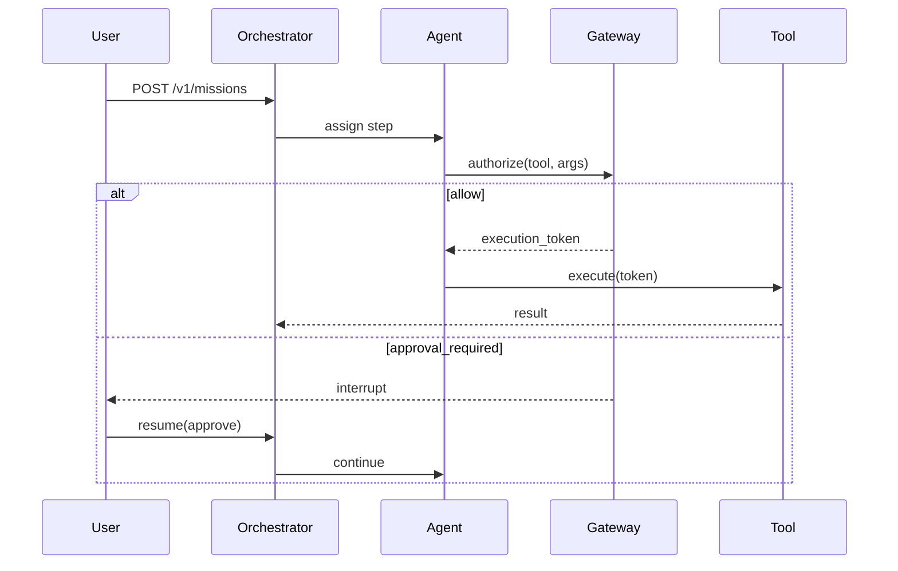
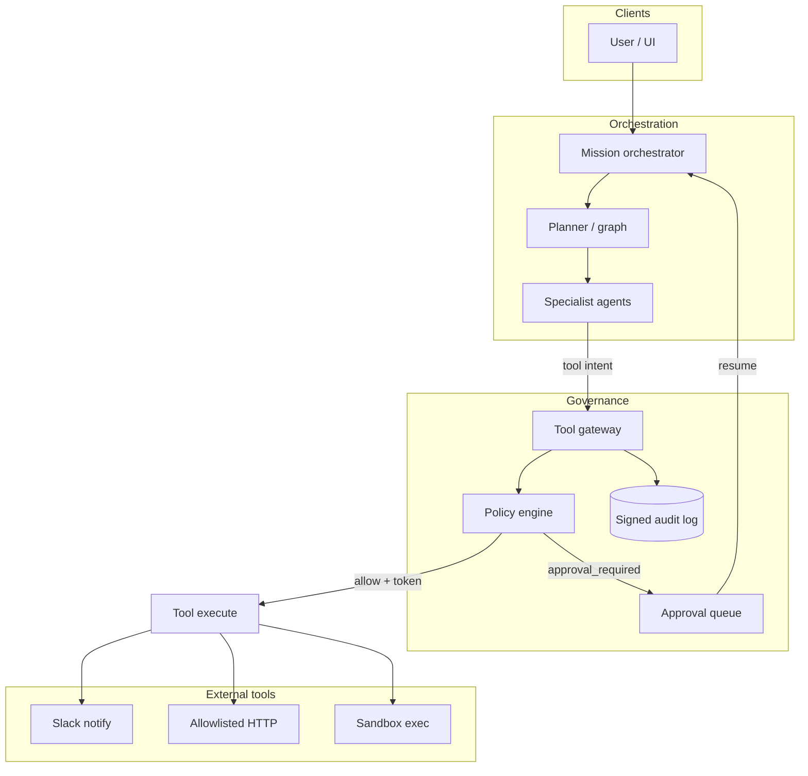

# Design an agent orchestration platform with real tool use


<!-- question-variants:v1 -->

## Expected question

"Design a scalable, enterprise-ready agentic AI platform. How do you architect it for availability, fault tolerance, and scale? Walk me through orchestration, tool use, and governance."

## Variant forms

Interviewers often ask the same design with different framing — recognize the archetype:

- "Design a multi-tenant AI agent system for 50 enterprise clients."
- "How would you scale your EDI agent platform to handle 100× the current load?"
- "You are building a document-processing agentic pipeline. Enterprise SLA: 99.9% uptime, 10,000 documents/day at peak. Walk me through the architecture."
- "Design infrastructure for agents that call Slack, Jira, and internal APIs — with human approval for side effects."
- "How do you prevent one customer's runaway agent from exhausting GPU budget for everyone else?"
- "Design a coding-agent platform like background agents — traces can run 30+ minutes with tool loops."
- "Architect MCP-style tool access so agents cannot bypass policy or exfiltrate credentials."
- "Design multi-agent orchestration: triage agent routes to specialist agents with separate tool surfaces."
- "How would you debug and replay a failed mission that touched five tools across three services?"

## Where this actually gets asked

A Blind post on Google DeepMind's Applied AI Engineer loop names "agent frameworks
(LangChain/LangGraph)" explicitly as an evaluation criterion in its ML-system-design round —
the best direct evidence found for this topic. Anthropic's infra-framed interview rounds
(per Blind write-ups) are described as testing GPU scheduling *and* protocol design (MCP), which
overlaps meaningfully with this question's tool-use surface. Beyond that, treat "design a
platform that lets an LLM take real actions — call APIs, modify records, trigger external
side effects — safely" as a fast-emerging archetype across every company shipping agentic
products in 2026, rather than a single pinned question.

## Requirements

**Functional**
- An agent should be able to decompose a user request, call one or more tools/APIs, and
  synthesize a final response.
- Side-effecting actions (anything beyond read-only generation) need to be gated, not
  auto-executed.
- The system should support multiple specialist agents, each with a narrower tool surface, not
  one agent with access to everything.

**Non-functional**
- Every side-effecting action must be auditable after the fact — who/what triggered it, under
  what policy decision.
- A single misbehaving agent or tool call must not be able to take down the whole platform or
  bypass policy.
- New tools/agents should be addable without redeploying the whole orchestration layer.

## Core entities

- **Agent**: a bounded unit with a specific task, a model, and an allow-listed tool set.
- **Tool call**: an intent to invoke a specific tool with specific arguments.
- **Policy decision**: allow / require-human-approval / deny, for a given tool call.
- **Audit record**: a signed, immutable log entry for every policy decision and executed action.

## API / interface
Auth: user session + agent identity. Side effects require a short-lived gateway execution token.

```http
POST /v1/missions
Authorization: Bearer <user_token>
{"message":"Summarize overnight incidents and notify Slack","thread_id":"thr_..."}
→ 200 {"mission_id":"mis_...","status":"running|awaiting_approval","interrupt":null|{...}}

POST /v1/missions/{mission_id}/resume
{"decision":"approve","approver_id":"u_..."} → 200 {"status":"running"}

POST /v1/gateway/authorize
Authorization: Bearer <agent_token>
{"mission_id":"mis_...","agent_id":"notifier","tool":"slack.notify","args":{...},"risk_signals":{...}}
→ 200 {"decision":"allow","execution_token":"et_...","expires_in_sec":30}
→ 200 {"decision":"approval_required","approval_id":"ap_..."}
→ 403 {"decision":"deny","reason":"policy_violation","rule_id":"..."}

POST /v1/tools/execute
{"execution_token":"et_...","tool":"slack.notify","args":{...}}
→ 200 {"result":{...},"audit_id":"aud_..."}
```

Staff+ callout: authorize ≠ execute. Tokens are single-use and audited; resume is a separate HITL API.


## Data Flow


Mission plan → agent work → gateway authorize → (optional HITL) → execute with short-lived token.



## High-level design

Maps to **functional** requirements from step 1 — the component architecture that makes the API and data flow real.



The first design decision that separates a strong answer from a generic one: **orchestration
and governance are separate systems, not one module.** The instinctive design merges "decide
what to do" and "decide if it's allowed" into a single agent framework — simpler at first,
but it breaks down because orchestration logic (new agents, new routing intents) needs to
change constantly, while governance logic (what counts as high-risk, audit format) needs to
change rarely and auditably, since policy changes are compliance events.

**Real decision**: this is exactly [ADR-001](https://github.com/vpeetla-ai/ai-architecture-portfolio/blob/main/adr/ADR-001-orchestration-vs-governance-split.md) —
[venkat-ai-platform](https://github.com/vpeetla-ai/venkat-ai-platform) owns orchestration
(routing, specialist delegation), [AegisAI](https://github.com/vpeetla-ai/aegisai-enterprise-agent-platform)
owns governance (policy, HITL, signed audit) as a genuinely separate, independently-deployable
system. Every side-effecting tool call, regardless of which orchestrator or specialist agent
triggered it, routes through the same gateway.

Deep dives below target **non-functional** requirements (latency, scale, failure, cost, security).

## Deep dive 1: the gateway pattern for side-effecting actions

The naive design puts a policy check inline in each agent's code — "before this agent calls
the refund API, check if it's allowed." That doesn't scale: every new agent reimplements the
check, and there's no single place to answer "what is any agent in this fleet allowed to do."

**Real implementation**: a gateway SDK all agents call through, so every side-effecting tool
call passes the same OPA-backed policy engine and lands in the same signed audit trail. Actions
above a risk threshold require human approval before execution — not agent-configurable. The
policy engine is **advisory, not a hard dependency**: if the policy engine itself is
unavailable, the system falls back to a conservative builtin simulator rather than blocking
every agent action outright — a real, disclosed trade-off between strict enforcement and
availability, specifically scoped to when the *enforcement mechanism* fails, not to when a
policy says no.

| Design | Blast radius of a bug | Auditability | Scales to N agents |
|---|---|---|---|
| Inline per-agent checks | High — each agent's bug is independent | Fragmented, per-agent logs | Poorly — N reimplementations |
| Shared gateway, all side effects | Low — one enforcement point to get right | Single audit trail | Yes |

## Deep dive 2: exposing the platform's own capabilities as a real protocol surface

Most designs stop at "agents call tools." A stronger answer treats the platform itself as
something that speaks a real protocol both ways. **Real implementation**: AegisAI's
`McpGovernanceProxy` already gated *outbound* MCP tool calls (an agent calling an external MCP
server like GitHub or Slack) through the same policy path above. The gap: nothing exposed the
platform's *own* governed capabilities (agent registry, budget status, kill-switch state,
orchestrator runs) as MCP tools an external client (e.g., Claude Code) could call in. The fix —
[ADR-0005](https://github.com/vpeetla-ai/aegisai-enterprise-agent-platform/blob/main/adr/0005-mcp-tool-exposure.md) —
is a thin protocol adapter over the *same* governed core: an MCP call to `run_website_build`
invokes the exact same orchestrator object an HTTP caller would, with the same enforcement.
**The design principle that generalizes**: a new protocol surface should never be a second,
parallel path that could accidentally bypass governance — it should be a thin adapter over
logic that's already governed.

The same principle applies to agent-to-agent communication. A naive integration between two
orchestrators is "one calls the other's HTTP endpoint" with no discovery step. **Real
implementation**: VAP exposes a genuine A2A discovery surface (`GET /orchestrators/{id}/agent-
card`); a consumer system (AegisLoop) originally skipped that and guessed the target
orchestrator from a hardcoded map — fixed in [ADR-013](https://github.com/vpeetla-ai/ai-architecture-portfolio/blob/main/adr/ADR-013-mcp-exposure-and-real-a2a-delegation.md)
to call the real agent-card endpoint first, and only proceed if discovery succeeds. Small
change, but the difference between "two services that happen to talk" and a genuine protocol
handshake.

## Deep dive 3: containing a misbehaving agent

If one specialist agent starts making excessive or runaway tool calls (a bug, a prompt
injection, or a cost blowup), the platform needs a real circuit breaker, not just logging.
Concretely: a kill-switch service that can block a specific agent, tool, or workflow scope
immediately, and a real cost-metering layer (see
[system-design/01](01-llm-inference-serving-at-scale.md)'s cost deep dive and
[agent-finops](https://github.com/vpeetla-ai/agent-finops)) that halts dispatch on budget
breach — two independent containment mechanisms for two different failure modes (behavioral
and financial), not one generic "something's wrong, page someone" alert.

## What's expected at each level

- **Mid-level:** proposes an orchestrator that routes to specialist agents and calls tools
  directly.
- **Senior:** separates read-only generation from side-effecting actions and proposes some
  approval gate for the latter.
- **Staff+:** designs orchestration and governance as genuinely separate systems, names the
  fail-open/fail-closed trade-off for the policy engine explicitly, and can explain why a
  shared gateway beats per-agent inline checks.
- **Principal:** additionally treats the platform's own protocol surface (MCP/A2A exposure) as
  a governed extension of the same core rather than a bolt-on, and designs containment for both
  behavioral and financial failure modes independently.

## Follow-up questions to expect

- "How do you version a policy without breaking agents that were built against the old
  policy?" (Answer: policy decisions should be evaluated against the policy version active at
  call time, with a deprecation window, not a hard cutover.)
- "What happens if the audit log itself is compromised?" (Answer: signed audit packets — HMAC
  or KMS-backed — so tampering is detectable even if the log store itself is compromised.)
- "How would you let a human approver see enough context to make a good decision in seconds,
  not minutes?" (Answer: the HITL queue needs the risk signals and a summary, not a raw tool-call
  payload — this is a UX design question disguised as a systems one.)
- "45-minute scope?" (Answer: mission API + gateway + HITL; defer full MCP/A2A protocol design unless steered there.)

## Related

- [ADR-001: Orchestration vs governance split](https://github.com/vpeetla-ai/ai-architecture-portfolio/blob/main/adr/ADR-001-orchestration-vs-governance-split.md)
- [ADR-0005: MCP tool exposure](https://github.com/vpeetla-ai/aegisai-enterprise-agent-platform/blob/main/adr/0005-mcp-tool-exposure.md)
- [ADR-013: Bidirectional MCP + real A2A discovery](https://github.com/vpeetla-ai/ai-architecture-portfolio/blob/main/adr/ADR-013-mcp-exposure-and-real-a2a-delegation.md)
- [scalability-governance-tradeoffs/03: Centralize vs. federate governance](../scalability-governance-tradeoffs/03-centralize-vs-federate-governance.md)
