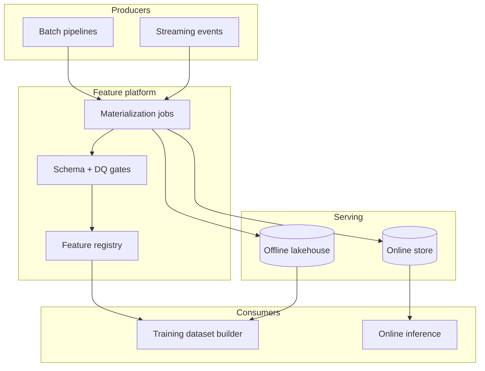

# Design a feature store / fine-tuning data pipeline

## Where this actually gets asked

This is the weakest-evidenced topic in this set for the six companies in scope — no
company-specific attributed question was confirmed for OpenAI, Anthropic, Meta, Google,
Microsoft, or Apple specifically. What exists publicly is mostly adjacent-company material
(e.g., Scale AI's own interview guides describe RLHF/fine-tuning data pipeline stages) or
generic MLOps system design content not pinned to a specific employer. Treat this as a
well-established *type* of question in ML infrastructure interviews broadly — feature stores
and training-data pipelines are a mature, widely-taught system design topic — rather than a
confirmed big-tech-specific prompt. Answer it on its technical merits.

## Requirements

**Functional**
- Data scientists should be able to define a feature once and use it consistently for both
  model training (offline, batch) and real-time inference (online, low-latency).
- Support point-in-time correct joins — a training example must only see feature values that
  were actually available *at the time* the label was generated, not values computed later.
- Fine-tuning/training jobs need a versioned, reproducible snapshot of the data they were
  trained on.

**Non-functional**
- Online feature lookup: single-digit-millisecond latency at inference time.
- Offline feature computation: can tolerate minutes-to-hours latency, optimized for throughput
  over a huge historical dataset.
- Training-serving skew must be structurally prevented, not just tested for after the fact.

## Core entities

- **Feature definition**: name, computation logic, data source, freshness SLA.
- **Feature value**: a computed value for one entity (user, document, session) at a point in
  time.
- **Dataset snapshot**: an immutable, versioned join of features + labels used for one training
  run.
- **Training/fine-tuning job**: references exactly one dataset snapshot, never a live, mutable
  query.

## API / interface
Auth: service identity for writers; training jobs read via scoped dataset tokens.

```http
POST /v1/feature-sets
{"name":"user_engagement_v3","entity_keys":["user_id"],"ttl_hours":24}
→ 201 {"feature_set_id":"fs_...","version":1}

POST /v1/feature-sets/{id}/materialize
{"mode":"offline","as_of":"2026-07-01T00:00:00Z"} → 202 {"job_id":"mat_..."}

GET /v1/online-features
{"feature_set_id":"fs_...","entities":[{"user_id":"u_1"}],"features":["click_7d"]}
→ 200 {"entities":[{"user_id":"u_1","values":{"click_7d":0.12},"event_time":"..."}]}

POST /v1/training-datasets
{"feature_set_id":"fs_...","label_source":"s3://labels/...","point_in_time":true,
 "train_window":{"start":"...","end":"..."}}
→ 202 {"dataset_id":"ds_...","lineage_id":"lin_..."}

GET /v1/training-datasets/{dataset_id}
→ {"status":"ready","uri":"s3://...","row_count":12000000,"lineage":{...}}
```

Staff+ callout: point-in-time correctness belongs in the training-dataset API contract, not a notebook convention.


## Data Flow


Offline materialization feeds training datasets; online path serves low-latency feature vectors at inference.

```mermaid
sequenceDiagram
  participant P as Producer job
  participant M as Materializer
  participant Off as Offline store
  participant On as Online store
  participant Tr as Training builder
  participant Inf as Inference
  P->>M: new events / batch
  M->>Off: point-in-time tables
  M->>On: serve features
  Tr->>Off: build training dataset
  Inf->>On: GET online-features
```

## High-level design

Maps to **functional** requirements from step 1 — the component architecture that makes the API and data flow real.



The core architectural decision is the **dual-store pattern**: the same feature computation
logic writes to both an offline store (optimized for large historical range scans, used to
build training datasets) and an online store (optimized for point lookups by entity ID, used
at inference time). The alternative — compute features differently for training vs. serving —
is the single most common root cause of training-serving skew in real ML systems, and a strong
answer should name this explicitly as the failure mode being designed against.

Deep dives below target **non-functional** requirements (latency, scale, failure, cost, security).

## Deep dive 1: point-in-time correctness

The naive dataset-building approach joins the latest feature values to historical labels. This
leaks future information into training — a feature that reflects "user's total purchases,"
computed *today*, joined against a label from six months ago, tells the model something it
couldn't have known at prediction time. The correct join is `as_of_time`-aware: for each label,
fetch the feature value as it existed at that label's timestamp, not the current value.

| Approach | Leakage risk | Implementation cost |
|---|---|---|
| Join current feature values to historical labels | High — silent, doesn't show up until production accuracy diverges from offline eval | Low, tempting default |
| Point-in-time join against a versioned feature history | None (correct by construction) | Higher — requires storing feature value history, not just current state |

This is the deep-dive question a Staff+ candidate should raise unprompted, because it's the
kind of bug that produces a model that looks great in offline eval and silently underperforms
in production — exactly the failure mode a rigorous eval practice (see
[system-design/07](07-llm-evaluation-observability-platform.md)) is supposed to catch, but only
if the training data itself wasn't already contaminated.

## Deep dive 2: data lineage and reproducibility

A fine-tuning job that can't say exactly what data it was trained on is a compliance and
debugging liability — if a fine-tuned model produces a bad output, you need to trace it back to
what training data might be responsible, and re-run that exact snapshot to reproduce a bug.

**The adjacent real system I've actually built**, not a full feature store but the same
underlying discipline: [enterprise_rag_platform](https://github.com/vpeetla-ai/enterprise_rag_platform)'s
ingestion pipeline stamps every indexed chunk with a real content hash and ingestion timestamp
that survive every downstream transformation (ADR-0005/ADR-016) — the same "can you actually
answer *when was this data captured and has it changed since*" discipline a training-data
pipeline needs, applied to a retrieval index instead of a training set. The generalizable
principle: lineage metadata that's computed but not enforced (or not propagated through every
transformation) is not real lineage — a real audit found exactly this gap (three places in the
codebase reconstructed the data object explicitly and silently dropped the lineage fields to
their defaults) and it's the same class of bug that would let a training pipeline silently lose
track of what a dataset snapshot actually contains.

## Deep dive 3: freshness vs. compute cost trade-off

Recomputing every feature for every entity on every write is wasteful; recomputing only on a
schedule risks staleness. The standard answer: event-driven incremental computation for
features that change frequently (recent activity counts), scheduled batch recomputation for
features that are expensive and change slowly (aggregate historical statistics) — naming which
features belong in which bucket, with a concrete example, is what separates a Staff-level
answer from "we'll just recompute everything hourly."

## Deep dive 4: exact reproducibility as a bit-level contract, not a policy statement

"We track lineage" is a Staff-level claim; a Principal-level answer specifies what reproducing a
training set actually requires: a content-hash of the *feature computation logic itself*
(not just its output) alongside the input snapshot's own hash, so that "rerun this exact
training set six months later" means re-executing the identical transformation code against the
identical input data, byte-for-byte — not just "the same feature names with roughly the same
values." Without hashing the transformation logic, a silent library upgrade or a refactored
feature-computation function can change output values without changing anything the lineage
system was tracking, breaking reproducibility invisibly. This matters concretely for compliance
and incident response: if a fine-tuned model is later found to have learned something harmful
from its training data, "what exact data and exact transformation produced this checkpoint" needs
to be an answerable, bit-exact question, not an approximate one.

The backfill cost this implies is also a real, numbers-driven decision: recomputing a feature
over N months of historical data at a non-trivial per-entity compute cost (e.g., an aggregate
statistic requiring a full scan of historical events) can be a multi-hour-to-multi-day batch job
at real data volumes — a Principal-level answer sizes this cost before committing to "we'll just
backfill it," and considers whether a cheaper, approximate backfill (computed only for entities
actually needed by the current training run, not the full historical population) is acceptable
given the reproducibility contract above.

## Deep dive 5: schema evolution, dual-write sync, and RTBF (interview-critical, keep short)

**Schema / backfill:** never mutate a feature definition in place for breaking changes — bump a SemVer
(`user_engagement@2.0.0`) and materialize into a new offline partition. Legacy training snapshots keep
pointing at v1; new jobs opt into v2. That isolates backfill blast radius without rewriting history.

**Streaming dual-write:** one computation path fans out to online + offline. Online writes must be
**idempotent** (`entity_id + event_time`); offline commits via checkpointed batches. On crash, replay
the log — Redis/Dynamo overwrites safely; uncommitted lake files are abandoned. Do **not** invent a
full XA/2PC story unless asked — idempotent online + checkpointed offline is the Staff+ answer.

**GDPR vs immutability:** "immutable snapshot" conflicts with right-to-be-forgotten. Prefer
pseudonymization at ingest, or rebuild a scrubbed snapshot with a **new** content hash — never silently
rewrite a published lineage id. Say this in one breath when compliance comes up.

## What's expected at each level

- **Mid-level:** proposes a single feature table used for both training and serving; may not
  spontaneously identify training-serving skew as a risk.
- **Senior:** proposes separate online/offline stores; identifies training-serving skew as a
  named risk to design against.
- **Staff+:** insists on point-in-time-correct joins unprompted, and can explain precisely why
  naive "join latest value" leaks future information.
- **Principal:** additionally specifies reproducibility as a content-hash contract over both the
  transformation logic and the input snapshot (not just "we track lineage" as a policy
  statement), and sizes the real compute cost of a historical backfill before committing to it —
  treating exact reproducibility as an incident-response and compliance requirement, not a
  nice-to-have.

## Follow-up questions to expect

- "How do you backfill a new feature into historical training data?" (Answer: this requires the
  feature's computation logic to be replayable against historical raw data, which is why raw
  source retention — not just computed feature retention — matters.)
- "How do you detect feature drift between training and production?" (Answer: monitor the
  statistical distribution of online-served feature values against the distribution in the
  training snapshot, alert on divergence.)
- "What's different about this for a fine-tuning pipeline specifically, versus a classic
  tabular ML feature store?" (Answer: the "features" become prompt/completion pairs or
  preference comparisons, but point-in-time correctness and lineage requirements are identical
  in spirit — you still need to know exactly what data a given fine-tuned checkpoint saw.)
- "How do prompt templates / tokenization fit a fine-tuning feature store?" (Answer: version the prompt template as a first-class artifact; prefer tokenizing in the training job unless you need bit-exact token arrays in the store — changing a tokenizer is a major feature version.)
- "In 45 minutes, what do you refuse to design?" (Answer: a full Feast/Tecton product catalog. Anchor on dual-store + PIT join + immutable snapshot + one of: schema versioning, dual-write sync, or RTBF.)

## Related

- [enterprise_rag_platform ADR-0005/ADR-016: Ingestion data contract + lineage](https://github.com/vpeetla-ai/enterprise_rag_platform/blob/main/docs/adr/0005-ingestion-data-contract-and-lineage.md)
- [system-design/08: Fine-tuning/RLHF training pipeline at scale](08-finetuning-rlhf-training-pipeline-at-scale.md)
