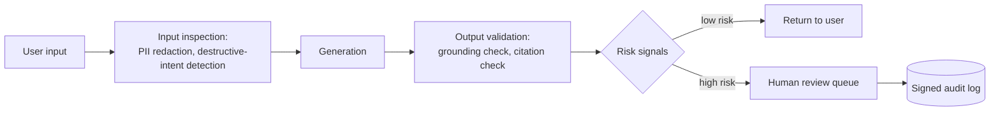

# Design a content moderation and safety system for generated content

## Where this actually gets asked

One secondary source describes Meta asking a "design a scalable content moderation system using
LLMs" style question; OpenAI's public emphasis on moderation-as-core-requirement (their own
published moderation API, safety-focused system cards) is well-documented, but I could not
confirm a single verbatim, sourced interview question from Glassdoor/Blind for OpenAI or
Anthropic specifically. Treat this as a strong, well-motivated *archetype* — every company
shipping generative AI at scale has to answer this question in production, whether or not it's
been reported as an exact interview prompt.

## Requirements

**Functional**
- Every generated output (and every user input, before it reaches the model) should be
  checkable against a safety policy before it's shown to a user or acted upon.
- Different risk categories (PII exposure, destructive actions, policy-violating content) need
  different handling — some auto-block, some require human review, some just get logged.
- Human reviewers need a queue with enough context to make a fast, correct decision.

**Non-functional**
- Input-side checks must add minimal latency to the interactive path (single-digit milliseconds
  ideally, not a network round-trip to a separate heavyweight classifier for every request).
- The system must fail toward safety, not availability, for the highest-risk categories — but
  that choice needs to be explicit and scoped, not a blanket "always block on any failure."
- Every moderation decision needs to be auditable — what was checked, what fired, what happened
  next.

## Core entities

- **Input inspection result**: flags raised on the raw user input (PII detected, destructive
  intent detected) before generation.
- **Output validation result**: flags raised on the generated content (ungrounded claim,
  policy-violating content, missing citation).
- **Risk signal**: a named, scored indicator (not a single "is this bad" boolean) feeding a
  policy decision.
- **Review case**: a human-in-the-loop queue item, with enough context to decide without
  re-deriving the risk signals from scratch.

## API / interface

```text
inspect_input(text) → { redacted_text, flags: ["sensitive_input_redacted", "human_approval_required"] }
validate_output(answer, context) → { grounded: bool, flags: ["missing_citation", "unknown_citation"] }
```

## High-level design



The key structural decision: moderation is **two separate checkpoints**, not one. Input-side
inspection catches sensitive or destructive intent *before* generation even happens (so you
never generate a response to "here's my SSN, use it to..."). Output-side validation catches
whether the *generated* content is actually grounded and safe, independent of what the input
looked like — a perfectly innocent-looking prompt can still produce an ungrounded or unsafe
completion.

## Deep dive 1: real, working input/output guardrails, not a placeholder

**Real implementation**: [enterprise_rag_platform](https://github.com/vpeetla-ai/enterprise_rag_platform)'s
`GuardrailService` does both halves for real — `inspect_input()` redacts detected PII (email,
payment-card patterns) and flags destructive-intent keywords (delete, refund, terminate)
against a real regex-based detector, returning both the redacted text *and* the flags raised so
downstream logic knows what fired, not just a pass/fail boolean. `validate_output()` checks
whether the generated answer actually cites real, retrieved context — if the model's response
doesn't reference any real citation, or references one that wasn't actually retrieved, that's a
flagged `missing_citation`/`unknown_citation` risk signal, checked independently of whatever the
input looked like.

**The subtlety that separates a strong answer**: a redacted query can lose the exact terms a
retrieval-based system needs to ground correctly. A query like "delete my account, my email is
x@example.com" gets its email redacted before retrieval runs — if the underlying knowledge base
has no content about "account deletion" specifically, the redacted query fails to ground at
all, and you get an ungrounded-but-safe answer instead of a grounded-and-safe one. This is a
real trade-off between safety (never let PII reach a retrieval/logging layer) and grounding
quality (the redacted query needs to retain enough signal to actually retrieve the right
content) — not something you get for free by bolting a redaction step onto an existing
pipeline without checking what it does to retrieval quality.

## Deep dive 2: routing risk signals to the right response, not one binary gate

A common weak answer treats moderation as one gate: safe or blocked. A stronger design routes
different risk categories to different responses:

| Risk signal | Response |
|---|---|
| PII detected in input | Redact before it reaches retrieval/logging; don't block the whole request |
| Destructive-action intent detected | Flag for human approval before executing anything, not before generating a *response about* it |
| Output missing a real citation | Flag as ungrounded; either regenerate, or surface a "low confidence" indicator, don't silently ship it as if fully grounded |
| Output cites something never retrieved | Hard block — this indicates a generation/retrieval mismatch bug, not just a risk to disclose |

**Real, disclosed trade-off**: whether to fail-open or fail-closed when the moderation system
itself is unavailable is genuinely different per category — the same principle as the
governance gateway in [system-design/03](03-agent-tool-use-orchestration-platform.md): a policy
engine that's advisory (fails open when it's down) is the right call for classification
decisions where availability matters more than perfect enforcement, and the wrong call for
anything that gates an irreversible action.

## Deep dive 3: the human review loop as a real system, not an afterthought

Human-in-the-loop only works if the reviewer has enough context to decide fast. Passing a
reviewer the raw risk signals and a summary — not the full conversation transcript they have to
re-read from scratch — is what makes the review queue actually usable at volume. This connects
directly to audit design: every review decision needs to be logged with the same rigor as the
automated ones, since "a human approved it" needs to be provably true after the fact, not just
asserted.

## What's expected at each level

- **Mid-level:** proposes a single classifier that flags "bad" content and blocks it.
- **Senior:** separates input-side and output-side checks; proposes a human review queue for
  ambiguous cases.
- **Staff+:** names the redaction-vs-grounding trade-off explicitly, and routes different risk
  categories to different responses rather than one binary gate.
- **Principal:** additionally treats fail-open/fail-closed as a per-category design decision
  (not a global policy), and designs the human review experience itself as a first-class part
  of the system, not an implementation detail.

## Follow-up questions to expect

- "How do you evaluate whether your safety system is actually catching what it should, without
  a flood of false positives?" (Answer: a real eval suite of known-bad and known-good inputs,
  run as a regression gate — same discipline as
  [system-design/07](07-llm-evaluation-observability-platform.md).)
- "What happens when a user tries many small variations of a blocked request to find one that
  slips through?" (Answer: rate-limit and pattern-detect repeated near-miss attempts at the
  session level, not just per-request.)
- "How do you handle moderation for a new risk category you didn't anticipate at launch?"
  (Answer: the risk-signal architecture needs to support adding new named flags without a full
  redeploy of the classification pipeline — a config/policy change, not a code change.)

## Related

- [enterprise_rag_platform's `GuardrailService`](https://github.com/vpeetla-ai/enterprise_rag_platform) — real input redaction + output grounding checks
- [system-design/03: Agent orchestration platform](03-agent-tool-use-orchestration-platform.md) — the same fail-open/fail-closed reasoning applied to side-effecting actions
