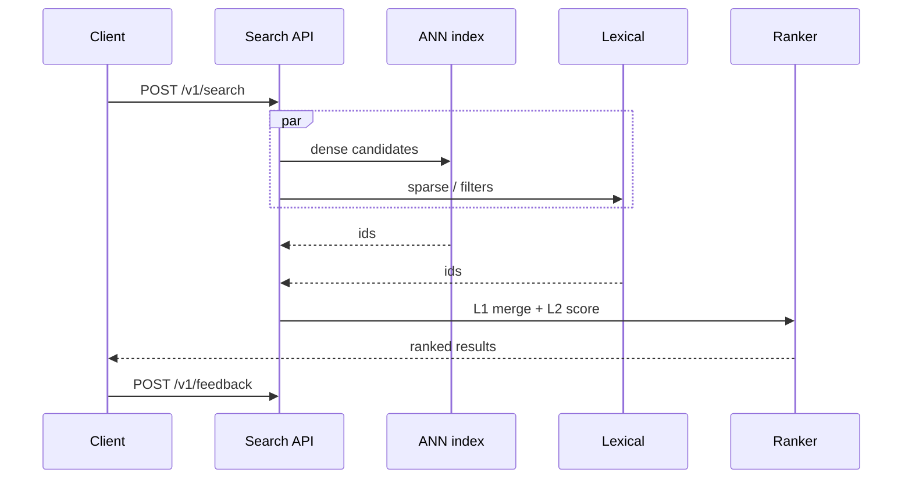
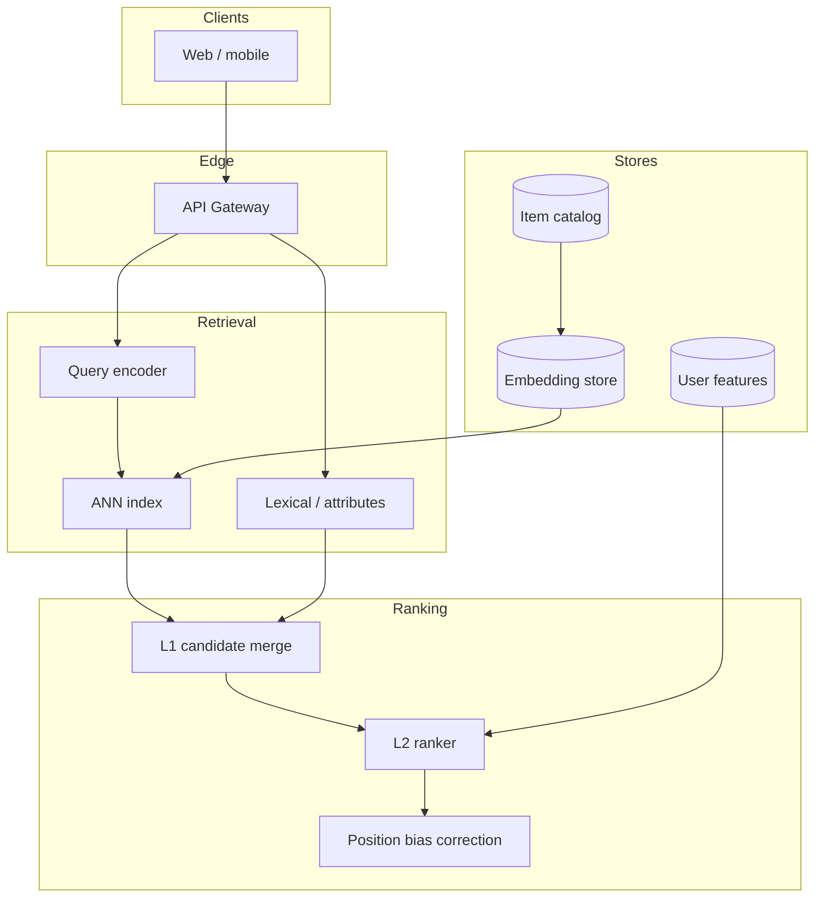

# Design a multimodal search / recommendation system


<!-- question-variants:v1 -->

## Expected question

"Design a multimodal search and recommendation system (text, image, video). How do you index, retrieve, rank, and serve personalized results at scale?"

## Variant forms

Interviewers often ask the same design with different framing — recognize the archetype:

- "Design Pinterest-style visual search — upload an image, get similar products."
- "How do you recommend short-form video with multimodal embeddings and real-time feedback?"
- "Design a commerce search that blends lexical, vector, and visual signals."
- "Scale ANN search to 10B multimodal vectors — what index and sharding strategy?"
- "How do you correct position bias and popularity bias in a feed ranking system?"
- "Design cold-start recommendations for new users with only a few clicks."
- "Architect near-real-time feature updates for trending content without full reindex."

## Where this actually gets asked

Meta has the best-attributed evidence in this entire set for a recommendation-flavored
question: Blind threads ("Meta ML System Design," "Meta MLE E6 ML System Design Interview")
plus Meta's own published prep guide describe recurring prompts like "design a personalized
news ranking system" and "design a product recommendation system." These are classic
recsys/ranking questions, not multimodal-specific — I found no company-attributed evidence of
a *multimodal* (text+image+video) version of this question for any of the six companies in
scope. Answer the recsys core well; treat the multimodal extension as a natural follow-up
direction an interviewer might push toward, not the headline framing.

**Honest note on grounding**: unlike the other entries in this playbook, I don't have a full
shipped recommendation system of my own to point to — the closest real overlap is
[enterprise_rag_platform](https://github.com/vpeetla-ai/enterprise_rag_platform)'s retrieval +
reranking core, which shares real architecture with recsys candidate generation and ranking.
Where I reference it below, it's a genuine partial analog, not a claim that I've built a full
recommendation system.

## Requirements

**Functional**
- Given a user (or a query), return a ranked list of relevant items (posts, products, videos)
  drawn from a catalog of hundreds of millions to billions of items.
- Support multiple content modalities in the catalog (text, image, video) with a unified
  relevance signal.
- Personalize ranking based on user history/context, not just query-item relevance alone.

**Non-functional**
- End-to-end latency budget in the tens of milliseconds at serving time, against a catalog far
  too large to score exhaustively per request.
- Freshness: new items (especially time-sensitive ones like news or trending content) need to
  enter the candidate pool within minutes.
- Diversity and fairness constraints — pure relevance-maximization can produce a feed that's
  technically "relevant" but narrow or harmful at the margins.

## Core entities

- **Item**: content with one or more modality-specific embeddings (text, image, video) plus
  metadata (recency, engagement stats).
- **User profile**: historical interactions, embeddings derived from behavior.
- **Candidate set**: a small (hundreds to low thousands) subset of the catalog selected for
  full ranking.
- **Ranking score**: the model's predicted relevance/engagement probability for a
  (user, item) pair.

## API / interface
Auth: end-user token; tenant-scoped indexes.

```http
POST /v1/index/items
{"item_id":"sku_42","modalities":{"text":"Red running shoe","image_uri":"s3://...","attributes":{"price_cents":8999}}}
→ 202 {"index_job_id":"idx_..."}

POST /v1/search
{"query":{"text":"trail shoes"},"filters":{"price_cents":{"lte":12000}},"limit":20,"personalize":true}
→ 200 {"results":[{"item_id":"sku_42","score":0.83,"reasons":["text_match","visual_sim"]}],"request_id":"req_..."}

POST /v1/recommend
{"user_id":"u_...","surface":"home","limit":10} → 200 {"items":[...],"experiment_arm":"B"}

POST /v1/feedback
{"request_id":"req_...","item_id":"sku_42","event":"click"} → 202 {"accepted":true}
```

Staff+ callout: search vs recommend share retrieval but differ in ranking contracts; feedback closes the loop.


## Data Flow


Query encoding → multi-channel retrieval → L1 merge → L2 rank → feedback loop.



## High-level design

Maps to **functional** requirements from step 1 — the component architecture that makes the API and data flow real.



The standard two-stage pattern — cheap, high-recall candidate generation followed by an
expensive, high-precision ranking model over a small candidate set — is the same shape as
RAG's retrieve-then-rerank pattern (see [system-design/02](02-rag-platform-at-scale.md)). This
is worth saying out loud in the interview: the underlying trade-off (you cannot afford to run
your most expensive model over your entire catalog per request) is identical whether the
"catalog" is documents or products or videos.

Deep dives below target **non-functional** requirements (latency, scale, failure, cost, security).

## Deep dive 1: ANN index choice at billion-item scale — the actual serving-time bottleneck

Candidate generation over a catalog of hundreds of millions to billions of items cannot mean a
brute-force distance computation against every item's embedding — at 1B items and a 128-
dimensional embedding, that's 1B floating-point dot products per query, several orders of
magnitude too slow for a tens-of-milliseconds budget. Real systems use an **approximate**
nearest-neighbor (ANN) index, and the choice of index is a genuine, numbers-driven trade-off:

| Index type | Recall@100 (typical) | Query latency at 1B items | Memory footprint | When it's the right call |
|---|---|---|---|---|
| Flat/brute-force | 100% (exact) | Seconds — infeasible at this scale | Highest (full-precision vectors) | Only for catalogs small enough to fit the latency budget exactly (low millions, not billions) |
| IVF-PQ (inverted file + product quantization) | ~85-95%, tunable via `nprobe` | Single-digit milliseconds | Low — PQ compresses vectors to a fraction of full precision (often 8-16x smaller) | The common real default at billion-item scale, when memory cost matters as much as latency |
| HNSW (hierarchical navigable small world graph) | ~95-99% | Single-digit milliseconds, generally faster per-query than IVF-PQ at comparable recall | High — stores full-precision vectors plus graph edges, several times IVF-PQ's footprint | When recall matters more than memory and the full index fits in memory |

**Common mistake at the mid/senior level:** proposing "use an embedding index" without naming
recall/latency/memory as three independently tunable axes — a Staff+/Principal answer states a
concrete target (e.g., "recall@100 above 90% at p99 latency under 20ms") and picks an index
family against that target explicitly, rather than treating ANN as a black box that "just
works."

## Deep dive 2: multiple candidate-generation sources, not one

A single retrieval method systematically misses whole categories of relevant content —
collaborative filtering struggles with new items (cold start), embedding similarity alone misses
exact-match or trending signals. Real systems merge candidates from several independent sources
(collaborative filtering, content-based embedding similarity via the ANN index above, trending/
recency-boosted, explicit graph signals like "followed by people you follow") before ranking — a
typical real system pulls on the order of 500-2,000 candidates per source, merges and dedups
down to a few thousand total, then ranks that bounded set — the same principle as hybrid lexical
+ semantic retrieval in RAG, generalized to more sources because the personalization surface is
richer.

| Candidate source | Strength | Blind spot |
|---|---|---|
| Collaborative filtering | Strong for popular, well-engaged items | Cold start — new items/users have no signal |
| Content/embedding similarity (ANN index) | Works for new items with no engagement history | Can over-recommend near-duplicates of what's already been seen |
| Trending/recency boost | Surfaces genuinely new, time-sensitive content | Can dominate the feed if not capped |

## Deep dive 3: multimodal representation — fusion vs. separate signals

For a multimodal catalog, the question becomes: do you learn one joint embedding space across
text/image/video (e.g., a CLIP-style dual-encoder trained via contrastive loss, so a single
cosine-similarity computation captures cross-modal relevance), or keep modality-specific
embeddings and combine their scores as separate features at ranking time? Joint embeddings are
expensive to train well and degrade when one modality's data is much sparser than another's — a
catalog with 100x more text-only items than video items will produce a joint space where video
embeddings are undertrained relative to text. Keeping modality-specific signals and combining
them at the ranking stage is cheaper to build incrementally and easier to debug per-modality
(you can directly inspect which modality's signal drove a given ranking decision), at the cost
of not capturing genuinely cross-modal relevance ("this image matches this text query") as
directly as a joint space would.

**Real, partial analog**: enterprise_rag_platform's retrieval layer makes an analogous choice at
smaller scope — hybrid lexical + semantic scoring are combined explicitly at the retrieval stage
rather than trained into one joint representation, specifically because it's debuggable and
doesn't require joint training data that doesn't exist for every corpus. The same reasoning
applies at recsys scale: start with combined-at-ranking-time signals, and only invest in joint
embeddings once there's clear evidence (a measured gap between fused-signal and joint-embedding
quality on a held-out set) that cross-modal relevance is the actual bottleneck, not a starting
assumption.

## Deep dive 4: feedback loops and position bias — the mechanism, not just the observation

Pure engagement-maximizing ranking creates a feedback loop: items that get engagement get
recommended more, get more engagement, and crowd out everything else. Naming this loop is a
Senior-level observation; a Staff+/Principal answer names the actual correcting mechanisms:
**position bias correction** (a click on the #1 slot means less than a click on the #10 slot,
since users click higher-ranked items more regardless of true relevance — training data needs
inverse-propensity weighting or a randomized-position exploration slice to avoid the ranking
model learning "rank 1 gets clicks" as a spurious feature), and **explicit exploration budgets**
(reserving a fixed fraction, e.g., 5-10% of candidate slots, for items the current model
under-scores, so genuinely relevant new content gets a real chance to accumulate engagement
signal rather than being permanently suppressed by its own cold start).

## Deep dive 4: serving degradation and deletion blast radius

If the L2 ranker breaches SLA, return L1 candidates with `degraded=true` rather than timing out the
whole feed; shrink exploration budget under load. User deletion / consent revoke must propagate to
embedding indexes **and** feature caches — a vector orphan is a privacy incident. In 45 minutes,
lead with two-stage candidate→rank; treat multimodal fusion as a short follow-up, not the headline.

## What's expected at each level

- **Mid-level:** proposes a single retrieval + ranking pipeline; may not raise cold start,
  ANN index trade-offs, or feedback loops unprompted.
- **Senior:** proposes multiple candidate-generation sources; identifies cold start and
  engagement feedback loops as named problems, without necessarily naming a correction mechanism.
- **Staff+:** picks a concrete ANN index family against a stated recall/latency/memory target,
  and designs an explicit exploration/diversity mechanism (a stated budget or penalty) rather
  than leaving it as an unmechanized observation.
- **Principal:** additionally names position bias as the specific, measurable failure mode
  driving the feedback loop (not just "engagement loops are bad") and designs the correction —
  inverse-propensity weighting or randomized exploration slices — as a training-data-level fix,
  not only a serving-time patch; and can state the ANN recall/latency trade-off in concrete
  numbers (e.g., "90% recall at p99 20ms" rather than "a fast approximate index").

## Follow-up questions to expect

- "Your IVF-PQ index's recall dropped after a re-index — how do you even detect this?" (Answer:
  maintain a held-out set of (query, true-nearest-neighbor) pairs computed via exact brute-force
  search, and continuously measure recall@K of the approximate index against it — this is a
  real, standard ANN-index regression test, not a hypothetical.)
- "How do you handle a brand-new user with no interaction history?" (Answer: fall back to
  content-based/trending candidates and coarse demographic signals until enough behavioral
  signal accumulates — a real cold-start strategy, not "just show popular items forever.")
- "What's different if this needs to run on-device (e.g., a phone) instead of a data center?"
  (Answer: candidate generation and ranking both need to shrink dramatically — smaller
  embeddings, quantized models, a much smaller candidate pool — trading some ranking quality
  for latency and privacy; see
  [ai-system-design/11](11-on-device-edge-ai-inference-architecture.md) for the general
  on-device/cloud tiering pattern this maps to.)
- "How would you A/B test a ranking model change safely?" (Answer: hold-out traffic
  segmentation with a real statistical significance bar, and a rollback path if the new model
  regresses a guardrail metric even while improving the primary one.)

## Related

- [ai-system-design/02: RAG platform at scale](02-rag-platform-at-scale.md) — the same retrieve-then-rank pattern and ANN-index trade-off, different domain
- [ai-system-design/11: On-device/edge AI inference architecture](11-on-device-edge-ai-inference-architecture.md) — the on-device tiering follow-up this entry maps to
