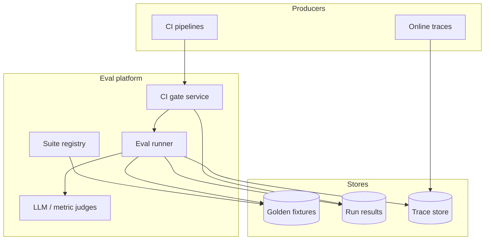

# Design an LLM evaluation and observability platform

## Where this actually gets asked

No company-specific attributed question was confirmed for this exact topic across the six
companies in scope, but prep material and industry commentary increasingly describe
"evaluation methodology" as displacing generic system design as the differentiating interview
topic for AI-infra roles — the reasoning being that anyone can wire up a model API, but knowing
whether your system is actually working, and catching regressions before they ship, is the
harder and more senior-differentiating skill. Treat this as an emerging archetype worth
preparing regardless of exact attribution.

## Requirements

**Functional**
- Every production LLM call (or agent run) should produce a trace: inputs, outputs, intermediate
  steps, and enough context to debug a bad output after the fact.
- A versioned suite of "golden" test cases should be runnable against any candidate model or
  prompt change, producing a pass/fail regression signal, not just a vibe check.
- Evaluation results need to be queryable across dimensions: by suite, by model version, by
  time, by which specific case regressed.

**Non-functional**
- Trace collection must not meaningfully add latency to the production request path — async,
  fire-and-forget instrumentation, not a blocking call.
- Eval suites need to be fast enough to run on every merge/deploy (a CI gate), not just a
  quarterly manual audit.
- Golden test data needs to be versioned and immutable — an eval that silently changed its own
  pass bar is worse than no eval at all.

## Core entities

- **Trace**: a full record of one production request/run — spans for each step (retrieval,
  generation, tool call), inputs/outputs, and metadata (model version, latency, cost).
- **Eval suite**: a versioned, locked set of test cases with expected outcomes.
- **Eval case**: one input + an `expect` block (grounded: true, specific risk flags expected,
  a quality-score floor) — not just "the output should look reasonable."
- **Eval run**: one execution of a suite against one target (a model version, a deployed
  service), producing pass/fail per case.

## API / interface
Auth: CI service account for gates; humans for overrides.

```http
POST /v1/eval-suites
{"name":"rag-grounding-v4","suite_uri":"s3://golden/rag_v4.jsonl","thresholds":{"grounding":0.92}}
→ 201 {"suite_id":"suite_...","version":4}

POST /v1/eval-runs
{"suite_id":"suite_...","target":{"service":"rag-answer","git_sha":"abc123"},"mode":"ci_gate"}
→ 202 {"run_id":"run_..."}

GET /v1/eval-runs/{run_id}
→ {"status":"failed","scores":{"grounding":0.88},"failed_cases":["case_17"],"trace_links":["https://..."]}

POST /v1/traces
{"trace_id":"tr_...","spans":[...],"eval_case_id":"case_17"} → 202 {"accepted":true}

POST /v1/gates/{run_id}/override
{"reason":"known flaky fixture","approver_id":"u_..."} → 200 {"gate":"waived","expires_at":"..."}
```

Staff+ callout: eval runs must deep-link to traces; overrides are audited and time-bounded.


## High-level design



The critical design split: **tracing** (what actually happened in production, for debugging)
and **evaluation** (does the system still behave correctly against known cases, for regression
prevention) are related but distinct systems. A common weak answer conflates them into one
"logging" system that does neither job well — traces need to capture arbitrary production
diversity; eval suites need to be small, curated, and stable enough to gate a merge on.

## Deep dive 1: fixtures that validate vs. fixtures that actually gate

The naive version of an eval system stores golden fixtures and checks that they're
well-formed — schema validation, no duplicate IDs. That's necessary but insufficient: it proves
the fixtures *exist*, not that the system *passes* them.

**Real, disclosed finding**: [golden-eval-registry](https://github.com/vpeetla-ai/golden-eval-registry)
had exactly this gap — versioned suites with real validation, but nothing actually executed a
suite against a live system and gated a build on the result (ADR-0001's own "future work" note
said as much). The fix (ADR-0002/[ADR-014](https://github.com/vpeetla-ai/ai-architecture-portfolio/blob/main/adr/ADR-014-golden-eval-registry-real-ci-gate.md)):
a real, dependency-light, provider-agnostic scorer — each consumer service reaches itself
however it can (an HTTP call, a direct function import) and hands the real output back for
comparison against the suite's `expect` block. **Running the very first suite for real
immediately found a genuine bug in the fixture itself** — a case whose expected answer had
never actually been checked against real system behavior, contradicted by what the real
pipeline produced once actually executed. This is the single strongest argument for why "the
fixtures exist and validate" and "the fixtures are correct and gate something" are different
claims — only real execution proves the second one.

| Eval maturity level | What it catches |
|---|---|
| Fixtures exist, schema-validated | Malformed test data |
| Fixtures gate a real CI build | Regressions in *tested* behavior — but only for kinds you've wired up |
| Fixtures run against live production traffic samples (shadow eval) | Regressions in behavior you didn't think to write a fixture for |

## Deep dive 2: trace-linked evals — connecting production behavior back to eval scores

An eval suite that only ever runs in CI, disconnected from what's actually happening in
production, drifts from reality — the traffic patterns and edge cases users actually hit are
richer than any hand-written suite. Real systems export production traces with eval-relevant
scores attached (grounded: bool, citation_count, human_approval_required) directly into the
same observability backend (Langfuse, in this org's reference stack) used for latency/cost
dashboards — so a quality regression shows up next to a latency regression, not in a separate
tool nobody checks as often.

## Deep dive 3: cost as an evaluation dimension, not a separate concern

A model change that improves quality but doubles cost per request is not an unambiguous win —
it's a trade-off that needs to be visible in the same evaluation report, not discovered later
in a finance review. This is the same "real numbers, not guessed" discipline as
[agent-finops](https://github.com/vpeetla-ai/agent-finops): real per-call token costs
aggregated alongside quality scores, so a candidate model change is evaluated on both axes
together.

## What's expected at each level

- **Mid-level:** proposes logging + a manual QA review process.
- **Senior:** proposes a versioned eval suite and some automated scoring.
- **Staff+:** distinguishes fixture validation from real CI-gating execution explicitly, and
  designs the scorer to be provider-agnostic (dependency-light, not embedding a specific
  service's client code).
- **Principal:** additionally connects production tracing and offline eval into one
  observability story, and treats cost as a first-class evaluation dimension alongside quality,
  not a separate report.

## Follow-up questions to expect

- "How do you keep golden fixtures from becoming stale as the underlying system evolves?"
  (Answer: version the suite explicitly — a fixture that needs correcting gets a disclosed,
  versioned update, not a silent edit, exactly as happened with the real bug found above.)
- "How would you catch a regression that no existing fixture covers?" (Answer: shadow-eval a
  sample of real production traffic against quality heuristics or a judge model, and promote
  interesting failures into new golden fixtures over time.)
- "What's the failure mode of over-relying on an LLM-as-judge for evaluation?" (Answer: judge
  models have their own biases and blind spots — treat judge-based scores as one signal, not a
  ground truth, and keep a core of human-verified fixtures the judge is itself periodically
  checked against.)

## Related

- [golden-eval-registry](https://github.com/vpeetla-ai/golden-eval-registry) — real scorer + CI gate, found a real fixture bug on first execution
- [ADR-014: golden-eval-registry becomes a real CI gate](https://github.com/vpeetla-ai/ai-architecture-portfolio/blob/main/adr/ADR-014-golden-eval-registry-real-ci-gate.md)
- [agent-finops](https://github.com/vpeetla-ai/agent-finops) — real cost metering as an evaluation dimension
