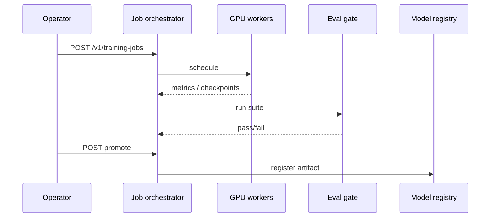
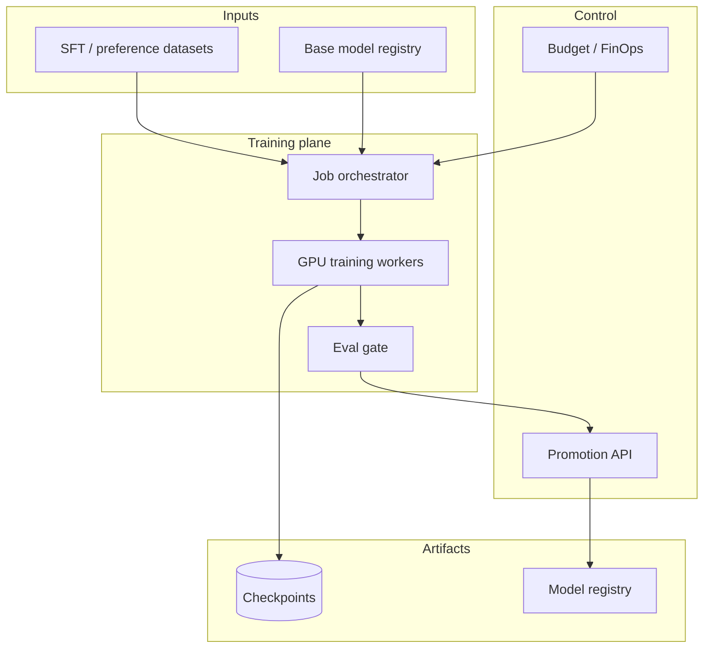

# Design a fine-tuning / RLHF training pipeline at scale


<!-- question-variants:v1 -->

## Expected question

"Design a fine-tuning and RLHF training pipeline at scale. How do you orchestrate data prep, distributed training, checkpointing, and safe promotion to serving?"

## Variant forms

Interviewers often ask the same design with different framing — recognize the archetype:

- "Design weekly LoRA fine-tunes on production feedback — how do you schedule GPU clusters?"
- "How do you run RLHF with human preference data across multiple annotator vendors?"
- "Design a training pipeline that checkpoints every N steps and survives spot preemption."
- "Our SFT model overfit on a small dataset — architect data mixing and eval gates."
- "Design promotion from experiment → staging → prod with automatic rollback on eval failure."
- "How do you train a 70B model with tensor + pipeline parallelism across nodes?"
- "Design alignment training where reward model drift is monitored continuously."

## Where this actually gets asked

Essentially no company-specific attributed evidence was found for OpenAI, Anthropic, Meta,
Google, Microsoft, or Apple for this exact topic — what exists publicly is adjacent-company
material (Scale AI's own interview guides describe RLHF pipeline stages: preference collection
→ reward modeling → PPO/DPO) or generic ML-training-infra content not pinned to a specific
employer. Given that companies training frontier models treat their actual training
infrastructure as some of their most closely-guarded IP, this scarcity of public interview
questions is expected, not a gap in the research. Answer this on the technical merits of the
pipeline, and be upfront in the interview that you're reasoning from public understanding of
RLHF/fine-tuning mechanics, not insider knowledge of any specific company's stack.

**Honest note on grounding**: this org has no shipped fine-tuning or RLHF training system.
Real callbacks below are to adjacent, genuinely-built disciplines (cost governance, eval
gating) that generalize to this domain, not to a training pipeline I've actually operated.

## Requirements

**Functional**
- Support supervised fine-tuning (SFT) on a curated instruction dataset, and a preference-based
  alignment stage (RLHF via PPO, or a simpler direct-preference method like DPO) on top of it.
- Every training run needs to produce a versioned, evaluable checkpoint — not just a final
  model with no visibility into intermediate stages.
- Support rollback to a previous checkpoint if a new one regresses eval or safety metrics.

**Non-functional**
- Multi-node, multi-GPU training with fault tolerance — a single node failure mid-run shouldn't
  lose all progress.
- Reward model quality directly gates the whole alignment stage — a broken reward model
  silently produces a worse-aligned policy model, so it needs its own evaluation, not just the
  final model's.
- Training cost (GPU-hours) needs to be visible and attributable per run, not discovered after
  the fact.

## Core entities

- **Base/SFT checkpoint**: a model snapshot after supervised fine-tuning, versioned.
- **Preference dataset**: pairs of (response A, response B, which one's preferred), with
  provenance (who/what generated the preference — human, or an AI judge).
- **Reward model**: a model trained to score a response's alignment with preferences, itself
  versioned and evaluated independently.
- **Policy checkpoint**: the model being aligned, at a specific point in RLHF training.

## API / interface
Auth: ML platform admins create jobs; workers use job-scoped credentials.

```http
POST /v1/training-jobs
{
  "base_model":"llama-3.1-8b",
  "method":"qlora",
  "dataset_id":"ds_...",
  "hyperparams":{"lr":2e-4,"epochs":3},
  "eval_suite_id":"suite_...",
  "budget_usd":1200
}
→ 201 {"job_id":"tj_...","status":"queued"}

GET /v1/training-jobs/{job_id}
→ {"status":"running","metrics":{"step":1200,"eval_loss":0.42},"cost_usd":310}

POST /v1/training-jobs/{job_id}/promote
{"artifact":"adapter_v3","gates_passed":true}
→ 200 {"registry_model_id":"mdl_...","stage":"staging"}

POST /v1/preference-datasets
{"pairs_uri":"s3://prefs/...","rubric":"helpfulness_v2"} → 201 {"pref_id":"pref_..."}

POST /v1/rlhf-jobs
{"sft_model_id":"mdl_...","pref_id":"pref_...","algo":"dpo"} → 201 {"job_id":"rj_..."}
```

Staff+ callout: promote is gated by eval suite + budget; preference data has its own versioned API.


## Data Flow


Dataset + base model → training workers → eval gate → promote to registry (budget-aware).



## High-level design

Maps to **functional** requirements from step 1 — the component architecture that makes the API and data flow real.



The pipeline is a **staged sequence with an independent evaluation gate at each stage**, not
one monolithic training job. This is the answer to "what could possibly go wrong with a naive
single-pass design": if you only evaluate the final aligned model, a bug in the reward model
(the middle stage) is invisible until it's already baked into a policy model that's expensive
to retrain — evaluating each stage independently catches the cheaper failure earlier.

Deep dives below target **non-functional** requirements (latency, scale, failure, cost, security).

## Deep dive 1: reward model quality is its own first-class problem

A reward model trained on noisy or inconsistent human preferences will happily produce a
confident, wrong signal — and RLHF will optimize the policy model directly against that wrong
signal, producing "reward hacking" behavior (the policy learns to exploit quirks of the reward
model rather than genuinely improving). The design answer: evaluate the reward model against a
held-out preference set *before* using it to train a policy, and monitor reward model agreement
with human judgment on an ongoing sample throughout RLHF training, not just once upfront.

| Failure mode | Symptom | Mitigation |
|---|---|---|
| Reward model overfits to superficial features (length, formatting) | Policy model produces longer/more-formatted but not more helpful output | Regularize preference data collection; monitor for length/formatting correlation with reward score |
| Reward hacking during RLHF | Policy exploits reward model blind spots the longer training runs | KL-divergence penalty against the SFT checkpoint to bound how far the policy can drift; periodic human eval spot-checks |
| Preference data has low inter-annotator agreement | Reward model learns an inconsistent signal | Track and report annotator agreement rate as a data-quality metric, not just collect-and-train |

**The subtler, Principal-level failure mode: reward model staleness under distributional
shift.** The reward model is trained once, on preference data reflecting outputs from the
*original* SFT checkpoint's output distribution. As PPO training proceeds over thousands of
steps, the policy's outputs drift further from that original distribution — which means the
reward model is increasingly scoring outputs it was never actually trained to evaluate, and its
scores become silently less trustworthy the longer training runs, even with no single obvious
bug. This is a distinct failure mode from reward hacking (deep dive above): reward hacking is
the policy exploiting a *known* weakness in a stable reward model; staleness is the reward
model's own reliability degrading as its input distribution shifts out from under it. The real
mitigation is periodic reward-model refresh — re-collecting preference judgments on samples of
the *current* policy's actual outputs at intervals during training (not just once, upfront) and
retraining or fine-tuning the reward model against them — treated as a first-class, scheduled
part of the training loop rather than a one-time setup step.

## Deep dive 2: cost and fault tolerance at multi-node scale

Training runs at this scale span many GPU-hours across many nodes; a node failure partway
through shouldn't discard all prior progress. Real systems checkpoint frequently (not just at
stage boundaries) and support resuming from the last good checkpoint on node failure — the same
principle as [system-design/01](01-llm-inference-serving-at-scale.md)'s preemption/swap
handling for inference, applied to training instead: expect partial failure, design recovery
into the system rather than treating it as an edge case.

Cost visibility is the same discipline this org actually built for a different part of the
stack: [agent-finops](https://github.com/vpeetla-ai/agent-finops) exists specifically because
two other platforms computed "cost" from static or guessed numbers instead of real per-call
usage. The same principle, applied to training: real GPU-hour attribution per run/stage,
not an after-the-fact bill reconciliation — if a training run's cost is only visible once
finance flags an anomaly, the design is missing a real-time cost-tracking requirement.

## Deep dive 3: the eval gate before promotion — and what it must check beyond "is it better"

Promoting a new aligned checkpoint to serving needs more than "does it score higher on the
primary benchmark." A real gate checks: the target capability improved, a set of *known-good*
prior behaviors didn't regress, and safety-relevant behaviors (refusal rates on known
adversarial prompts, factuality on a golden set) didn't get worse in the pursuit of the primary
metric. This is exactly the same discipline as
[system-design/07](07-llm-evaluation-observability-platform.md)'s "fixtures that actually gate,
not just validate" — a training pipeline that skips this and promotes on primary-metric
improvement alone is exposed to exactly the kind of regression a real CI eval gate is built to
catch.

## What's expected at each level

- **Mid-level:** proposes SFT → RLHF as a linear pipeline; may not separate reward model
  evaluation from the final policy's evaluation.
- **Senior:** proposes checkpointing and some evaluation between stages.
- **Staff+:** names reward hacking and reward-model-quality as independent risks requiring
  their own evaluation, and designs fault tolerance (checkpoint + resume) as a first-class
  requirement, not an afterthought.
- **Principal:** additionally names reward-model staleness under distributional shift as a
  distinct failure mode from reward hacking — the reward model's reliability silently degrading
  as the policy drifts from the distribution it was validated against — and designs periodic
  reward-model refresh (re-collecting preferences on the current policy's actual outputs) as a
  scheduled part of the training loop, not a one-time upfront step; and treats cost attribution
  and safety-regression gating as non-negotiable parts of the promotion decision.

## Follow-up questions to expect

- "How do you decide between full RLHF (PPO) and a simpler method like DPO?" (Answer: DPO
  skips training an explicit reward model by optimizing directly against preference pairs —
  simpler infra, faster iteration, but less flexible if you need the reward signal itself for
  other purposes like reward-guided sampling.)
- "How do you prevent the aligned model from drifting too far from the original SFT model's
  capabilities?" (Answer: a KL-divergence penalty against the reference/SFT model, tuned as an
  explicit hyperparameter, not left unconstrained.)
- "What's your rollback plan if a promoted checkpoint causes a safety incident in
  production?" (Answer: this requires the serving layer to support instant traffic routing back
  to the previous checkpoint — the same kill-switch pattern as
  [system-design/03](03-agent-tool-use-orchestration-platform.md), applied to model versions
  instead of agent actions.)
- "45-minute scope?" (Answer: compare DPO vs PPO in two minutes — do not derive PPO math; point to 12 for provenance depth.)

## Related

- [agent-finops](https://github.com/vpeetla-ai/agent-finops) — the real-cost-metering discipline this pipeline's cost tracking should mirror
- [system-design/07: LLM evaluation and observability platform](07-llm-evaluation-observability-platform.md) — the eval-gate discipline this pipeline's promotion step should mirror
- [system-design/04: Feature store / fine-tuning data pipeline](04-feature-store-finetuning-data-pipeline.md) — the data lineage this pipeline's datasets depend on
