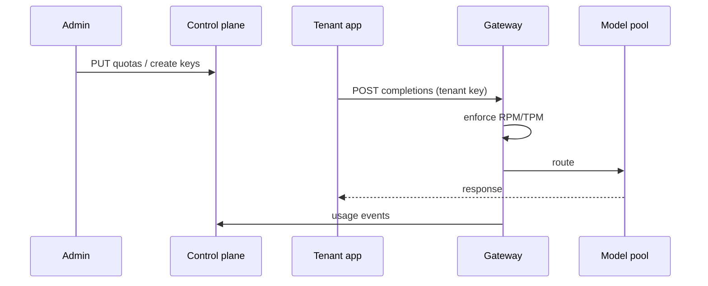
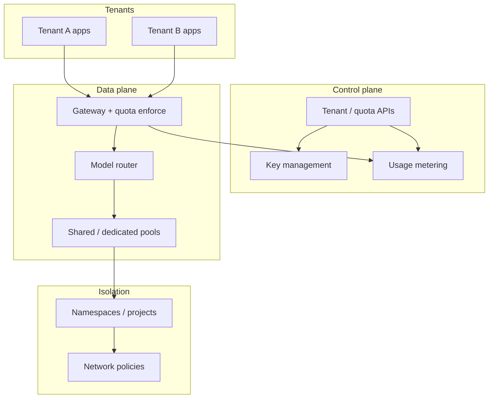

# Design a multi-tenant AI platform

## Where this actually gets asked

Best-sourced at Microsoft: the official [Azure Architecture Center](https://learn.microsoft.com/en-us/azure/architecture/guide/multitenant/service/openai)
has a real, published document explicitly discussing per-tenant vs. shared-instance trade-offs
for Azure OpenAI, noisy-neighbor risk, and TPM/RPM (tokens/requests-per-minute) quota mechanics
— with Provisioned Throughput Units (PTUs, dedicated reserved capacity) documented as the real
mitigation for noisy-neighbor contention. Google's Vertex AI Dedicated Endpoints
(cloud.google.com) confirm dedicated-endpoint isolation as a real, documented pattern. OpenAI
publishes its own tier/TPM/RPM rate-limit structure but no internal architecture document.
**Two claims caught and rejected during research**: a specific, widely-repeated "a tenant's
recursive workflow took down services for 47 other customers for 3 hours" Vertex AI incident
traced to an unsourced personal blog post with no citation trail — not used here. A claim that
"system design for a multi-tenant Claude deployment" is a specific, confirmed Anthropic interview
stage traced only to a blog author's own generic characterization, not any leaked candidate
account — also not presented as verified. Treat multi-tenancy/isolation as a classic distributed-
systems archetype asked broadly across big tech; the GPU-batching/KV-cache/token-quota angle
below is the genuinely AI-specific wrinkle that makes this harder than a typical multi-tenant web
service question.

## Requirements

**Functional**
- Multiple customers (tenants) share the same underlying model-serving infrastructure, each with
  their own API key, usage accounting, and rate limits.
- Support per-tenant customization (fine-tuned model variants, custom system prompts, tool
  configurations) without each tenant requiring a fully separate deployment.
- Provide a path to fully dedicated capacity for tenants who need guaranteed throughput or
  stronger isolation, without re-architecting the platform for them specifically.

**Non-functional**
- No tenant's traffic pattern should degrade another tenant's latency or throughput — the
  "noisy neighbor" problem, which is more severe here than in typical multi-tenant web services
  because GPU batching means tenants can share the same physical compute at the request level,
  not just the same rack.
- Per-tenant quota enforcement (TPM/RPM) needs to be accurate under concurrent load, not
  eventually-consistent — a tenant hitting their quota should be rejected promptly, not after
  they've already burned through GPU capacity meant for others.

## Core entities

- **Tenant**: an isolated customer/account with its own API key, quota (TPM/RPM), and billing.
- **Model variant**: the base model plus tenant-specific customization (fine-tune, system
  prompt, tool access) — may or may not require dedicated GPU capacity depending on tier.
- **Capacity tier**: shared (multiplexed across tenants), or dedicated (Provisioned Throughput
  Unit-style reserved capacity for one tenant).
- **Quota ledger**: real-time tracking of each tenant's token/request consumption against their
  configured limit.

## API / interface
Auth: tenant-scoped API keys or org JWT with `tenant_id` claim verified server-side.

```http
POST /v1/tenants
{"name":"acme","plan":"enterprise","isolation":"namespace"} → 201 {"tenant_id":"ten_..."}

PUT /v1/tenants/{tenant_id}/quotas
{"rpm":600,"tpm":2e6,"max_concurrent":50,"budget_usd_day":500}
→ 200 {"quotas":{...},"effective_at":"..."}

POST /v1/tenants/{tenant_id}/keys
{"scopes":["inference:chat"],"expires_at":"..."} → 201 {"key_id":"key_...","secret":"..."}  # secret once

GET /v1/tenants/{tenant_id}/usage?window=24h
→ {"rpm_used":120,"tpm_used":4.2e5,"cost_usd":88.4,"throttled_requests":12}

POST /v1/chat/completions
Authorization: Bearer <tenant_key>
{"model":"...","messages":[...]}
→ 200 ... | 429 {"error":"quota_exceeded","quota":"tpm","reset_at":"..."}
```

Staff+ callout: quotas and keys are control-plane APIs; data-plane errors must name which quota fired.


## Data Flow


Control plane sets quotas/keys; data plane enforces on every inference call and meters usage.



## High-level design

Maps to **functional** requirements from step 1 — the component architecture that makes the API and data flow real.



The critical design decision: quota enforcement happens at the gate, before scheduling — not as
a post-hoc billing reconciliation. A design that only tracks usage *after* the GPU has already
done the work has already let the noisy-neighbor problem happen; it can bill for it accurately,
but it hasn't prevented it.

Deep dives below target **non-functional** requirements (latency, scale, failure, cost, security).

## Deep dive 1: shared vs. dedicated capacity, and the real mitigation for noisy neighbors

| Approach | Isolation | Cost efficiency | When it's the right call |
|---|---|---|---|
| Fully shared pool, best-effort scheduling | Weakest — one tenant's burst can add latency to others sharing the same batch | Highest — maximum GPU utilization across all tenants | Low-tier/free-tier tenants where cost efficiency matters more than latency guarantees |
| Shared pool + per-tenant token quota (TPM/RPM) | Better — caps how much any one tenant can consume, bounding worst-case impact | High | Most paying tenants — the real mechanism Azure OpenAI documents via PTUs as an escalation path |
| Dedicated capacity (reserved GPU pool per tenant) | Strongest — architecturally isolated from other tenants' load | Lowest — reserved capacity sits idle when that tenant isn't using it | Enterprise tenants with contractual latency/throughput guarantees, or genuinely bursty tenants whose noise would otherwise be capped by quota alone |

**Common mistake at the mid/senior level:** proposing only per-tenant rate limits (TPM/RPM caps)
as the complete isolation story. Rate limits bound how much of the *shared* pool one tenant can
consume, but if the shared pool's batching itself isn't tenant-aware, a large batch dominated by
one tenant's long-context requests can still add latency variance for other tenants within their
quota — quota caps the blast radius, it doesn't eliminate cross-tenant interference within the
allowed range.

## Deep dive 2: customization without fragmenting the platform

A common weak design gives each tenant a fully separate deployment the moment they need any
customization (a fine-tune, a custom system prompt), which doesn't scale operationally past a
handful of tenants. The better pattern, consistent with how Azure OpenAI and Vertex AI structure
this: keep the base model and serving infrastructure shared, and express tenant customization as
a **layer** applied at request time — a fine-tuned adapter loaded alongside the shared base
weights, or a system prompt injected before the tenant's user prompt — rather than a fully forked
deployment per tenant. Dedicated capacity (the top row of the table above) is reserved for
tenants who need isolation *guarantees*, not merely customization.

## Deep dive 3: the AI-specific isolation problem generic multi-tenancy design doesn't cover

A generic multi-tenant system design answer (connection pooling, per-tenant database schemas,
row-level security) doesn't address the specific mechanism unique to LLM serving: **continuous
batching multiplexes multiple tenants' requests into the same GPU forward pass** (see
[system-design/01](01-llm-inference-serving-at-scale.md)'s deep dive on this same scheduler).
This means tenant isolation isn't just an API-gateway concern — it extends into the scheduler
itself, which needs to be quota-aware and, for dedicated tiers, needs to guarantee a tenant's
requests never share a batch with another tenant's at all. This is the genuinely AI-specific
wrinkle: isolation has to be reasoned about one layer deeper than the request/response boundary
most multi-tenant system designs stop at.

## What's expected at each level

- **Mid-level:** proposes per-tenant API keys and rate limits without addressing GPU-batching-
  level interference between tenants sharing the pool.
- **Senior:** identifies TPM/RPM quota enforcement at the gate (before scheduling, not after) as
  the mechanism bounding noisy-neighbor impact.
- **Staff+:** designs the shared-vs-dedicated capacity tiering explicitly, and connects tenant
  customization (fine-tunes, prompts) to a layering mechanism rather than per-tenant forked
  deployments.
- **Principal:** additionally reasons about the scheduler-level isolation problem specifically —
  that continuous batching multiplexes tenants at the GPU level, requiring quota-awareness inside
  the scheduler itself for dedicated-tier guarantees, not just at the API gateway.

## Follow-up questions to expect

- "A tenant on the shared tier complains about inconsistent latency. How do you diagnose it?"
  (Answer: check whether their requests are being batched alongside high-token-count requests
  from other tenants sharing the same pool — this is a scheduler-visibility problem, not just an
  API-gateway metric.)
- "How would you migrate a growing tenant from shared to dedicated capacity without downtime?"
  (Answer: provision the dedicated pool, dual-route a small percentage of that tenant's traffic
  to verify it behaves identically, then cut over fully — the same canary pattern used for model
  version rollouts, applied to a capacity-tier migration instead.)

## Related

- [system-design/01: LLM inference serving at scale](01-llm-inference-serving-at-scale.md) — the shared scheduler this entry's isolation problem builds on
- [cloud-architecture/01: GPU capacity planning and procurement](../cloud-architecture/01-gpu-capacity-planning-and-procurement.md)
- [agent-finops](https://github.com/vpeetla-ai/agent-finops) — real per-tenant/per-call cost metering, the accounting half of this problem
