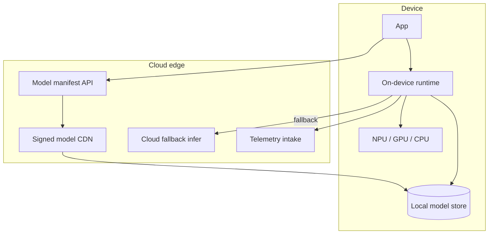

# Design an on-device / edge AI inference architecture

## Where this actually gets asked

Confirms a real hypothesis: this is the topic where Apple's interview loop most plausibly
diverges hardest from the other five companies, and it's well-documented via primary sources.
**Apple**: its own [Machine Learning Research blog on Apple Foundation Models](https://machinelearning.apple.com/research/introducing-apple-foundation-models)
and [security research blog on Private Cloud Compute](https://security.apple.com/blog/private-cloud-compute/)
describe a real, published architectural philosophy — on-device-first (works offline, no
per-request cost or latency to a server), with PCC as an *extending* cloud tier used only when a
request exceeds on-device capability, explicitly designed so PCC-processed data is never stored
or inspectable, even by Apple itself. Reported (CNBC, TechCrunch, 2026) partnership with Google
to power some Apple Intelligence/Siri features with Gemini — a real, if commercially notable,
admission that even Apple's on-device-first strategy has a vendor-mix component for
capabilities beyond what on-device or PCC alone can deliver; the specific ~$1B/year figure
traces only to unconfirmed Bloomberg reporting and should be cited as "reported," not fact, and
a circulating "1.2 trillion parameter" model-size claim was not corroborated by the primary
reporting checked — treat it as unverified. **Google**: Android's own [Gemini Nano developer docs](https://developer.android.com/ai/gemini-nano)
confirm AICore as a real, system-level on-device model custodian on Pixel devices, isolating
per-app requests and not persisting input/output — architecturally similar in spirit to Apple's
on-device tier, though less extensively published as a unified philosophy. **Meta**: a real
[engineering blog on Ray-Ban Meta glasses' multimodal AI](https://engineering.fb.com/2025/03/04/virtual-reality/building-multimodal-ai-for-ray-ban-meta-glasses/)
confirms a tiered on-device (wake-word, simple commands) vs. cloud-routed (complex multimodal
queries) split — real, but product-specific (smart glasses) rather than a platform-wide
strategy. **Microsoft, OpenAI, Anthropic**: no meaningful on-device architecture found — a
legitimate finding in itself, since all three are essentially cloud-only by business model; the
absence is real data, not a research gap.

## Requirements

**Functional**
- Simple, latency-sensitive requests (wake-word detection, short command interpretation, basic
  autocomplete) should be handled entirely on-device, working offline with no network round trip.
- Complex requests exceeding the on-device model's capability (long-context reasoning,
  world-knowledge queries, large multimodal generation) should transparently escalate to a
  cloud tier — the user experience shouldn't require them to know which tier handled their
  request.

**Non-functional**
- On-device inference is bounded by the device's memory and compute — a phone's on-device model
  is necessarily smaller and less capable than a data-center-scale model, so the escalation
  decision has real accuracy/latency/privacy trade-offs, not just a cost optimization.
- If the cloud tier is used, user data privacy guarantees should be as strong as architecturally
  possible — Apple's PCC design goal (data never stored, not inspectable even by the company
  operating it) is the real bar this design should be evaluated against, not just "encrypted in
  transit."
- The escalation decision itself needs to happen fast enough not to add its own perceptible
  latency — a slow "should this go to the cloud?" check defeats the purpose of having an
  on-device fast path at all.

## Core entities

- **On-device model**: a small, quantized model resident on the device, capable of handling a
  bounded set of simple requests entirely locally.
- **Escalation classifier**: the (typically very fast, itself on-device) decision of whether a
  given request is within the on-device model's capability or needs cloud escalation.
- **Cloud tier**: a larger, more capable model running in a data center, with its own privacy
  architecture (e.g., a confidential-computing-style design like PCC) for requests that reach it.
- **Session context**: whatever state (recent conversation turns, user preferences) needs to be
  available to whichever tier ends up handling a given request, without leaking it unnecessarily
  to the cloud tier for requests that stay on-device.

## API / interface
Auth: device attestation token; model packages signed by the platform.

```http
GET /v1/models/manifest?device_class=phone_npus&app_version=4.2
→ {"models":[{"id":"asr_small_v3","size_mb":42,"digest":"sha256:...","min_os":"17"}]}

POST /v1/models/{model_id}/download-ticket
{"device_id":"dev_...","attestation":"..."}
→ 200 {"url":"https://cdn/...","expires_in_sec":600,"signature":"..."}

POST /v1/telemetry/inference
{"device_id":"dev_...","model_id":"asr_small_v3","latency_ms":90,"outcome":"ok","on_device":true}
→ 202 {"accepted":true}

POST /v1/fallback/cloud-infer
{"model":"asr_large","audio_ref":"...","privacy_mode":"no_store"}
→ 200 {"transcript":"...","processed_in":"region_us"}
```

Staff+ callout: on-device path is default; cloud fallback is an explicit, privacy-scoped API.


## High-level design



The design principle Apple's published PCC architecture makes explicit: escalating to the cloud
tier is not the same privacy trade-off as a typical "call an API" cloud request — the design
goal is that the cloud tier processes the request and discards it, with no operator visibility
into content, as close to on-device privacy guarantees as a cloud tier can architecturally get.

## Deep dive 1: on-device vs. cloud-first, and why the trade-off differs from classic edge computing

| Approach | Latency | Privacy | Capability ceiling | When it's the right call |
|---|---|---|---|---|
| Cloud-only (no on-device tier) | Network round-trip always incurred | Weakest by default — every request leaves the device | Highest — full data-center-scale model always available | Simplest to build; right when the product doesn't need offline capability or strict on-device privacy as a differentiator |
| On-device-only | Lowest, works offline | Strongest — nothing ever leaves the device | Bounded by device memory/compute — real ceiling on request complexity | Narrow, well-defined tasks (wake-word, simple commands) where the capability ceiling is acceptable |
| Tiered (on-device + escalating cloud, Apple's/Google's real pattern) | Best of both for the common case; cloud latency only when actually needed | Strong if the cloud tier is architected for it (PCC's no-retention design) — weaker if it's just a normal API call | Highest, since the cloud tier extends capability beyond the device | The right call whenever the product needs both a fast/private common case and full capability for the long tail — the real, published Apple/Google pattern |

**Common mistake at the mid/senior level:** treating this as a pure latency/cost optimization
(cache simple stuff locally, send everything else to the cloud) without addressing that the
escalation boundary is also a *privacy* boundary — the tiering decision determines what data
ever leaves the device at all, which is a materially different design concern than a typical
edge-caching architecture.

## Deep dive 2: designing the escalation classifier itself

A weak design escalates based on a crude heuristic (e.g., always escalate anything more than N
tokens). A better design reasons about the actual on-device model's known failure modes — if the
on-device model reliably handles short factual commands but degrades on multi-step reasoning or
anything requiring world knowledge beyond its training, the classifier should be trained or
tuned specifically against that boundary, not a generic complexity proxy. Meta's documented
Ray-Ban Glasses split (wake-word/simple commands on-device, complex multimodal cloud-routed) is
a real, concrete instance of exactly this kind of task-specific tiering, done at the product
level rather than a generic token-count threshold.

## Deep dive 3: what a "no-retention" cloud tier actually requires architecturally

Saying "the cloud tier doesn't store your data" is a policy statement; making it an
architectural guarantee — the bar Apple's PCC design targets — requires real engineering:
verifiable non-persistence (no durable storage the request ever touches, by construction, not
just by operational policy), no privileged operator access path that could inspect requests in
flight, and ideally an external verifiability mechanism (cryptographic attestation of what code
is actually running, which Apple's PCC publications describe as part of its design). This is a
meaningfully higher bar than "we encrypt data in transit and delete it after 30 days" — the
distinction between a policy promise and an architectural guarantee is exactly what separates a
mid-level answer ("encrypt it, delete it later") from a Staff+/Principal one (design the system
so retention is structurally impossible, not just against policy).

## What's expected at each level

- **Mid-level:** proposes "run simple stuff on-device, send the rest to the cloud" without
  addressing the escalation decision's privacy implications or the cloud tier's retention
  guarantees.
- **Senior:** identifies the escalation classifier as a distinct design problem from a generic
  complexity threshold, and connects tiering to both latency and privacy, not just cost.
- **Staff+:** designs the cloud tier's privacy architecture explicitly (ephemeral processing, no
  durable storage of request content) rather than treating "the cloud is more private if we say
  so" as sufficient.
- **Principal:** additionally reasons about verifiable/attestable guarantees (how would a
  skeptical user or regulator confirm the no-retention promise is actually true, not just
  claimed) as the real differentiator between a policy-level and architecture-level privacy
  guarantee — the distinction Apple's PCC publications explicitly target.

## Follow-up questions to expect

- "What happens when the on-device model's escalation classifier gets it wrong — handles
  something locally that it shouldn't have?" (Answer: this is a quality/safety regression, not
  just a UX inconvenience — the same eval-gating discipline from
  [system-design/07](07-llm-evaluation-observability-platform.md) applies here: the on-device
  model's capability boundary needs its own versioned eval suite, not just an assumption it
  works.)
- "How would you update the on-device model without shipping a full OS update?" (Answer: this is
  a real operational constraint distinct from cloud model updates — on-device models typically
  ship via a separate, smaller downloadable update mechanism, decoupled from the OS release
  cycle, precisely so capability improvements don't wait on a full platform release.)

## Related

- [system-design/05: Content moderation & safety system](05-content-moderation-safety-system.md) — the privacy/trust design parallel
- [cloud-architecture/05: Security & compliance architecture for AI systems](../cloud-architecture/05-security-and-compliance-architecture-for-ai-systems.md)
- [scalability-governance-tradeoffs/04: Build vs. train vs. fine-tune](../scalability-governance-tradeoffs/04-build-vs-train-vs-finetune-foundation-model-strategy.md) — the model-sourcing decision this architecture's on-device tier depends on
