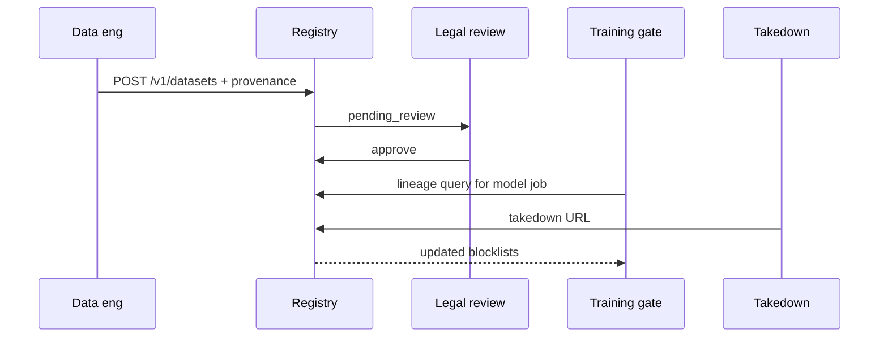
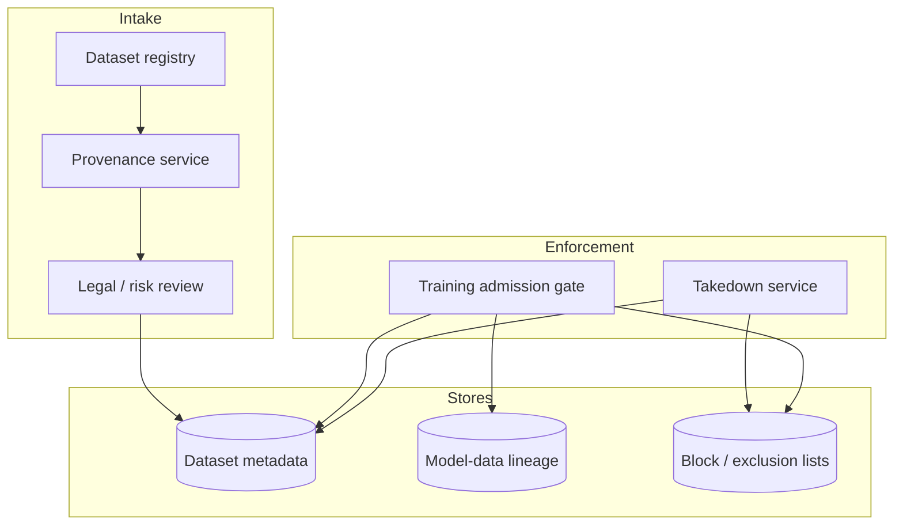

# Design a training-data provenance and IP-risk architecture

## Where this actually gets asked

No company-specific interview attribution was found for this exact topic at any of the six
companies — this entry wasn't produced from a dedicated research pass the way most others in
this repo were, so treat the sourcing discipline here as slightly different: the *underlying
facts* below (the lawsuits, the "model collapse" research) are well-documented public record, not
interview-attributed claims, and should be read that way. **New York Times v. OpenAI/Microsoft**
(filed December 2023) and **Getty Images v. Stability AI** (filed 2023, in both UK and US courts)
are real, ongoing, widely-reported litigation directly about training-data copyright and
provenance — not speculative future risk, but live legal exposure at exactly the scale a
Staff+/Principal AI architect at any of these six companies would need to reason about
architecturally, regardless of which specific company asks about it in an interview. Given this
is genuinely one of the highest-profile legal risk categories facing every frontier AI lab
simultaneously, expect it to come up in some form even without a single pinned source naming
which company's loop asks it most directly.

## Requirements

**Functional**
- Track, for every training example that enters a training or fine-tuning corpus, its source
  (where it came from), license terms (if any), and consent status (was this data collected with
  permission to use for model training specifically, not just to display/index).
- Support removing a specific data source's contribution retroactively if a legal or licensing
  dispute requires it — not just from future training runs, but ideally verifying whether
  already-trained models retain extractable traces of it.
- Distinguish licensed/opted-in data from scraped/uncertain-provenance data at ingestion time,
  not after the fact.

**Non-functional**
- Provenance metadata needs to survive the full pipeline — from raw ingestion through
  deduplication, filtering, and any synthetic-data augmentation — without being silently dropped
  at any transformation step.
- The system needs to support a real compliance/legal review process: "show me everything this
  model was trained on that came from source X" needs to be an answerable, auditable query, not
  a research project each time it's asked.
- Synthetic data (model-generated data used to augment or replace real training data) needs its
  own provenance category, distinct from human-authored data — mixing the two indistinguishably
  creates a different, emerging risk (see deep dive 3).

## Core entities

- **Source**: an origin of training data (a licensed dataset, a scraped corpus, a user-consented
  data-sharing agreement), with license terms and a consent/opt-in status.
- **Training example**: one unit of training data, tagged with its source and a content-hash for
  exact identification.
- **Corpus snapshot**: a versioned, immutable collection of training examples that a specific
  training run actually used — the same content-hash-based reproducibility discipline
  [ai-system-design/04](04-feature-store-finetuning-data-pipeline.md) requires for feature data,
  applied to raw training corpora.
- **Provenance query**: a request to enumerate every training example (and, transitively, every
  model trained on it) that traces back to a specific source.

## API / interface
Auth: compliance + data-platform roles; writes require dual control for high-risk corpora.

```http
POST /v1/datasets
{"name":"web_crawl_2026q2","license":"cc-by-4.0","source_uri":"s3://...","risk_tier":"medium"}
→ 201 {"dataset_id":"data_...","status":"pending_review"}

POST /v1/datasets/{id}/provenance
{"spdx":"...","collectors":["crawl_v2"],"exclusions":["news_domain_blocklist_v9"]}
→ 200 {"provenance_id":"prov_..."}

POST /v1/datasets/{id}/approve
{"approver_ids":["u_legal","u_ml"],"attestation":"license_reviewed"}
→ 200 {"status":"approved","usable_for":["pretrain","sft"]}

POST /v1/lineage/query
{"model_id":"mdl_..."} → 200 {"datasets":[{"dataset_id":"data_...","license":"cc-by-4.0"}],"gaps":[]}

POST /v1/takedowns
{"url":"https://...","reason":"copyright"} → 202 {"takedown_id":"td_...","propagation":["crawl_index","pending_train_sets"]}
```

Staff+ callout: approval + lineage query + takedown propagation are the compliance APIs — not a spreadsheet.


## Data Flow


Register dataset → provenance → dual approval → training admission checks lineage; takedowns propagate exclusions.



## High-level design

Maps to **functional** requirements from step 1 — the component architecture that makes the API and data flow real.



The design principle: provenance is enforced at ingestion (reject data without it) and preserved
end-to-end via the corpus-snapshot-to-model linkage — not reconstructed after the fact by
grepping through data pipelines when a legal team asks a question.

Deep dives below target **non-functional** requirements (latency, scale, failure, cost, security).

## Deep dive 1: provenance tracking through transformation, not just at ingestion

The hardest part of this problem isn't tagging raw data — it's keeping the tag attached through
deduplication, filtering, and mixing steps that combine or transform examples from multiple
sources. A common failure mode (this repo has documented the exact same class of bug in a real,
different system): a deduplication or filtering step reconstructs a data record without
explicitly carrying forward its provenance fields, silently defaulting them to empty/unknown —
functionally identical to the real bug enterprise_rag_platform's own ingestion pipeline had
before its data-contract fix (three places in that codebase reconstructed objects and silently
dropped lineage fields), just one layer up the stack from RAG retrieval into training-data
ingestion specifically. **The fix generalizes directly**: provenance fields need to be part of
the core record schema validated at every pipeline stage boundary, not optional metadata that
survives only if every transformation step happens to preserve it.

## Deep dive 2: can you prove a model didn't retain a specific removed source?

Removing a source from future training runs is straightforward; the much harder question a
Principal-level answer needs to address is whether an **already-trained** model still contains
extractable traces of removed data. The real, concrete test mechanism is the same membership-
inference approach named in
[cloud-architecture/02](../cloud-architecture/02-multi-region-strategy-training-vs-serving.md)'s
residency-inheritance deep dive: probe the model for its behavior on samples from the disputed
source, checking for verbatim or near-verbatim reproduction. If the model demonstrably retains
extractable content from a legally disputed source, the only real remediation options are
re-training without that source (expensive, may not be immediate) or targeted unlearning
techniques (an active, not-yet-fully-solved research area) — a Principal-level answer says this
plainly rather than implying "we removed it from the corpus" alone resolves a legal exposure that
already exists in a shipped model.

## Deep dive 3: synthetic data and the model-collapse risk

As training corpora increasingly mix human-authored and model-generated (synthetic) data,
research on "model collapse" (later models trained on earlier models' output, recursively,
degrading in diversity and quality over generations) makes provenance tracking a *quality* issue,
not just a legal one. A corpus that can't distinguish "this example was written by a human" from
"this example was generated by a previous model version" can't measure or bound this risk at
all. **Common mistake at the mid/senior level:** treating synthetic data augmentation as free
extra training volume without tagging its provenance distinctly — the real design requires
tracking the generation lineage of synthetic examples (which model, which version, how many
generations removed from original human-authored data) as its own first-class provenance
dimension, not folding it into the same category as licensed human data.

## What's expected at each level

- **Mid-level:** proposes tagging data sources at ingestion without addressing whether that
  tagging survives downstream transformation.
- **Senior:** identifies that provenance metadata can be silently dropped during deduplication/
  filtering and proposes validating it at each pipeline stage.
- **Staff+:** designs the corpus-snapshot-to-model linkage explicitly, so "what did this model
  train on" is an answerable query, and treats synthetic data as needing its own provenance
  category distinct from human-authored data.
- **Principal:** additionally addresses the harder question of whether an already-trained model
  retains extractable traces of removed data (via membership-inference testing, not just corpus
  removal) and names the real remediation limits (re-training vs. unlearning) rather than
  implying corpus-level removal alone resolves an already-shipped model's exposure.

## Follow-up questions to expect

- "Legal asks you to prove the model never trained on a specific copyrighted work — what do you
  actually check?" (Answer: first, whether that work's content-hash appears in any corpus
  snapshot the model's training run used — a provenance-query answer, if the linkage was built
  correctly; if it's absent from tracked corpora but the concern is scraped/untracked data,
  membership-inference testing against the live model is the fallback, with the caveat that a
  negative result is evidence, not proof.)
- "How would this differ for a fine-tuning pipeline built on top of a third-party base model?"
  (Answer: your own provenance tracking only covers your fine-tuning data — you inherit whatever
  provenance risk exists in the base model's own training corpus, which you generally can't
  audit directly, making the base-model vendor's own data practices a real due-diligence
  question before choosing to build on top of it.)

## Related

- [ai-system-design/04: Feature store / fine-tuning data pipeline](04-feature-store-finetuning-data-pipeline.md) — the same content-hash reproducibility discipline, applied to features rather than raw training corpora
- [cloud-architecture/02: Multi-region strategy for training vs. serving](../cloud-architecture/02-multi-region-strategy-training-vs-serving.md) — the membership-inference testing mechanism this entry reuses
- [scalability-governance-tradeoffs/04: Build vs. train vs. fine-tune](../scalability-governance-tradeoffs/04-build-vs-train-vs-finetune-foundation-model-strategy.md) — the strategic decision this entry's risk applies to most directly when training/fine-tuning your own model
