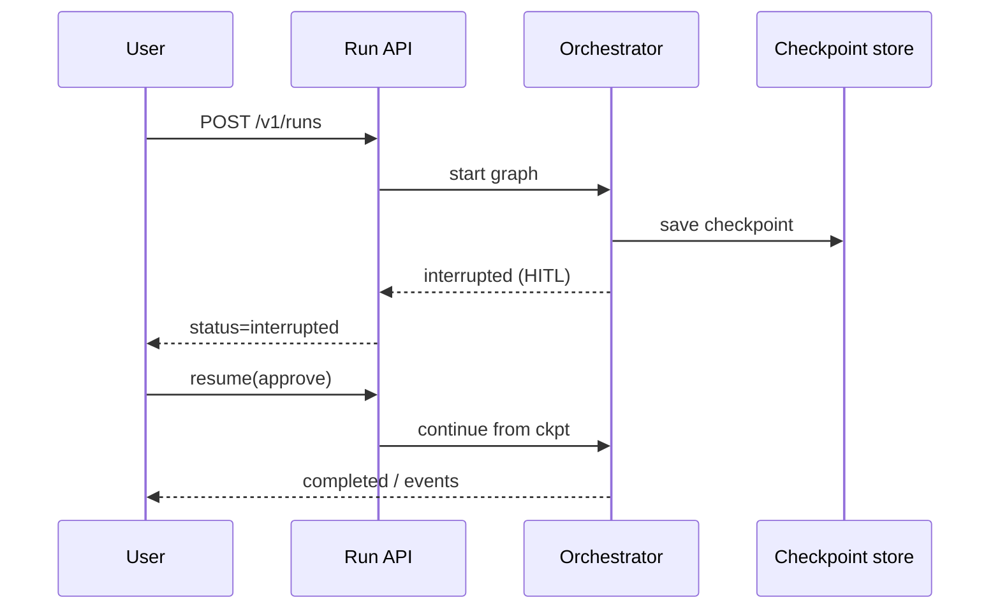
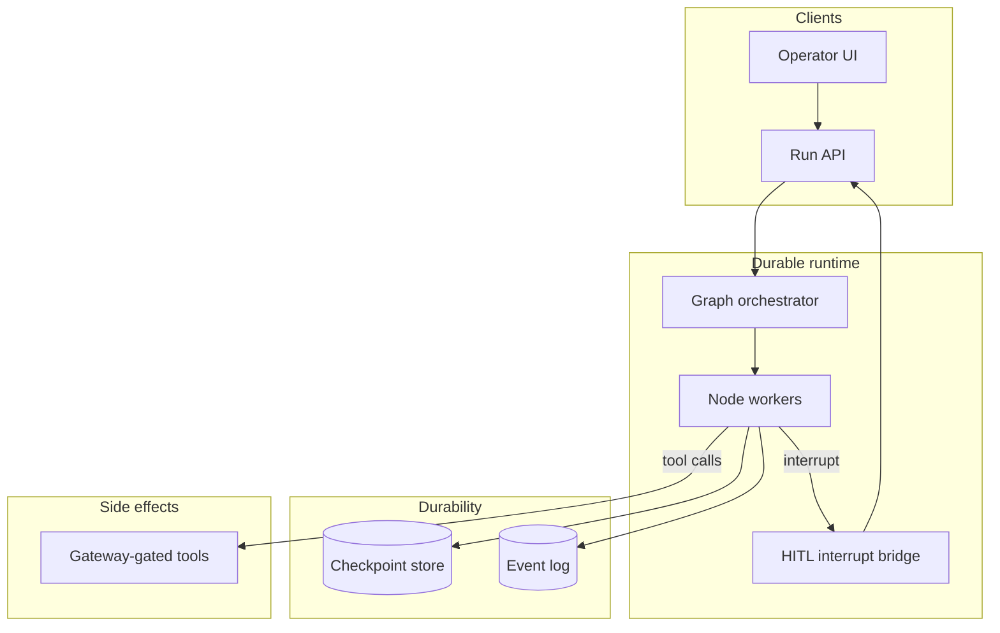

# Design durable execution for long-running AI agents


<!-- question-variants:v1 -->

## Expected question

"Design durable execution for long-running AI agents. How do you checkpoint state, survive crashes, resume HITL interrupts, and avoid duplicate side effects?"

## Variant forms

Interviewers often ask the same design with different framing — recognize the archetype:

- "Design agents that run for hours — research reports, multi-file refactors — with resume."
- "How do you implement `interrupt_before` human approval without losing partial progress?"
- "Design idempotent tool execution when an agent retries after a network timeout."
- "Our orchestrator OOM-killed mid-mission — architect externalized state and replay."
- "Design workflow engine vs hand-rolled state machine for agent missions."
- "How do you version agent graph definitions while in-flight runs use old code?"
- "Design saga/compensation when step 4 fails after steps 1–3 already emailed a customer."

## Where this actually gets asked

No company-specific interview attribution was found for this exact topic — like the previous
entry, this one wasn't produced from a dedicated research pass, so treat it as a well-reasoned
architectural extension of confirmed real patterns rather than a sourced interview question.
What's real and directly relevant: agentic products are visibly shifting from chat-turn-shaped
interactions (seconds) toward long-horizon, task-shaped ones (minutes to days) — deep-research
agents, autonomous coding agents, and multi-step workflow agents are real, shipped product
categories at several of these six companies. The architecture problem this creates — a process
that must survive its own restart mid-task without losing reasoning progress — is a genuine,
current systems problem distinct from anything else in this repo's `ai-system-design/` folder,
which otherwise addresses synchronous or short-lived agent interactions.

## Requirements

**Functional**
- An agent working on a long-horizon task (e.g., a multi-hour research task, a multi-step coding
  task) needs to survive a process restart, a deployment, or a worker crash mid-task without
  losing its reasoning progress or repeating already-completed work.
- Support human-in-the-loop checkpoints that can pause an agent's execution for an
  indeterminate amount of time (hours to days, not seconds) waiting on human input, then resume
  exactly where it left off.
- Support cancellation and inspection of an in-progress long-running task — a human should be
  able to see what an agent has done so far and stop it, not just wait for a final result.

**Non-functional**
- Every external side effect (an API call, a file write, a message sent) an agent takes during a
  long-running task must not be repeated on resume — a naive "replay the whole reasoning trace
  from the start" approach would re-execute every tool call, including ones with real
  consequences.
- Resuming after a restart should not require the agent to re-derive its own state from scratch
  (e.g., by re-reading everything it's already processed) — that's both slow and, for
  sufficiently long tasks, potentially non-deterministic if the underlying data has changed.
- Checkpointing itself must be cheap and frequent enough that a crash never loses more than a
  small, bounded amount of progress.

## Core entities

- **Task**: a long-running unit of agent work, with a current status (running, paused-for-human,
  completed, failed) and an execution history.
- **Checkpoint**: a durable snapshot of the agent's reasoning state (not just its conversation
  history, but its internal plan/progress state) at a specific point, sufficient to resume
  execution from exactly that point.
- **Side-effect record**: a log of every external action the agent has actually taken, keyed by
  an idempotency identifier, checked before re-attempting any action on resume.
- **Human checkpoint**: a specific pause point awaiting human input, which can remain open for an
  arbitrarily long, unbounded duration without holding any compute resource idle.

## API / interface
Auth: user token for start/resume; workers use run-scoped credentials.

```http
POST /v1/runs
{"graph_id":"content_pipeline","input":{...},"checkpoint_ns":"tenant_acme"}
→ 201 {"run_id":"run_...","status":"running"}

GET /v1/runs/{run_id}
→ {"status":"interrupted","interrupt":{"node":"publish","reason":"hitl_required"},"checkpoint_id":"ckpt_..."}

POST /v1/runs/{run_id}/resume
{"decision":"approve","payload":{...}} → 200 {"status":"running"}

POST /v1/runs/{run_id}/cancel → 200 {"status":"cancelled"}

GET /v1/runs/{run_id}/events?after=120
→ {"events":[{"ts":"...","node":"research","type":"completed"},{"ts":"...","type":"interrupt"}]}

GET /v1/runs/{run_id}/checkpoints/{checkpoint_id}
→ {"state_uri":"redis://...","created_at":"...","nodes_completed":["research","draft"]}
```

Staff+ callout: interrupt/resume/cancel + checkpoint fetch are the durability contract — not “retry the HTTP call”.


## Data Flow


Run starts, checkpoints after nodes, interrupts for HITL, resumes from checkpoint — cancel is first-class.



## High-level design

Maps to **functional** requirements from step 1 — the component architecture that makes the API and data flow real.



The core design principle: checkpointing happens after *every* meaningful step (not just at
coarse task boundaries), and every side effect is idempotency-checked against a durable log
before execution — so a crash-and-restart at any point resumes from the last checkpoint and
never re-executes an already-completed side effect, regardless of how long ago the checkpoint
was taken.

Deep dives below target **non-functional** requirements (latency, scale, failure, cost, security).

## Deep dive 1: durable execution engines — the real, named pattern this maps to

This is not a novel problem invented by agentic AI — it's the same problem durable-execution
workflow engines (Temporal, AWS Step Functions, and similar systems) were built to solve for
long-running business processes, applied to agent reasoning instead of business logic. The core
mechanism these systems use, and the one a Staff+/Principal answer should name explicitly: the
workflow's code re-executes from the beginning on every resume, but every side-effecting
operation is wrapped so that its *result* (not just whether it ran) is durably recorded — on
replay, if a wrapped operation's result already exists in the durable log, the engine returns the
cached result instantly instead of re-running the operation. This means the "checkpoint" isn't a
single blob of frozen state; it's the side-effect log itself, and the agent's reasoning code can
be re-run cheaply and deterministically as long as every consequential action it takes is
recorded and replayed-from-cache rather than re-executed.

| Approach | Resume cost | Side-effect safety | When it's the right call |
|---|---|---|---|
| Naive full-conversation replay | High — re-runs every reasoning step from scratch | Unsafe — re-executes every tool call, including ones with real consequences | Never for anything with real side effects; only safe for pure read-only reasoning |
| Coarse checkpointing (snapshot state every N steps) | Bounded by checkpoint interval; may lose up to N steps of progress on crash | Safe only if the checkpoint interval aligns with side-effect boundaries | Simpler to build; acceptable when N can be kept small relative to task length |
| Durable-execution-style (idempotent side-effect log + cheap replay) | Near-zero — replay from log is fast, and only truly new steps do real work | Safe by construction — a side effect is checked against the log before ever re-executing | The real, robust pattern for tasks with consequential, hard-to-reverse side effects |

## Deep dive 2: human-in-the-loop pauses that don't hold resources hostage

A pause waiting on human input might last minutes or might last days — holding a compute
process, a database transaction, or a locked resource open for an indeterminate duration is a
real operational hazard (resource exhaustion, and a crash during a long pause loses the pause
state entirely if it isn't itself durably persisted). The correct design treats a human-input
pause as a fully durable, resource-free state: the task's state is checkpointed and the compute
process is released entirely, with the pause represented purely as a database/queue record
awaiting an external event (a human's response) to trigger resumption — this org's own real
[ai-content-factory](https://github.com/vpeetla-ai/ai-content-factory) build applies exactly
this principle at smaller scale: its `interrupt_before=["hitl"]` LangGraph pattern plus a Redis
checkpointer specifically exists to resume long pipelines after an indeterminate human-approval
wait, without holding a process open for that entire duration.

## Deep dive 3: observability into an in-progress, not-yet-complete task

Unlike a short synchronous request, a long-running agent task needs real mid-flight
observability — a human should be able to inspect what an agent has done *so far*, not just wait
for a terminal result. This connects directly to
[ai-system-design/07](07-llm-evaluation-observability-platform.md)'s trace/eval distinction: a
long-running task's trace needs to be queryable while the task is still executing, not only
after completion, so a human deciding whether to cancel a task partway through has real evidence
(what's been done, what side effects have already occurred) rather than a black box they can
only kill blindly.

## Deep dive 4: tenant blast radius on checkpoints

Checkpoint and event stores are **tenant-namespaced** (and encrypted at rest). Workers must refuse
cross-tenant checkpoint loads. Side-effect idempotency keys are scoped to
`(tenant_id, run_id, tool, args_hash)`. Compare to Temporal in one minute; do not invent a workflow DSL
in 45 minutes.

## What's expected at each level

- **Mid-level:** proposes storing conversation history in a database for resume, without
  addressing side-effect idempotency or the cost of re-running reasoning steps.
- **Senior:** identifies the need for periodic checkpointing and idempotency keys on side
  effects, at a coarse (e.g., per-task-stage) granularity.
- **Staff+:** designs the durable-execution pattern explicitly — checkpoint via a side-effect log
  checked before every consequential action, not a single frozen-state blob — and treats
  human-input pauses as fully resource-free durable states.
- **Principal:** additionally connects this to observability requirements for in-progress tasks
  (queryable mid-flight, not just post-completion) and can name the real trade-off between
  coarse checkpointing (simpler, bounded progress loss) and full durable-execution replay
  (near-zero loss, more implementation complexity) against a stated task-criticality bar.

## Follow-up questions to expect

- "What happens if the agent's tool-call side effect succeeds, but the process crashes before
  recording that it succeeded?" (Answer: this is the actual hard edge case — the mitigation is
  making the side-effect record-then-execute, or execute-then-record-with-a-verification-check
  on resume, sequence as tight as possible, and for genuinely non-idempotent side effects
  (e.g., "send an email"), using an idempotency key the downstream system itself honors, so even
  a duplicate execution attempt is a no-op on the receiving end.)
- "How long should a human-input pause be allowed to last before the task is considered stale?"
  (Answer: this needs an explicit policy, not an indefinite wait — e.g., a task auto-cancels or
  escalates after a stated timeout, so an abandoned human-approval request doesn't silently hold
  a task open forever.)

## Related

- [ai-system-design/03: Agent/tool-use orchestration platform](03-agent-tool-use-orchestration-platform.md) — the synchronous-orchestration counterpart this entry extends to long-horizon tasks
- [ai-system-design/07: LLM evaluation and observability platform](07-llm-evaluation-observability-platform.md) — the trace/observability discipline this entry's mid-flight inspection requirement depends on
- [ai-content-factory](https://github.com/vpeetla-ai/ai-content-factory) — the real, shipped `interrupt_before` + Redis-checkpointer pattern this entry's human-pause design generalizes from
