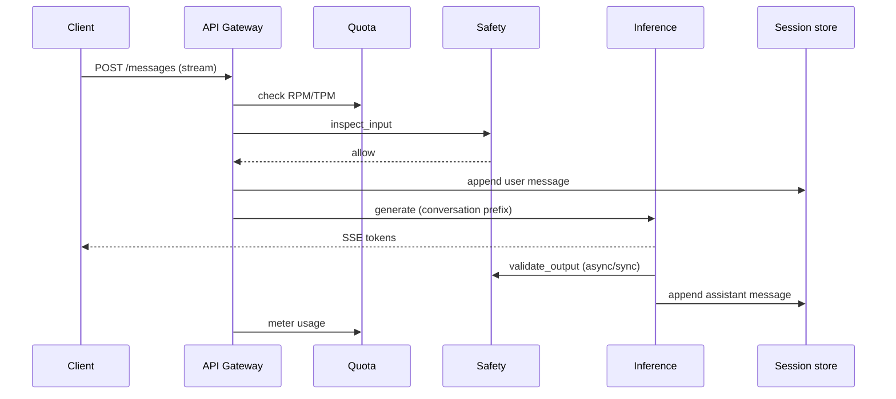
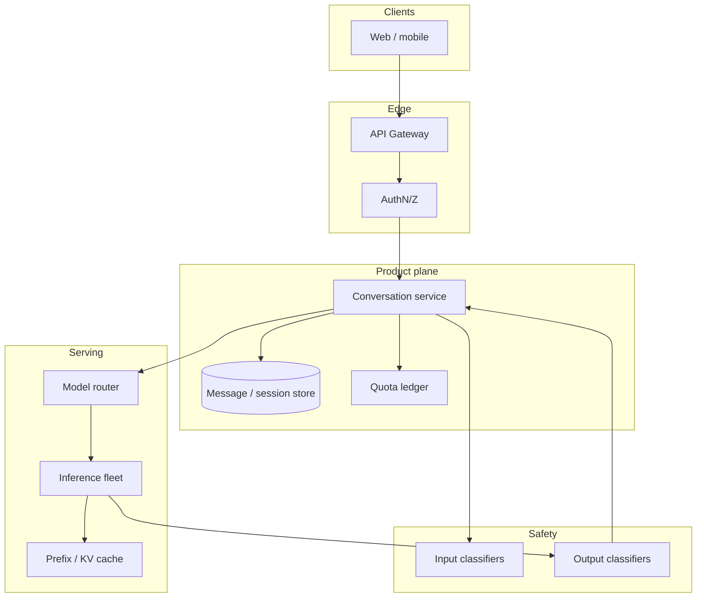

# Design a ChatGPT-style conversational service


<!-- question-variants:v1 -->

## Expected question

"Design a ChatGPT-style conversational service. How do you handle sessions, streaming, context windows, model routing, and safety at consumer scale?"

## Variant forms

Interviewers often ask the same design with different framing — recognize the archetype:

- "Design a chat product for 100M MAU with streaming tokens and conversation history."
- "How do you manage context when threads exceed the model's window — summarize or retrieve?"
- "Design regenerate/edit-message UX without corrupting conversation state."
- "Scale chat from one region to global with data residency constraints."
- "Design rate limits, abuse detection, and tiered access (free vs paid)."
- "How do you route simple queries to a small model and hard queries to a frontier model?"
- "Design conversation export, deletion (RTBF), and retention policies."

## Where this actually gets asked

This is the single most common **product-level** GenAI system-design prompt in public prep
material for OpenAI, Anthropic, and Google AI roles — framed as "Design ChatGPT," "Design an AI
chatbot," or "Design Claude's chat service." Treat company tags as directional (prep aggregators
over-attribute); the archetype is real and high-frequency. It is **not** the same question as
"design an LLM inference platform" alone — interviewers want the end-to-end product: sessions,
streaming, safety, model routing, quotas, and conversation history.

## Requirements

**Functional**
- Start a conversation, send messages, receive streamed token responses.
- Persist conversation history; support regenerate / edit-and-resend.
- Choose among models (fast/cheap vs high-quality); optional file/image attachments in scope.
- Enforce free vs paid usage limits without silently dropping messages.

**Non-functional**
- Interactive TTFT target ~200ms P50; stream tokens (SSE), do not buffer full answers.
- Multi-million concurrent sessions; conversation store must survive replica restarts.
- Safety on input and output; cost per conversation is a first-class constraint.
- Graceful degradation: queue or shed load, never corrupt session state.

## Core entities

- **Conversation / Session**: id, owner, model preference, created_at, retention policy.
- **Message**: role (system/user/assistant), content, parent_message_id (for regenerate branches), token counts.
- **Generation job**: request tied to a message, priority, stream cursor, cancel token.
- **Quota ledger**: tenant/user remaining tokens/RPM for the billing period.
- **Safety decision**: input/output flags, policy_version, allow/block/review.

## API / interface

Auth: `Authorization: Bearer <user_token>`. Streaming is the default product path.

```http
POST /v1/conversations
{ "model": "flagship", "title?": "..." }
→ 201 { "conversation_id":"c_...", "model":"flagship" }

POST /v1/conversations/{id}/messages
Idempotency-Key: <uuid>
{ "content":"...", "attachments?":[{"type":"file","uri":"..."}], "stream": true }
→ 200 text/event-stream
   event: token  data: {"delta":"..."}
   event: done   data: {"message_id":"m_...","usage":{"in":120,"out":340}}
→ 429 quota_exceeded | 403 safety_blocked

POST /v1/conversations/{id}/messages/{mid}/regenerate
→ same stream contract on a new assistant message branch

GET /v1/conversations/{id}/messages?cursor=&limit=50
→ { "items":[...], "next_cursor":"..." }

GET /v1/usage
→ { "rpm_remaining":..., "tokens_remaining":..., "plan":"plus" }
```

Staff+ callout: regenerate creates a **branch**, not an overwrite — history and audit need both.

```http
DELETE /v1/conversations/{id}
→ 204  (GDPR / user delete; tombstone messages per retention policy)
```

## Data Flow

Client opens/continues a conversation; gateway checks auth+quota; safety inspects input; inference
streams tokens; output safety runs; messages persist; usage meters.



## High-level design

Maps to **functional** requirements from step 1 — the component architecture that makes the API and data flow real.



Compose existing building blocks deliberately: inference ([01](01-llm-inference-serving-at-scale.md)),
realtime delivery patterns ([../general-system-design/02-realtime-chat-messaging-at-scale.md](../general-system-design/02-realtime-chat-messaging-at-scale.md)),
safety ([05](05-content-moderation-safety-system.md)), multi-tenant quotas ([09](09-multi-tenant-ai-platform-architecture.md)).
The Staff+ signal is **product composition**, not reinventing each subsystem.

Deep dives below target **non-functional** requirements (latency, scale, failure, cost, security).

## Deep dive 1: conversation context vs GPU memory

Naive designs resend the full transcript every turn. At long threads that destroys TTFT and cost.
Strong designs: (1) store messages durably in a session store, (2) build a **prompt view** with
budgeted truncation/summarization of old turns, (3) reuse **prefix KV cache** for shared system
prompts and stable conversation prefixes. Regenerate must fork from a parent message id without
mutating the prior assistant turn (users compare variants).

## Deep dive 2: model routing and cost

Route by intent/complexity: short factual → small/fast model; long reasoning → flagship; tool-heavy
→ agent path (out of scope unless asked). Expose model choice in the API but also allow server-side
override under load (shed to cheaper model with user-visible notice). Meter tokens **before** and
**after** generation; reject when quota would go negative rather than completing then billing.

## Deep dive 3: safety without killing latency

Input classifiers on the critical path (PII, jailbreak, self-harm) with fail-closed for high-severity
categories. Output classifiers can stream-with-delay (buffer N tokens) or post-check with kill
switch mid-stream. Human review queue for borderline cases — same discipline as moderation deep
dives, but tied to conversation UX (show "content filtered" without leaking the blocked span).

## Deep dive 4: overload, retention, and 45-min composition

Under overload: **429 + retry-after**, or shed to a smaller model with a user-visible banner — never
corrupt session state. Keep TTFT ~200ms P50; budget context (summarize/truncate older turns). Ship
retention (e.g., 30/90 day) + delete for GDPR. In 45 minutes, **compose** serving (01), safety (05),
quotas (09) — do not redraw the inference scheduler from scratch.

## What's expected at each level

- **Mid-level:** client → LLM API → store messages; mentions streaming.
- **Senior:** sessions, quotas, input/output safety, basic model choice.
- **Staff+:** prefix caching / context budgeting, regenerate branching, load shedding with UX.
- **Principal:** composes org/platform building blocks, names cost-per-conversation as a product
  SLO, and designs retention/compliance for conversation data.

## Follow-up questions to expect

- "How do you handle a user editing an earlier message?" (Truncate/branch from that point; invalidate
  dependent assistant turns.)
- "What if inference is overloaded?" (Priority queues, 429 with retry-after, optional model downgrade.)
- "How do attachments change the design?" (Async extract → chunk → attach as context refs; virus scan.)
- "What do you refuse to redesign in 45 minutes?" (Answer: the GPU scheduler — reference 01 and spend time on sessions, streaming UX, safety, and quotas.)

## Related

- [01 LLM inference serving](01-llm-inference-serving-at-scale.md)
- [05 Content moderation](05-content-moderation-safety-system.md)
- [09 Multi-tenant AI platform](09-multi-tenant-ai-platform-architecture.md)
- [../general-system-design/02 Realtime chat](../general-system-design/02-realtime-chat-messaging-at-scale.md)
