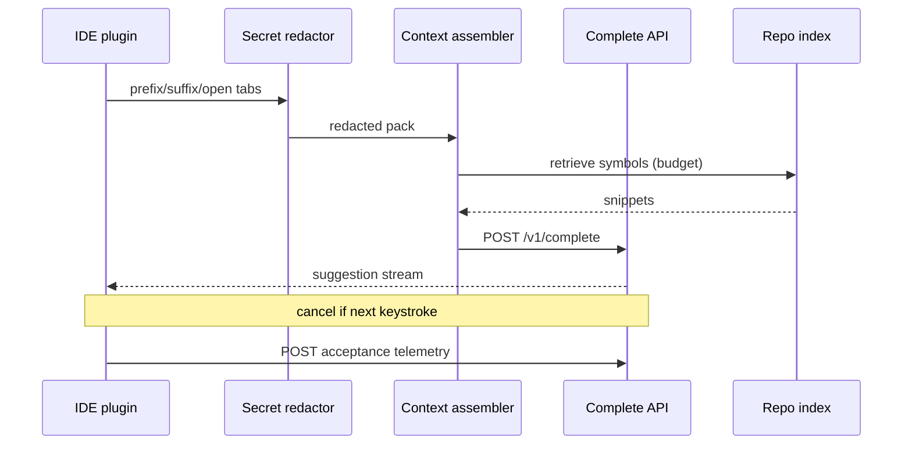
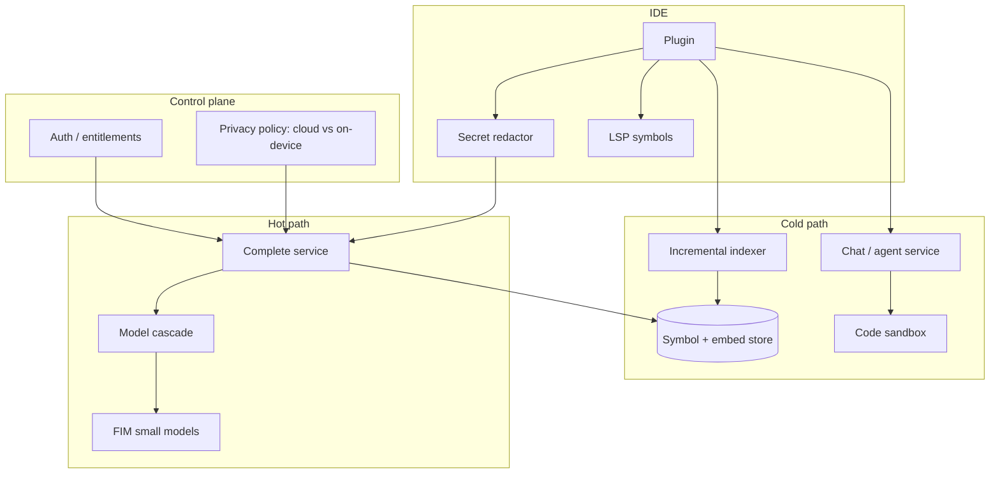

# Design an AI coding assistant (Copilot-style)

## Where this actually gets asked

Explicitly listed among high-frequency 2026 GenAI system-design questions (Microsoft, OpenAI,
Apple prep material): "Design GitHub Copilot," "Design a code completion system," "Design Cursor."
The critical Staff+ distinction: **inline completion** (sub-100–200ms TTFT, FIM, small model) is a
different system from **chat/agent mode** (frontier model, tools, multi-file edits). Pin the mode
before drawing boxes — conflating them is the #1 failure mode.

## Requirements

**Functional**
- Inline ghost-text completions as the user types (prefix + suffix aware).
- Optional chat/agent mode: explain code, multi-file edit proposals, run tools in a sandbox.
- Repo-aware context: current file, open tabs, symbols, similar code retrieval.
- Privacy: secrets never leave the IDE; enterprise may require on-prem / no-train.

**Non-functional**
- Inline TTFT budget typically 50–200ms P99 feel; cancel abandoned requests on keystroke.
- Index large monorepos without blocking the editor; incremental re-index on edit.
- Acceptance rate / persistence metrics for product quality, not just HumanEval offline.
- License and vulnerability filters on suggestions.

## Core entities

- **Completion request**: cursor position, prefix, suffix, language, debounce_id, cancel_token.
- **Context pack**: budgeted snippets (current file, imports, retrieved symbols) + token budget.
- **Repo index**: AST symbols (tree-sitter), embeddings, file hashes, incremental dirty set.
- **Suggestion**: text, range, model_id, latency_ms, filter_flags.
- **Acceptance event**: shown / accepted / persisted_after_N_min (online eval).

## API / interface

IDE plugin is the primary client. Separate hot path (complete) from cold path (index/chat).

```http
POST /v1/complete
Authorization: Bearer <device_or_user_token>
{ "language":"python", "prefix":"...", "suffix":"...", "repo_id":"r_...",
  "open_files_meta":[{"path":"a.py","hash":"..."}], "max_tokens":64 }
→ 200 text/event-stream (partial suggestion) | 204 cancelled | 429

POST /v1/index/delta
{ "repo_id":"r_...", "changes":[{"path":"...","content_hash":"...","symbols":[...]}] }
→ 202 { "indexed_through":"..." }

POST /v1/chat
{ "repo_id":"r_...", "messages":[...], "tools_allowed":["read_file","apply_patch"] }
→ stream + optional tool_calls (gated)

POST /v1/telemetry/acceptance
{ "suggestion_id":"s_...", "accepted":true, "persisted_30m":false }
→ 204
```

Staff+ callout: `/complete` must be cancelable; wasted GPU on abandoned keystrokes is a cost bug.

## Data Flow

Keystroke → debounce → context assemble (local redaction) → complete API → stream suggestion →
telemetry. Index path is async and separate.



## High-level design

Maps to **functional** requirements from step 1 — the component architecture that makes the API and data flow real.



Deep dives below target **non-functional** requirements (latency, scale, failure, cost, security).

## Deep dive 1: FIM and context budgeting

Fill-in-the-Middle formats `<PRE> prefix <SUF> suffix <MID>` so the model sees code after the cursor —
critical for inline accuracy. Budget ~2–4k tokens: current prefix (highest), suffix, import/signatures
from open tabs, then repo retrieval. Never embed the whole repo on the hot path.

## Deep dive 2: latency stack

Debounce + speculative start; **cancel** in-flight on keystroke; model cascade (tiny model for
parens/names, larger for multi-line); prefix KV cache for stable file headers; local LRU of recent
completions. Chat/agent must not share the inline GPU pool without isolation.

## Deep dive 3: privacy, license, eval

Client-side secret redaction before network. Enterprise: on-device or VPC inference
([11](11-on-device-edge-ai-inference-architecture.md)). Filter license-contaminated and known-CWE
patterns. Online metrics: acceptance rate, persistence@30m — offline HumanEval alone is insufficient.

## What's expected at each level

- **Mid-level:** send current file to an LLM API; show completion.
- **Senior:** FIM, basic retrieval, streaming, mentions latency.
- **Staff+:** cancelation, cascade, incremental index, privacy redaction, acceptance metrics.
- **Principal:** separates inline vs agent products, GPU pool isolation, enterprise no-train contracts.

## Follow-up questions to expect

- "How do you index a 10M-LOC monorepo?" (Incremental tree-sitter; embed symbols not files; dirty queue.)
- "What if the model suggests a secret?" (Output filters + never train on customer code by default.)
- "Agent mode vs autocomplete?" (Different models, tools, latency SLOs — shared indexer only.)
- "Overload on complete?" (Answer: return 204/429 fast; isolate chat/agent GPU pool so agent traffic never blows inline 50–200ms P99.)

## Related

- [10 Agent sandboxing](10-ai-agent-sandboxing-and-code-execution-security.md)
- [03 Agent orchestration](03-agent-tool-use-orchestration-platform.md)
- [11 On-device inference](11-on-device-edge-ai-inference-architecture.md)
- [01 LLM inference](01-llm-inference-serving-at-scale.md)
