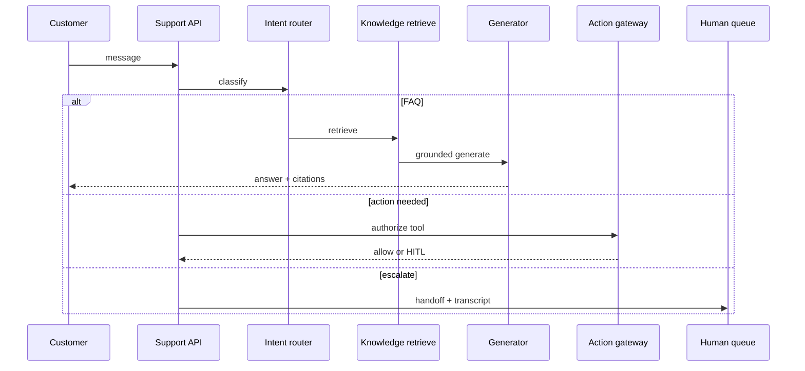
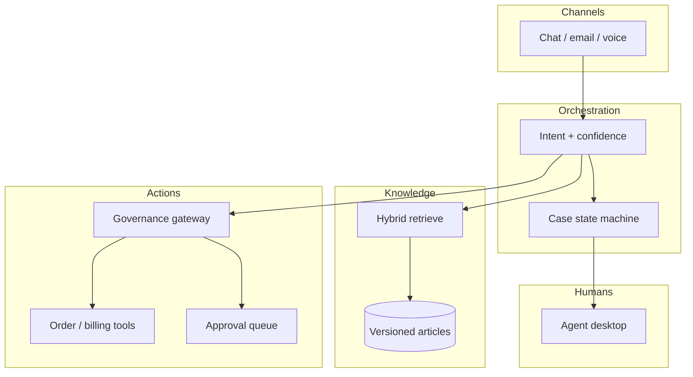

# Design an LLM-powered customer support assistant

## Where this actually gets asked

High-frequency product GenAI design at Amazon/Microsoft/AI startups: "Design a customer support
bot," "Design an AI helpdesk." Differs from ChatGPT clone by **grounded knowledge**, **tool actions**
(refund, cancel order), and **human escalation** with clear ownership handoff.

## Requirements

**Functional**
- Answer FAQs from a knowledge base with citations.
- Take allowed actions via tools (order lookup, cancel, refund) under policy.
- Escalate to human agents with full conversation + reason codes.
- Multi-turn memory of the case; optional multilingual.

**Non-functional**
- High containment (resolve without human) without sacrificing CSAT.
- Hallucination of policy/order state is unacceptable — ground or escalate.
- Action tools are side effects: gateway + HITL above risk thresholds.
- Audit trail for regulated industries (payments, healthcare).

## Core entities

- **Case / Ticket**: customer_id, channel, status, assignee (bot|human), priority.
- **Turn**: message, intent, confidence, citations[], tool_calls[].
- **Knowledge article**: versioned content, locale, effective_dates.
- **Tool policy**: tool_name, risk_tier, approval_required, rate limits.
- **Escalation**: reason_code, transcript_ref, SLA clock start.

## API / interface

```http
POST /v1/cases
{ "customer_id":"...", "channel":"chat", "subject":"..." }
→ 201 { "case_id":"k_..." }

POST /v1/cases/{id}/messages
{ "content":"Where is my order?", "stream":true }
→ SSE tokens + final { "citations":[...], "suggested_actions":[...] }

POST /v1/cases/{id}/actions
{ "tool":"cancel_order", "args":{"order_id":"..."} }
→ 200 { "status":"done" } | 202 { "status":"approval_required" } | 403

POST /v1/cases/{id}/escalate
{ "reason":"low_confidence", "queue":"billing" }
→ 200 { "assignee":"agent_...", "sla_due":"..." }

GET /v1/cases/{id}
→ full transcript + tool audit
```

Staff+ callout: never let the LLM invent order state — tools are the source of truth.

## Data Flow

Message → intent route (FAQ vs agent vs escalate) → retrieve KB → generate grounded reply →
optional tool via gateway → escalate if confidence/policy requires.



## High-level design

Maps to **functional** requirements from step 1 — the component architecture that makes the API and data flow real.



Reuse RAG ([02](02-rag-platform-at-scale.md)) and gateway ([03](03-agent-tool-use-orchestration-platform.md))
patterns; the product-specific hard parts are escalation quality and action policy.

Deep dives below target **non-functional** requirements (latency, scale, failure, cost, security).

## Deep dive 1: containment vs CSAT

Optimizing only for "deflect from humans" creates hostile bots. Track resolution rate **and** CSAT /
reopen rate. Low-confidence or high-emotion intents should escalate early. Tone adaptation matters
(empathy vs efficiency) but is secondary to correct state.

## Deep dive 2: tools and money movement

Refunds/cancels are irreversible. Classify tools read-only vs mutating; mutating requires gateway
authorize + optional HITL above $ thresholds ([03](03-agent-tool-use-orchestration-platform.md)).
Idempotency keys on every mutating tool call.

## Deep dive 3: knowledge freshness

Policy articles need effective dating; stale KB is a hallucination source. Invalidate retrieval on
publish; cite article version in the answer. Eval suite of golden tickets as a merge gate
([07](07-llm-evaluation-observability-platform.md)).

## Deep dive 4: containment SLOs and human-queue saturation

Escalate when confidence is low (e.g., <0.7) or after repeated failed tool attempts — do not optimize
only for deflection. Target containment in a realistic band (often ~40–60%) **with** a CSAT/reopen
guardrail, not 90% at any cost. Under load, stop aggressive deflection and route to humans with an
explicit `queue_depth_high` reason; name a pickup SLA (e.g., minutes for chat). Reuse RAG (02) and
gateway (03); do not rebuild them.

## What's expected at each level

- **Mid-level:** FAQ chatbot over docs.
- **Senior:** retrieval + escalation path.
- **Staff+:** tool governance, confidence routing, citation grounding, case state machine.
- **Principal:** SLAs for queues, audit for regulated actions, metrics that prevent false containment.

## Follow-up questions to expect

- "How do you prevent the bot from promising a refund the policy forbids?" (Tool+policy engine, not prompt-only.)
- "What does the human see on escalate?" (Transcript, intent, failed attempts, recommended macros.)

## Related

- [02 RAG platform](02-rag-platform-at-scale.md)
- [03 Agent orchestration](03-agent-tool-use-orchestration-platform.md)
- [05 Content moderation](05-content-moderation-safety-system.md)
