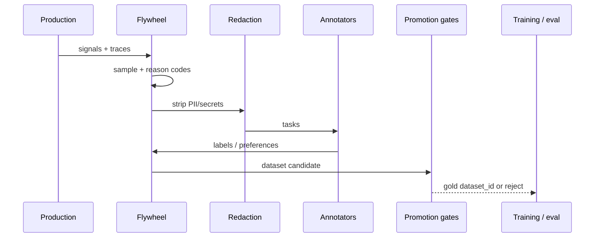
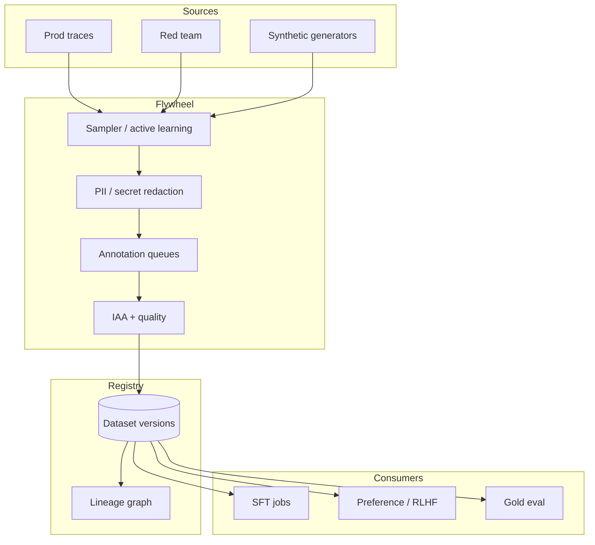

# Design an AI data flywheel and human-feedback platform


<!-- question-variants:v1 -->

## Expected question

"Design a data flywheel for a production LLM product. How do you sample production traffic, label or preference-rank examples, control quality, and promote datasets into training and eval without poisoning the model?"

## Variant forms

Interviewers often ask the same design with different framing — recognize the archetype:

- "Design the human feedback loop that turns ChatGPT thumbs-down into better SFT/RLHF data."
- "How do you sample 0.1% of production traces for labeling without biasing the dataset?"
- "Design annotation workflows for preference pairs with inter-annotator agreement gates."
- "Our flywheel started rewarding sycophancy — architect detection and dataset surgery."
- "Design PII redaction and consent before any production log enters training."
- "How do you version datasets, promote to gold, and roll back a bad labeling week?"
- "Design active learning: which failures should humans see first?"
- "Architect a red-team / adversarial data pipeline separate from organic feedback."

## Where this actually gets asked

High-frequency at OpenAI/Anthropic/Google/Meta-style **ML platform / applied science** Staff+
rounds — the "how does the product get better every week" question. Distinct from the training
pipeline itself ([08](08-finetuning-rlhf-training-pipeline-at-scale.md)) and from offline eval
([07](07-llm-evaluation-observability-platform.md)): this entry owns **sampling → labeling →
dataset contracts → promotion**. Prep aggregators over-attribute company names; the archetype is
real.

## Requirements

**Functional**
- Capture production signals (thumbs, edits, escalations, tool failures) with consent/policy.
- Sample and route items to human raters or specialist queues.
- Produce versioned datasets: SFT rows, preference pairs, eval gold, adversarial sets.
- Promote datasets through quality gates; block training on failed contracts.

**Non-functional**
- Strict PII / secrets redaction before annotator eyes or training storage.
- Sampling must be auditable and reweightable (rare failures oversampled intentionally).
- Label latency SLOs by queue (safety same-day; style preference weekly).
- Poisoning / reward-hacking resistance: adversarial and organic streams stay separable.

## Core entities

- **Production event**: request_id, model_id, prompt_hash, outcome signals, consent_flags.
- **Sampled item**: event_ref, sampling_reason, queue, priority.
- **Annotation task**: schema (rating / preference / critique), rater_id, agreement_score.
- **Dataset version**: id, lineage, row_count, quality_report, promotion_status.
- **Promotion gate**: checks (PII, agreement, schema, toxicity, leakage of eval into train).

## API / interface

```http
POST /v1/flywheel/events
{ "request_id":"...", "signals":{"thumb":"down","user_edit":true}, "consent":"train_ok" }
→ 202 { "accepted":true }

POST /v1/flywheel/sample
{ "strategy":"active_learning","quota":1000,"filters":{"failure_class":"grounding"} }
→ 200 { "batch_id":"b_...","items":[...] }

POST /v1/annotations/{task_id}/submit
{ "preference":"a_wins","critique":"...", "time_spent_s":42 }
→ 200 { "agreement":0.81 }

POST /v1/datasets
{ "name":"sft_support_v12","sources":["batch_..."], "split":"train" }
→ 201 { "dataset_id":"ds_...","status":"pending_gates" }

POST /v1/datasets/{id}/promote
→ 200 { "status":"gold" } | 422 { "violations":["pii_residual","iaa_below_threshold"] }
```

Staff+ callout: **promote** is a hard gate — training jobs must pin `dataset_id`, not "latest."

## Data Flow

Signals → policy/consent filter → sample → redact → annotate → quality → dataset version →
consume by train/eval (never silent auto-promote).



## High-level design



Deep dives below target **non-functional** requirements (latency, scale, failure, cost, security).

## Deep dive 1: sampling without silent bias

Uniform 0.1% undersamples rare safety failures and oversamples easy thumbs-up. Staff+ designs
**stratified + active** sampling: oversample tool failures, escalations, grounding declines, and
low-confidence routes; cap any single power-user's contribution. Store `sampling_reason` on every
row so you can reweight later. Never train only on thumbs-down — that encodes "be conservative and
useless."

## Deep dive 2: annotation quality and reward hacking

Preference data needs clear rubrics and inter-annotator agreement (IAA) thresholds (e.g., Cohen's κ
or pairwise agreement ≥0.7 for gold). Spot-check with experts on safety queues. Watch for
sycophancy and length bias in raters — measure with holdout probes. Keep **red-team** datasets
out of the organic mix so adversarial coverage does not get diluted.

## Deep dive 3: consent, PII, and train/eval leakage

Production → train is a privacy incident waiting to happen. Redact before humans; dual-control for
export; honor `consent=train_ok`. Hash prompts for dedup. **Eval leakage**: promotion gates must
block train rows that near-duplicate gold eval items ([07](07-llm-evaluation-observability-platform.md)).
Pin dataset versions in training configs for reproducibility and rollback.

## Deep dive 4: promotion SLOs and bad-week rollback

A labeling vendor outage or rubric change can poison a week of data. Keep `pending` vs `gold`
states; train only on gold. If online metrics regress after a train job, roll back **dataset pin**
and model together ([19](19-model-release-canary-and-rollback.md)). In 45 minutes, cover sampling
bias, redaction, IAA gate, and version pins — not GPU kernel details.

## What's expected at each level

- **Mid-level:** "log thumbs and fine-tune on them."
- **Senior:** human annotation queue + basic PII stripping.
- **Staff+:** stratified/active sampling with reason codes; IAA gates; dataset versioning; train/eval
  leakage checks; consent.
- **Principal:** reward-hacking detection, vendor quality contracts, incident rollback of datasets,
  and clear separation of organic vs adversarial streams.

## Follow-up questions to expect

- "How do you stop the model from learning to please raters?" (Rubrics, probes, mix of outcome metrics.)
- "Who sees raw user data?" (Need-to-know queues; redact first; audit access.)
- "How fast can a new failure class enter training?" (Hot queue → emergency dataset → gated promote.)

## Related

- [04 Feature store / fine-tuning data](04-feature-store-finetuning-data-pipeline.md)
- [07 LLM evaluation & observability](07-llm-evaluation-observability-platform.md)
- [08 Fine-tuning / RLHF pipeline](08-finetuning-rlhf-training-pipeline-at-scale.md)
- [12 Training-data provenance](12-training-data-provenance-and-ip-risk-architecture.md)
