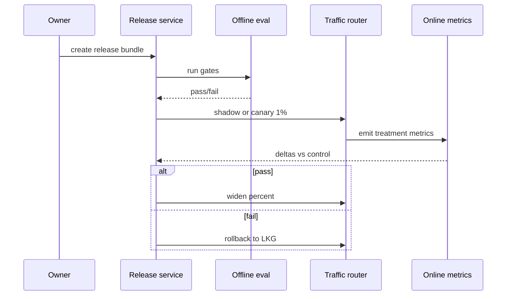
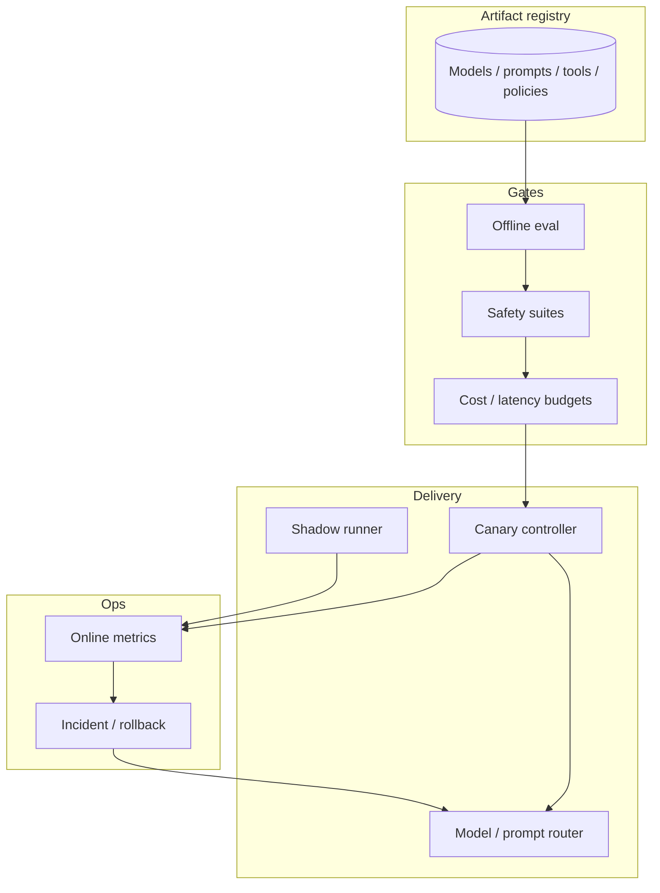

# Design a model release, canary, and rollback platform


<!-- question-variants:v1 -->

## Expected question

"Design a release platform for LLM models, prompts, and tools. How do you canary, shadow, gate on offline+online metrics, and roll back safely when quality or safety regresses?"

## Variant forms

Interviewers often ask the same design with different framing — recognize the archetype:

- "How do you ship a new model version to 1% of traffic with automatic rollback?"
- "Design shadow traffic comparison between model A and B without changing user-visible answers."
- "Our prompt change improved offline eval but tanked CSAT — architect release gates."
- "Design coordinated release of model weights + safety classifier + tool schema."
- "How do you prevent a bad agent tool from reaching 100% of tenants?"
- "Design holdback cohorts and experiment analysis for GenAI products."
- "Walk through incident response when a canary spikes toxicity or cost 3×."
- "How do you version prompts as code with review, eval, and progressive delivery?"

## Where this actually gets asked

Staff+/Principal signal at every serious AI platform loop: shipping is the product. Distinct from
eval platform design ([07](07-llm-evaluation-observability-platform.md)) — this entry owns
**progressive delivery contracts, blast radius, and rollback**. Common at Google/Meta/Microsoft
ML platform and OpenAI/Anthropic applied infra narratives (archetype, not a single verbatim ask).

## Requirements

**Functional**
- Register release artifacts: model build, prompt bundle, tool schema, safety policy version.
- Run offline gates, then shadow/canary/progressive rollout to traffic slices.
- Compare treatments on quality, safety, latency, and cost; auto or human-approve promotion.
- Roll back to last known good within minutes, including dependent artifacts.

**Non-functional**
- Canary decisions within a defined window (e.g., 30–120 min) with statistical guardrails.
- Blast radius caps (max % traffic, max tenants, exclude regulated tenants until soak).
- Auditability: who approved what, with which eval report.
- Fail closed: cannot mark "production default" without passing gates.

## Core entities

- **Artifact**: type (model|prompt|tool|policy), version, digest, lineage.
- **Release**: set of artifacts, target environment, strategy (shadow|canary|pct).
- **Gate result**: offline scores, online deltas, pass/fail, approver.
- **Traffic slice**: % / tenant allowlist / geo / plan tier.
- **Rollback plan**: previous release pointer, drain strategy, SLO clock.

## API / interface

```http
POST /v1/artifacts
{ "type":"model","version":"llama-x-2026-04-01","digest":"sha256:...","eval_report_id":"e_..." }
→ 201 { "artifact_id":"a_..." }

POST /v1/releases
{ "artifacts":["a_model","a_prompt","a_safety"], "strategy":"canary","slice":{"percent":1} }
→ 201 { "release_id":"r_...","status":"pending_offline_gates" }

POST /v1/releases/{id}/promote
→ 200 { "status":"canary_10pct" } | 422 { "failed_gates":["toxicity_delta","cost_per_session"] }

POST /v1/releases/{id}/rollback
{ "reason":"safety_regression","incident_id":"i_..." }
→ 200 { "active":"r_previous","drain_seconds":60 }

GET /v1/releases/{id}/metrics
→ { "quality_delta":-0.02,"toxicity_delta":+0.004,"ttft_p99_ms":...,"cost_ratio":1.8 }
```

Staff+ callout: releases are **bundles** — rolling model without matching safety policy is a bug.

## Data Flow

Offline eval gate → shadow (optional) → canary slice → soak metrics → progressive % → default;
any gate fail or page → rollback to pinned previous bundle.



## High-level design



Deep dives below target **non-functional** requirements (latency, scale, failure, cost, security).

## Deep dive 1: shadow vs canary

**Shadow**: new model scores the same requests; user still sees control. Good for latency/cost and
offline-like online signals; bad for measuring UX that depends on the visible answer. **Canary**:
user-visible treatment on a slice — required for CSAT/acceptance, higher risk. Staff+ picks based
on risk class: safety-critical changes need smaller slices + faster kill switches; prompt tweaks
may canary faster. Never canary a tool schema change to regulated tenants first.

## Deep dive 2: gates that catch the usual failures

Minimum offline: golden eval regression bounds, safety suites, tool-contract tests, cost/token
estimates ([07](07-llm-evaluation-observability-platform.md)). Online: toxicity/rate-limit spikes,
TTFT/TPOT, cost per session, task success / containment, thumbs-down rate. Use sequential testing
or pre-registered thresholds — not "eyeball the dashboard." Hold out a long-term control cohort
so you can detect slow drifts.

## Deep dive 3: coordinated rollback

Rolling back weights while leaving a new prompt that assumes new behavior causes silent failures.
Store **release bundles** and atomically switch the router pointer. Drain in-flight streams
gracefully (finish or cancel with client message). For agents, freeze new tool versions and revoke
capability grants tied to the bad release ([17](17-llm-application-security-prompt-injection.md)).

## Deep dive 4: multi-tenant blast radius

Enterprise tenants may require contractual approval for model changes. Support per-tenant pins,
allowlists, and "stability channel" vs "rapid channel." Cap global canary (e.g., ≤5%) until soak;
exclude VIP/regulated until 24h clean. In 45 minutes: bundle + gates + canary metrics + atomic
rollback — do not redesign training.

## What's expected at each level

- **Mid-level:** deploy new model behind a flag; manual rollback.
- **Senior:** percent rollout + basic offline eval before ship.
- **Staff+:** artifact bundles, shadow vs canary trade-off, online guardrails with auto-rollback,
  tenant blast-radius controls.
- **Principal:** experiment design (holdbacks), cross-artifact coordination, incident runbooks tied
  to release IDs, and contractual stability channels.

## Follow-up questions to expect

- "Offline looked good, online tanked — why?" (Distribution shift, position bias, latency UX, abuse.)
- "How fast must rollback be?" (Minutes for safety; name drain + DNS/router TTLs.)
- "Prompts vs weights — same pipeline?" (Same release service, different artifact types and gates.)

## Related

- [07 LLM evaluation & observability](07-llm-evaluation-observability-platform.md)
- [01 LLM inference serving](01-llm-inference-serving-at-scale.md)
- [09 Multi-tenant AI platform](09-multi-tenant-ai-platform-architecture.md)
- [cloud-architecture/07 LLM gateway](../cloud-architecture/07-llm-gateway-semantic-cache-model-router.md)
