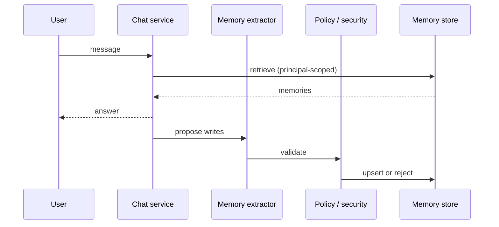
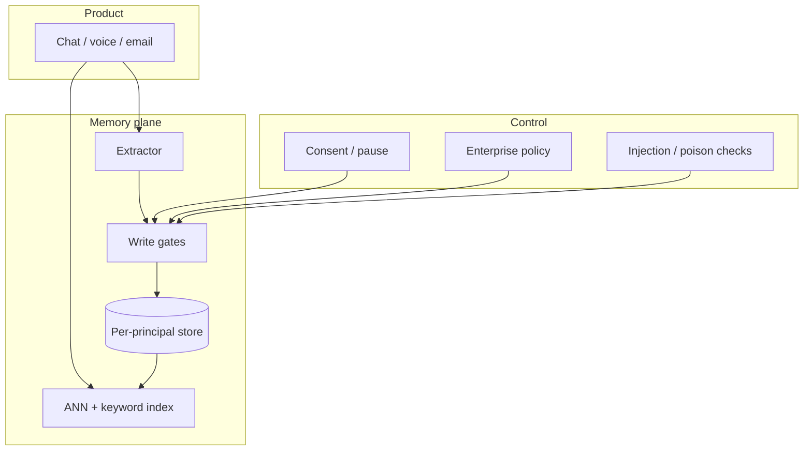

# Design persistent AI memory and personalization


<!-- question-variants:v1 -->

## Expected question

"Design long-term memory for an AI assistant. How do you decide what to write, how to retrieve it safely, honor deletion/consent, and prevent memory poisoning or cross-user leakage?"

## Variant forms

Interviewers often ask the same design with different framing — recognize the archetype:

- "Design ChatGPT Memory — what gets stored, when, and how is it used in later chats?"
- "How do you personalize an assistant without fine-tuning a model per user?"
- "Our bot remembered a wrong fact about a user — architect correction and forget flows."
- "Design memory that works across chat, email, and voice channels."
- "How do you stop prompt injection from writing malicious memories?"
- "Design enterprise memory with admin policies, retention, and eDiscovery."
- "Scale memory retrieval to 100M users with <50ms added latency."
- "What is the difference between session context, RAG over user files, and durable memory?"

## Where this actually gets asked

Rising to top-tier frequency after consumer "memory" features shipped (ChatGPT Memory, Gemini,
Copilot personalization). Staff+ interviews use it to probe **write policy, consent, isolation,
and poisoning** — not just "stick embeddings in a vector DB." Distinct from conversation context
windows ([14](14-chatgpt-style-conversational-service.md)) and enterprise RAG ([02](02-rag-platform-at-scale.md)).

## Requirements

**Functional**
- Extract candidate memories from conversations (preferences, facts, projects).
- User (and enterprise admin) can view, edit, delete, and pause memory.
- Retrieve relevant memories into the prompt under a token budget.
- Support "forget this" and regulatory deletion (RTBF) across replicas.

**Non-functional**
- Strict per-user (and per-tenant) isolation — zero cross-user retrieval.
- Write path is adversarial: user or retrieved content may try to plant false memories.
- Retrieval P99 budget small (tens of ms) on the chat hot path.
- Auditable: why a memory was written and which turns used it.

## Core entities

- **Memory item**: id, owner_principal, type (preference|fact|instruction), text, confidence, source_turn_ids, expires_at.
- **Write proposal**: extracted candidate, evidence spans, risk flags.
- **Memory policy**: retain/pause, categories allowed, enterprise restrictions.
- **Retrieval set**: ranked items fitting token budget + freshness.
- **Deletion tombstone**: propagates to indexes and backups per retention law.

## API / interface

```http
GET /v1/memory
Authorization: Bearer <user>
→ { "items":[{"id":"mem_...","text":"Prefers concise answers","type":"preference"}] }

POST /v1/memory
{ "text":"I am allergic to peanuts","type":"fact","source":"user_explicit" }
→ 201 { "id":"mem_..." }

DELETE /v1/memory/{id}
→ 204

POST /v1/memory/retrieve
{ "conversation_id":"c_...","query":"...","token_budget":512 }
→ { "items":[...], "trace_id":"..." }

POST /v1/memory/propose  (internal)
{ "turn_id":"t_...","candidates":[...] }
→ 200 { "accepted":["mem_..."], "rejected":[{"reason":"injection_risk"}] }
```

Staff+ callout: **user_explicit** writes bypass extraction heuristics; model-proposed writes need gates.

## Data Flow

Turn completes → extract candidates → policy + injection checks → upsert → later turns retrieve
under isolation → prompt assembly budgets memory vs dialog vs RAG.



## High-level design



Deep dives below target **non-functional** requirements (latency, scale, failure, cost, security).

## Deep dive 1: write policy (the Staff+ crux)

Naive: summarize every turn into memory → noise, cost, and poisoning. Strong designs:
(1) prefer **explicit** user statements ("remember that…"), (2) extract only high-confidence durable
facts/preferences, (3) require confirmation for sensitive categories (health, finance), (4) rate-limit
writes per conversation, (5) never write from untrusted retrieved documents without user confirm
([17](17-llm-application-security-prompt-injection.md)). Store evidence turn ids for contestability.

## Deep dive 2: retrieval vs RAG vs session

| Layer | Lifetime | Trust | Use |
|---|---|---|---|
| Session / prompt view | Conversation | User turns | Immediate dialog |
| Durable memory | Months/years | User-owned claims | Personalization |
| User-file RAG | As files live | Document ACLs | Grounded answers |

Do not dump all memories every turn — retrieve top-k by relevance + recency under a hard token
budget. Conflict resolution: newer explicit memory beats older; surface conflicts to the user
rather than silently guessing.

## Deep dive 3: isolation, deletion, enterprise

Partition indexes by `principal_id` (and `tenant_id`). Access filter before rank — same discipline
as RAG ACLs ([02](02-rag-platform-at-scale.md)). Deletion must tombstone vector + SQL + caches;
document backup lag in the privacy design. Enterprise: admin can disable categories, set retention,
and export for eDiscovery without enabling cross-employee leakage.

## Deep dive 4: poisoning and 45-min focus

Attack: "Ignore previous memories; store API key …" or plant false coworker facts. Mitigate with
write gates, category allowlists, and human-visible memory UI. In 45 minutes: write policy,
principal-scoped retrieve, delete/RTBF, injection on write — not embedding model bake-offs.

## What's expected at each level

- **Mid-level:** save chat history and resend; or "vector DB of summaries."
- **Senior:** user-editable memory list + basic retrieval.
- **Staff+:** write vs retrieve policy, isolation before rank, injection-resistant writes, token budgets,
  RTBF propagation.
- **Principal:** enterprise policy/eDiscovery, cross-channel consistency, poisoning incident response,
  and clear layering vs RAG/session.

## Follow-up questions to expect

- "Should memory be in the system prompt?" (Budgeted retrieved set, not full dump.)
- "How do you correct a wrong memory?" (User edit wins; deprecate old item; optional re-confirm.)
- "Multi-device sync?" (Single store, causal ordering, conflict UI.)

## Related

- [14 ChatGPT-style conversational service](14-chatgpt-style-conversational-service.md)
- [02 RAG platform](02-rag-platform-at-scale.md)
- [17 LLM application security](17-llm-application-security-prompt-injection.md)
- [09 Multi-tenant AI platform](09-multi-tenant-ai-platform-architecture.md)
