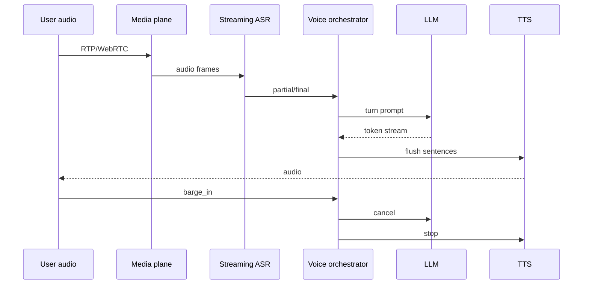
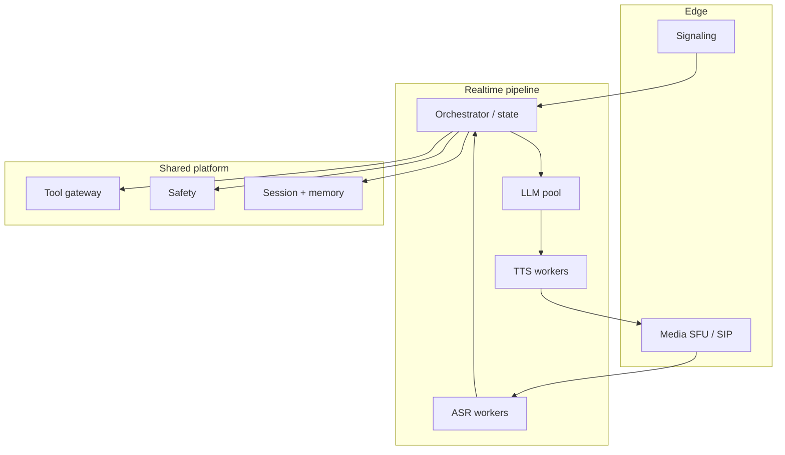

# Design a real-time voice AI assistant


<!-- question-variants:v1 -->

## Expected question

"Design a real-time voice assistant (phone or app). How do you orchestrate streaming ASR, LLM, and TTS with barge-in, low latency, and safety?"

## Variant forms

Interviewers often ask the same design with different framing — recognize the archetype:

- "Design a voice agent for customer support with <800ms perceived response start."
- "How do you handle barge-in when the user interrupts the TTS mid-sentence?"
- "Design telephony integration (SIP/WebRTC) for an AI receptionist."
- "Our voice bot talks over the user — architect turn-taking and endpointing."
- "Design cascading vs speech-to-speech models — trade latency and control."
- "How do you keep transcripts, tools, and PCI data safe on a voice path?"
- "Scale to 50k concurrent calls with GPU pools for ASR/LLM/TTS."
- "Design failover when ASR confidence collapses mid-call."

## Where this actually gets asked

High-frequency product GenAI design in 2025–2026 (OpenAI Realtime-style, Amazon Connect + LLM,
Google voice agents, startup "AI phone"). Distinct from text chat ([14](14-chatgpt-style-conversational-service.md))
because **endpointing, barge-in, duplex audio, and tighter latency budgets** dominate. Treat
vendor names as directional.

## Requirements

**Functional**
- Duplex audio: listen and speak; support interrupt (barge-in).
- Stream partial transcripts; call tools; optionally hand off to human.
- Multi-turn dialogue with short-term call state + optional long-term memory.
- Languages / accents within a declared set; clear error recovery ("sorry, repeat").

**Non-functional**
- Perceived responsiveness: aim first audible response in ~500–1000ms after end-of-utterance for
  simple turns (state the budget; measure components).
- Cancel in-flight LLM/TTS immediately on barge-in — wasted latency is a UX bug.
- Call recording / transcript retention under consent and PCI/PII rules.
- Graceful degrade: ASR fail → slower turn or human transfer; never invent payment card data.

## Core entities

- **Call / session**: media transport (WebRTC/SIP), locale, consent flags, state machine.
- **Utterance**: audio spans, partial/final ASR text, confidence, endpoint reason.
- **Turn plan**: LLM tokens / speech-to-speech events, tool calls, cancel_token.
- **TTS stream**: sentence/chunk cues, marks for interruptible boundaries.
- **Escalation**: human agent bridge, warm transfer context.

## API / interface

Media is WebRTC/SIP; control plane is separate.

```http
POST /v1/voice/sessions
{ "transport":"webrtc","locale":"en-US","tools":["lookup_order"], "record":false }
→ 201 { "session_id":"v_...","ice_servers":[...] }

WS /v1/voice/sessions/{id}/events
← asr.partial | asr.final | agent.audio | agent.tool | agent.transfer | error
→ client.audio | client.barge_in | client.dtmf

POST /v1/voice/sessions/{id}/tools/{name}
{ "args":{...}, "idempotency_key":"..." }
→ 200 | 202 hitl | 403

POST /v1/voice/sessions/{id}/transfer
{ "queue":"billing","reason":"low_asr_confidence" }
→ 200 { "bridge":"..." }
```

Staff+ callout: **barge_in** must cancel LLM and TTS server-side, not only mute the speaker.

## Data Flow

Audio in → streaming ASR → endpoint → LLM (stream) → sentence-flush TTS → audio out;
barge-in aborts the pipeline; tools via gateway.



## High-level design



Compose text chat safety/tools ([14](14-chatgpt-style-conversational-service.md), [03](03-agent-tool-use-orchestration-platform.md));
this entry owns **audio duplex + cancellation**.

Deep dives below target **non-functional** requirements (latency, scale, failure, cost, security).

## Deep dive 1: latency budget (name the numbers)

Example budget after end-of-utterance: ASR finalize 100–200ms + LLM TTFT 200–400ms + TTS first
chunk 100–200ms ≈ 500–800ms. Steal latency with speculative LLM start on high-confidence partials
(risk: wrong endpoint). Prefer **sentence-level TTS flush** over waiting for full LLM completion.
Speech-to-speech models can cut hops but weaken tool/policy control — state the trade-off.

## Deep dive 2: turn-taking and barge-in

Endpointing (VAD + ASR endpoint) is the hard ML+product problem: cut too early → truncate user;
too late → sluggish. On barge-in: (1) stop TTS playout, (2) cancel LLM generation and GPU work,
(3) keep ASR rolling, (4) discard obsolete tool calls not yet authorized. Without cancel, cost and
UX both fail.

## Deep dive 3: tools, PCI, and transcripts

Voice + tools inherits gateway/HITL rules. DTMF for PCI (cards) should bypass LLM context —
capture in a secure widget, not in ASR text retained for training. Transcripts are sensitive:
consent, retention TTLs, redaction before flywheel ([18](18-ai-data-flywheel-and-human-feedback-platform.md)).

## Deep dive 4: scale and degrade

Separate GPU pools for ASR/LLM/TTS so a TTS spike does not kill recognition. Under load: shorten
responses, disable speculative starts, transfer to human, or queue with ringtone UX. In 45 minutes:
budget, barge-in cancel, tool gateway, one degrade path — do not redesign SIP stacks.

## What's expected at each level

- **Mid-level:** ASR → LLM → TTS pipeline diagram.
- **Senior:** streaming + basic interrupt; mentions WebRTC.
- **Staff+:** numeric latency budget, barge-in cancellation of LLM/TTS, endpointing trade-offs,
  tool/PCI isolation, pool isolation.
- **Principal:** speech-to-speech vs cascade trade-off, telephony failure domains, compliance for
  recordings, and human warm-transfer design.

## Follow-up questions to expect

- "Partial transcripts wrong — still call tools?" (Confirm on final or high confidence; idempotent tools.)
- "How do you test voice?" (Golden audio suites, barge-in chaos tests, latency traces per stage.)
- "Accent / noise?" (Locale models, SNR degrade → ask repeat / transfer.)

## Related

- [14 ChatGPT-style conversational service](14-chatgpt-style-conversational-service.md)
- [16 LLM customer-support assistant](16-llm-customer-support-assistant.md)
- [01 LLM inference serving](01-llm-inference-serving-at-scale.md)
- [03 Agent orchestration](03-agent-tool-use-orchestration-platform.md)
