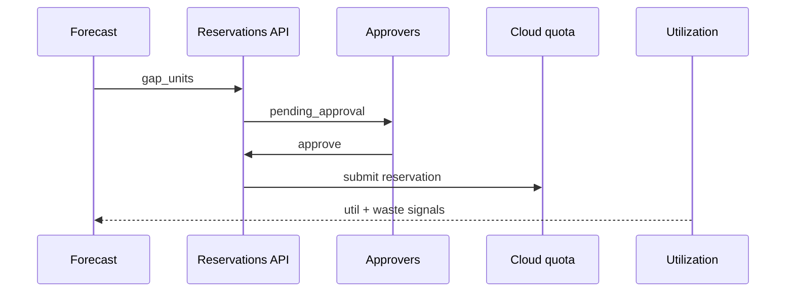
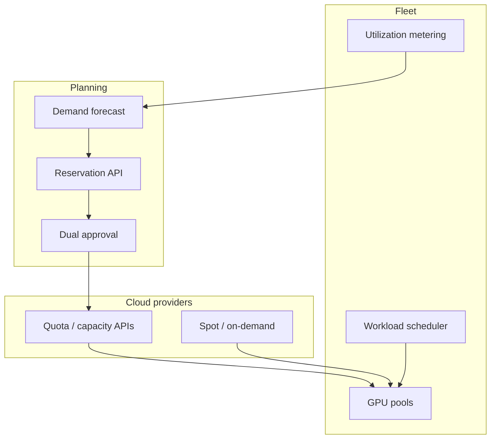

# Design a GPU capacity-planning and procurement system


<!-- question-variants:v1 -->

## Expected question

"Design a GPU capacity-planning and procurement system for AI workloads. How do you forecast demand, reserve vs spot, and avoid quota exhaustion?"

## Variant forms

Interviewers often ask the same design with different framing — recognize the archetype:

- "OpenAI needs 10 gigawatts of compute — how do you plan procurement and cluster lifecycle?"
- "Design reserved GPU capacity vs on-demand for training jobs with unpredictable duration."
- "How do you forecast H100 needs for next quarter when product usage doubles monthly?"
- "Our training jobs queue for days — architect quota pooling across teams."
- "Design build vs rent (CoreWeave/Nebius) for a hyperscaler scaling GenAI."
- "How do you right-size clusters when model sizes jump 4× year over year?"
- "Design FinOps dashboards tying GPU hours to product features and tenants."

## Where this actually gets asked

Well-documented as a *real infrastructure problem* at OpenAI and Meta specifically, but not as a
*verbatim reported interview question* anywhere I could confirm. OpenAI's own engineering blog
["Scaling Kubernetes to 7,500 Nodes"](https://openai.com/index/scaling-kubernetes-to-7500-nodes/)
and its Compute Infrastructure team's public job scope both describe capacity planning and
cluster lifecycle as a named discipline; the OpenAI–NVIDIA 10-gigawatt compute deal (reported by
OpenAI and NVIDIA directly) confirms procurement at this scale is a real, current concern,
not a hypothetical. Meta's engineering blog ("Building Meta's GenAI Infrastructure") documents
24k-GPU clusters, and multiple outlets have reported Meta renting roughly $48B of external GPU
capacity from CoreWeave and Nebius — a real build-vs-rent decision made at hyperscaler scale.
No Glassdoor/Blind quote ties this to a specific interview loop at any of the six companies.
Treat it as a distinctively AI-infra topic — a generic cloud-architect interview does not ask
about GPU quota exhaustion or reserved-vs-spot training capacity, because non-AI workloads
rarely hit this constraint as the dominant cost and availability bottleneck.

## Requirements

**Functional**
- Forecast GPU-hour demand across training runs (scheduled, bursty) and serving fleets
  (steadier, but scales with product traffic).
- Decide, per workload, the procurement mix: reserved capacity, on-demand/spot, or a secondary
  cloud/neocloud provider (CoreWeave, Lambda, Nebius-style GPU-specific vendors).
- Support graceful degradation when a quota or reservation is exhausted — queue, downshift to a
  smaller model/batch size, or overflow to a secondary provider, not a hard failure.

**Non-functional**
- GPU-hours are usually the single largest infrastructure cost line at an AI company — the
  system's forecasts and procurement decisions have a bigger P&L impact than almost any other
  infra choice.
- Utilization matters as much as raw availability: idle reserved GPUs are pure waste, and
  under-provisioned capacity blocks product launches or degrades training throughput.
- Lead time is real and non-trivial — large reserved-capacity commitments (weeks-to-months lead
  time from cloud vendors) can't be decided reactively the way a web server's autoscaling group
  can.

## Core entities

- **Workload**: training job or serving fleet, with a demand profile (steady vs. bursty), a
  priority tier, and a GPU-hour forecast.
- **Capacity pool**: a reserved commitment (1-3 year, specific GPU type/region), an on-demand
  quota, or spot capacity, each with a cost-per-GPU-hour and an availability guarantee level.
- **Allocation**: the binding of a workload to a capacity pool at a point in time, with a
  fallback pool if the primary is exhausted.
- **Utilization record**: actual GPU-hours consumed vs. reserved/allocated, the input to both
  cost accounting and the next forecasting cycle.

## API / interface
Auth: FinOps + ML-platform admins; reservations require dual approval above a spend threshold.

```http
GET /v1/capacity/forecast?sku=h100_80gb&days=90
→ {"demand":[...],"supply":[...],"gap_units":120,"confidence":0.74}

POST /v1/reservations
{"sku":"h100_80gb","units":64,"start":"2026-09-01","term_months":12,"regions":["us-east"]}
→ 201 {"reservation_id":"res_...","status":"pending_approval","est_cost_usd":...}

POST /v1/reservations/{id}/approve
{"approver_ids":["u_finops","u_ml"],"budget_code":"AI-2026"} → 200 {"status":"submitted_to_cloud"}

GET /v1/fleet/utilization?sku=h100_80gb&window=7d
→ {"avg_util":0.61,"p95_queue_wait_sec":42,"idle_waste_usd":18000}

POST /v1/placement/recommendations
{"job_class":"training","priority":"high"} → 200 {"region":"us-east","pool":"reserved","reason":"sla_queue"}
```

Staff+ callout: forecast → reservation → approval → utilization feedback is a closed control-plane loop.


## Data Flow


Forecast → reservation request → dual approval → provider submit → utilization feeds the next forecast.



## High-level design

Maps to **functional** requirements from step 1 — the component architecture that makes the API and data flow real.



The core loop is closed: a forecaster drives procurement decisions ahead of demand (reserved
capacity has real lead time), a scheduler binds actual workloads against whatever pools exist
at request time with an explicit fallback chain, and every allocation's real consumption feeds
back into the next forecast — not a one-time capacity plan that goes stale the moment traffic
shifts.

Deep dives below target **non-functional** requirements (latency, scale, failure, cost, security).

## Deep dive 1: reserved vs. on-demand vs. secondary-provider trade-offs

| Approach | Cost per GPU-hour | Availability guarantee | Lead time | When it's the right call |
|---|---|---|---|---|
| Reserved (1-3yr commitment) | Lowest | High — capacity is yours | Weeks-months | Steady-state serving fleets, planned large training runs |
| On-demand (cloud vendor) | Higher | Best-effort, subject to regional quota | Minutes-hours | Bursty training experiments, overflow above reserved baseline |
| Spot/preemptible | Lowest of all, but interruptible | Low — can be reclaimed with short notice | Minutes | Fault-tolerant batch training with checkpointing, never for serving |
| Secondary/neocloud provider | Varies, often competitive | Independent of primary cloud's quota | Days-weeks | Diversifying away from a single vendor's capacity ceiling — the real reason Meta reportedly rents external GPU capacity rather than only building/expanding its own data centers |

**Common mistake at the mid/senior level:** treating this as a single "reserved vs. on-demand"
binary. The real decision is a portfolio across at least three tiers, and the mix shifts by
workload type — serving fleets skew toward reserved (predictable, can't tolerate preemption),
training experimentation skews toward spot/on-demand (tolerant of interruption if checkpointed
correctly), and secondary providers exist specifically to remove a single vendor's quota ceiling
as a hard constraint on how fast the company can scale.

## Deep dive 2: forecasting and utilization as the actual hard problem

Procuring capacity is a solved logistics problem once you have an accurate forecast; the real
difficulty is that AI workload demand is lumpy — a single large training run can dwarf months of
steady serving demand, and forecasts built from serving-traffic patterns (which look like normal
web traffic) don't transfer to training demand (which looks like a queue of large, discrete
jobs). A forecaster needs separate models for these two demand shapes, not one unified curve.

This is the same discipline behind [agent-finops](https://github.com/vpeetla-ai/agent-finops) —
a real, standalone service built after an audit found platforms in this org computing "cost"
from static estimates instead of real per-call usage. The same principle applies one layer up
the stack: a GPU capacity plan built from *forecasted* demand without a real utilization
feedback loop is exactly the same failure mode — you can't correct a bad forecast if you never
measure what was actually consumed against what was reserved.

## Deep dive 3: the org's own procurement discipline, at a much smaller scale

The real Phase C deploys in this org ([agent-finops on GCP Cloud Run](https://github.com/vpeetla-ai/agent-finops),
[aegisai on AWS ECS Fargate](https://github.com/vpeetla-ai/aegisai-enterprise-agent-platform))
made the same category of decision at a scale small enough to fully reason about by hand:
smallest-tier reserved compute (`db-f1-micro`, `db.t4g.micro`) for steady-state cost, scale-to-
zero (Cloud Run `min_instances = 0`) for bursty/intermittent demand, and an explicit stand-up/
verify/tear-down operating pattern instead of leaving capacity provisioned and idle between
uses. It's the same reserved-vs-elastic reasoning as GPU procurement, just at a cost scale where
the trade-off can be verified end-to-end in a single session rather than modeled statistically.

## What's expected at each level

- **Mid-level:** proposes "reserve some capacity, use on-demand for spikes" without a forecasting
  mechanism or a fallback chain when a pool is exhausted.
- **Senior:** separates training demand (lumpy, checkpoint-tolerant) from serving demand
  (steady, preemption-intolerant) and assigns different procurement tiers to each.
- **Staff+:** designs the full fallback chain (reserved → on-demand → secondary provider) with
  explicit triggers, and treats utilization measurement as a required input to the next
  forecasting cycle, not an afterthought report.
- **Principal:** additionally reasons about multi-vendor diversification as a strategic
  capacity-ceiling problem, not just a cost problem — can articulate why a company might
  deliberately rent from a secondary provider even at a cost premium, to avoid being capped by
  one vendor's quota during a scaling inflection point.

## Follow-up questions to expect

- "How do you decide how much to over-provision reserved capacity, given utilization is never
  100%?" (Answer: size the reserved baseline to steady-state serving demand plus a buffer
  informed by historical peak-to-trough ratio, and route anything above that to on-demand/spot
  rather than reserving for the peak.)
- "What happens when a training job needs GPUs mid-run and none are available in any tier?"
  (Answer: this is a scheduling/priority decision, not a procurement one at that point — preempt
  a lower-priority job, queue with a deadline-aware backoff, or degrade to a smaller
  configuration; procurement's job was to make this rare, not to make it impossible.)
- "How would this change for a company that owns its own data centers vs. one that's fully
  cloud-native?" (Answer: owned data centers shift the trade-off from "reserved vs. on-demand
  pricing" to "capital expenditure and multi-year build lead time vs. flexibility" — the same
  reserved-vs-elastic tension, one layer further out.)
- "Spot preemption?" (Answer: only for checkpointed training; checkpoint frequency is effective RPO — serving stays on reserved/on-demand.)

## Related

- [agent-finops](https://github.com/vpeetla-ai/agent-finops) — real per-call cost metering, the same forecast-vs-actual discipline one layer down
- [system-design/01: LLM inference serving at scale](../ai-system-design/01-llm-inference-serving-at-scale.md) — the serving-side GPU memory/scheduling deep dive this procurement layer feeds
- [ADR-015: Genuine hands-on AWS + GCP infra](https://github.com/vpeetla-ai/ai-architecture-portfolio/blob/main/adr/ADR-015-real-aws-gcp-infra-phase-c.md)
