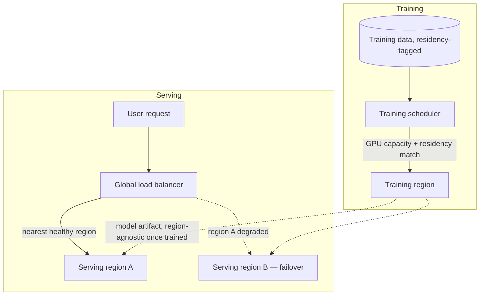

# Design a multi-region strategy for training vs. serving

## Where this actually gets asked

The weakest-sourced entry in this section, disclosed plainly: no company-specific interview
account was found for any of the six companies distinguishing training-region strategy from
serving-region strategy. What does exist is solid *architecture documentation*, not interview
evidence — Google Cloud's own guidance on multi-region GKE and Cloud SQL replicas, and
Microsoft's documented Azure OpenAI deployment model (Regional, Global, and "Data Zone" tiers,
each with different data-residency and latency guarantees, per Microsoft Learn). Treat this as
the generic "multi-region system design" archetype asked broadly across big tech, adapted to an
AI-specific wrinkle — training and serving have almost opposite region requirements, and a
candidate who treats them identically is missing the actual point of the question.

## Requirements

**Functional**
- Training jobs need to run wherever GPU capacity exists, without user-facing latency
  constraints.
- Serving/inference needs to run close to users, with regional failover if a region degrades.
- Some workloads (regulated industries, EU customers) require data to stay within a specific
  jurisdiction end-to-end — for training data, fine-tuning data, and inference logs alike.

**Non-functional**
- Serving latency budgets (often sub-second) make cross-region round-trips for every request a
  non-starter — regional replicas of the serving stack are required, not optional.
- Training has no comparable latency constraint, but does have a data-gravity constraint — moving
  petabyte-scale training data across regions is slow and expensive, so training tends to run
  wherever the data and GPU capacity co-locate, not wherever is "closest."
- Data residency requirements (GDPR, and sector-specific rules like HIPAA) can force training
  data to never leave a region — which then constrains where a compliant model can even be
  trained, independent of GPU availability.

## Core entities

- **Region**: a deployment location with a GPU capacity profile, a data-residency
  classification, and a set of services deployed there.
- **Training job**: bound to whichever region has both sufficient GPU capacity and residency
  clearance for its input data — not necessarily the region closest to any user.
- **Serving replica**: a full regional deployment of the inference stack, load-balanced by
  proximity, with a defined failover target if its region degrades.
- **Data residency policy**: a per-dataset/per-customer rule constraining which regions are
  legally allowed to process or store that data.

## API / interface

```text
POST /training/schedule { job_id, dataset_residency_tag, gpu_requirement }
  → { region: "us-central1" | "europe-west4" | ..., reason }
GET  /serving/route?client_region= → { primary_region, failover_region, estimated_latency_ms }
```

## High-level design



The key design split: training region selection is driven by **data gravity and residency**,
serving region selection is driven by **user proximity and failover** — and the trained model
artifact itself is the boundary between them, since a model (unlike raw training data) is
usually not subject to the same residency constraints once training is complete, unless
regulation specifically extends to model weights (an emerging, not yet settled, area).

## Deep dive 1: why training and serving region strategy are not the same problem

A common weak answer proposes one multi-region strategy and applies it uniformly. The actual
constraints point in different directions:

| Dimension | Training | Serving |
|---|---|---|
| Primary driver | GPU capacity availability + data residency | User latency + regional failover |
| Data movement pattern | One-time or periodic bulk transfer (or none, if compute moves to data) | Continuous, per-request, small payloads |
| Failure tolerance | High — a delayed training run is costly but rarely user-facing | Low — a serving outage is immediately user-visible |
| Region count driver | As few as necessary (fewer regions = simpler compliance surface) | As many as needed to keep users within an acceptable latency radius |

## Deep dive 2: data residency as a hard constraint, not a preference

Azure OpenAI's documented "Data Zone" deployment tier — a middle ground between fully regional
and fully global processing — is a real, useful pattern here: it commits to keeping data within
a defined geography (e.g., "EU Data Zone") while still allowing some cross-region routing for
availability, rather than forcing an all-or-nothing choice between "fully regional" (expensive,
fragments capacity) and "fully global" (fails compliance outright for regulated customers).
**Common mistake at the mid/senior level:** proposing "just replicate everywhere" without
addressing that some datasets legally cannot be replicated everywhere — the model this data
trains also inherits some of that constraint if the model can be shown to memorize or leak
training data.

## What's expected at each level

- **Mid-level:** proposes regional serving replicas with a global load balancer; may not
  address training's region strategy as a separate question at all.
- **Senior:** explicitly separates training-region selection (capacity + residency driven) from
  serving-region selection (latency + failover driven).
- **Staff+:** designs the residency-tagging mechanism explicitly — how a dataset's allowed
  regions propagate through training scheduling — and identifies the model-artifact boundary as
  the point where residency constraints may or may not carry forward.
- **Principal:** additionally reasons about the compliance-surface cost of adding a region (more
  regions to audit, more jurisdictions' rules to track) as a real operating cost that trades off
  against latency/capacity benefits, not a free win.

## Follow-up questions to expect

- "A regulator says a customer's data can never leave their home region — but you only have GPU
  capacity for fine-tuning in a different region. What do you do?" (Answer: this is a real
  constraint, not a negotiable one — either provision capacity in the compliant region even at
  higher cost, or don't offer that fine-tuning capability to that customer segment; there's no
  clever routing trick around a legal data-residency boundary.)
- "How do you fail over serving traffic when a region goes down mid-request?" (Answer: in-flight
  requests to the failed region are lost — the load balancer needs health-check-driven failover
  fast enough that new requests route around it, and the client/application layer needs to
  retry, not assume exactly-once delivery across a regional failure.)

## Related

- [cloud-architecture/03: Disaster recovery for model serving](03-disaster-recovery-for-model-serving.md)
- [cloud-architecture/05: Security & compliance architecture for AI systems](05-security-and-compliance-architecture-for-ai-systems.md)
- [ADR-015: Genuine hands-on AWS + GCP infra](https://github.com/vpeetla-ai/ai-architecture-portfolio/blob/main/adr/ADR-015-real-aws-gcp-infra-phase-c.md)
