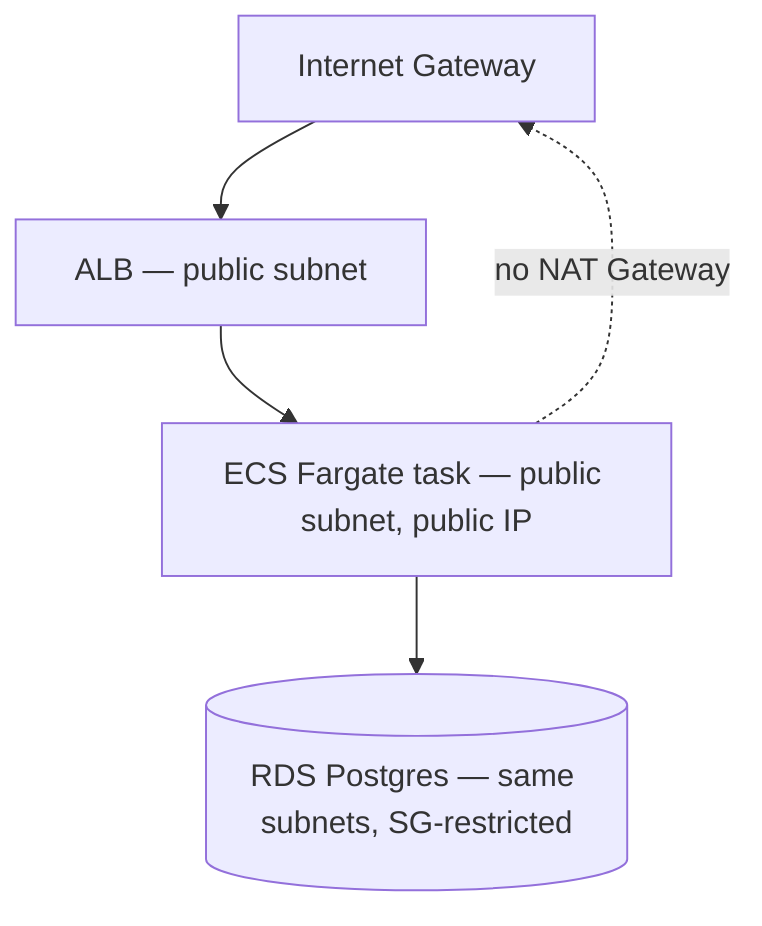

# VPC and network boundary design

## The question, as it might actually be asked

"Design the network layout for a service with a load balancer, an application tier, and a
database. Public subnets, private subnets, NAT gateways — walk me through the trade-offs."

## Real system

`aegisai-enterprise-agent-platform/deploy/terraform/aws/` — a real VPC provisioned via
Terraform for the AegisAI governance control plane's AWS deploy path (Phase C).

## The textbook answer vs. the real decision

The textbook enterprise pattern: public subnets hold only the load balancer; the application
tier and database live in private subnets with no direct internet route, reaching the internet
(for package installs, external API calls) through a NAT Gateway.

**Real decision, disclosed as a deliberate trade-off, not presented as best practice:** the
actual Terraform uses **public subnets only** — the ECS Fargate task gets a public IP directly
and routes through the Internet Gateway, no NAT Gateway at all. The reason: a NAT Gateway costs
roughly $32/month as a fixed charge whether or not it's used, and this deployment was built to
be stood up, verified, and torn down in a single session, not run continuously. Paying a fixed
monthly NAT cost for a service that's up for an hour doesn't make sense.

**This is exactly the kind of trade-off an interviewer is testing for:** can you explain not
just what the "right" pattern is, but when a deliberate deviation from it is the correct
engineering call, and can you say so explicitly rather than presenting a cost-driven compromise
as if it were the ideal design.

## The security boundary that didn't get compromised

Public subnets for compute doesn't mean no network isolation. Real security groups still
enforce the actual boundary:

- **ALB security group:** allows inbound 80 from `0.0.0.0/0` (it's meant to be public).
- **ECS task security group:** allows inbound only from the ALB's security group, on the
  application port — nothing else can reach the task directly, even though it has a public IP.
- **RDS security group:** allows inbound only from the ECS task's security group, on 5432 —
  the database is not reachable from the internet or from the ALB, only from the application
  tier.

The public-IP-without-NAT trade-off is about egress cost, not about weakening the ingress
boundary — that distinction is the difference between a defensible cost trade-off and an actual
security regression.

## What would change this decision

- **If this ran continuously as a real production service** (not stood-up-and-torn-down), the
  NAT Gateway cost would be worth paying — a persistent public IP on a compute task is a larger
  attack surface than a NAT-routed private subnet, and $32/month is a small cost relative to a
  real production system's total spend.
- **If compliance required data residency guarantees or private connectivity to other VPCs**
  (not just cost), private subnets + VPC peering or PrivateLink would be non-negotiable
  regardless of NAT Gateway cost.

## Related

- [ADR-015: Genuine hands-on AWS + GCP infra](https://github.com/vpeetla-ai/ai-architecture-portfolio/blob/main/adr/ADR-015-real-aws-gcp-infra-phase-c.md)
- [aegisai ADR-0006: PaaS vs IaC deploy trade-offs](https://github.com/vpeetla-ai/aegisai-enterprise-agent-platform/blob/main/adr/0006-paas-vs-iac-deploy-tradeoffs.md)
- Real Terraform: `aegisai-enterprise-agent-platform/deploy/terraform/aws/main.tf`
