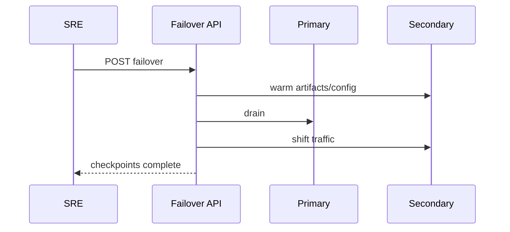
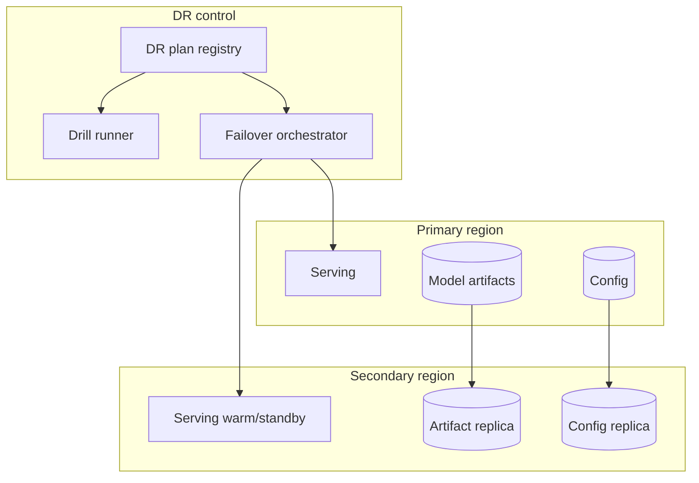

# Design disaster recovery for a model-serving platform


<!-- question-variants:v1 -->

## Expected question

"Design disaster recovery for a model-serving platform. How do you meet RTO/RPO when regions fail, models corrupt, or routing breaks?"

## Variant forms

Interviewers often ask the same design with different framing — recognize the archetype:

- "Design DR for an LLM API with RPO <5 minutes and RTO <15 minutes."
- "How do you failover inference when the primary GPU cluster is unavailable?"
- "Design model artifact replication and version pinning across regions."
- "Our config push broke all replicas — architect safe rollout and rollback for serving."
- "Design chaos testing for model-serving without customer-visible outages."
- "How do you DR KV-cache-heavy serving vs stateless API gateways differently?"
- "Design runbooks when embedding index and model versions drift after failover."

## Where this actually gets asked — and a fabricated source caught and rejected

This is the weakest-evidenced entry in this repo. No company-specific interview account was
found for any of the six companies. Worse: a widely-circulating claim on SEO-oriented
infrastructure blogs (introl.com and similar) states that "Anthropic's internal analysis found a
4-hour RPO/RTO to be cost-optimal, saving $12 million annually" — **this figure appears in no
Anthropic publication, has no citation trail, and does not survive scrutiny.** It's being
flagged here explicitly rather than quietly excluded, because this is exactly the failure mode
this repo's sourcing discipline exists to catch: a specific-sounding number, attributed to a
real company, that turns out to be invented by a content-marketing blog with no primary source
behind it. Don't repeat it, and treat any interview-prep content citing a suspiciously precise
company-attributed dollar figure with the same skepticism until you've traced it to something
the company itself published.

What *is* real: RTO/RPO tiering is a well-established general system-design archetype (asked
broadly across big tech, not AI-specific), and applying it to a model-serving platform — where
the "product" is a live API most users experience as always-on — is a reasonable, if
unconfirmed-at-these-specific-companies, extension of that archetype.

## Requirements

**Functional**
- The serving platform should recover from a regional outage, a bad model deployment, or a
  corrupted model artifact without requiring a full from-scratch rebuild.
- Rollback to the last known-good model version should be fast and routine, not an emergency
  procedure exercised for the first time during an actual incident.

**Non-functional**
- Define RTO (how long until service is restored) and RPO (how much recent state, if any, can be
  lost) explicitly and separately — they're often conflated into one "how fast do we recover"
  number, which hides that they have different design implications.
- A model-serving platform is mostly stateless per-request (the model weights are the durable
  asset, not per-request session state) — this changes the DR shape significantly compared to a
  stateful database-backed service, and a good answer should say so explicitly.

## Core entities

- **Model artifact**: the durable asset — versioned weights, config, and the eval results that
  qualified this version for production.
- **Deployment**: a specific model artifact running behind a specific traffic percentage (for a
  canary or blue/green rollout).
- **Incident**: a detected degradation (error rate, latency, or quality regression) that
  triggers a rollback or regional failover.
- **Rollback target**: the last deployment that passed its eval gate — the thing you fail back
  to, which must always exist and be known-good by construction, not discovered under pressure.

## API / interface
Auth: SRE break-glass roles; drills are scheduled and scored.

```http
GET /v1/dr/plans/{service}
→ {"rto_min":15,"rpo_min":5,"active_ Passive":["us-east","us-west"],"last_drill_at":"..."}

POST /v1/dr/drills
{"service":"model-serving","scenario":"region_loss","dry_run":false}
→ 202 {"drill_id":"dr_..."}

GET /v1/dr/drills/{drill_id}
→ {"status":"passed","actual_rto_min":11,"gaps":[]}

POST /v1/dr/failover
{"service":"model-serving","target_region":"us-west","ticket":"INC-..."}
→ 202 {"change_id":"chg_...","checkpoints":["dns","model_artifacts","kv_warm"]}

GET /v1/dr/artifacts/{service}
→ {"artifact_replicas":{"us-east":"ok","us-west":"ok"},"config_sync_lag_sec":3}
```

Staff+ callout: failover is a sequenced API with checkpoints; drills produce measurable RTO evidence.


## Data Flow


Drills exercise the same failover sequence used in incidents; checkpoints make RTO measurable.



## High-level design

Maps to **functional** requirements from step 1 — the component architecture that makes the API and data flow real.



The design splits into two failure classes that get handled differently: a **bad deployment**
(the new model itself is the problem — rollback to the last good version, entirely within one
region) and a **regional infrastructure failure** (the region itself is degraded — failover to a
secondary region running the same last-good model). Conflating these into one recovery path is
the most common weak answer — a bad-deployment rollback should be near-instant and needs no
cross-region traffic shift at all.

Deep dives below target **non-functional** requirements (latency, scale, failure, cost, security).

## Deep dive 1: RTO/RPO tiering by workload, since one number doesn't fit both training and serving

| Workload | Reasonable RTO | Reasonable RPO | Why |
|---|---|---|---|
| Serving/inference API | Minutes | Near-zero (stateless per-request; "data loss" mostly means dropped in-flight requests) | The product is directly user-facing; an outage is immediately visible and costly |
| Model artifact / weights storage | Hours | Zero — weights are versioned, immutable, and backed up like any other durable asset | Losing a model version means an expensive re-training or re-fine-tuning cycle, not just an inconvenience |
| Training pipeline / in-progress training run | Hours-to-a-day acceptable | The last checkpoint — checkpointing frequency directly sets the RPO | A delayed training run rarely has direct user-facing cost; checkpoint-and-resume is standard practice already |

These numbers are *reasonable engineering defaults*, not attributed to any specific company's
disclosed policy — presented explicitly as first-principles reasoning, not a cited figure.

## Deep dive 2: rollback as the actual first line of defense, not regional failover

The instinct in a DR discussion is to jump straight to multi-region failover, but for a model-
serving platform specifically, the far more common real incident is a bad model deployment —
not a regional outage. **Common mistake at the mid/senior level:** designing an elaborate
regional-failover architecture while treating "rollback to the last good model" as an
afterthought, when in practice the latter is exercised far more often and needs to be closer to
instant. A canary rollout with an automated quality/error-rate gate (this org's own
[golden-eval-registry](https://github.com/vpeetla-ai/golden-eval-registry) CI-gating pattern,
one layer earlier in the pipeline — gate *before* production, not just detect *after*) is the
real first line of defense; regional failover is the second, rarer line.

## Deep dive 3: what "recovery" means when the asset is mostly stateless

Unlike a database-backed service where DR is fundamentally about not losing committed writes, a
model-serving platform's core durable asset is the model artifact itself — and it's typically
written once (at training/fine-tuning completion) and read many times. This means the DR story
is less about continuous replication of per-request state and much more about: (a) the model
artifact being durably stored and versioned before it ever reaches production traffic, and (b)
the serving infrastructure around it being fast to reconstruct from that artifact in a new
region or on a rolled-back version. The org's real AWS/GCP Phase C work reflects a smaller-scale
version of this same principle — Postgres-backed state (`PostgresFinOpsStore`,
`PostgresAgentRegistryStore`) is the durable asset that must survive a teardown/rebuild cycle;
the compute layer around it (ECS tasks, Cloud Run revisions) is treated as disposable and
quick to reprovision, not something that itself needs point-in-time recovery.

## Deep dive 4: warm standby vs cold RTO reality

DNS/traffic shift is not user-visible RTO if the secondary still loads weights and has a cold KV
cache — p99 latency can break for minutes after "failover complete." Pre-load models and optionally
warm prefix/KV; quantify warm vs cold cost. In 45 minutes, separate bad-deploy rollback from region
failover; don't design a full multi-cloud mesh.

## What's expected at each level

- **Mid-level:** proposes "have backups and a secondary region" without distinguishing RTO from
  RPO or bad-deployment rollback from regional failover.
- **Senior:** separates rollback (bad deployment) from regional failover (infrastructure
  outage) as distinct recovery paths with different expected speeds.
- **Staff+:** assigns explicit RTO/RPO targets per workload type (serving vs. model storage vs.
  training) and explains why they differ, grounded in the stateless-per-request nature of
  serving traffic.
- **Principal:** additionally treats pre-production eval gating as the actual primary defense
  (preventing the bad deployment from reaching production at all) rather than only planning for
  fast recovery after the fact — and can articulate why over-investing in elaborate regional
  failover while under-investing in deployment gating is a common, costly mis-prioritization.

## Follow-up questions to expect

- "How do you test that your DR plan actually works, rather than trusting the design on paper?"
  (Answer: this is the same "real verification, not a diagram exercise" principle this org
  applies to its own infra work — actually trigger a rollback and a regional failover in a
  non-production environment on a schedule, don't just document the intended procedure.)
- "What's the cost of maintaining a warm standby secondary region vs. a cold one?" (Answer: warm
  standby costs continuously for readiness you rarely use; cold standby is cheaper but adds real
  RTO — for a serving platform where outage cost is high and visible, warm standby is usually
  the right trade, but say the trade-off out loud rather than assuming one answer is universally
  correct.)

## Related

- [golden-eval-registry](https://github.com/vpeetla-ai/golden-eval-registry) — the real CI-gating pattern that prevents bad deployments before they need a rollback
- [system-design/07: LLM evaluation & observability platform](../ai-system-design/07-llm-evaluation-observability-platform.md)
- [cloud-architecture/02: Multi-region strategy for training vs. serving](02-multi-region-strategy-training-vs-serving.md)
