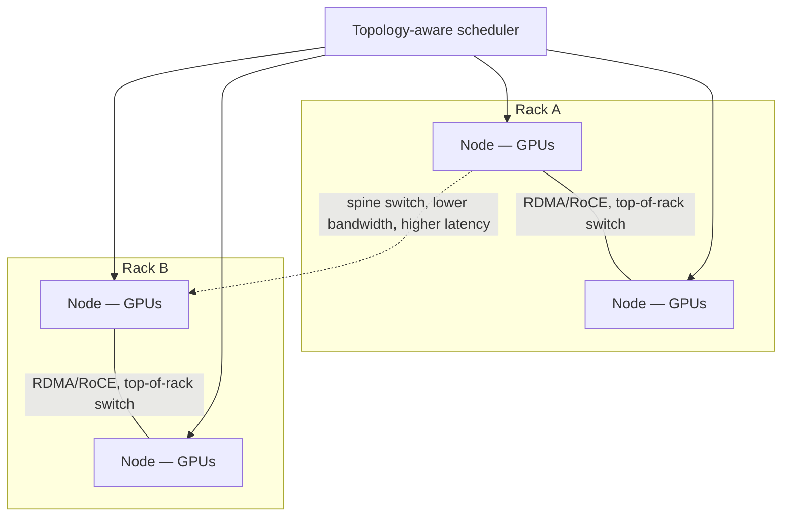
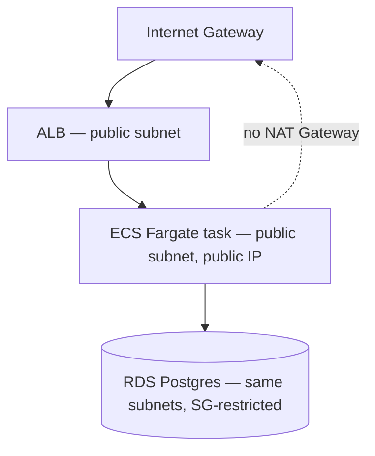

# Design the network architecture for distributed training

## Where this actually gets asked

The best-sourced entry in this section — grounded in real, primary engineering-blog material,
though still not a confirmed verbatim interview question. Meta's engineering blog
("RoCE networks for distributed AI training at scale," engineering.fb.com, Aug 2024) is a real,
citable primary source describing RoCE (RDMA over Converged Ethernet) vs. InfiniBand cluster
choices and topology-aware scheduling constraints (rack, AI-zone, and data-center-level placement)
for large training clusters. OpenAI's own blog ("Supercomputer networking to accelerate
large-scale AI training") describes MRC (Multipath Reliable Connection), a GPU-networking
resilience protocol co-developed with AMD, Broadcom, Intel, Microsoft, and NVIDIA. Neither
source confirms this exact material appears in a candidate's interview loop — but the contrast
matters: general cloud-architect interview prep (confirmed via Google's own published Cloud
Architect interview guidance) stays at the VPC/subnet/peering/Interconnect level. Nothing found
in generic cloud-architecture interview material touches InfiniBand, RDMA, or NCCL collective
communication at all — this is genuinely distinctive AI-infra content, not a relabeled version
of a question every cloud architect gets asked.

## Requirements

**Functional**
- GPUs across many nodes need to exchange gradients (all-reduce) and activations
  (all-to-all, for pipeline/tensor parallelism) every training step, at the speed the compute
  itself produces new data — network speed, not compute speed, is often the actual bottleneck at
  scale.
- The scheduler placing training jobs onto physical GPUs needs to be topology-aware — which
  GPUs share a rack, a switch, or a data-center "AI zone" — because communication cost is not
  uniform across the cluster.

**Non-functional**
- Bisection bandwidth (the worst-case bandwidth between any two halves of the cluster) is the
  real capacity metric, not aggregate bandwidth — a network that's fast in aggregate but poorly
  connected between specific rack pairs will bottleneck exactly the collective operations
  training depends on.
- Failure tolerance matters differently here than in typical enterprise networking: a single
  slow or flaky link can silently degrade an entire multi-day training run's throughput (a
  straggler problem) rather than causing a clean failure — this is a materially different
  failure mode than a web service's request timeout.

## Core entities

- **Node**: a physical or virtual machine hosting some number of GPUs, with a known rack/switch/
  zone position.
- **Collective operation**: an all-reduce, all-gather, or all-to-all communication pattern
  across a set of nodes, executed by a library like NCCL.
- **Topology**: the physical connectivity graph — which nodes share a top-of-rack switch, which
  racks share a spine switch, and the resulting bisection bandwidth at each level.
- **Placement**: the scheduler's assignment of a training job's ranks (GPU processes) onto
  physical nodes, ideally co-locating tightly-communicating ranks close in the topology.

## API / interface

Distributed training doesn't expose a public request/response API in the traditional sense —
the relevant interface is internal, between the scheduler and the training framework:

```text
POST /scheduler/place { job_id, world_size, gpus_per_node }
  → { rank_to_node_mapping, topology_score }
```

`topology_score` (e.g., the fraction of communication that stays within a rack vs. crosses a
spine switch) is the actual signal a topology-aware placement algorithm optimizes.

## High-level design



The design principle: rank-to-node placement should minimize cross-rack (and especially
cross-zone) traffic for the collective operations a specific parallelism strategy generates.
Tensor-parallel ranks (which communicate on every layer, the tightest coupling) should be
co-located within a rack; data-parallel ranks (which only communicate gradients once per step, a
much looser coupling) can tolerate being spread across racks or zones.

## Deep dive 1: RDMA/RoCE and InfiniBand vs. standard Ethernet

| Approach | Latency | Throughput | Complexity/cost | When it's the right call |
|---|---|---|---|---|
| Standard TCP/IP Ethernet | Highest (kernel network stack overhead) | Lowest at this scale | Lowest | Fine for control-plane/orchestration traffic; wrong for the actual gradient-exchange path |
| RoCE (RDMA over Converged Ethernet) | Low — bypasses kernel network stack | High | Medium — needs lossless Ethernet fabric (PFC/ECN tuning) | Meta's documented choice — leverages Ethernet's cost/ecosystem advantages while getting RDMA's latency benefit |
| InfiniBand | Lowest | Highest | Highest — specialized hardware/fabric, less commodity | When absolute lowest latency justifies the specialized hardware and vendor lock-in |

**Common mistake at the mid/senior level:** treating "add faster networking hardware" as the
whole answer without connecting it to *why* — the real driver is that all-reduce/all-to-all
collective operations are synchronous barriers: every rank waits for the slowest communication
path to complete before the next training step starts, so the network's worst-case latency (not
its average) sets the actual training step time.

## Deep dive 2: topology-aware scheduling as the software half of this problem

Fast networking hardware is necessary but not sufficient — if the scheduler places tightly-
coupled ranks far apart in the topology anyway, the hardware advantage is wasted. Real systems
(per Meta's documented approach) constrain placement explicitly: schedule a job's ranks within
the smallest topology domain (rack, then zone, then cross-zone) that fits the job's GPU count,
rather than scattering ranks wherever capacity happens to be free. This is directly analogous to
data-locality-aware scheduling in distributed data processing systems, applied to network
locality instead of storage locality — the same underlying principle (move the computation to
where the data/communication is cheap, not the reverse), a different resource axis.

## Deep dive 3: the straggler problem — a single slow link degrades the whole job

Because collective operations are synchronous barriers, one degraded link (not fully failed —
degraded, e.g., running at reduced bandwidth due to a hardware fault) can silently slow an entire
multi-day training run to the speed of its slowest participant, without ever producing an error.
This is a materially different failure mode than most enterprise networking design accounts for
— a request-timeout-and-retry model (the standard answer to a flaky link in typical system
design) doesn't apply, because there's no request to retry; there's a synchronous barrier every
rank is blocked on. Real systems need per-link health monitoring and automated exclusion of
degraded nodes from a job's rank assignment, not just failure detection after the job completes
and someone notices it ran slowly.

## Deep dive 4: the control-plane network this contrast is against, made real

The generic "VPC/subnet/peering" design this entry contrasts against isn't hypothetical either
— it's the real network this org actually built for the AegisAI governance control plane's AWS
deploy (Phase C):



The textbook enterprise pattern keeps only the load balancer in a public subnet, with the
application tier and database in private subnets reaching the internet through a NAT Gateway.
The real deployment used **public subnets only** — the ECS task gets a public IP directly,
no NAT Gateway at all — a deliberate cost trade-off (a NAT Gateway is a roughly $32/month fixed
charge regardless of usage, not worth paying for a deployment stood up, verified, and torn down
in a single session). This doesn't weaken the actual security boundary: security groups still
enforce that only the ALB's security group can reach the ECS task, and only the ECS task's
security group can reach RDS on 5432 — the public-IP-without-NAT choice is about egress cost,
not about opening the ingress boundary. This is exactly the kind of trade-off this deep dive's
training-network contrast is testing for at a different layer: knowing the textbook pattern
*and* being able to say when and why a deliberate deviation from it is the correct call, rather
than presenting a cost-driven compromise as if it were unconditional best practice.

## What's expected at each level

- **Mid-level:** proposes "use a fast network" without identifying collective operations as
  synchronous barriers or explaining why that makes worst-case (not average) latency the binding
  constraint.
- **Senior:** identifies RDMA/RoCE or InfiniBand as the relevant technology choice and can
  explain the latency/throughput/cost trade-off between them.
- **Staff+:** designs topology-aware placement explicitly — co-locating tightly-coupled ranks
  (tensor-parallel) within a rack, allowing loosely-coupled ranks (data-parallel) to spread
  further — and connects this to which parallelism strategy generates which communication
  pattern.
- **Principal:** additionally identifies the straggler problem (a degraded, not failed, link
  silently slowing an entire job) as a distinct failure mode requiring per-link health
  monitoring and automated node exclusion — not just "make the network fast and reliable" as an
  assumption.

## Follow-up questions to expect

- "How is this different from designing a network for a normal distributed web service?" (Answer:
  web services tolerate independent per-request latency and use timeout-and-retry for failures;
  training's collective operations are synchronous barriers across the whole job, so a single
  degraded participant — not just a failed one — degrades everyone, which standard request-level
  retry logic doesn't address at all.)
- "How would tensor parallelism vs. data parallelism change your placement strategy?" (Answer:
  tensor-parallel ranks communicate on every layer and need the tightest topology co-location
  — ideally within a rack; data-parallel ranks only synchronize gradients once per step and can
  tolerate being spread across racks or even zones without proportionally hurting step time.)

## Related

- [system-design/01: LLM inference serving at scale](../ai-system-design/01-llm-inference-serving-at-scale.md) — the serving-side counterpart; this entry is training-side
- [cloud-architecture/01: GPU capacity planning and procurement](01-gpu-capacity-planning-and-procurement.md)
- [vllm-architecture-lab](https://github.com/vpeetla-ai/vllm-architecture-lab) — real scheduler/memory-management simulator, one layer up from raw networking
