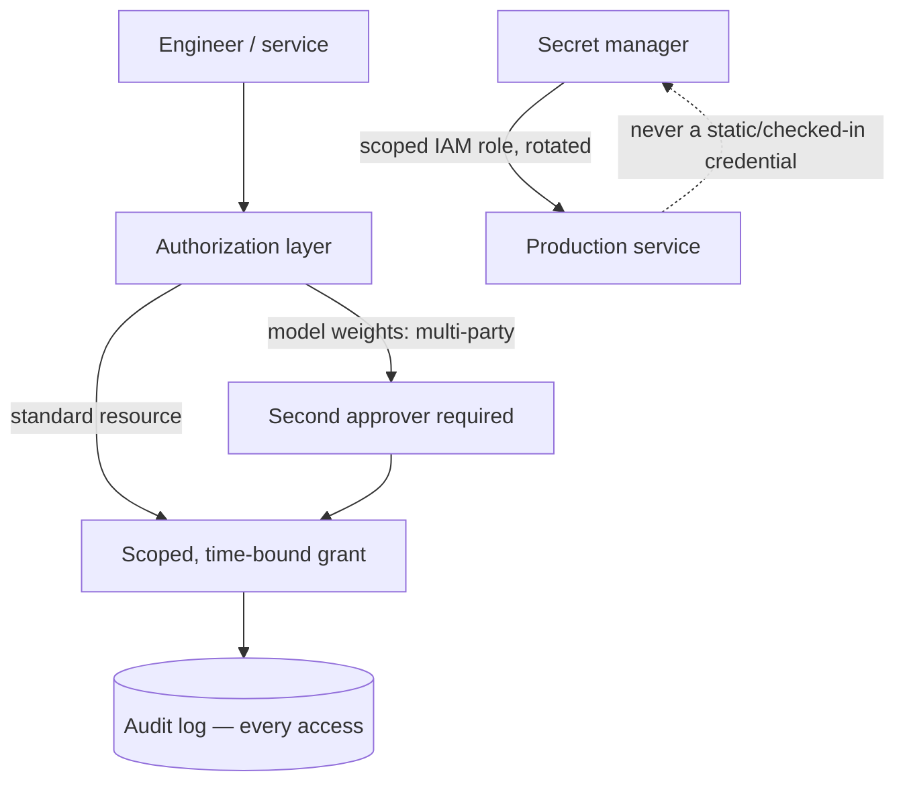

# Design the security and compliance architecture for an AI system

## Where this actually gets asked

Mixed but genuinely well-sourced sourcing, disclosed per company. This is real public company
documentation, not a leaked interview account — a well-prepared candidate targeting these
companies would be expected to know this material regardless. **Anthropic**: its public
Responsible Scaling Policy (multiple published versions) explicitly documents ASL-3 Security
Standards — multi-party authorization and mandatory code review specifically to remove
persistent, unilateral high-privilege access to model weights, and named insider-threat
controls. **Meta**: the 2023 Llama model weights leak (widely reported, including a formal
letter from Senator Blumenthal) is a real, documented incident specifically about model-weight
exfiltration via insider access — not a hypothetical threat model. **Apple**: its own security
blog (security.apple.com) documents Private Cloud Compute's architecture principles —
non-targetability, no privileged runtime access, stateless computation — as real, shipped
design decisions, not aspirational goals. **Microsoft**: Azure OpenAI's compliance
certifications (FedRAMP High, HIPAA, SOC 2, ISO 27001) and Key Vault/Private Link architecture
are documented on Microsoft Learn, though this is generic cloud-compliance content rather than
something distinctively AI-specific. **OpenAI/Google**: no company-specific primary source found,
though RAND's "Securing AI Model Weights" report — a real, citable, frontier-lab-adjacent
publication — covers this threat model across labs generally. The throughline that *is*
distinctive to AI infra: model weights as a uniquely high-value, exfiltratable asset is a
threat model a generic cloud-security interview does not raise, because a typical enterprise
service has no equivalent single artifact whose theft alone reproduces the company's core
product.

## Requirements

**Functional**
- Model weights need protection against both external exfiltration and insider misuse —
  distinct from, and in addition to, standard application security (auth, input validation).
- Training and fine-tuning data subject to residency/compliance rules (GDPR, HIPAA, sector-
  specific regulation) need enforcement that survives the full pipeline — ingestion, training,
  and any logging/tracing along the way, not just at the API boundary.
- Secrets (API keys for public-facing endpoints, database credentials, model-serving auth
  tokens) need managed rotation, not static values checked into config.

**Non-functional**
- The blast radius of a single compromised credential or an insider with broad access should be
  bounded — no single actor's access should be sufficient to exfiltrate a full model checkpoint
  unilaterally.
- Compliance certifications (SOC 2, HIPAA, FedRAMP) are binary gates for entire market segments
  (regulated industries, government) — treat them as hard requirements for those segments, not
  best-effort goals.

## Core entities

- **Model weights artifact**: the highest-value asset in this threat model — access to it should
  require multi-party authorization, not a single engineer's standing credentials.
- **Access grant**: a scoped, auditable, time-bound permission to a specific resource (weights,
  training data, a production secret) — never a standing "admin" role that implicitly covers
  everything.
- **Secret**: an API key, database credential, or signing key, stored in a managed secret store
  with rotation policy and audit log of every access.
- **Compliance boundary**: a jurisdiction- or regulation-specific rule (data must stay in-region,
  access must be logged for N years) that constrains where and how data and models can be
  processed.

## API / interface

Security architecture is mostly policy, not a public API — the relevant interface is the
authorization check every sensitive operation must pass through:

```text
POST /access/request { resource: "model_weights" | "training_data" | "secret", requestor, justification }
  → { approved: bool, requires_second_approver: bool, audit_log_id }
```

## High-level design



The design principle directly reflected in Anthropic's published ASL-3 standards: the highest-
value asset (model weights) gets a *categorically* different access control — multi-party
authorization — not just a stricter version of the same single-approver flow used for lower-
value resources. Treating all internal access uniformly (one authorization model for everything)
misses this distinction entirely.

## Deep dive 1: model weights as a uniquely high-value asset — the AI-specific wrinkle

| Asset type | Typical protection | Why weights are different |
|---|---|---|
| Application secrets (API keys, DB creds) | Managed secret store, rotation, scoped IAM | Standard practice across all of software, not AI-specific |
| Customer data | Access control, encryption at rest/in transit, audit logging | Standard, though scale and regulation vary by industry |
| Model weights | Per Anthropic's public standard: multi-party authorization, no persistent unilateral high-privilege access | A single exfiltration event reproduces the company's core product capability — no comparable single-artifact-theft risk exists for most non-AI software companies |

The Llama weights leak is the concrete, real-world proof this isn't a hypothetical: once
weights left the building, the containment problem became fundamentally different from a
typical data breach — you can rotate a leaked API key; you cannot "rotate" leaked model weights
once they're publicly redistributed.

## Deep dive 2: secrets management — where this org found a real bug, not a hypothetical

This isn't abstract for this org: the real GCP Terraform for
[agent-finops](https://github.com/vpeetla-ai/agent-finops) originally used `"unset"` as a
Terraform default meant to signal "no value provided yet" for the service's API key — but
because the underlying Cloud Run service's IAM invoker was `allUsers` (a public endpoint), that
placeholder string became the actual enforced password, guessable by anyone who read the
Terraform source. **The fix**: a real `random_password` Terraform resource generating the actual
value, with the placeholder only ever used as a documented "override if you have a real key"
escape hatch, not a functioning default. A second, related real finding from the same work:
Cloud Run does not automatically roll a new revision just because a referenced secret's "latest"
version changes in Secret Manager — rotating a compromised key requires an explicit
`terraform apply -replace` (or equivalent forced redeploy) to actually take effect, a real
operational gotcha that would otherwise create a false sense of security ("I rotated the key")
while the old key remains live in the running revision.

## Deep dive 3: compliance certifications as market-access gates, not engineering choices

Azure OpenAI's documented certifications (FedRAMP High for government, HIPAA for healthcare,
SOC 2 broadly) illustrate a distinct category from the technical controls above: these are
binary, all-or-nothing gates to entire customer segments, not a spectrum of "more secure vs.
less secure." A system can be technically well-secured and still be commercially unusable for a
healthcare customer without a specific HIPAA attestation. **Common mistake at the mid/senior
level:** treating compliance work as equivalent to general security hardening — in practice, a
compliance certification often requires specific, sometimes non-obvious controls (audit log
retention periods, specific encryption standards, documented incident response procedures) that
a technically excellent but uncertified system simply doesn't have, regardless of its actual
security posture.

## What's expected at each level

- **Mid-level:** proposes standard application security (auth, secrets in a vault, encryption)
  without distinguishing model weights as requiring a categorically different control.
- **Senior:** identifies model weights as a distinct, high-value asset requiring stricter access
  control than standard application secrets.
- **Staff+:** designs multi-party authorization specifically for weight access (not just a
  stricter single-approver flow), and understands secret rotation's real operational gaps (e.g.,
  a managed secret store's "latest version" not auto-propagating to already-running compute).
- **Principal:** additionally reasons about compliance certifications as market-access
  decisions with real engineering cost (specific controls a cert requires, not general
  hardening) and can prioritize which certifications unlock which customer segments, trading off
  against the engineering investment each requires.

## Follow-up questions to expect

- "An engineer needs weights access for a legitimate debugging task at 2am with no second
  approver awake. What do you do?" (Answer: this is a real operational tension in a strict
  multi-party model — the answer isn't to bypass the control, it's to design a break-glass
  procedure with its own strict audit trail and mandatory retroactive review, not silent
  unilateral access.)
- "How do you rotate a secret that's already been compromised, given a managed secret store
  doesn't guarantee the new value is live everywhere instantly?" (Answer: rotating the value in
  the secret store is necessary but not sufficient — you also need to force redeploy/restart of
  every consumer, and verify the old value no longer authenticates, exactly the real gap this
  org's own Cloud Run work surfaced.)

## Related

- [ADR-015: Genuine hands-on AWS + GCP infra](https://github.com/vpeetla-ai/ai-architecture-portfolio/blob/main/adr/ADR-015-real-aws-gcp-infra-phase-c.md) — the real placeholder-API-key bug and fix
- [behavioral/03: Org-wide security hardening](../behavioral/03-org-wide-security-hardening.md) — the real 6-repo auth-gate pass in this org
- [system-design/05: Content moderation & safety system](../ai-system-design/05-content-moderation-safety-system.md)
