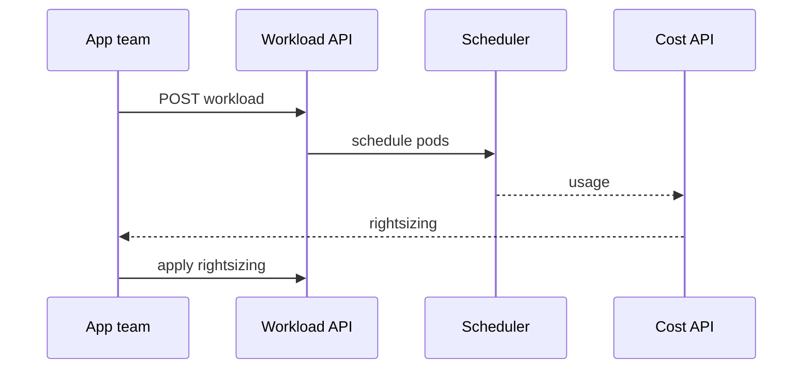
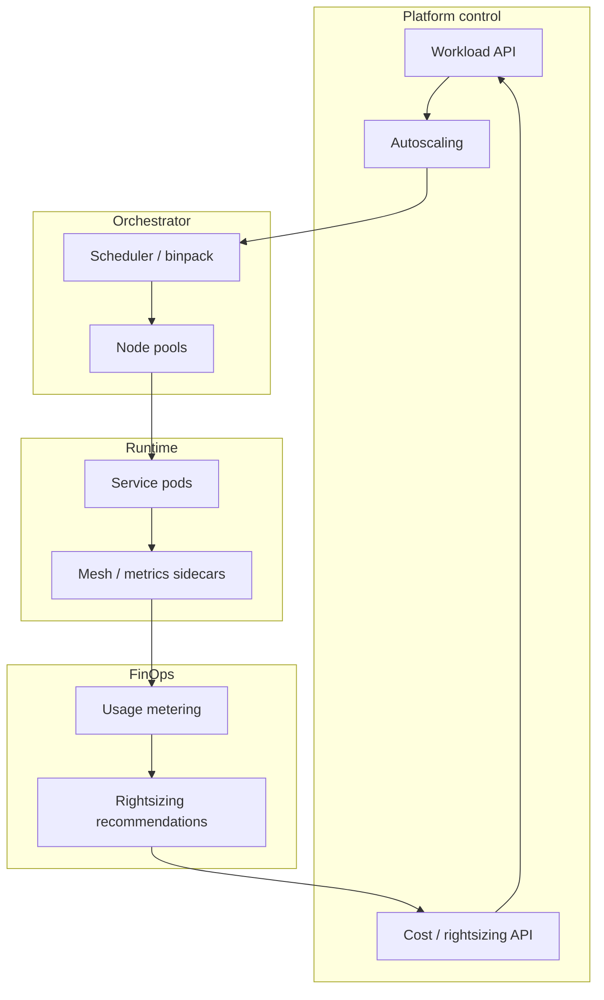

# Design container orchestration and cost optimization for AI workloads


<!-- question-variants:v1 -->

## Expected question

"Design container orchestration and cost optimization for AI workloads at scale. How do you schedule GPUs, autoscale inference, and reduce idle spend?"

## Variant forms

Interviewers often ask the same design with different framing — recognize the archetype:

- "Design Kubernetes scheduling for mixed inference + batch training on shared GPU nodes."
- "How do you scale vLLM pods to zero overnight without cold-start violating SLO?"
- "Design spot/preemptible instances for fault-tolerant training with checkpoint resume."
- "Our GPU utilization is 30% — architect bin-packing, MIG, and right-sizing."
- "Design cluster autoscaling when queue depth exceeds threshold for 5 minutes."
- "How do you isolate noisy training jobs from latency-sensitive inference on one cluster?"
- "Design chargeback/showback per namespace, team, and tenant for GPU hours."

## Where this actually gets asked

Partially a well-known general archetype, partially distinctive to AI infra — disclosed
honestly by piece. OpenAI's own engineering blog ("Scaling Kubernetes to 7,500 Nodes") is a
real, primary, citable source describing Kubernetes at GPU scale — genuine evidence this is a
real operational concern at OpenAI, though not confirmed as a verbatim interview question.
Google's own documentation and blog content on GKE Autopilot vs. Standard trade-offs for
ML/GPU workloads is a legitimate primary source, though generic-GKE rather than AI-interview-
specific. No company-specific interview sourcing was found for Meta, Anthropic, Microsoft, or
Apple on this exact topic. The honest split: "Kubernetes vs. a managed container service" is a
well-known general cloud-architecture archetype asked broadly, not AI-specific. What *is*
distinctive for AI infra is the GPU-utilization and bin-packing angle — idle GPU cost waste and
topology-aware node provisioning are real, current problems (confirmed via multiple GPU-
scheduling vendor sources) that a generic container-orchestration interview for a web-service
role would never raise, because idle CPU waste is a rounding error compared to idle GPU waste.

## Requirements

**Functional**
- Run containerized training and serving workloads with GPU scheduling — not just CPU/memory
  bin-packing, but GPU-count and GPU-type-aware placement.
- Support both long-running serving deployments (steady, low-churn) and bursty, short-lived
  training/batch jobs (high-churn, needs fast scale-up and scale-down).

**Non-functional**
- GPU cost dominates the infrastructure bill — an idle, allocated-but-unused GPU is a much more
  expensive mistake than an idle CPU core, so utilization/bin-packing efficiency matters more
  here than in typical container orchestration.
- Cluster autoscaling needs to react fast enough to avoid queueing training jobs behind slow
  node provisioning, but not so aggressively that it churns expensive GPU nodes up and down for
  transient load spikes.

## Core entities

- **Pod/task**: a containerized workload with explicit GPU-count and GPU-type requirements, not
  just CPU/memory requests.
- **Node**: a physical or virtual machine with a fixed GPU count — unlike CPU, GPUs generally
  cannot be fractionally allocated across workloads on most hardware, making bin-packing
  decisions coarser-grained and higher-stakes.
- **Cluster autoscaler**: decides when to provision or terminate GPU nodes based on pending
  (unschedulable) workload demand.

## API / interface
Auth: platform admins for cluster policies; app teams deploy via constrained APIs.

```http
POST /v1/workloads
{"name":"rag-answer","image":"ghcr.io/...","cpu":2,"mem_gb":8,"min_replicas":2,"max_replicas":20,
 "scale_metric":"rps","budget_usd_day":200}
→ 201 {"workload_id":"wl_..."}

PUT /v1/workloads/{id}/autoscaling
{"min":2,"max":40,"target_rps":80} → 200 {"version":5}

GET /v1/workloads/{id}/cost?window=7d
→ {"cost_usd":940,"idle_pct":0.22,"rightsizing":{"cpu":1.5,"mem_gb":6}}

POST /v1/workloads/{id}/rightsizing:apply
{"cpu":1.5,"mem_gb":6,"ticket":"COST-..."} → 202 {"change_id":"chg_..."}

GET /v1/clusters/{cluster}/binpack
→ {"fragmentation":0.18,"suggested_moves":3}
```

Staff+ callout: cost and rightsizing are product APIs next to deploy — not a monthly spreadsheet.


## Data Flow


Deploy workload → autoscale on RPS → meter cost → rightsizing recommendation → apply change.



## High-level design

Maps to **functional** requirements from step 1 — the component architecture that makes the API and data flow real.



Deep dives below target **non-functional** requirements (latency, scale, failure, cost, security).

## Deep dive 1: managed orchestration vs. Kubernetes, with real numbers from actually deploying both

Both were actually built and deployed by this org in the same work (Phase C), not a
hypothetical comparison: AegisAI's API on **AWS ECS Fargate** (VPC + ALB + RDS + IAM roles), and
agent-finops on **GCP Cloud Run** (+ Cloud SQL + Secret Manager). Both were `terraform apply`'d,
verified against live endpoints, and torn down.

| Approach | Setup complexity | Cost model | GPU/ML fit | When it's the right call |
|---|---|---|---|---|
| Kubernetes (self-managed or GKE Standard) | Highest | You control every knob — can be cost-optimal with effort | Best for large, sustained GPU workloads needing fine-grained scheduling control (per OpenAI's own documented approach at scale) | Sustained scale where the ops investment pays for itself |
| ECS Fargate | Medium — explicit VPC/ALB/IAM, but no cluster to operate | Persistent task cost even at low traffic (no true scale-to-zero) | Fine for steady serving; poor fit for bursty GPU training | Classic enterprise AWS pattern; when VPC/IAM control matters more than idle-cost optimization |
| Cloud Run / GKE Autopilot | Lowest | True scale-to-zero (Cloud Run) or per-pod billing (Autopilot) | Good for intermittent/bursty workloads | Services with genuinely intermittent traffic where idle cost must be near-zero |

**Real cost numbers from actually running both:** AWS (ECS Fargate + ALB + RDS) — the ALB alone
costs roughly $16/month *whether or not it's serving traffic*, combined with Fargate + RDS
roughly $20-30/month while running. GCP (Cloud Run + Cloud SQL) — Cloud Run itself is close to
$0 at low/demo traffic (pay-per-request, scale-to-zero); Cloud SQL's smallest tier is the real
fixed cost, roughly $7-10/month while running.

## Deep dive 2: real bugs only a real deployment surfaced — not a Terraform-plan exercise

Writing the Terraform and running `terraform plan` caught none of these — only a real
`terraform apply` against a real container registry did:

- **agent-finops's Dockerfile ignored Cloud Run's injected `PORT` env var** — hardcoded to 8000
  instead of `${PORT:-8000}`. Cloud Run injects its own port; a container that doesn't listen on
  it never passes health checks.
- **aegisai's Dockerfile couldn't build at all** — `python:3.13-slim` has no `git`, and its
  `requirements.txt` depends on `agent-finops` via a `git+https` source. This container had
  apparently never been built for real since that dependency was added.
- **The AWS ECR repo needed `force_delete = true`** to tear down at all, since it still held the
  pushed image — `terraform destroy` failed on this the first time.

## Deep dive 3: bin-packing and idle-GPU cost as the AI-specific optimization

Because GPUs generally can't be fractionally shared across unrelated workloads the way CPU
cores can, a scheduler that places jobs without bin-packing awareness leaves large amounts of
allocated-but-idle GPU capacity stranded on partially-filled nodes. **Common mistake at the
mid/senior level:** treating GPU scheduling identically to CPU scheduling — proposing a
generic bin-packing algorithm without accounting for the fact that a partially-used GPU node
(e.g., 3 of 8 GPUs allocated) still costs the same as a fully-used one, making consolidation
(actively repacking jobs onto fewer, fuller nodes) a much higher-value optimization than it
would be for CPU-only workloads, where partial node usage is a much smaller cost leak.

## Deep dive 4: preemption tiers and GPU node loss

Spot/preemptible only for checkpointed training; serving on on-demand/reserved. Priority classes +
SIGTERM→checkpoint so preemption doesn't silently burn GPU-hours. On node loss, reschedule with
topology awareness from last checkpoint — interval is your training RPO. In 45 minutes, bin-pack +
cost loop + one failure story.

## What's expected at each level

- **Mid-level:** proposes "use Kubernetes" or "use a managed container service" without
  connecting the choice to GPU-specific cost or scheduling implications.
- **Senior:** identifies that GPU bin-packing is coarser-grained and higher-stakes than CPU
  bin-packing, and picks an orchestration approach based on workload burstiness (steady serving
  vs. bursty training).
- **Staff+:** designs the utilization-tracking and rightsizing feedback loop explicitly (idle-
  allocated-GPU detection, consolidation passes), not just initial placement.
- **Principal:** additionally reasons about the real operational cost of the surrounding
  infrastructure (ALB fixed costs, cluster ops overhead) as part of the total cost equation, not
  just the compute/GPU line item — and can articulate why a candidate's "I have cloud
  infrastructure experience" claim is unverifiable without evidence of Terraform that was
  actually applied and torn down, not just written.

## Follow-up questions to expect

- "How would you detect and reclaim an idle-allocated GPU automatically?" (Answer: track
  actual GPU utilization, not just allocation — a workload holding a GPU allocation with near-
  zero utilization for a sustained window is a candidate for preemption or consolidation, gated
  by the workload's priority tier so this doesn't preempt legitimate low-utilization-but-
  latency-sensitive serving traffic.)
- "What's the actual evidence a candidate has real cloud infrastructure experience, versus just
  having written Terraform?" (Answer: the Terraform was actually applied, created real
  resources, was verified against a live endpoint doing real work, and was torn down cleanly —
  each of those is a claim that can be independently checked, unlike "I wrote infrastructure as
  code" alone.)

## Related

- [ADR-015: Genuine hands-on AWS + GCP infra](https://github.com/vpeetla-ai/ai-architecture-portfolio/blob/main/adr/ADR-015-real-aws-gcp-infra-phase-c.md)
- [agent-finops ADR-0002](https://github.com/vpeetla-ai/agent-finops/blob/main/docs/adr/0002-paas-vs-iac-deploy-tradeoffs.md), [aegisai ADR-0006](https://github.com/vpeetla-ai/aegisai-enterprise-agent-platform/blob/main/adr/0006-paas-vs-iac-deploy-tradeoffs.md)
- [cloud-architecture/01: GPU capacity planning and procurement](01-gpu-capacity-planning-and-procurement.md)
