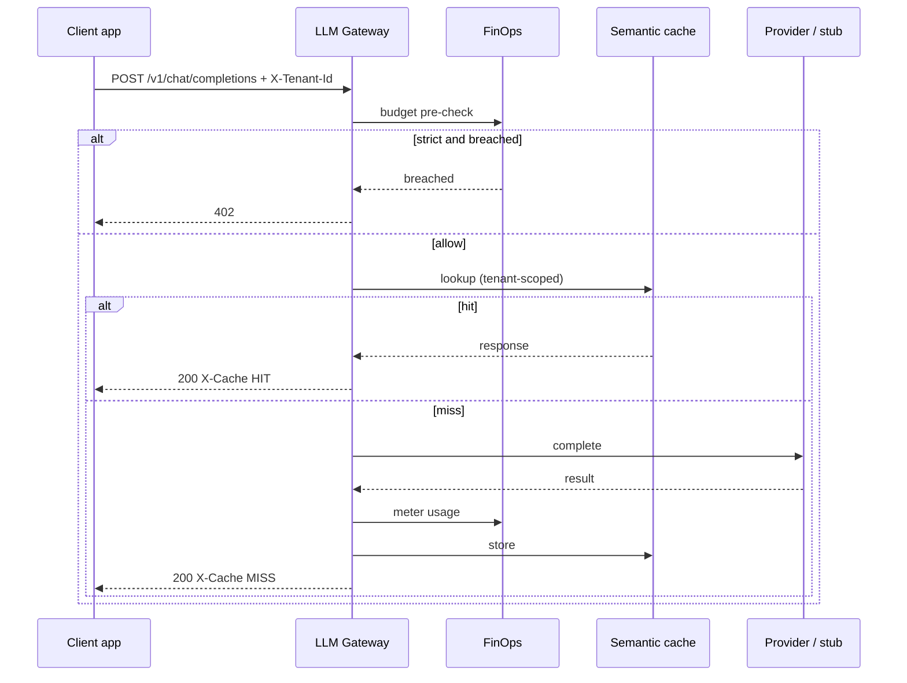
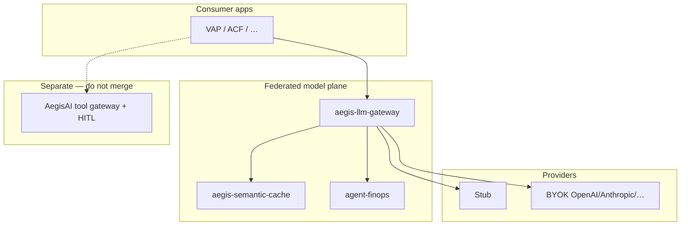

# Design an enterprise LLM gateway with semantic cache — gateway vs sidecar; cache-in-process vs cache-as-service


<!-- question-variants:v1 -->

## Expected question

"Design an enterprise LLM gateway with semantic cache and model routing. How do you cut cost/latency while enforcing policy, keys, and observability?"

## Variant forms

Interviewers often ask the same design with different framing — recognize the archetype:

- "Design a gateway that caches semantically similar prompts — when is it safe?"
- "How do you route prompts to GPT-4 vs Haiku vs self-hosted Llama based on complexity?"
- "Design centralized API keys, rate limits, and PII redaction before upstream LLM calls."
- "Our LLM bill doubled — architect caching, routing, and budget caps per team."
- "Gateway vs sidecar vs SDK — where does policy enforcement belong?"
- "Design cache invalidation when the underlying model version changes."
- "How do you log prompts/responses for compliance without storing secrets?"

## Where this actually gets asked

Rising 2026 infra question as companies centralize LLM spend: "Design an LLM gateway," "API
gateway for OpenAI/Anthropic," "semantic cache for prompts," "gateway vs sidecar." Sits between
multi-tenant platforms and FinOps — Staff+ cares about deployment topology, cache safety, and
blast radius — not a reverse proxy demo.

Org grounding: [aegis-llm-gateway](https://github.com/vpeetla-ai/aegis-llm-gateway) +
[aegis-semantic-cache](https://github.com/vpeetla-ai/aegis-semantic-cache) ([ADR-028](https://github.com/vpeetla-ai/ai-architecture-portfolio/blob/main/adr/ADR-028-federated-ai-control-plane-k8s-analogy.md))
— federated model plane; tool governance stays in AegisAI.

## Requirements

**Functional**
- Single ingress for chat/completions across multiple model providers (or stub → BYOK).
- Route by policy: tenant, latency class, cost class, capability (tools, vision).
- Optional semantic cache for idempotent / FAQ-like prompts.
- Central auth, rate limits, usage metering, and kill switches.
- Explicit choice: shared gateway plane vs per-app sidecar; cache-as-service vs in-process.

**Non-functional**
- P99 overhead of the gateway itself is small vs model latency.
- Cache must not serve personalized or safety-sensitive answers across tenants.
- Provider / FinOps outages: fail-closed vs fail-open is a **documented posture**, not silent.
- FinOps: per-tenant budgets enforced **before** tokens burn.
- No fake 99.9% SLO claims on free-tier demos.

## Core entities

- **Route policy**: match rules → model/provider, timeout, retry, fallback chain.
- **Cache key**: `tenant_id` + embedding(prompt) + model_id + policy_version (+ optional tags).
- **Usage event**: tenant, model, tokens_in/out, cached_hit, cost_usd.
- **Provider adapter**: normalized request/response + error taxonomy.
- **Control posture**: `strict` | `demo` — budget/cache/auth failure behavior.

## API / interface

```http
POST /v1/chat/completions
Authorization: Bearer <gateway_key>
X-Tenant-Id: vap|acf|…
{ "messages":[...], "model":"auto"| "stub-small"| "gpt-…", "stream": false }
→ 200 json + headers: X-Model-Used, X-Cache: HIT|MISS
→ 402 budget breached (strict) | 503 FinOps down (strict)

POST /v1/cache/lookup
{ "tenant_id":"…", "model":"…", "messages":[...] }
→ { "hit": true|false, "response": … }

POST /v1/cache/store
{ "tenant_id":"…", "model":"…", "messages":[...], "response":{…} }
→ 204

GET /v1/posture
→ { "control_plane_mode":"demo"|"strict", "fail_open":… }

GET /v1/ops/metrics
→ completions, cache_hits/misses, finops_* (gateway) | hits, misses, hit_rate (cache)
```

Staff+ callout: default deny semantic cache for user-specific / tool-using prompts; opt-in for safe classes. Tenant is a **first-class header**, not inferred from model name.

## Data Flow

Client → auth → tenant bind → budget pre-check → cache lookup (if allowed) → provider/stub →
meter → (optional) cache store → response. Failover walks the provider chain; posture decides
whether FinOps/cache outages block or degrade.



## High-level design

Maps to **functional** requirements — shared plane vs sidecar is a first-class topology choice.



Overlaps [../ai-system-design/09](../ai-system-design/09-multi-tenant-ai-platform-architecture.md) and
[../scalability-governance-tradeoffs/01](../scalability-governance-tradeoffs/01-cost-vs-latency-vs-safety.md).
Tool side effects stay on AegisAI — this entry is the **model HTTP plane** only.

Deep dives below target **non-functional** requirements (topology, tenancy, safety, failure, cost).

## Deep dive 1: gateway vs sidecar

**Shared gateway (org default):** one OpenAI-shaped service; apps set `LLM_GATEWAY_URL`. Wins for
central FinOps, one policy surface, Control Room metrics, and cross-app cache hit rates.

**Sidecar / in-process:** library or container next to a single app. Wins at the edge (low RTT),
air-gapped single product, or when the shared plane is down and you need a documented local
fallback (OmniForge “self-contained OR plane-connected”).

Staff+ trap: absorbing the LLM proxy **into** the tool-governance monolith. Separating planes
keeps blast radius and ownership clear (ADR-028).

## Deep dive 2: cache-in-process vs cache-as-service

**In-process / sidecar cache:** lowest latency; hard to share hits across apps; memory pressure on
every replica; invalidation is local.

**Cache-as-service (org default):** `aegis-semantic-cache` scales independently; gateway stays thin;
tenant isolation and ops metrics (`hit_rate`) are one API. Cost: extra hop + availability coupling
— mitigate with fail-open/closed posture and short timeouts.

## Deep dive 3: tenancy keying and cache poisoning

Keys **must** include `tenant_id` (logical multi-tenant). Cross-tenant lookup must miss — test it.
Never cache: tool-using agent traces, PII-heavy prompts, regulated advice without review.
False-hit story: cosine threshold + optional exact-match secondary check; prefer miss over wrong answer.

## Deep dive 4: TTL vs tag invalidation; fail-closed vs fail-open; FinOps placement

**TTL** alone is blunt; prefer **tag invalidation** when RAG/KB versions change (`kb_v42`).
**Fail-closed (strict):** budget breached → 402; FinOps down → 503. **Fail-open (demo):** degrade
to stub/direct with honest `/v1/posture` — never silent.

**FinOps placement:** pre-flight budget in the gateway (before provider call); meter after success;
cache hits still record `saved_usd` for exec dashboards. Align with [agent-finops](https://github.com/vpeetla-ai/agent-finops).

Streaming: cache complete responses only (or skip cache for SSE) — say how `X-Cache: HIT` works.

## What's expected at each level

- **Mid-level:** reverse proxy to OpenAI.
- **Senior:** multi-provider + rate limits + basic cache.
- **Staff+:** gateway vs sidecar trade-off; cache-as-service vs in-process; tenant-scoped keys; fail-closed posture; FinOps pre-flight.
- **Principal:** org-wide spend control, Control Room ops, incident playbooks for provider/FinOps outages, clear non-goals (no fake SLO).

## Follow-up questions to expect

- "How do you prevent cache poisoning across tenants?" (Hard tenant partition + authz on keys.)
- "When does sidecar beat a shared gateway?" (Edge RTT, single-app blast radius, offline fallback.)
- "Where do you meter — app, gateway, or provider webhook?" (Gateway pre-flight + post-success; webhooks as reconciliation.)
- "What is your false-hit story?" (Threshold + optional exact-match secondary check.)

## Related

- [../ai-system-design/09 Multi-tenant AI platform](../ai-system-design/09-multi-tenant-ai-platform-architecture.md)
- [05 Security and compliance](05-security-and-compliance-architecture-for-ai-systems.md)
- [../scalability-governance-tradeoffs/01 Cost vs latency vs safety](../scalability-governance-tradeoffs/01-cost-vs-latency-vs-safety.md)
- Shipped planes: [aegis-llm-gateway](https://github.com/vpeetla-ai/aegis-llm-gateway) · [aegis-semantic-cache](https://github.com/vpeetla-ai/aegis-semantic-cache)
- ADR: [ADR-028 federated AI control plane](https://github.com/vpeetla-ai/ai-architecture-portfolio/blob/main/adr/ADR-028-federated-ai-control-plane-k8s-analogy.md)
