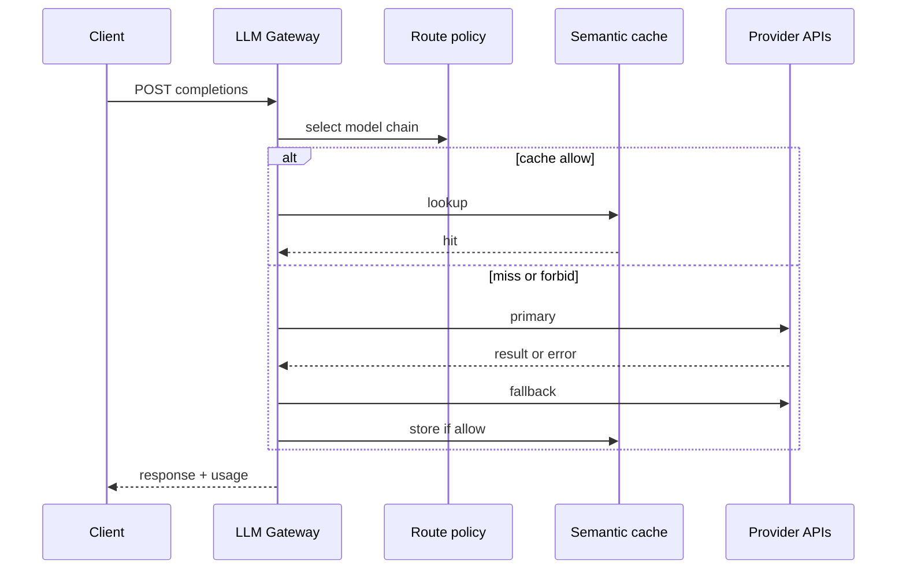
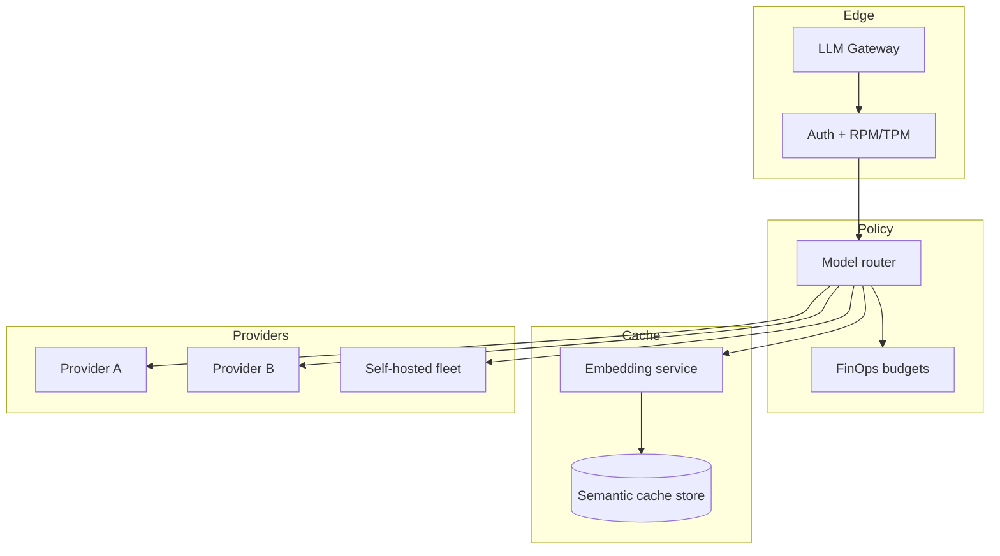

# Design an LLM gateway with semantic cache and model routing

## Where this actually gets asked

Rising 2026 infra question as companies centralize LLM spend: "Design an LLM gateway," "API
gateway for OpenAI/Anthropic," "semantic cache for prompts." Sits between multi-tenant platforms
and FinOps — Staff+ cares about routing policy, cache safety, and blast radius.

## Requirements

**Functional**
- Single ingress for chat/completions across multiple model providers.
- Route by policy: tenant, latency class, cost class, capability (tools, vision).
- Optional semantic cache for idempotent / FAQ-like prompts.
- Central auth, rate limits, usage metering, and kill switches.

**Non-functional**
- P99 overhead of the gateway itself is small vs model latency.
- Cache must not serve personalized or safety-sensitive answers across users.
- Provider outages trigger failover without thundering herds.
- FinOps: per-tenant budgets enforced before tokens burn.

## Core entities

- **Route policy**: match rules → model/provider, timeout, retry, fallback chain.
- **Cache key**: tenant_scope + embedding(prompt) + model_semver + policy_version.
- **Usage event**: tenant, model, tokens_in/out, cached_hit, cost_usd.
- **Provider adapter**: normalized request/response + error taxonomy.

## API / interface

```http
POST /v1/chat/completions
Authorization: Bearer <tenant_key>
X-Route-Class: interactive|batch
{ "messages":[...], "model":"auto"| "gpt-…"| "claude-…", "cache":"allow"|"forbid" }
→ 200 stream/json + headers: X-Model-Used, X-Cache: HIT|MISS

PUT /v1/policies/routing
{ "rules":[{"match":{"tenant_tier":"free"},"model":"small","rpm":60}] }
→ 200

POST /v1/cache/invalidate
{ "tenant_id":"…", "tag":"kb_v42" }
→ 202

GET /v1/usage/current
→ { "spend_usd":…, "budget_usd":…, "cache_hit_rate":… }
```

Staff+ callout: default `cache=forbid` for authenticated user-specific prompts; opt-in for safe classes.

## Data Flow

Client → auth/quota → route policy → cache lookup (if allowed) → provider adapter → meter → response.
Failover walks the fallback chain.



## High-level design

Maps to **functional** requirements from step 1 — the component architecture that makes the API and data flow real.



Overlaps [../ai-system-design/09](../ai-system-design/09-multi-tenant-ai-platform-architecture.md) and
[../scalability-governance-tradeoffs/01](../scalability-governance-tradeoffs/01-cost-vs-latency-vs-safety.md);
this entry focuses on the **gateway product** itself.

Deep dives below target **non-functional** requirements (latency, scale, failure, cost, security).

## Deep dive 1: semantic cache safety

Embed prompts; ANN lookup under cosine threshold. **Scope keys by tenant** (and user when needed).
Never cache: tool-using agent traces, PII-heavy prompts, regulated advice without review.
Invalidate by knowledge-base version tags when RAG context changes.

## Deep dive 2: routing and failover

Capability-based routing (vision → models that support images). Timeouts shorter than client SLOs;
hedged requests carefully (cost). Circuit-break bad providers; shed to smaller models with
`X-Model-Used` honesty.

## Deep dive 3: FinOps enforcement

Budgets checked pre-flight; soft vs hard limits. Cache hits still meter "saved_usd" for exec
dashboards. Align with agent-finops discipline used elsewhere in the org.

## What's expected at each level

- **Mid-level:** reverse proxy to OpenAI.
- **Senior:** multi-provider + rate limits + basic cache.
- **Staff+:** cache tenancy/safety, policy routing, failover, budget gates.
- **Principal:** org-wide spend control and incident playbooks for provider outages.

## Follow-up questions to expect

- "How do you prevent cache poisoning across tenants?" (Hard tenant partition + authz on keys.)
- "What is your false-hit story?" (Threshold + optional exact-match secondary check.)

## Related

- [../ai-system-design/09 Multi-tenant AI platform](../ai-system-design/09-multi-tenant-ai-platform-architecture.md)
- [05 Security and compliance](05-security-and-compliance-architecture-for-ai-systems.md)
- [../scalability-governance-tradeoffs/01 Cost vs latency vs safety](../scalability-governance-tradeoffs/01-cost-vs-latency-vs-safety.md)
