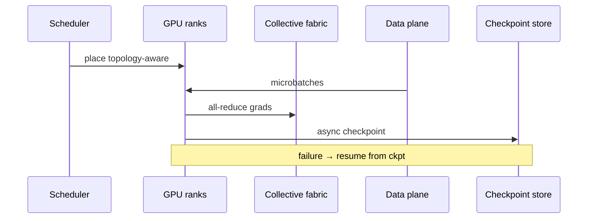
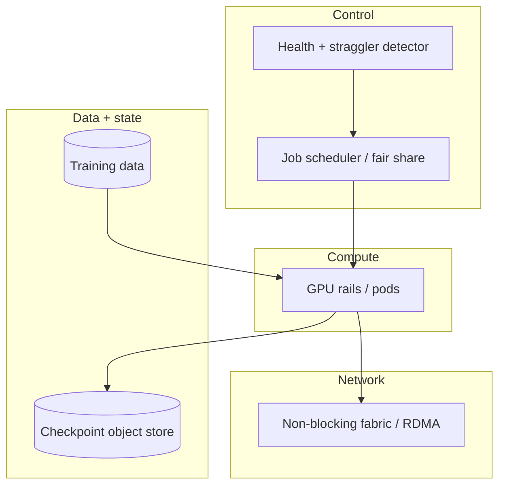

# Design a foundation-model pretraining cluster


<!-- question-variants:v1 -->

## Expected question

"Design the infrastructure for pretraining a large foundation model across thousands of GPUs. How do you handle parallelism, networking, checkpointing, stragglers, and utilization?"

## Variant forms

Interviewers often ask the same design with different framing — recognize the archetype:

- "Design a 10k-GPU training job that can survive node failures without restarting from scratch."
- "How do you choose data/tensor/pipeline parallelism for a 100B+ parameter model?"
- "Our training run wastes 30% of GPU hours on stragglers — architect detection and mitigation."
- "Design checkpoint storage so a world-size change still resumes."
- "How do you network a GPU cluster when all-reduce dominates step time?"
- "Design multi-tenant training queues with fair-share and preemption."
- "Walk through why storage I/O or collective comms — not FLOPs — becomes the bottleneck."
- "How do you estimate time-to-train and $/token for a proposed cluster?"

## Where this actually gets asked

Frontier-lab and hyperscaler **training infra** Staff+/Principal rounds (OpenAI/Anthropic/Google/Meta
archetypes). Distinct from serving ([../ai-system-design/01-llm-inference-serving-at-scale.md](../ai-system-design/01-llm-inference-serving-at-scale.md))
and from generic K8s cost ([06](06-container-orchestration-and-cost-optimization-at-scale.md)).
Public blogs (Megatron, Llama training, cluster networking) ground the patterns; treat company
attribution as directional.

## Requirements

**Functional**
- Launch distributed training jobs with declared parallelism topology.
- Stream training data at step rate; write periodic checkpoints; resume after failure.
- Expose job status, step time, MFU (model FLOPs utilization), and failure reasons.

**Non-functional**
- High MFU (production targets often discussed in ~40–60%+ range depending on model/stack — state assumptions).
- Survive node/GPU failures with bounded lost work (checkpoint interval trade-off).
- Network fabric sized for collective communication, not just east-west general traffic.
- Cost visibility: GPU-hours, idle from bubbles/stragglers, storage for checkpoints.

## Core entities

- **Job**: model config, world size, parallelism plan, data mix, owner, priority.
- **Worker / rank**: GPU membership, rail/zone, health.
- **Checkpoint**: step, sharded tensors, optimizer state, topology metadata.
- **Collective**: all-reduce / all-gather groups mapped to topology.
- **Straggler event**: rank, slow kernel/IO, mitigation (reschedule, drop microbatch).

## API / interface

```http
POST /v1/training/jobs
{
  "model":"fm-100b","gpus":2048,
  "parallelism":{"tp":8,"pp":16,"dp":16},
  "checkpoint_every_steps":500,
  "data_manifest":"s3://datasets/mix_v3"
}
→ 201 { "job_id":"tj_...","status":"queued" }

GET /v1/training/jobs/{id}
→ { "step":120000,"mfu":0.48,"step_time_ms":2100,"last_ckpt":"..." }

POST /v1/training/jobs/{id}/resume
{ "checkpoint":"ckpt_..." }
→ 202 { "status":"restarting" }
```

Staff+ callout: checkpoint format must record **parallelism topology** or resume becomes a rewrite.

## Data Flow

Scheduler places ranks on topology-aware hosts → data loader feeds microbatches → forward/backward
with collectives → optimizer step → periodic async checkpoint → on failure, restart from last ckpt.



## High-level design



Deep dives below target **non-functional** requirements (latency, scale, failure, cost, security).

## Deep dive 1: parallelism topology

**Tensor parallel (TP)** needs the fastest links (often within node/NVLink). **Pipeline parallel (PP)**
introduces bubbles — microbatch tuning matters. **Data parallel (DP)** scales with all-reduce volume.
Staff+ picks TP/PP/DP from model size, node GPU count, and interconnect — not slogans. Changing
world size mid-run requires checkpoint reshape tooling.

## Deep dive 2: checkpoint vs lost work

Checkpoint every N steps: small N wastes IO/GPU sync; large N loses more work on failure. Overlap
async checkpoint with compute where safe; verify checksums. Store optimizer state or accept
longer re-warmup. Test restore regularly — untested checkpoints are fiction.

## Deep dive 3: network and stragglers

If step time is collective-bound, buy/design fabric (rail-optimized placement) before more GPUs.
Stragglers: health checks, exclude sick nodes, speculative data fetch, avoid tiny tail ranks on
bad disks. Preemption of low-priority jobs must dump clean checkpoints first.

## Deep dive 4: utilization economics and 45-min focus

Report MFU and goodput (successful tokens/sec). Idle from poor packing or waiting on data is a
first-class cost. In 45 minutes: topology choice, checkpoint interval, fabric/straggler, resume
story — not CUDA kernel tuning unless asked.

## What's expected at each level

- **Mid-level:** "use PyTorch DDP on many GPUs."
- **Senior:** names DP/TP/PP at a high level; periodic checkpoints.
- **Staff+:** topology-aware placement, checkpoint/resume contracts, straggler + fabric bottlenecks,
  MFU/goodput metrics.
- **Principal:** multi-tenant fair-share with preemption SLOs, cost-per-token estimates, and
  operational drills for cluster-scale failure domains.

## Follow-up questions to expect

- "What breaks first at 2× GPUs?" (Often network or checkpoint IO, not peak FLOPs.)
- "How do you train across regions?" (Usually avoid; WAN collectives kill MFU — prefer single campus.)
- "Who gets GPUs when jobs contend?" (Fair-share + priority + max quota; training vs serving isolation.)

## Related

- [01 GPU capacity planning](01-gpu-capacity-planning-and-procurement.md)
- [04 Network for distributed training](04-network-architecture-for-distributed-training.md)
- [06 Container orchestration & cost](06-container-orchestration-and-cost-optimization-at-scale.md)
- [ai-system-design/08 Fine-tuning / RLHF](../ai-system-design/08-finetuning-rlhf-training-pipeline-at-scale.md)
