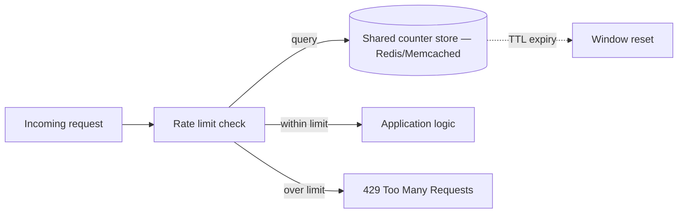

# Design a distributed rate limiter

## Where this actually gets asked

Weakly sourced for company-specific attribution, disclosed honestly: no verified Blind/Glassdoor
post was found confirming this exact question at any of the six companies. Several aggregator
sites (PracHub, DesignGurus) label it a "Google Interview Question" — but a direct fetch of
PracHub's own page found **zero citation trail** behind that label, the same fabrication-
adjacent pattern this repo has caught before. Treat "rate limiter" as a well-known general
system-design archetype asked broadly across big tech (not AI-specific, and not
company-specific to any of the six) rather than a confirmed leaked question. What's genuinely
useful and real: Google Cloud's own [Cloud Armor rate-limiting documentation](https://cloud.google.com/blog/products/identity-security/how-to-improve-resilience-to-ddos-attacks-with-cloud-armor-advanced-rate-limiting-capabilities)
describes a real, shipped system (throttle vs. rate-based-ban rules, keyed by IP/header/
forwarded-for) that's excellent grounding material for this question's real-world answer, even
without a confirmed interview attribution.

## Requirements

**Functional**
- Limit the number of requests a client (by API key, user ID, or IP) can make in a given time
  window, rejecting requests over the limit.
- Support multiple simultaneous limit rules (e.g., 10 requests/second AND 1000 requests/day per
  client) rather than a single flat threshold.

**Non-functional**
- Must work correctly across multiple servers/regions handling the same client's traffic — a
  rate limiter that only tracks state on one server undercounts a client hitting multiple
  servers.
- Low latency — the rate-limit check happens on every request, so it can't meaningfully add to
  request latency.
- Should fail safe in a way that's explicitly chosen, not accidental — deciding whether a
  limiter-storage outage should fail open (allow all traffic) or fail closed (reject all
  traffic) is a real design decision, not a detail.

## Core entities

- **Client**: the entity being rate-limited (API key, user, IP) with one or more applicable
  limit rules.
- **Limit rule**: a threshold (N requests per time window) and the window's semantics (fixed,
  sliding, or token-bucket).
- **Counter/bucket**: the current state of a client's consumption against a rule — this is the
  piece that must be shared/synchronized across servers.

## API / interface

```text
CheckLimit(client_id, rule_id) → { allowed: bool, remaining: int, retry_after_seconds: int }
```

Every request path calls this before doing any real work — a rejected check should cost as
close to nothing as possible.

## High-level design



The critical design decision: the counter store must be shared across every server instance
handling that client's traffic — an in-process counter per server undercounts a client
distributing requests across multiple servers/regions, defeating the limiter entirely.

## Deep dive 1: algorithm choice

| Algorithm | Burst handling | Memory | Accuracy | When it's the right call |
|---|---|---|---|---|
| Fixed window counter | Poor — allows 2x burst at window boundary | Lowest | Approximate | Simple cases where boundary bursts are acceptable |
| Sliding window log | Best — exact | Highest (stores every request timestamp) | Exact | Low-volume, high-precision limits |
| Sliding window counter (weighted average of two fixed windows) | Good — smooths boundary bursts | Low | Approximate, close to exact | The common real-world default — good accuracy/memory trade-off |
| Token bucket | Good — allows controlled bursts up to bucket size | Low | Approximate by design (bursts are intentional) | APIs that want to allow occasional bursts, not just a flat cap |

**Common mistake at the mid/senior level:** proposing a fixed-window counter without recognizing
its boundary-burst flaw — a client can send the full limit at the very end of one window and
the full limit again at the very start of the next, doubling the effective rate for a brief
period. This is exactly the kind of edge case a Staff+ answer catches unprompted.

## Deep dive 2: distributed synchronization — the actual hard part

A single-server rate limiter is a solved problem; the distributed version's real difficulty is
keeping the shared counter both fast and consistent across concurrent requests hitting
different servers simultaneously. A shared Redis instance with an atomic increment-and-check
(via a Lua script or `INCR` + `EXPIRE`) is the standard real answer — the atomicity matters
because a naive "read counter, check, increment" sequence has a race condition where two
concurrent requests can both read the same under-limit value before either increments it,
allowing both through when only one should have passed.

## Deep dive 3: making "regionally approximate" a concrete mechanism, not a hand-wave

Naming "each region enforces a fraction of the global limit" is a Staff+-level answer; a
Principal-level one specifies how regions actually stay approximately in sync without a
synchronous cross-region call on every request. Two real mechanisms, with different cost
profiles: **static fractional allocation** (each of N regions gets limit/N as a fixed local
budget — zero coordination cost, but wastes capacity when traffic is skewed toward one region
and a client legitimately needs more than their region's fixed share) versus **periodic gossip/
reconciliation** (each region tracks its own local counter and asynchronously exchanges counts
with other regions on a short interval, e.g., every 1-2 seconds, allowing each region to adjust
its effective local limit based on other regions' recent consumption). The gossip approach
recovers much of the accuracy of a globally-exact limiter while keeping the hot path
single-region and synchronous-call-free — the real cost is a bounded window (the gossip
interval) during which the global limit can be modestly over-enforced, which is an explicit,
quantifiable trade-off (e.g., "up to 2 seconds of staleness means at most ~2 extra seconds'
worth of over-limit traffic can slip through across all regions combined") rather than an
unstated approximation.

## What's expected at each level

- **Mid-level:** proposes a fixed-window counter without addressing the boundary-burst problem
  or distributed synchronization at all.
- **Senior:** identifies the need for a shared counter store and picks a reasonable algorithm
  (sliding window or token bucket), addressing the boundary-burst flaw of fixed windows.
- **Staff+:** designs the atomic check-and-increment explicitly (Lua script or equivalent) to
  close the race condition, and makes an explicit, stated choice about fail-open vs. fail-closed
  behavior when the counter store itself is unavailable.
- **Principal:** additionally specifies the actual cross-region synchronization mechanism
  (static fractional allocation vs. periodic gossip/reconciliation) with its concrete staleness-
  vs-accuracy trade-off quantified — not just "trade exactness for latency" as an unmechanized
  observation — and picks the right one against a stated traffic-skew assumption.

## Follow-up questions to expect

- "What happens if the rate-limit store itself goes down?" (Answer: this is the fail-open vs.
  fail-closed decision — for a public API under attack, fail-closed is usually safer; for an
  internal service where availability matters more than strict enforcement, fail-open may be
  the right call. State the choice explicitly rather than leaving it implicit.)
- "How would you rate-limit fairly across a global user base without a single global
  bottleneck?" (Answer: shard the limit regionally with each region enforcing a fraction of the
  total, accepting approximate rather than exact global enforcement — the same latency/
  exactness trade-off named in the Principal-level expectation above.)

## Related

- [system-design/01: LLM inference serving at scale](../ai-system-design/01-llm-inference-serving-at-scale.md) — a similar admission-control problem, one layer up at the GPU-scheduling level
- [ai-system-design/09: Multi-tenant AI platform architecture](../ai-system-design/09-multi-tenant-ai-platform-architecture.md) — the same TPM/RPM quota mechanism applied to LLM serving specifically
