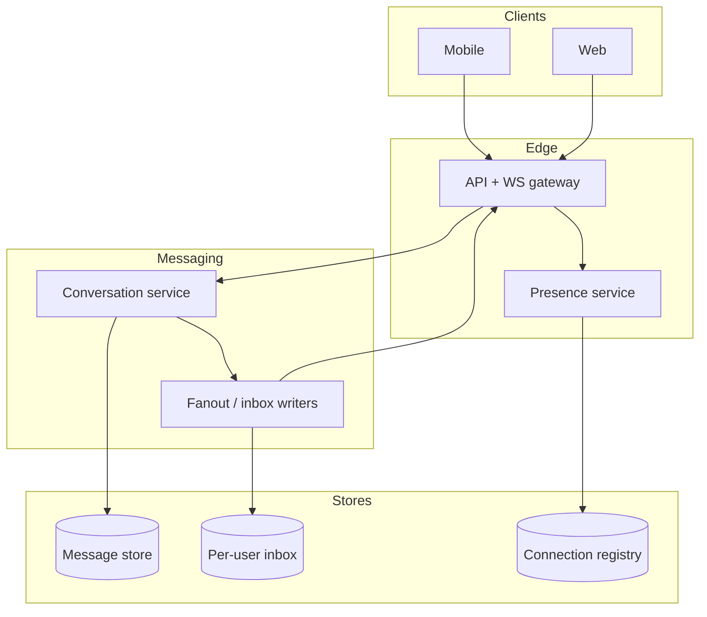

# Design a real-time chat/messaging system at scale

## Where this actually gets asked

The best-sourced entry in this folder. **Meta** is well-documented as asking a version of this —
multiple independent interview-prep sources (IGotAnOffer, Exponent, DesignGurus) consistently
list "Design WhatsApp/Messenger" as one of Meta's most common system-design questions; no single
verbatim Blind quote was captured, but the convergence across independent sources, plus Meta
actually owning both products, makes this credible. **Microsoft** has moderate secondary
sourcing for "design the chat service for Microsoft Teams." No company-specific evidence was
found for Google, Apple, OpenAI, or Anthropic on this exact topic. What's unusually strong here:
the *real system* grounding, independent of interview attribution. WhatsApp's own engineering
team publicly documented their architecture directly — Rick Reed's "Scaling to Millions of
Simultaneous Connections" talk (Erlang Factory SF, 2012) and WhatsApp's own blog post
"1 Million is so 2011." Separately, **Meta's own engineering blog** published "Building Facebook
Messenger" (2011) and "Building Mobile-First Infrastructure for Messenger" (2014), describing
the real MQTT-based push architecture and the "Iris" ordered-queue system — genuine primary
sources, not aggregator claims.

## Requirements

**Functional**
- Users can send/receive messages 1:1 and in groups, with delivery working even when the
  recipient is briefly offline.
- Message delivery status (sent, delivered, read) should be trackable and shown to the sender.
- Users should see whether their contacts are currently online (presence).

**Non-functional**
- Low latency for message delivery when both parties are online — this is a real-time system,
  not an eventually-consistent one.
- At-least-once delivery, with the client responsible for deduplication via message IDs — never
  silently drop a message, even under server failure.
- Must scale to a connection count in the hundreds of millions concurrently — this is
  fundamentally a long-lived-connection-management problem, not just a database-throughput
  problem.

## Core entities

- **Message**: sender, recipient(s), content, timestamp, a client-generated unique ID (for
  dedup), and delivery status.
- **Conversation**: 1:1 or group, with membership and the ordered message history.
- **Connection**: a client's currently-open long-lived connection (WebSocket or MQTT), mapped to
  which server instance is holding it — needed to route a message to the right server when the
  sender and recipient aren't connected to the same one.
- **Presence record**: a user's current online/offline/last-seen status.

## API / interface
Auth: user session; device-scoped connections.

```http
POST /v1/conversations
{"member_ids":["u_1","u_2"],"type":"direct"} → 201 {"conversation_id":"cv_..."}

POST /v1/conversations/{id}/messages
Idempotency-Key: <uuid>
{"client_msg_id":"cmsg_...","body":"hello","reply_to":null}
→ 201 {"message_id":"msg_...","seq":1842,"server_ts":"..."}

GET /v1/conversations/{id}/messages?after_seq=1800&limit=50
→ {"messages":[...],"next_after_seq":1850}

WebSocket /v1/realtime?device_id=dev_...
→ server pushes {"type":"message","conversation_id":"cv_...","message":{...}}
→ client sends {"type":"ack","conversation_id":"cv_...","seq":1842}
→ client sends {"type":"typing","conversation_id":"cv_..."}

POST /v1/conversations/{id}/read
{"up_to_seq":1842} → 200 {"ok":true}
```

Staff+ callout: client_msg_id + seq give idempotent send and gap-free sync; read receipts are a separate write.


## High-level design



The core design problem this diagram makes explicit: sender and recipient are very often
connected to *different* gateway servers, so message delivery requires a routing layer that
knows which server currently holds which user's connection — a stateful routing problem, unlike
a typical stateless request/response API.

## Deep dive 1: connection management at scale

| Approach | Concurrent connections per server | Real-time push | When it's the right call |
|---|---|---|---|
| Polling (client asks "any new messages?") | High (stateless) | Poor — adds latency proportional to poll interval | Never for a real chat product; only ever a fallback |
| Long-lived WebSocket | Moderate-high, bounded by server memory/file descriptors | Good | The standard modern default |
| Erlang/BEAM-based connection handling (WhatsApp's real, documented approach) | Very high — the actor model and lightweight processes are specifically suited to millions of concurrent lightweight connections | Good | When connection count per server is the dominant scaling axis, as WhatsApp's own published talks describe |

**Common mistake at the mid/senior level:** treating this as a database-scaling problem (shard
the messages table) when the actual first-order bottleneck is connection count — a server has a
hard ceiling on concurrent open connections well before it hits a database throughput limit, and
the real engineering challenge WhatsApp's own talks describe is specifically about maximizing
connections-per-machine.

## Deep dive 2: offline delivery and ordering — Meta's real "Iris" pattern

When a recipient is offline, messages need to queue until they reconnect, and arrive in the
correct order. Meta's own published architecture ("Building Mobile-First Infrastructure for
Messenger," 2014) describes exactly this: an ordered, per-user queue system (internally named
Iris) that assigns each message a sequence number per recipient, so a reconnecting client can
request "everything since sequence N" and receive a gap-free, correctly-ordered backlog — a more
robust pattern than a raw pub/sub fan-out, which doesn't inherently guarantee ordering or
completeness across a disconnect/reconnect cycle.

## Deep dive 3: delivery guarantees and deduplication

At-least-once delivery (never silently drop a message) necessarily means a client might receive
the same message twice — after a connection drop and retry, for example. The correct design
puts deduplication responsibility on the client, using the client-generated `client_message_id`
from the send request: if a client sees a message with an ID it's already displayed, it discards
the duplicate rather than showing it twice. **Common mistake at the mid/senior level:** trying
to achieve exactly-once delivery at the server layer alone — this is either impossible or
requires far more coordination overhead than the at-least-once-plus-client-dedup pattern real
systems actually use.

## What's expected at each level

- **Mid-level:** proposes a database-backed message store with polling or basic pub/sub, without
  addressing connection-count scaling or ordering guarantees.
- **Senior:** identifies long-lived connections (WebSocket) as the right transport and designs a
  routing layer for cross-server message delivery.
- **Staff+:** designs the offline/ordered-queue mechanism explicitly (per-recipient sequence
  numbers, gap-free reconnect sync) and states the at-least-once-plus-client-dedup delivery
  model rather than chasing exactly-once at the server.
- **Principal:** additionally reasons about connection-count as the actual first-order scaling
  bottleneck (not database throughput), and can discuss why a connection-optimized runtime model
  (like WhatsApp's real, published Erlang/BEAM choice) matters more at this scale than typical
  web-service scaling levers.

## Follow-up questions to expect

- "How do you handle a user with the app open on two devices simultaneously?" (Answer: fan out
  the same message to both device connections, and make read-status idempotent per-device so
  reading on one device doesn't inconsistently mark it unread on the other.)
- "How would group chat change your design?" (Answer: fan-out cost scales with group size — for
  very large groups, this starts to resemble the news-feed fan-out problem
  [general-system-design/03](03-news-feed-ranking-system.md) covers, where fan-out-on-write
  becomes expensive enough that some systems switch to fan-out-on-read for the largest groups.)

## Related

- [general-system-design/03: News feed / ranking system](03-news-feed-ranking-system.md) — the fan-out trade-off this entry's group-chat follow-up connects to
- [general-system-design/07: Distributed cache / CDN layer](07-distributed-cache-cdn-layer.md) — Meta's real Memcache-at-scale pattern, relevant to this system's presence/status lookups
