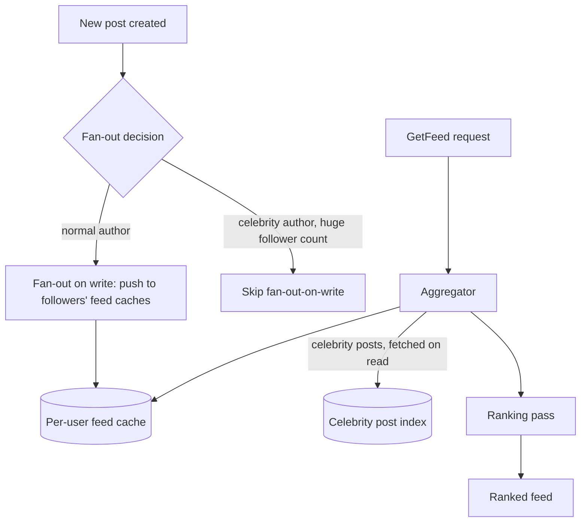

# Design a news feed / ranking system

## Where this actually gets asked

Well-documented for Meta specifically: "Design Instagram" is repeatedly cited, independently,
across multiple prep sources (IGotAnOffer, Exponent, DesignGurus) as one of Meta's most commonly
asked system-design questions — no single verbatim Blind quote was captured, but the
cross-source convergence is credible given Meta's own consumer feed products. No evidence was
found for Google, Microsoft, Apple, OpenAI, or Anthropic asking a comparable feed-ranking
question — unsurprising, since none of these companies has a consumer feed product as central to
its business as Meta's. The real-system grounding here is unusually strong and primary: Meta's
own engineering blog published ["Serving Facebook Multifeed: Efficiency, performance gains
through redesign"](https://engineering.fb.com/) (2015), describing the real Aggregator/Leaf/
Tailer architecture, and "News Feed ranking, powered by machine learning" (2021), describing the
real candidate-generation → ranking → post-ranking pipeline — genuine primary sources, as close
to ground truth as this repo's research has found anywhere.

## Requirements

**Functional**
- A user's feed shows content from people/pages they follow, ordered by relevance (not strictly
  chronological).
- New content should appear in relevant followers' feeds within a reasonable delay — not
  necessarily instant, but not hours late either.
- Support a "celebrity" case: some accounts have hundreds of millions of followers, which a naive
  design would handle identically to a normal user and buckle under.

**Non-functional**
- Read-heavy at extreme scale — most users check their feed far more often than they post,
  making read-path efficiency the dominant design concern.
- Ranking needs to run fast enough to feel instant on feed load, even though it's evaluating a
  large candidate pool per request.
- The celebrity/fan-out problem is a real, asymmetric scaling concern — a small fraction of
  accounts generate a disproportionate share of total fan-out work.

## Core entities

- **Post**: author, content, timestamp, engagement signals (likes, comments, shares) used as
  ranking features.
- **Follow graph**: who follows whom — the basis for whose posts appear in whose feed.
- **Feed entry**: a (user, post) pairing representing "this post is a candidate for this user's
  feed," with a computed relevance score.
- **Ranking model**: consumes engagement signals, follow-graph proximity, and recency to score
  candidate posts per user.

## API / interface

```text
GetFeed(user_id, cursor) → { posts: [ranked_post, ...], next_cursor }
CreatePost(author_id, content) → { post_id, fan_out_status }
```

## High-level design



This is Meta's own real, published architecture pattern (the Aggregator/Leaf/Tailer design):
separate the fan-out mechanism by author type rather than using one uniform strategy for every
post.

## Deep dive 1: fan-out-on-write vs. fan-out-on-read — the celebrity problem

| Approach | Write cost | Read cost | When it's the right call |
|---|---|---|---|
| Fan-out-on-write (push to every follower's feed cache at post time) | High for accounts with huge follower counts — one post = millions of writes | Very low — reading a feed is just reading a pre-computed cache | The default for normal accounts with a bounded, reasonable follower count |
| Fan-out-on-read (compute the feed at request time by pulling from followed accounts) | Low — a post is written once | Higher — every feed load must query and merge from many followed accounts | Necessary for celebrity/huge-follower-count accounts, where fan-out-on-write would be prohibitively expensive per post |
| Hybrid (Meta's real, documented pattern) | Fan-out-on-write for normal accounts; fan-out-on-read for celebrity accounts, merged at aggregation time | Best of both, at the cost of a more complex aggregation layer | The actual real-world answer — treating this as one uniform strategy is the common mid/senior-level gap |

**Common mistake at the mid/senior level:** proposing pure fan-out-on-write as the entire
answer, without recognizing that a single post from an account with 100M+ followers would
require 100M+ individual cache writes at post time — a catastrophic write amplification that
real systems specifically design around via the hybrid approach above.

## Deep dive 2: ranking as a separate, ML-driven stage

A common weak design stops at "show posts in reverse-chronological order." Meta's real,
published ranking pipeline (per its 2021 engineering blog) runs a genuine multi-stage process:
candidate generation (pull a bounded set of recent/relevant candidates, not the full history),
a ranking model (scores candidates using engagement-prediction signals — likelihood of like/
comment/share, recency, relationship strength to the viewer), and post-ranking adjustments
(diversity — not showing 10 posts from the same author consecutively, integrity/safety
filtering). **Common mistake at the mid/senior level:** treating ranking as a single sort-by-
recency-and-engagement-score step, missing that real systems separate candidate generation
(a cheap, broad first pass) from ranking (an expensive, narrow scoring pass) specifically to
keep the expensive step's input size bounded.

## What's expected at each level

- **Mid-level:** proposes pure fan-out-on-write with simple reverse-chronological ordering,
  without addressing the celebrity/high-follower-count case.
- **Senior:** identifies the celebrity fan-out problem and proposes a fan-out-on-read fallback
  for high-follower accounts.
- **Staff+:** designs the hybrid aggregation layer explicitly (merging pre-computed and
  on-read-computed candidates), and separates candidate generation from ranking as distinct
  pipeline stages.
- **Principal:** additionally reasons about ranking model feedback loops (engagement-optimized
  ranking can create filter-bubble or addiction-pattern side effects) and discusses where
  diversity/integrity post-ranking adjustments belong in the pipeline as a deliberate
  counterbalance, not an afterthought.

## Follow-up questions to expect

- "How would you handle a burst of posts about a breaking news event, where relevance should
  temporarily override normal ranking?" (Answer: this needs a separate, time-boxed relevance
  boost mechanism layered on top of the standard ranking model — treating it as a special case
  in candidate generation rather than trying to make the standard model itself react to
  real-time events.)
- "How do you evaluate whether a ranking model change actually improved the feed, not just
  engagement metrics?" (Answer: this is the same eval-gating discipline from
  [ai-system-design/07](../ai-system-design/07-llm-evaluation-observability-platform.md) applied
  to ranking — engagement alone is a proxy that can be gamed by addictive-but-low-quality
  content, so real evaluation needs additional signals beyond raw engagement.)

## Related

- [general-system-design/02: Real-time chat/messaging at scale](02-realtime-chat-messaging-at-scale.md) — the group-chat fan-out problem this entry's pattern generalizes to
- [general-system-design/07: Distributed cache / CDN layer](07-distributed-cache-cdn-layer.md) — Meta's real Memcache architecture, the caching layer this design's feed cache builds on
- [ai-system-design/06: Multimodal search/recommendation system](../ai-system-design/06-multimodal-search-recommendation-system.md) — the AI-specific counterpart to this entry's ranking problem
