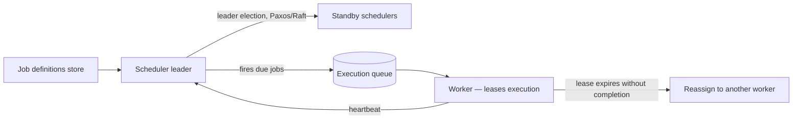

# Design a distributed job scheduler / task queue

## Where this actually gets asked

Weakly sourced for company-specific interview attribution: no confirmed Blind/Glassdoor post was
found for any of the six companies asking this exact question; generic aggregator lists tag it
"asked at Google, Amazon, Microsoft" without individual sourcing behind any one company —
treat as an unconfirmed general archetype, not a leaked question. What's genuinely strong here
is the real-system grounding: Google's own [SRE Book](https://sre.google/sre-book/) has a
dedicated chapter, "Distributed Periodic Scheduling with Cron Service," describing Google's real
internal distributed cron system built atop Borg and Paxos-based consensus — a genuine Google
primary source. The [Borg paper itself](https://research.google/pubs/large-scale-cluster-management-at-google-with-borg/)
(Google Research, republished at EuroSys 2015) is directly relevant background. Use this
question as a well-known general distributed-systems archetype, grounded in real, published
Google infrastructure, rather than a confirmed company-specific interview prompt.

## Requirements

**Functional**
- Schedule jobs to run at a specific time or on a recurring interval (cron-style), across a
  fleet of worker machines.
- Guarantee a scheduled job runs — and, critically, runs **exactly once** even if the scheduler
  or a worker fails mid-execution, not zero times (silently dropped) or multiple times
  (duplicated side effects).
- Support job priorities and retries with backoff for jobs that fail.

**Non-functional**
- The scheduler itself must not be a single point of failure — a scheduler crash shouldn't mean
  no jobs run until it's manually restarted.
- Jobs need to be idempotent-safe or the system needs deduplication, since distributed systems
  generally can't guarantee exactly-once execution without one of these.
- Scale to a very large number of scheduled jobs (Google's real cron service handles this at
  enormous internal scale) without the scheduling decision itself becoming a bottleneck.

## Core entities

- **Job definition**: what to run, the schedule (cron expression or one-time timestamp), retry
  policy, and priority.
- **Job execution**: a specific instance of a job definition firing at a specific time, with a
  status (pending, running, succeeded, failed).
- **Lease**: a time-bounded claim by one worker on one job execution, preventing two workers
  from picking up the same execution simultaneously.
- **Worker**: a machine capable of executing jobs, reporting health/liveness to the scheduler.

## API / interface

```text
ScheduleJob(cron_expr | run_at, job_spec, retry_policy) → { job_id }
GET /jobs/{job_id}/executions → [{ execution_id, status, started_at, worker_id }]
```

## High-level design



The design principle Google's own real cron-service architecture reflects: the scheduler itself
runs as a leader-elected, consensus-backed cluster (not a single instance) so a scheduler
failure triggers leader re-election rather than a scheduling outage — and job execution uses a
time-bounded lease so a worker failure mid-execution results in reassignment, not a silently
lost job.

## Deep dive 1: exactly-once execution — the actual hard guarantee

Distributed systems fundamentally cannot guarantee true exactly-once execution across a network
that can partition or a worker that can crash mid-job — the real, practical answer is
**at-least-once execution plus idempotency**. The scheduler leases an execution to a worker for
a bounded time; if the worker doesn't report completion before the lease expires, the execution
is reassigned to another worker. This means a job could genuinely run twice (the original worker
was just slow, not dead, and both it and the reassigned worker complete) — so job definitions
need to either be naturally idempotent (safe to run twice) or use a dedup key the job's own
side-effect system checks before acting.

| Guarantee | What it actually requires | Real-world approach |
|---|---|---|
| At-most-once | Accept some jobs silently never run | Rarely acceptable for anything that matters |
| At-least-once | Retry on any doubt about completion | The real, practical default — combined with idempotency |
| Exactly-once (in effect) | At-least-once execution + idempotent job logic or a dedup check | The correct target — achieved by combining the above, not by the scheduler alone |

**Common mistake at the mid/senior level:** claiming the scheduler itself can guarantee
exactly-once execution through clever engineering alone — a Staff+ answer names this as
fundamentally impossible without idempotency and designs for at-least-once-plus-idempotent
explicitly.

## Deep dive 2: scheduler high availability via consensus

A single-instance scheduler is a hard single point of failure — if it crashes, no jobs fire
until it's replaced. Google's real cron-service design (per the SRE Book) runs the scheduler as
a small cluster using Paxos-based consensus for leader election: one instance is the active
leader firing jobs, the others stand by ready to take over if the leader fails, with consensus
ensuring only one leader is ever active at a time (avoiding a split-brain scenario where two
schedulers both believe they're the leader and double-fire jobs).

## What's expected at each level

- **Mid-level:** proposes a single scheduler process with a jobs database, without addressing
  scheduler failover or exactly-once semantics.
- **Senior:** identifies the need for scheduler redundancy and a lease-based worker assignment
  mechanism to handle worker failures.
- **Staff+:** explicitly names exactly-once execution as unachievable without idempotency, and
  designs the at-least-once-plus-idempotent-or-dedup pattern rather than claiming the scheduler
  alone solves it.
- **Principal:** additionally designs the scheduler's own high-availability mechanism (leader
  election via consensus) explicitly, connecting it to the same split-brain-avoidance principle
  that makes distributed consensus hard in general, not just asserting "run multiple instances."

## Follow-up questions to expect

- "Two scheduler instances both think they're the leader after a network partition heals — what
  happens?" (Answer: this is exactly what consensus protocols like Paxos/Raft prevent — a
  properly implemented leader election guarantees at most one leader is recognized by a
  majority of the cluster at any time, which is the actual mechanism preventing double-firing,
  not just "we elected a leader.")
- "How would you prioritize a large backlog of overdue jobs after an extended scheduler outage?"
  (Answer: this needs an explicit backlog-catch-up policy — run overdue jobs in priority order
  rather than strict chronological order, and consider whether some jobs are stale enough that
  running them late is actively wrong, which needs to be a job-level configuration, not a
  scheduler-wide default.)

## Related

- [general-system-design/01: Distributed rate limiter](01-distributed-rate-limiter.md) — a similar distributed-coordination problem at a different layer
- [cloud-architecture/03: Disaster recovery for model serving](../cloud-architecture/03-disaster-recovery-for-model-serving.md) — the same RTO/RPO reasoning applied to a scheduler outage specifically
