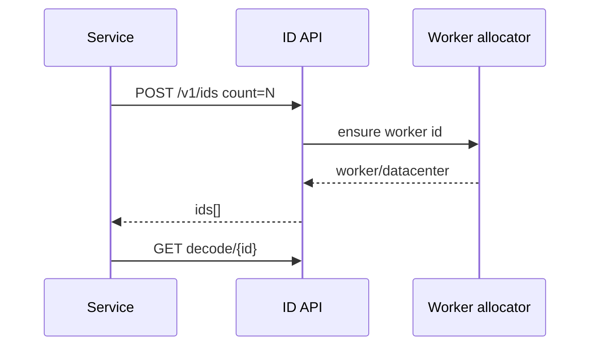
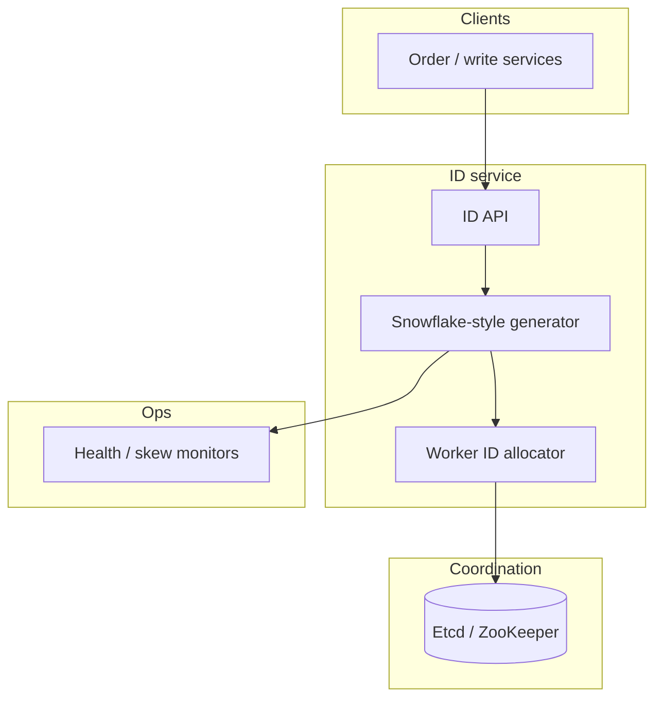

# Design a distributed unique ID generator

## Where this actually gets asked — and an honest attribution correction

No company-specific interview attribution was found for any of the six companies in scope
(OpenAI, Anthropic, Meta, Google, Microsoft, Apple) on this exact question. **This needs a
direct correction to a common assumption**: the canonical real-world system most people
associate with this problem — Snowflake — is a **Twitter** system (announced on Twitter's own
engineering blog, "Announcing Snowflake," 2010), and Twitter is not one of the six companies
this repo researches. Any claim that Google, Meta, Microsoft, Apple, OpenAI, or Anthropic
"invented" or specifically documented Snowflake would be false, and this repo's own sourcing
discipline requires saying so plainly rather than force-fitting a real, well-known system to a
company it didn't come from. Treat this as a well-known general distributed-systems archetype,
useful and worth preparing regardless of company attribution, grounded in a real system — just
not one of the six companies' own.

## Requirements

**Functional**
- Generate unique identifiers for entities (posts, orders, messages) across many machines
  simultaneously, with no coordination required between generators for each individual ID.
- IDs should be roughly sortable by creation time — useful for pagination and debugging without
  a separate timestamp lookup.

**Non-functional**
- No single point of failure or bottleneck — a centralized "next ID" counter service would be
  exactly that, and needs to be avoided at scale.
- High throughput per generating node — potentially tens of thousands of IDs per second per
  machine, with no cross-machine coordination on the hot path.
- IDs should fit in 64 bits for practical storage/indexing efficiency (the real constraint
  Snowflake's own design was built around).

## Core entities

- **Generator node**: a machine or process assigned a unique node/worker ID, capable of
  generating IDs independently.
- **ID**: a 64-bit value composed of a timestamp component, a generator/node-ID component, and a
  per-millisecond sequence component — the real Snowflake structure.

## API / interface
Auth: internal service mesh; clients should not mint IDs in app code ad hoc.

```http
POST /v1/ids
{"namespace":"orders","count":1} → 200 {"ids":["4192837461029384"]}

POST /v1/ids
{"namespace":"orders","count":100} → 200 {"ids":["..."],"batch_id":"b_..."}

GET /v1/ids/decode/{id}
→ {"namespace":"orders","datacenter":3,"worker":12,"timestamp_ms":...,"sequence":42}

GET /v1/allocator/health
→ {"workers":[{"id":12,"datacenter":3,"status":"ok","last_tick_ms":...}]}
```

Staff+ callout: batch allocate + decode are part of the contract; clock/worker health is observable.


## Data Flow


Clients allocate IDs via the service (batch optional); decode exposes datacenter/worker/time for debugging.



## High-level design

Maps to **functional** requirements from step 1 — the component architecture that makes the API and data flow real.



The key design insight: uniqueness is achieved by construction, not by coordination — each
node's assigned ID is baked into every ID it generates, so as long as node IDs are unique
(assigned once, out of band, e.g. via a configuration system or a lightweight coordination
service used only at startup, not per-request) and each node's own per-millisecond sequence
counter doesn't overflow (12 bits = 4096 IDs per node per millisecond), no two nodes can ever
produce the same ID without any request-time coordination between them.

Deep dives below target **non-functional** requirements (latency, scale, failure, cost, security).

## Deep dive 1: why this beats a centralized ID service

| Approach | Coordination cost per ID | Throughput ceiling | When it's the right call |
|---|---|---|---|
| Centralized counter service (single source of truth) | One network round-trip per ID | Bottlenecked by the single service | Never at real scale — this is the naive first answer worth explicitly rejecting |
| Database auto-increment | Requires a database write per ID, plus doesn't work across multiple database shards without coordination | Bottlenecked by the database | Fine for a single-database, non-distributed system; breaks down the moment you shard |
| UUID (random) | Zero coordination | Very high | Good for uniqueness alone, but not sortable by time, and larger (128 bits) than a Snowflake-style ID |
| Snowflake-style structured ID | Zero coordination on the hot path (node ID assigned once, out of band) | Very high — bounded only by per-node sequence counter capacity | The real-world answer when both uniqueness and rough time-ordering matter, at 64-bit size |

**Common mistake at the mid/senior level:** proposing a centralized ID-generation service as the
primary design without recognizing it recreates the exact single-bottleneck problem the
distributed system is trying to avoid — the whole point of the Snowflake-style approach is
eliminating that coordination point entirely.

## Deep dive 2: clock skew — the real edge case

Because the timestamp component is core to both uniqueness and ordering, a generator node whose
system clock jumps backward (NTP correction, VM migration) can produce an ID that collides with
or precedes one it already generated. Real implementations handle this by detecting a backward
clock jump and either refusing to generate IDs until the clock catches back up, or maintaining
a small buffer/offset to smooth over minor skew — this is exactly the kind of failure-mode
awareness that separates a Staff+ answer ("I know clocks aren't perfectly monotonic across
machines, here's how I handle it") from a senior one that assumes the timestamp component is
always trustworthy.

## Deep dive 3: hybrid logical clocks — the unifying fix, not a patch per symptom

Detecting and buffering around a backward clock jump treats each skew incident as a one-off
patch. A **Principal-level answer names the underlying, unifying mechanism**: a Hybrid Logical
Clock (HLC) — a timestamp component that combines the physical wall-clock time with a logical
counter that only ever increases, so the combined value is guaranteed monotonically increasing
*per node* regardless of physical clock behavior, while still staying close to real wall-clock
time for practical time-range queries. This reframes clock skew from "a failure mode to detect
and work around" into "a property the ID format is designed to tolerate by construction" — the
same category of shift (from reactive patch to structural guarantee) that distinguishes a
Principal answer elsewhere in this repo. It also directly resolves the sortability question:
because an HLC-based ID stays monotonic per node even under skew, cross-node causal ordering
(did event A happen before event B, when A and B originated on different nodes with imperfectly
synchronized clocks) becomes answerable in a way a raw physical timestamp alone cannot guarantee.

## What's expected at each level

- **Mid-level:** proposes a centralized counter or database auto-increment without recognizing
  the bottleneck/single-point-of-failure problem this recreates at distributed scale.
- **Senior:** proposes a structured ID (timestamp + node ID + sequence) achieving coordination-
  free generation.
- **Staff+:** designs the bit allocation deliberately (trading off ID lifetime before the
  timestamp component overflows, against per-node per-millisecond throughput from the sequence
  bits), addresses node-ID assignment, and detects/buffers around clock-skew incidents reactively.
- **Principal:** additionally names hybrid logical clocks as the structural fix for skew — a
  monotonicity guarantee built into the ID format itself rather than a reactive patch per
  incident — and can explain why this also solves cross-node causal ordering, not just
  same-node monotonicity; and can discuss the sortability trade-off against alternatives (UUIDs)
  explicitly.

## Follow-up questions to expect

- "What happens when a node's sequence counter overflows within a single millisecond?" (Answer:
  either the generator blocks briefly until the next millisecond tick, or the design needs more
  sequence bits — this is a real, bounded throughput ceiling per node that should be sized
  against actual expected load, not assumed away.)
- "How do you assign unique node IDs without introducing a coordination bottleneck?" (Answer:
  assign them once, out of band — via static configuration, a lightweight registration step at
  node startup against a coordination service like ZooKeeper/etcd, or even manual assignment at
  small scale — never per-ID-generation-request, which would defeat the entire design.)

## Related

- [general-system-design/04: Distributed job scheduler / task queue](04-distributed-job-scheduler-task-queue.md) — a different distributed-coordination problem, contrasting coordination-required (leader election) vs. coordination-free (this entry) designs
