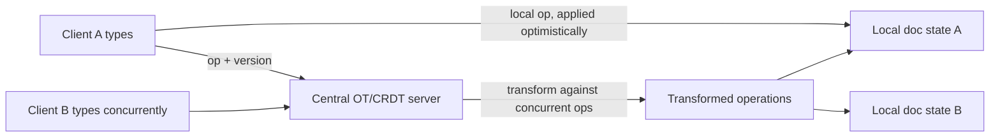

# Design a collaborative document editing system

## Where this actually gets asked — and another attribution correction

Weakly sourced, with a specific correction worth flagging: one Glassdoor-sourced citation that
surfaced during research for "design Google Docs" turned out, on verification, to be a
**Netflix** interview question, not Google's — a mislabeling worth catching rather than
repeating. No verified Google-attributed Blind/Glassdoor post was found for this exact question
at any of the six companies. What is real and useful: the [Google Wave Operational Transformation
whitepaper](https://svn.apache.org/repos/asf/incubator/wave/whitepapers/operational-transform/)
(preserved in the Apache Wave incubator archive after Wave's code was open-sourced to Apache) is
a genuine primary source describing the real OT algorithm Google built. Google Docs is
confirmed, via multiple secondary technical sources, to have adopted the same OT lineage as Wave
after Google shut down Wave and folded its editing technology into Docs post-2010 — but no
dedicated "how Google Docs actually works" official engineering blog post was found, so treat
the OT whitepaper as strong background grounding for the real algorithm, not as direct
documentation of Docs' current production system specifically.

## Requirements

**Functional**
- Multiple users can edit the same document simultaneously, with each user's edits eventually
  visible to all others.
- Concurrent edits to the same or overlapping regions of a document must converge to the same
  final state for every user — not diverge into different "versions" of the document.
- Support offline editing that syncs and merges correctly once connectivity resumes.

**Non-functional**
- Low latency for a user's own keystrokes to appear locally (this must feel instant, handled
  optimistically, not waiting on a round trip).
- Eventual consistency across all collaborators is acceptable for *others'* edits appearing, but
  the convergence guarantee (everyone ends up with the identical final document) is not optional.
- Should scale to documents with a very large edit history without every client needing to
  replay the entire history on every sync.

## Core entities

- **Document**: the current content, plus its full or truncated operation history.
- **Operation**: a single edit (insert N characters at position P, delete N characters at
  position P), the atomic unit that gets transformed and applied.
- **Client state**: each collaborator's local view of the document plus a cursor/version marker
  indicating which operations they've already applied.

## API / interface

```text
ApplyOperation(doc_id, operation, client_version) → { transformed_operation, new_version }
  → broadcast to other connected clients
```

## High-level design



The central design problem this diagram is built around: two users type at nearly the same time
in overlapping parts of the document, and each op needs to be *transformed* against the other so
that applying both, in either order, produces the identical final document — this is the core
guarantee operational transformation and CRDTs are each, differently, designed to provide.

## Deep dive 1: operational transformation vs. CRDTs

| Approach | Convergence guarantee | Complexity | When it's the right call |
|---|---|---|---|
| Last-write-wins (naive) | None — concurrent edits silently overwrite each other | Lowest | Never for real collaborative editing; only for genuinely non-overlapping data |
| Operational Transformation (OT — Google Wave's real, documented approach) | Strong, but requires a central server to sequence and transform operations correctly | High — the transform functions themselves are notoriously easy to get subtly wrong | Real-time, server-mediated collaborative editing where a central authority is acceptable |
| CRDTs (Conflict-free Replicated Data Types) | Strong, and mathematically guaranteed without a central sequencing authority | High — different complexity trade-off, often higher memory overhead per character/element | Peer-to-peer or offline-first collaboration where no single server can be assumed always reachable |

**Common mistake at the mid/senior level:** proposing "just apply edits in timestamp order"
(last-write-wins) as the conflict resolution strategy — this silently loses data whenever two
users edit overlapping regions concurrently, which is the exact case a real collaborative editor
must handle correctly, not just the common case of non-overlapping edits.

## Deep dive 2: why the transform function is the actual hard part

The distinguishing difficulty of OT specifically: given two concurrent operations from different
clients (each unaware of the other at the moment they were created), the transform function must
adjust one operation's position indices to account for the other having already been applied —
and this transform must be correct for every combination of operation types (insert-vs-insert,
insert-vs-delete, delete-vs-delete) and must produce identical results regardless of which order
the two operations are ultimately applied in. Google's real Wave whitepaper documents exactly
this class of edge case as the actual source of complexity — not the high-level "let users edit
together" concept, but the combinatorial correctness of the transform functions themselves.

## Deep dive 3: the real cost CRDTs don't advertise — tombstone growth

Choosing CRDTs for their peer-to-peer, no-central-authority convergence guarantee has a real,
often-omitted cost: a naive CRDT implementation for text must retain a **tombstone** (a marker
recording "a character was here and was deleted") for every deleted character, forever — because
a late-arriving concurrent operation from an offline peer might still reference that position,
and the CRDT needs the tombstone present to resolve the conflict correctly. In a long-lived,
heavily-edited document, tombstones can grow to dwarf the actual visible content — a document
that's been edited and revised thousands of times can accumulate a metadata overhead many times
larger than its final visible text. **This is exactly the kind of concrete, non-obvious cost a
Principal-level answer names unprompted**: real CRDT implementations need an explicit tombstone
garbage-collection strategy (e.g., periodically compacting tombstones older than the oldest
still-active peer's last-synced state, since only peers that haven't yet synced past a deletion
still need its tombstone to resolve correctly), trading a small risk of rare conflict-resolution
edge cases for bounded metadata growth — a real engineering trade-off, not a detail CRDT
adoption gets for free.

## What's expected at each level

- **Mid-level:** proposes last-write-wins or a simple locking scheme (only one user can edit at
  a time), missing the actual concurrent-editing requirement.
- **Senior:** identifies OT or CRDTs by name as the right category of solution, without
  necessarily being able to explain why the transform function itself is the hard part.
- **Staff+:** can walk through a concrete insert-vs-insert or insert-vs-delete transform example,
  explain why naive position-index math breaks without it, and connects the OT-vs-CRDT choice to
  a real product requirement (offline-first favors CRDTs; always-online can accept OT's
  central-server dependency).
- **Principal:** additionally names tombstone growth as CRDTs' real, non-obvious operational
  cost — unbounded metadata accumulation in long-lived documents — and designs a concrete garbage-
  collection strategy for it (compaction bounded by the oldest still-syncing peer's state)
  rather than treating CRDTs as a cost-free convergence guarantee.

## Follow-up questions to expect

- "How would you support a user editing completely offline for an extended period, then
  reconnecting?" (Answer: this stresses the CRDT-vs-OT trade-off directly — OT's central-
  sequencing model handles brief disconnects reasonably but degrades for long offline periods
  with many local operations to reconcile; CRDTs are specifically designed to merge long-
  diverged states correctly without a central authority mediating in real time.)
- "How do you keep the operation history from growing unbounded on a long-lived document?"
  (Answer: periodic compaction/snapshotting — collapse the full operation history into a
  point-in-time document snapshot plus only the operations since that snapshot, so a
  reconnecting client doesn't need to replay the document's entire lifetime history.)

## Related

- [general-system-design/02: Real-time chat/messaging at scale](02-realtime-chat-messaging-at-scale.md) — a different real-time delivery-ordering problem, contrasted against this entry's conflict-resolution problem
