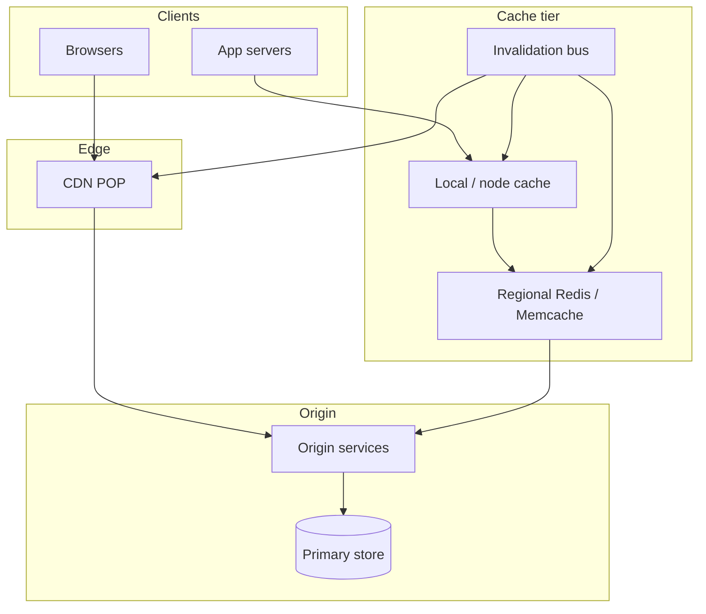

# Design a distributed cache / global content delivery layer

## Where this actually gets asked — with two attribution corrections

Mixed sourcing, with two specific corrections worth disclosing rather than smoothing over.
**Microsoft** is the best-sourced of the six for this topic — DesignGurus frames "Design a
Distributed Caching Solution" as a Microsoft question referencing Azure Cache for Redis, and a
Microsoft-tagged Glassdoor question set includes general distributed-cache framing — moderate
confidence, secondary-aggregator sourcing rather than a raw verified quote. **A real Google
Glassdoor question does exist, but it's "Implement an LRU cache"** — that's a coding-round data-
structure question, not a distributed-systems-round question, and should not be conflated with
this entry's scope. **The one solid, specific Glassdoor citation found for "Design a distributed
cache" is attributed to Amazon (SDE-3)** — not one of this repo's six companies — worth citing as
evidence the question genuinely circulates in FAANG-style loops broadly, but not claimable as
one of the six without further verification. What's unusually strong here is the real-system
grounding: Meta's own paper, ["Scaling Memcache at Facebook"](https://www.usenix.org/conference/nsdi13/technical-sessions/presentation/nishtala)
(Nishtala et al., NSDI 2013), is a genuine, primary, Facebook-authored USENIX paper — the gold
standard of real-world grounding found anywhere in this repo's research. Meta's TAO paper
(USENIX ATC 2013) is also directly relevant for the caching-tier-over-database pattern.

## Requirements

**Functional**
- Serve frequently-accessed data with much lower latency than hitting the backing database/
  origin every time.
- Support cache invalidation when the underlying data changes, so clients don't see stale data
  indefinitely.
- Scale reads far beyond what the backing store alone could sustain.

**Non-functional**
- Cache hit rate matters enormously — a low hit rate means most requests still hit the
  expensive backing store, defeating the cache's purpose.
- Must handle individual cache-server failure without a full cache-wide outage (a "thundering
  herd" of requests hitting the origin all at once when a cache node goes down is a real,
  documented failure mode).
- For a global/CDN-style layer specifically: content should be served from a location physically
  close to the requesting user, not always from one central region.

## Core entities

- **Cache entry**: a key, its cached value, and a TTL (time-to-live) or explicit invalidation
  marker.
- **Cache cluster/pool**: a set of cache servers, with a consistent-hashing scheme determining
  which server owns which keys.
- **Origin/backing store**: the source of truth a cache miss falls back to.
- **Edge location** (for the CDN variant): a geographically distributed point-of-presence
  serving cached content close to users.

## API / interface
Auth: service identity for cache admin; CDN purge is dual-controlled in production.

```http
GET /v1/cache/{key}
→ 200 {"value":"...","hit":true,"ttl_remaining_sec":42}
→ 404 {"hit":false}

PUT /v1/cache/{key}
{"value":"...","ttl_sec":300,"tags":["user:42"]} → 200 {"stored":true}

DELETE /v1/cache/{key} → 200 {"deleted":true}
POST /v1/cache/invalidate
{"tags":["user:42"]} → 202 {"invalidation_id":"inv_..."}

POST /v1/cdn/purge
{"urls":["https://cdn.example/a.js"],"approver_id":"u_..."} → 202 {"purge_id":"pg_..."}

GET /v1/cache/stats
→ {"hit_ratio":0.93,"evictions_per_min":120,"replication_lag_ms":5}
```

Staff+ callout: tag-based invalidation + CDN purge are separate APIs with different blast radii.


## High-level design



## Deep dive 1: cache invalidation strategy

| Approach | Staleness window | Complexity | When it's the right call |
|---|---|---|---|
| TTL-only (no explicit invalidation) | Bounded by TTL, can serve stale data until expiry | Lowest | Data where brief staleness is acceptable |
| Write-through invalidation (update/invalidate cache on every write) | Minimal — cache reflects writes near-immediately | Medium | Data where correctness after a write matters, and write volume is manageable |
| Write-behind / async invalidation | Some staleness window while invalidation propagates | Medium-high | High write-throughput systems where synchronous invalidation would add unacceptable write latency |

**Common mistake at the mid/senior level:** proposing TTL-only invalidation as the complete
answer without addressing that a write followed by an immediate read (a very common real
pattern — a user updates something and expects to see the update reflected right away) can
still return stale data for the remainder of the TTL window, unless writes trigger explicit
invalidation.

## Deep dive 2: the real cross-region/cross-cluster scaling problem — Meta's documented approach

Meta's own "Scaling Memcache at Facebook" paper describes the real problem at a scale most
system-design answers never reach: a single cache cluster isn't enough — the real architecture
scales across multiple axes: within a cluster (consistent hashing across many memcached
servers), across clusters in the same region (a "regional pool" reducing redundant cache misses
across clusters), and across regions entirely (replicating cached data closer to users while
handling cross-region invalidation consistency, which is a genuinely hard problem — an
invalidation in one region needs to propagate to others without either being so slow that stale
data lingers cross-region, or so synchronous that it adds unacceptable latency to every write).
**This is the kind of concrete, multi-axis scaling reasoning that separates a Staff+/Principal
answer from a senior one that stops at "add a consistent-hashed cache cluster."**

## Deep dive 3: the thundering herd problem

When a popular cache entry expires or a cache node fails, many concurrent requests can suddenly
all miss the cache simultaneously and hammer the origin at once — potentially overloading it
just as it was supposed to be protected by the cache. Real mitigations: a request-coalescing
mechanism (the first request that misses fetches from origin and populates the cache; concurrent
requests for the same key wait on that result rather than each independently hitting origin), or
staggered/jittered TTLs so popular entries don't all expire in the same instant.

## What's expected at each level

- **Mid-level:** proposes a single cache layer with TTL expiration, without addressing
  invalidation-after-write consistency or multi-cluster scaling.
- **Senior:** identifies write-triggered invalidation as necessary alongside TTL, and proposes
  consistent hashing for distributing keys across cache servers.
- **Staff+:** designs for cross-cluster/cross-region cache scaling explicitly (regional pools,
  cross-region invalidation propagation), matching the real scale Meta's own published
  architecture operates at.
- **Principal:** additionally addresses the thundering-herd failure mode with a concrete
  mitigation (request coalescing, jittered TTLs) and can reason about the cost/consistency
  trade-off of synchronous vs. asynchronous cross-region invalidation explicitly.

## Follow-up questions to expect

- "What happens when an entire cache cluster goes down?" (Answer: this is exactly the
  thundering-herd scenario at cluster scale — the origin needs to survive a sudden full-traffic
  hit, which argues for either request coalescing/rate-limiting in front of the origin, or a
  gradual cache-warming strategy rather than an instant full-traffic cutover to a cold cache.)
- "How would a CDN's edge-caching differ from an application-level cache like Memcache?" (Answer:
  a CDN caches at the network edge, closest to users geographically, typically for largely
  static or infrequently-changing content (images, static assets); an application-level cache
  like Memcache sits close to the application/database tier, caching computed or queried data
  that changes more dynamically — different placement in the stack for a related but distinct
  latency problem.)

## Related

- [coding/01: LRU cache with concurrency](../coding/01-lru-cache-with-concurrency.md) — coding-round sibling (local LRU); this entry stays distributed cache/CDN
- [coding/08: Debug broken cache eviction](../coding/08-debug-broken-cache-eviction.md) — debug/extend style on eviction bugs
- [general-system-design/03: News feed / ranking system](03-news-feed-ranking-system.md) — the feed-cache layer that depends on this entry's caching design
- [ai-system-design/01: LLM inference serving at scale](../ai-system-design/01-llm-inference-serving-at-scale.md) — prefix/KV caching as the AI-specific analog of this entry's caching problem
