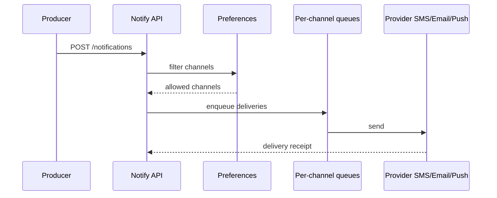
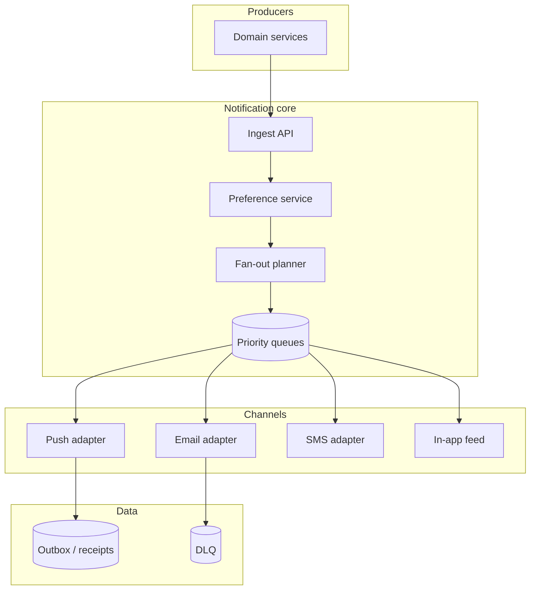

# Design a notification system


<!-- question-variants:v1 -->

## Expected question

"Design a notification system. How do you deliver push, email, SMS, and in-app notifications reliably with user preferences and rate limits?"

## Variant forms

Interviewers often ask the same design with different framing — recognize the archetype:

- "Design Uber-style trip notifications across push, SMS, and email with fallbacks."
- "How do you send 1B push notifications for a marketing campaign without burning deliverability?"
- "Design user preference center: quiet hours, channel opt-in, topic subscriptions."
- "Our notifications duplicated — architect idempotency and deduplication keys."
- "Design priority: transactional alerts bypass marketing throttles."
- "How do you template and localize notifications for 40 languages?"
- "Design delivery analytics: sent, delivered, opened, failed — with retry policies."

## Where this actually gets asked

Top-tier classic system-design question at Amazon, Meta, and most big-tech loops: multi-channel
notifications (push, email, SMS, in-app) with fan-out, preferences, and reliability. Not AI-specific;
still appears in Staff loops as an operational-depth probe.

## Requirements

**Functional**
- Accept notification events from producers (order shipped, mention, security alert).
- Deliver via user-preferred channels with templates.
- Honor quiet hours, per-category opt-outs, and frequency caps.
- Support digests (batch) and realtime (immediate) priorities.

**Non-functional**
- At-least-once delivery with idempotent providers; no silent drops for security alerts.
- Fan-out to millions of recipients for one event (celebrity / flash sale) without melting producers.
- Per-channel retries, DLQ, and observability.
- P99 enqueue latency low; end-to-end delivery SLO varies by priority.

## Core entities

- **Notification request**: idempotency_key, user_id(s) or segment, template_id, priority, payload.
- **Preference**: user_id, channel, category, enabled, quiet_hours.
- **Delivery attempt**: channel, provider_message_id, status, attempt_n.
- **Template**: localized body, required variables, channel constraints.

## API / interface

```http
POST /v1/notifications
Idempotency-Key: <uuid>
{ "user_id":"u_...", "category":"security", "template":"login_new_device",
  "data":{"device":"iPhone"}, "priority":"high" }
→ 202 { "notification_id":"n_..." }

POST /v1/notifications/bulk
{ "segment_id":"seg_...", "template":"sale_start", "priority":"normal" }
→ 202 { "campaign_id":"cmp_..." }

PUT /v1/users/{id}/preferences
{ "email":{"marketing":false,"security":true}, "push":{"mentions":true}, "quiet_hours":"22-07" }
→ 200

GET /v1/notifications/{id}
→ { "status":"delivered|pending|failed", "attempts":[...] }
```

Staff+ callout: security category ignores marketing opt-outs; encode that in policy, not hope.

## Data Flow

Producer enqueues → preference filter → channel router → provider adapters → receipt/webhook updates status.



## High-level design

Maps to **functional** requirements from step 1 — the component architecture that makes the API and data flow real.



Deep dives below target **non-functional** requirements (latency, scale, failure, cost, security).

## Deep dive 1: fan-out at scale

For 1:N campaigns, do not expand millions of rows synchronously in the producer. Use segment
materialization + chunked workers, or write-fanout to per-user inboxes for small N and read-fanout
for large N (same celebrity problem as feeds). Cap QPS to each provider; smooth with token buckets.

## Deep dive 2: reliability semantics

Idempotency keys at ingest; provider-level dedupe. Retries with exponential backoff + jitter; DLQ
after N. Critical alerts: fail closed on preference store outage (still attempt security email);
marketing: fail open to skip is acceptable. Track provider SLA breaches separately.

## Deep dive 3: preference and abuse

Frequency caps prevent notification fatigue and SMS cost blowups. Quiet hours defer normal priority
but not security. Rate-limit producers that spam a single user.

## Deep dive 4: delivery SLOs and provider circuit breaking

Track `queued → sent → delivered → bounced` per notification; set SLOs by priority (security:
minutes; marketing: hours). On provider degradation, **circuit-break** — stop global retry storms,
use capped backoff, and only cross-channel fallback where policy allows. In 45 minutes, cover
fan-out + preferences + idempotency + one provider-failure story.

## What's expected at each level

- **Mid-level:** one queue → email API.
- **Senior:** multi-channel + preferences + retries.
- **Staff+:** fan-out strategy, idempotency, priority vs quiet hours, DLQ/ops.
- **Principal:** provider cost economics, abuse, and cross-region delivery SLOs.

## Follow-up questions to expect

- "How do you digests work?" (Windowed aggregation worker per user/category.)
- "User disables push mid-campaign?" (Preference check at send time, not only enqueue.)

## Related

- [04 Distributed job scheduler](04-distributed-job-scheduler-task-queue.md)
- [02 Realtime chat](02-realtime-chat-messaging-at-scale.md)
- [01 Distributed rate limiter](01-distributed-rate-limiter.md)
- [18 Event-driven architecture with Kafka](18-event-driven-architecture-with-kafka.md)
