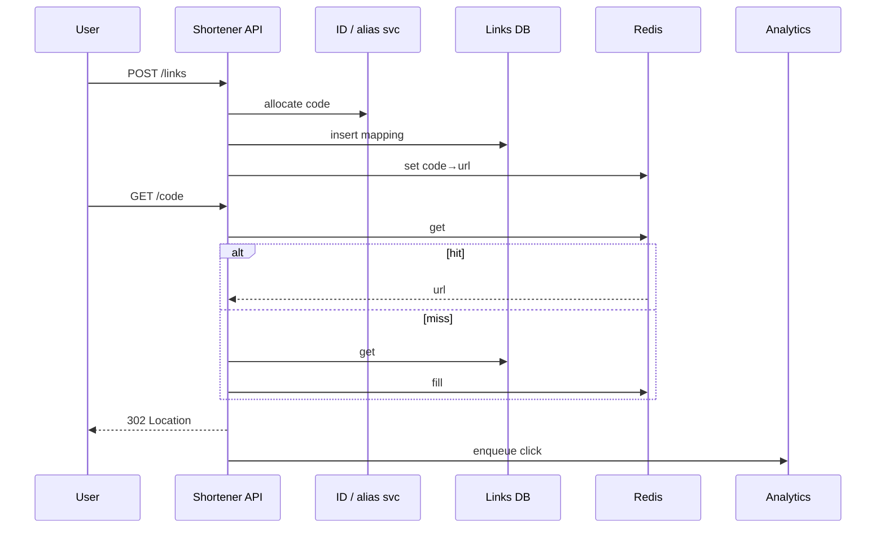
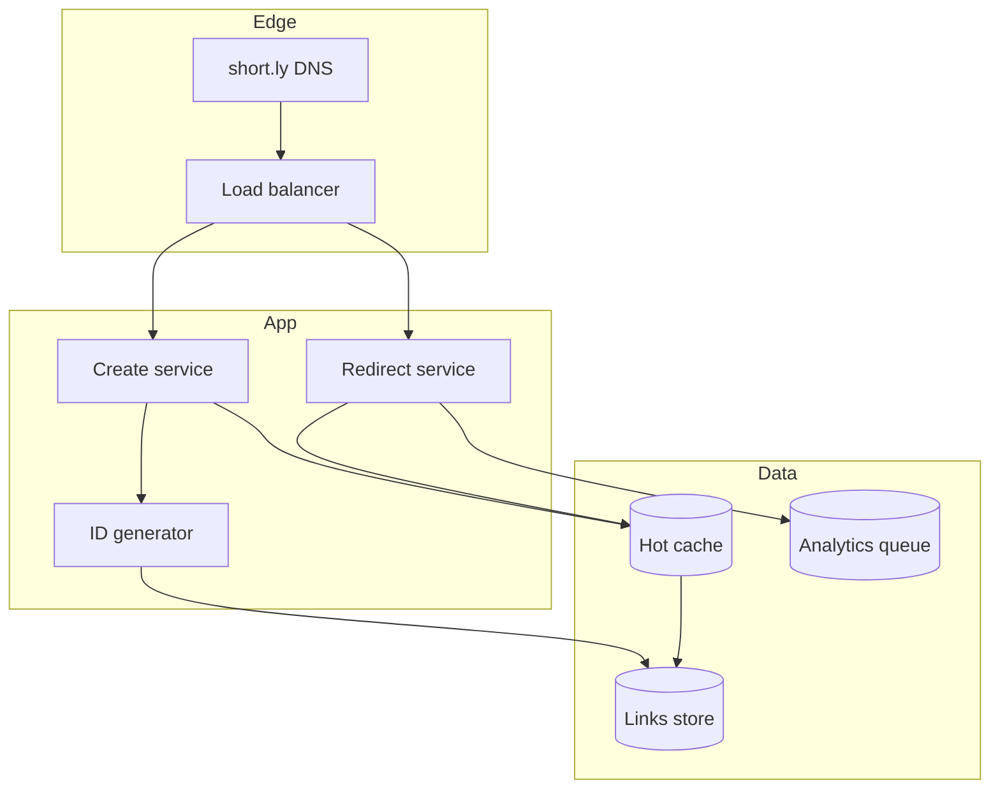

# Design a URL shortener


<!-- question-variants:v1 -->

## Expected question

"Design a URL shortener (bit.ly-style). How do you generate short codes, redirect with low latency, and track analytics at scale?"

## Variant forms

Interviewers often ask the same design with different framing — recognize the archetype:

- "Design a URL shortener for 100M new links/month and 10B redirects/month."
- "How do you generate short codes — hash, counter, or random — and avoid collisions?"
- "Design custom branded domains per enterprise customer."
- "Our short links were used for malware — architect abuse detection and takedown."
- "How do you expire links and support UTM analytics without slowing redirects?"
- "Design read-heavy redirect path with <10ms P99 globally."
- "Scale the analytics pipeline separately from the redirect hot path."

## Where this actually gets asked

Canonical warm-up / screening system-design question (Bitly-style) across Google, Amazon, Meta,
and startups. Often used before a harder follow-up in the same loop. Staff+ depth: ID generation,
read-heavy caching, 301 vs 302, analytics, and abuse.

## Requirements

**Functional**
- Create a short code for a long URL; optional custom alias and TTL.
- Redirect short URL to long URL quickly.
- Basic click analytics (count, optional referrer/country aggregates).

**Non-functional**
- Extremely read-heavy (≈100:1); redirects P99 < 10–50ms with cache.
- Unique short codes; no collisions serving wrong destinations.
- High availability for redirects even if write path is degraded.
- Abuse: malware URLs, spam creation rate limits.

## Core entities

- **Link**: short_code, long_url, owner_id, created_at, expires_at, status.
- **Click event**: short_code, ts, metadata (coarse).
- **Alias reservation**: custom code lock during create.

## API / interface

```http
POST /v1/links
Authorization: Bearer <token>
{ "url":"https://example.com/very/long", "custom_code?":"launch", "ttl_days?":90 }
→ 201 { "code":"aB3xY9", "short_url":"https://short.ly/aB3xY9" }
→ 409 alias_taken | 400 invalid_url

GET /{code}
→ 302 Location: <long_url>  (or 301 if immutable / analytics-light)
→ 404 | 410 gone

GET /v1/links/{code}/stats
→ { "clicks":123456, "by_day":[...] }
```

Staff+ callout: say whether redirects are 301 (cacheable, weaker analytics) or 302 (accurate counts).

## Data Flow

Create allocates code → persist mapping → cache. Redirect reads cache then DB; async click log.



## High-level design

Maps to **functional** requirements from step 1 — the component architecture that makes the API and data flow real.



Deep dives below target **non-functional** requirements (latency, scale, failure, cost, security).

## Deep dive 1: ID generation

Base62 encode a counter (Snowflake-style or pre-generated ranges per instance) beats hash-and-retry
for uniqueness at scale. Custom aliases need a reservation transaction. See also
[05](05-distributed-unique-id-generator.md).

## Deep dive 2: cache and 301/302

Cache long URLs by code with TTL; negative-cache 404 briefly. 301 lets browsers/CDNs cache forever —
cheap but bad for accurate analytics and destination changes. 302 + async analytics is the usual
product choice for Bitly-like services.

## Deep dive 3: abuse

Rate-limit creates per owner/IP; scan destinations against malware lists asynchronously (mark
suspended). Cap custom alias namespace squatting.

## Deep dive 4: viral hot links and create-path races

Shard by `short_code`; a viral link can melt one shard — edge/CDN cache + read replicas + redirect
rate limits. Custom aliases need transactional uniqueness; if DB write succeeds and cache fill
fails, a reconcile job must repair (avoid redirect 404). In 45 minutes, IDs + cache + 301/302 is
the core; analytics is async.

## What's expected at each level

- **Mid-level:** hash URL, store map, redirect.
- **Senior:** Base62 IDs, cache, basic stats.
- **Staff+:** collision-free ID ranges, 301/302 trade-off, write/read HA split, abuse.
- **Principal:** global replication strategy and analytics cost at 100B redirects/day.

## Follow-up questions to expect

- "How long are codes?" (62^7 ≈ 3.5T; size for capacity + years.)
- "Can destinations change?" (If yes, forbid 301 or purge CDN.)

## Related

- [05 Distributed unique ID generator](05-distributed-unique-id-generator.md)
- [07 Distributed cache / CDN](07-distributed-cache-cdn-layer.md)
