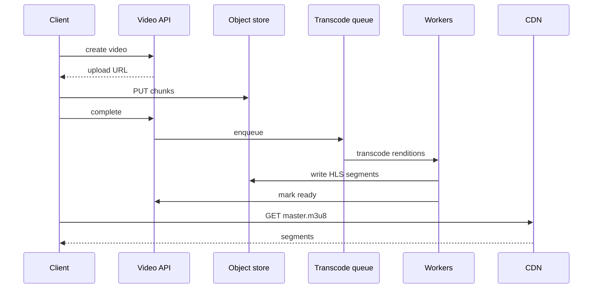
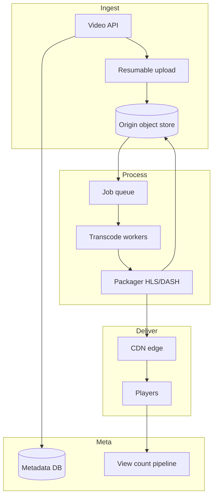

# Design a video streaming platform

## Where this actually gets asked

Classic hard system-design (YouTube/Netflix-style): upload, transcode, CDN delivery, adaptive
bitrate. Appears at Netflix, Google, Meta; Staff+ probes encoding pipelines and global delivery cost.

## Requirements

**Functional**
- Upload video (resumable); process into multiple renditions.
- Playback with adaptive bitrate (HLS/DASH).
- Metadata: title, thumbnails, visibility; basic view counts.
- Optional: live streaming as a follow-up (different design — call out).

**Non-functional**
- Upload reliability for multi-GB files; processing async.
- Startup time and rebuffering SLOs globally via CDN.
- Storage cost dominates — lifecycle cold storage for rarely watched.
- Copyright / abuse takedown path.

## Core entities

- **Video asset**: id, owner, status (uploading|processing|ready|failed), duration.
- **Rendition**: resolution, bitrate, codec, object_uri, playlist_uri.
- **Playback session**: user, CDN edge, chosen rendition ladder.
- **Processing job**: ffmpeg pipeline steps, retries.

## API / interface

```http
POST /v1/videos
{ "title":"...", "visibility":"public" }
→ 201 { "video_id":"v_...", "upload":{"url":"https://upload/...","method":"PUT"} }

PUT upload URL (chunked / resumable)
→ 200

POST /v1/videos/{id}/complete-upload
→ 202 { "status":"processing" }

GET /v1/videos/{id}
→ { "status":"ready", "playback_url":"https://cdn/.../master.m3u8", "thumbnails":[...] }

GET /v1/videos/{id}/analytics
→ { "views":..., "watch_time_sec":... }
```

Staff+ callout: separate **upload/origin** from **playback CDN** trust boundaries.

## Data Flow

Client uploads to object storage → complete → transcoder workers produce renditions + HLS playlist
→ publish to CDN → player fetches ABR ladder; views counted asynchronously.



## High-level design

Maps to **functional** requirements from step 1 — the component architecture that makes the API and data flow real.



Deep dives below target **non-functional** requirements (latency, scale, failure, cost, security).

## Deep dive 1: transcode pipeline

Parallelize per-rendition; idempotent jobs; dead-letter poison files. GOP alignment matters for ABR
switching. Thumbnails and previews are separate cheap jobs.

## Deep dive 2: CDN and ABR

Pre-warm popular titles; origin shield to protect object store. Player picks rung by bandwidth;
measure rebuffer ratio as the product SLO, not just CDN hit rate. See cache/CDN patterns in
[07](07-distributed-cache-cdn-layer.md).

## Deep dive 3: cost and cold storage

Move cold videos to cheaper storage class; keep hot segments on CDN. Precompute vs just-in-time
transcode trade-off for long-tail catalogs.

## Deep dive 4: signed playback and origin protection

Private/unlisted playback uses short-lived **signed URLs** (upload creds ≠ playback creds). On CDN
cold start for a viral title, use origin shield + request coalescing so origin survives a global
miss storm — otherwise rebuffer SLOs die while "RTO" looks fine. In 45 minutes, upload→transcode→ABR;
live streaming is a separate follow-up.

## What's expected at each level

- **Mid-level:** upload to S3, play from URL.
- **Senior:** async transcode + CDN + HLS.
- **Staff+:** resumable upload, rendition parallelism, ABR/rebuffer SLOs, cost tiers.
- **Principal:** global capacity planning and live-vs-VOD split when asked.

## Follow-up questions to expect

- "Design live streaming instead?" (Ingest servers, low-latency HLS/WebRTC, different SLA.)
- "How do recommendations fit?" (Separate system — [../ai-system-design/06](../ai-system-design/06-multimodal-search-recommendation-system.md).)

## Related

- [07 Distributed cache / CDN](07-distributed-cache-cdn-layer.md)
- [04 Job scheduler](04-distributed-job-scheduler-task-queue.md)
