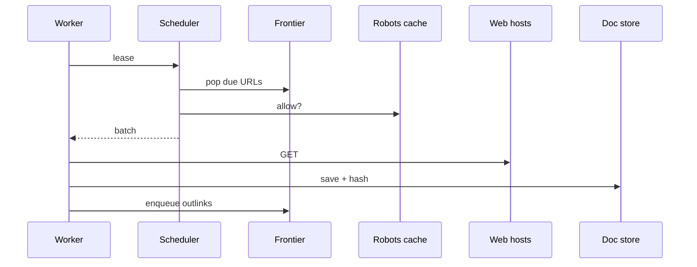
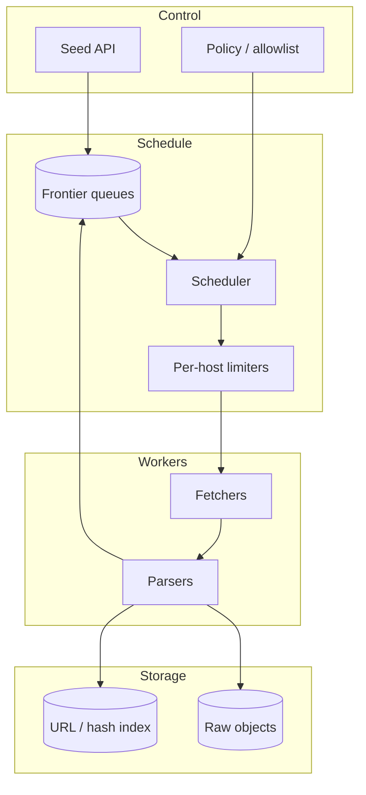

# Design a web crawler


<!-- question-variants:v1 -->

## Expected question

"Design a web crawler. How do you discover URLs, fetch politely, deduplicate, store, and scale crawling without overloading target sites?"

## Variant forms

Interviewers often ask the same design with different framing — recognize the archetype:

- "Design a search-engine crawler for billions of pages with politeness policies."
- "How do you prioritize fresh vs important pages when crawl budget is finite?"
- "Design distributed crawling with URL frontier sharding and dedup."
- "Our crawler got blocked — architect rate limits, robots.txt, and backoff per domain."
- "How do you detect and handle duplicate/near-duplicate content at crawl time?"
- "Design a recrawl scheduler based on page change frequency signals."
- "Architect storing raw HTML vs extracted text for downstream indexing."

## Where this actually gets asked

Reported in OpenAI and general Staff system-design loops as "design a polite web crawler" or
"crawl the web at scale." Tests frontier queues, politeness, dedupe, and parser pipelines — not AI
per se, but often paired with training-data / RAG ingest discussions.

## Requirements

**Functional**
- Given seed URLs, discover and fetch pages continuously.
- Extract links; respect robots.txt and crawl-delay.
- Store raw + parsed content; emit change detection.
- Prioritize important / fresh URLs.

**Non-functional**
- Politeness: per-host rate limits; no accidental DDoS.
- Scale to billions of URLs; exactly-once-ish fetch semantics via dedupe.
- Fault tolerant workers; poison URL isolation.
- Legal/ToS constraints — stay in allowed domains when scoped.

## Core entities

- **URL frontier**: prioritized queue of URLs to fetch with next_fetch_at.
- **Host lease**: per-domain token bucket / crawl-delay state.
- **Document**: content_hash, fetched_at, canonical_url, outlinks[].
- **Robots rules**: cached per host with TTL.

## API / interface

Control-plane APIs for operators; workers pull work.

```http
POST /v1/seeds
{ "urls":["https://example.com"], "scope":"domain" }
→ 202

POST /v1/workers/lease
{ "worker_id":"w1", "max":100 }
→ 200 { "items":[{"url":"...","headers":{...}}] }

POST /v1/workers/complete
{ "url":"...", "status":200, "content_hash":"...", "outlinks":["..."] }
→ 204

GET /v1/stats
→ { "frontier_size":..., "fetch_qps":..., "robots_blocked":... }
```

Staff+ callout: politeness is a **correctness** requirement, not an optimization.

## Data Flow

Seeds → frontier → host-polite scheduler → fetch → parse → dedupe store → enqueue outlinks.



## High-level design

Maps to **functional** requirements from step 1 — the component architecture that makes the API and data flow real.



Deep dives below target **non-functional** requirements (latency, scale, failure, cost, security).

## Deep dive 1: frontier and prioritization

Multiple priority queues (news > static). Consistent hashing of hosts to crawlers reduces per-host
coordination. Bloom filter / URL store prevents re-crawl storms; content_hash detects unchanged pages.

## Deep dive 2: politeness and robots

Cache robots.txt; default deny on fetch failure of robots for strict modes. Per-host token buckets;
global QPS caps. Separate political/legal allowlists for enterprise crawlers.

## Deep dive 3: parser safety

Sandbox HTML parsers; size limits; no executing JS by default (or isolated headless pool with
strict budgets). Connects to training-data provenance when crawl feeds models
([../ai-system-design/12](../ai-system-design/12-training-data-provenance-and-ip-risk-architecture.md)).

## Deep dive 4: canonicalization and lease-based frontier

Normalize URLs before frontier insert (host, slash, tracking params, redirects, `rel=canonical`)
or you either storm duplicates or miss pages. Workers **lease** URLs with visibility timeout
(same pattern as job queues) so death doesn't lose work or politeness state. In 45 minutes, cover
frontier + politeness + dedupe; JS-rendering is an expensive optional tier.

## What's expected at each level

- **Mid-level:** queue of URLs + HTTP GET + store.
- **Senior:** robots, per-host limits, link extraction.
- **Staff+:** frontier priority, dedupe, failure isolation, scale partitioning.
- **Principal:** legal scope, cost of refresh policies, interaction with downstream training/RAG.

## Follow-up questions to expect

- "How do you crawl JS-heavy sites?" (Optional headless tier; expensive — budget it.)
- "How do you avoid traps?" (Max depth, calendar traps, checksum loops.)

## Related

- [04 Job scheduler](04-distributed-job-scheduler-task-queue.md)
- [../ai-system-design/12 Training data provenance](../ai-system-design/12-training-data-provenance-and-ip-risk-architecture.md)
