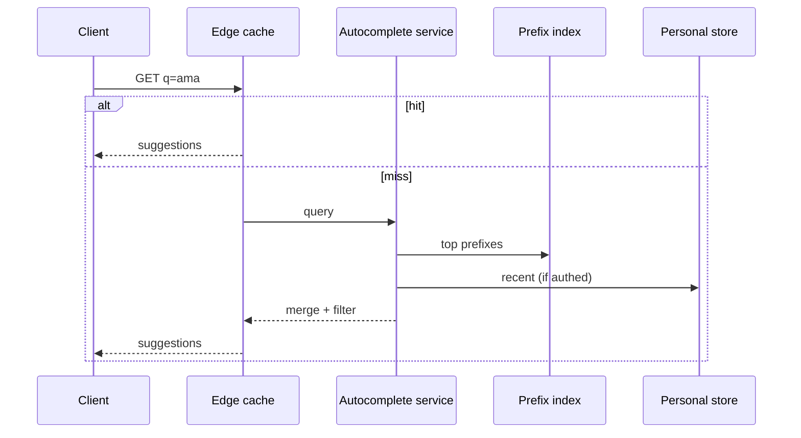
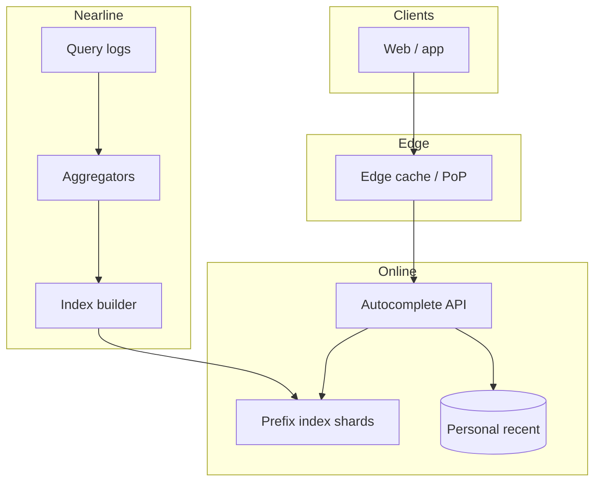

# Design search autocomplete / typeahead


<!-- question-variants:v1 -->

## Expected question

"Design a search autocomplete system. How do you serve prefix suggestions with low latency at high QPS, keep them fresh, and personalize without leaking private queries?"

## Variant forms

Interviewers often ask the same design with different framing — recognize the archetype:

- "Design Google-style search suggestions as the user types."
- "How do you rank autocomplete when two prefixes share millions of queries?"
- "Design typeahead for an e-commerce catalog with product + query suggestions."
- "Our suggestions show another user's private search — architect isolation."
- "Scale autocomplete to 100k QPS with P99 under 50ms."
- "How do you handle typos and fuzzy prefix match?"
- "Design personalization (recent searches) vs global popularity."
- "How fast do new trending queries appear in suggestions?"

## Where this actually gets asked

Canonical high-frequency classic system-design prompt (Google/Amazon/Meta/Microsoft screening and
mid rounds). Often paired with rate limiter or feed questions. Staff+ depth: trie/segment trees vs
inverted indexes, offline aggregation vs online personalization, privacy, and freshness.

## Requirements

**Functional**
- Given a prefix, return top-k suggestions (queries and/or entities).
- Optional: personal recent searches, trending boosts, locale.
- Suppress unsafe / banned suggestions.

**Non-functional**
- Extremely low latency: P99 often <30–50ms including network to edge.
- Very high read QPS; write path is aggregated, not per-keystroke DB writes.
- Privacy: never suggest another user's private or authenticated-only queries.
- Freshness: new viral queries appear in minutes–hours, not weeks.

## Core entities

- **Suggestion**: text, type (query|product|user), score components, locale.
- **Prefix entry**: prefix → ranked posting list (capped).
- **Query aggregate**: query string, frequency windows (1h/1d/7d), filtered flags.
- **Personal store**: per-user recent searches (small, private).

## API / interface

```http
GET /v1/autocomplete?q=ama&locale=en-US&limit=8
Authorization: optional Bearer (personalization)
→ 200 { "suggestions":[{"text":"amazon","score":0.92},{"text":"amazon prime","score":0.88}] }

POST /v1/autocomplete/admin/suppress
{ "text":"...", "reason":"unsafe" }
→ 204
```

Staff+ callout: client debounces; server still needs cache + cheap prefix structures — do not hit OLTP per keystroke.

## Data Flow

Keystroke → edge cache → prefix index → blend global + personal → filter → respond;
offline/nearline jobs aggregate query logs into prefix lists.



## High-level design



Deep dives below target **non-functional** requirements (latency, scale, failure, cost, security).

## Deep dive 1: data structure choice

In-memory **tries** (or compressed prefix maps) per shard hold top-k per prefix — optimal for
strict prefix. For huge alphabets / fuzzy, use n-gram or AQ (approximate) indexes with higher
latency. Cap posting lists (e.g., top 50) at build time so reads are O(k). Shard by prefix hash
or first character ranges; hot prefixes ("a", "how") need replication.

## Deep dive 2: ranking and freshness

Score = f(frequency windows, CTR on suggestion, personal match, freshness boost). Use time-decayed
counts so yesterday's spike fades. Trending pipeline (minutes) updates a small overlay index;
full rebuild hourly/daily. Personalization: blend 1–2 personal hits at the top only if prefix
matches — never show another user's history.

## Deep dive 3: privacy and abuse

Authenticated recent-search is per-principal storage with strict ACL. Global index only includes
queries above anonymity thresholds (min distinct users). Suppress porn/illegal/PII-like patterns.
Rate-limit suggestion analytics writes. Cache keys must not embed raw user ids in shared CDN
entries for personalized responses (cache global separately from personal).

## Deep dive 4: failure and 45-min focus

If aggregator lags, serve stale global index + personal — still better than empty. Under overload,
reduce k and disable personalization. In 45 minutes: prefix index + top-k cap + aggregation pipeline
+ privacy threshold — not ML query rewriting unless asked.

## What's expected at each level

- **Mid-level:** SQL `LIKE 'ama%'` or simple cache.
- **Senior:** trie / prefix index + top-k by frequency + client debounce.
- **Staff+:** sharded in-memory index, nearline aggregation, anonymity thresholds, personal vs global
  cache split, P99 budget.
- **Principal:** trending overlay, abuse/suppression ops, multi-locale sharding, and CTR feedback
  without privacy leaks.

## Follow-up questions to expect

- "Typos?" (Fuzzy layer or separate spell-correct before autocomplete; watch latency.)
- "How do you update top-k?" (Recompute offline; atomic swap of prefix lists.)
- "Ajax storm?" (Debounce 20–50ms client-side; coalesce identical prefixes server-side.)

## Related

- [03 News feed ranking](03-news-feed-ranking-system.md)
- [07 Distributed cache / CDN](07-distributed-cache-cdn-layer.md)
- [01 Distributed rate limiter](01-distributed-rate-limiter.md)
