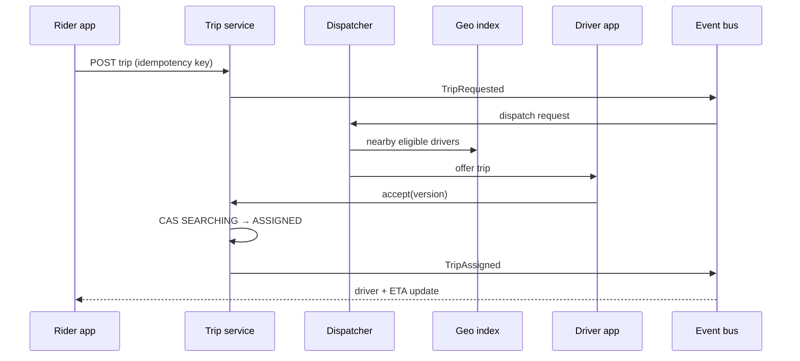
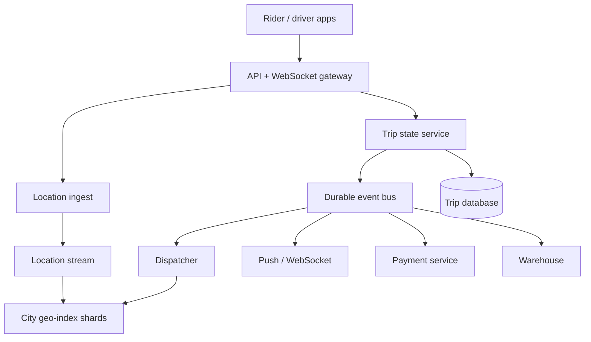

# Design a ride-sharing service (Uber-style)


<!-- question-variants:v1 -->

## Expected question

"Design a ride-sharing service (Uber-style). How do you match riders and drivers, maintain accurate ETAs, price rides, and keep trip state correct at city scale?"

## Variant forms

Interviewers often ask the same design with different framing — recognize the archetype:

- "Design Uber for a city with 1M daily rides and 100k concurrently online drivers."
- "How do you find the nearest available driver without querying every driver?"
- "Design dispatch for ride requests where drivers continuously move."
- "Our pickup ETAs are inaccurate during rush hour — how would you improve them?"
- "How do you calculate surge pricing without creating a feedback loop?"
- "Design driver location updates at 1–5 second intervals."
- "How do you prevent two riders from being assigned the same driver?"
- "Design the lifecycle from request through cancellation, completion, and payment."

## Where this actually gets asked

Canonical marketplace / real-time-location system-design prompt in consumer marketplace and logistics
interviews. It tests geo indexing, asynchronous workflows, and product trade-offs more than perfect
route planning. Staff+ depth: partitioning cities, dispatch correctness, price explainability, and
degraded behavior when location or maps are stale.

## Requirements

**Functional**
- Riders request, cancel, track, and pay for a trip.
- Drivers go online/offline, publish location, accept/decline, and complete trips.
- Match an eligible nearby driver and return pickup ETA and fare estimate.
- Calculate dynamic pricing; notify both sides of state changes.

**Non-functional**
- Driver location and trip state propagate in seconds; rider updates feel real time.
- Never assign one driver to two active trips; keep a durable trip history.
- Handle city-level bursts and localized hotspots; P99 matching under a few seconds.
- Protect precise location and payment data; tolerate delayed map or notification dependencies.

## Core entities

- **Driver**: driver_id, availability, vehicle, current_cell, location_ts, eligibility.
- **Rider**: rider_id, payment_profile, rating, current_trip_id.
- **Trip**: trip_id, rider_id, driver_id, state, pickup, destination, quoted_fare, version.
- **Location event**: driver_id, lat/lon, heading, timestamp, sequence.
- **Supply/demand window**: geo_cell, service_type, time bucket, requested, available, multiplier.

## API / interface

```http
POST /v1/trips
Idempotency-Key: 6ed...
{ "pickup":{"lat":37.78,"lon":-122.41}, "destination":{"lat":37.76,"lon":-122.43}, "product":"standard" }
→ 202 { "trip_id":"t_123", "state":"SEARCHING", "fare_quote":{"min":14,"max":18,"currency":"USD"} }

POST /v1/drivers/me/location
{ "lat":37.781,"lon":-122.412, "heading":90, "seq":812 }
→ 204

POST /v1/trips/t_123/accept
{ "trip_version":3 }
→ 200 { "state":"DRIVER_EN_ROUTE" }

GET /v1/trips/t_123
→ 200 { "state":"DRIVER_EN_ROUTE", "driver_location":{...}, "eta_seconds":180 }
```

Staff+ callout: acceptance is a conditional state transition, not a best-effort notification; use
`trip_version` or a transactional compare-and-set to reject a stale second accept.

## Data Flow

The rider request is durably created, then a city dispatcher finds candidates from a geo index and
offers sequentially or in a controlled batch. Location is a high-rate ephemeral stream; trip events
are durable and drive notifications, payment, and analytics.



## High-level design

Maps to **functional** requirements: a control plane owns durable trips and assignment, while a
regional real-time plane maintains driver availability and location. Payments and notifications
consume trip events rather than extending dispatch latency.



Deep dives below target **non-functional** requirements (real-time latency, correctness, scale,
privacy, and cost).

## Deep dive 1: geo index and location ingestion

At 100k active drivers sending one update every 3 seconds, ingest is about 33k events/sec before
replication. Store the latest location in a memory-oriented geo service, not the trip OLTP database.
Geohash cells are easy to shard and query by expanding neighboring cells; a quadtree adapts better
to dense downtown areas. Use a cell precision around 5–7 (hundreds of meters to a few km), then
rank exact coordinates by road ETA.

| Choice | Strength | Cost / risk |
|---|---|---|
| Geohash grid | Simple key partitioning and neighbor lookup | Uneven density and border expansion |
| Quadtree | Splits dense cells adaptively | More complex rebalance and routing |
| Road-network index | Better candidate quality | Expensive; still needs coarse prefilter |

Discard out-of-order `seq` events, mark drivers stale after e.g. 15 seconds, and use a TTL so dead
clients leave supply automatically. Location history goes asynchronously to cold storage with access
controls; dispatch only needs the latest point.

## Deep dive 2: matching and the trip state machine

Expand search rings until enough candidates exist, filter by product, vehicle capability, driver
state, and route direction, then rank by predicted pickup ETA rather than crow-flies distance.
Offer one driver first for fairness and lower duplicate work, or a small batch with short leases
when acceptance is poor. A 10-second offer lease expires safely.

```text
REQUESTED → SEARCHING → ASSIGNED → DRIVER_EN_ROUTE → ARRIVED
→ IN_PROGRESS → COMPLETED → PAID
                 ↘ CANCELLED
```

The authoritative transition is `UPDATE trips SET driver_id=?, state='ASSIGNED', version=version+1
WHERE id=? AND state='SEARCHING' AND version=?`. If it affects zero rows, the driver lost a race or
the rider cancelled. Publish an outbox event in the same transaction; consumers are at-least-once
and deduplicate by trip/event id.

## Deep dive 3: ETA and surge pricing

Route engines provide a baseline travel time; ETA models add recent road speeds, pickup friction,
driver heading, weather, and map confidence. Recompute on meaningful movement or every 15–30 seconds,
not on every GPS point. Show a range when uncertainty is high.

Surge uses smoothed supply/demand by city cell and product over short windows, with minimum sample
sizes and caps. Avoid pricing off raw instantaneous counts: driver app updates and rider retries can
create oscillation. Quote and persist the multiplier/version at booking; a later surge change must
not silently alter a rider's accepted quote.

## Deep dive 4: failure modes and multi-region scope

Partition operationally by city/region so dispatch stays local; replicate durable trip records for
DR, but do not synchronously coordinate a driver between distant cities. If the geo index is lost,
rebuild from live location heartbeats and temporarily widen search. If maps are down, use straight-line
fallback ETA labeled low confidence. If push delivery fails, apps poll trip state.

Prevent split-brain availability with a driver session lease owned by one city shard. A driver crossing
a boundary transfers only when idle, or the active trip retains its original shard. In 45 minutes,
make state transitions and geo candidate lookup explicit before discussing ML dispatch optimization.

## What's expected at each level

- **Mid-level:** store drivers, find nearby locations, describe request/accept/complete.
- **Senior:** geo cells, WebSockets, trip states, durable events, basic ETA and surge.
- **Staff+:** conditional assignment, stale-location handling, city partitioning, quote semantics,
  event/outbox consistency, and measurable latency budgets.
- **Principal:** marketplace incentives, cross-city operations, fairness, safety/compliance, and how
  dispatch, pricing, and supply programs are governed together.

## Follow-up questions to expect

- "Why not broadcast every request to every nearby driver?" (Offer fan-out burns attention and races.)
- "What if a driver accepts while the rider cancels?" (Conditional transition chooses one outcome.)
- "How do you support pooling?" (Match route-compatible trips; much harder state and ETA constraints.)
- "How accurate must a location be?" (Use confidence/staleness; never present false precision.)

## Related

- [01 Distributed rate limiter](01-distributed-rate-limiter.md)
- [02 Realtime chat / messaging](02-realtime-chat-messaging-at-scale.md)
- [08 Notification system](08-notification-system.md)
- [04 Distributed job scheduler](04-distributed-job-scheduler-task-queue.md)
