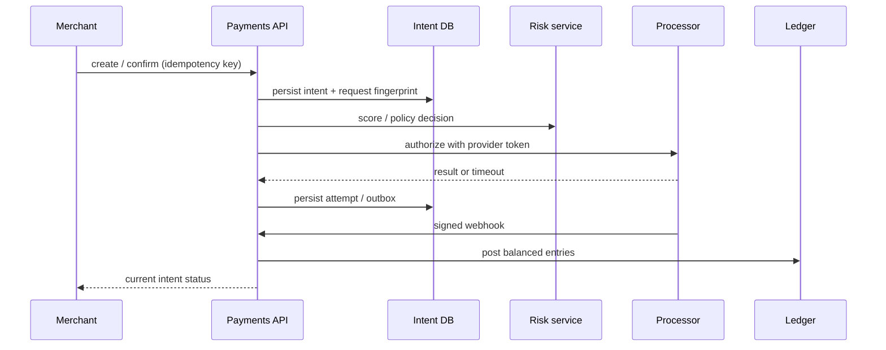
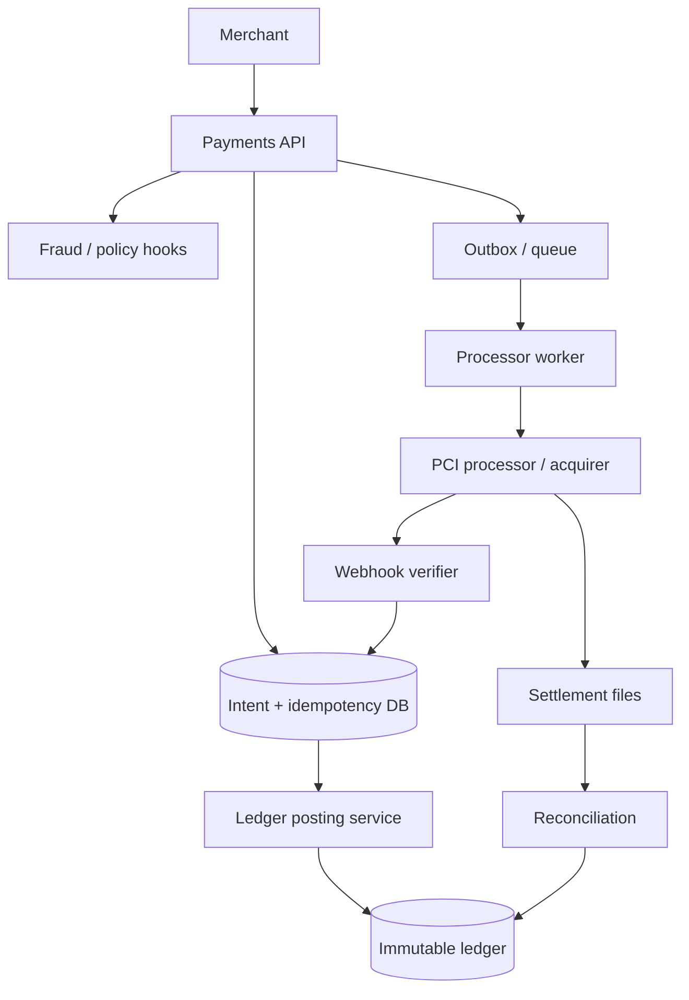

# Design a payment processing system


<!-- question-variants:v1 -->

## Expected question

"Design a payment processing system. How do you authorize and capture payments reliably, prevent duplicates, maintain a correct ledger, and reconcile with external payment networks?"

## Variant forms

Interviewers often ask the same design with different framing — recognize the archetype:

- "Design Stripe-like payment processing for merchants worldwide."
- "A client retries after a timeout — how do you guarantee they are not charged twice?"
- "Design card authorization, capture, refund, and chargeback workflows."
- "How do you build an immutable ledger for money movement?"
- "Our acquirer callback arrives twice and out of order — what is authoritative?"
- "How do you choose sagas versus distributed transactions for payments?"
- "Design daily reconciliation when processor settlement files disagree with your records."
- "Where do PCI controls begin and end in the architecture?"

## Where this actually gets asked

Common fintech and platform-system prompt; it appears anywhere a product has orders, subscriptions,
or payouts. A strong answer distinguishes an internal financial source of truth from external
processor outcomes. Staff+ depth: idempotency boundaries, double-entry invariants, operational
reconciliation, and the fact that card networks cannot participate in your database transaction.

## Requirements

**Functional**
- Create payment intents; authorize, capture, void, refund, and report payment status.
- Accept idempotent merchant requests and asynchronous processor webhooks.
- Keep a balanced immutable ledger and merchant balances.
- Expose fraud/risk checks and settlement/reconciliation operations.

**Non-functional**
- Never create duplicate financial effects; preserve a complete audit trail.
- Availability favors accepting safe intents, while ledger correctness is non-negotiable.
- PCI scope is minimized; sensitive card data is tokenized by a compliant provider.
- Recover from processor timeouts, retries, duplicates, delayed settlement, and partial failures.

## Core entities

- **Payment intent**: id, merchant_id, amount, currency, state, idempotency_key, version.
- **Payment attempt**: processor reference, method token, outcome, retry sequence.
- **Ledger entry**: account_id, debit/credit, amount, currency, event_id, posted_at.
- **Balance account**: merchant payable, platform fee revenue, processor clearing, customer receivable.
- **Reconciliation item**: external reference, expected amount, observed amount, status.

## API / interface

```http
POST /v1/payment_intents
Idempotency-Key: order-491-payment
{ "amount":4999, "currency":"USD", "payment_method":"pm_tok_...", "capture_method":"manual" }
→ 201 { "id":"pi_123", "status":"requires_confirmation" }
→ 200 { "id":"pi_123", "status":"authorized" }  # same idempotency key, same request
→ 409 idempotency_key_reused_with_different_payload

POST /v1/payment_intents/pi_123/confirm
→ 202 { "status":"processing" }

POST /v1/webhooks/acquirer
{ "event_id":"evt_9", "processor_payment_id":"abc", "status":"captured" }
→ 204
```

Staff+ callout: an HTTP 500 after sending to an acquirer is an **unknown outcome**, not permission
to resend a new charge. Persist the attempt reference, query/reconcile it, and make retries idempotent.

## Data Flow

The API creates an intent and idempotency record atomically. A worker executes the processor call;
webhooks and polling converge the intent state. Each accepted financial event posts balanced ledger
entries through one serialized ledger boundary.



## High-level design

Maps to **functional** requirements: the token vault/processor boundary handles card data; the
payments domain handles state; the ledger handles money. Queues decouple external calls and make
recovery explicit, but are never a substitute for ledger invariants.



Deep dives below target **non-functional** requirements (correctness, auditability, retries,
compliance, and operational recovery).

## Deep dive 1: idempotency and payment state

Store `(merchant_id, idempotency_key)` with a canonical request hash and the resulting intent id in
the same transaction as intent creation. Repeating the exact request returns the first result; a
different amount or currency returns 409. Scope idempotency by operation: create, confirm, capture,
and refund have distinct keys.

Use an explicit state machine: `requires_confirmation → processing → authorized → captured →
settled`, with terminal `failed`, `cancelled`, and dispute states. Transitions are conditional on
version/current state. Webhooks are signed, persisted by provider `event_id`, and deduplicated; they
may arrive late or out of order, so compare them against processor sequence/status precedence.

## Deep dive 2: ledger and double-entry correctness

An intent is workflow state, not the book of record. Post append-only journal lines where every
event balances per currency:

| Event | Debit | Credit |
|---|---|---|
| Capture $49.99 | processor clearing $49.99 | merchant payable $49.99 |
| Platform fee $1.50 | merchant payable $1.50 | fee revenue $1.50 |
| Payout $48.49 | merchant payable $48.49 | bank clearing $48.49 |

Require `sum(debits) = sum(credits)` inside one ledger transaction, immutable corrections rather
than updates, unique `event_id`, and a period-close process. Derived balance projections can be
eventually consistent; authorization to pay out must use a durable available-balance view.

## Deep dive 3: saga, 2PC, PCI, and fraud

Do not use 2PC with card networks: external processors do not expose a durable prepare/commit
participant, and holding locks across network calls harms availability. A saga persists each intent
step, retries safely, and uses compensation such as void/refund where possible. Some effects cannot
be undone (a completed settlement), so reconciliation is the final compensating control.

Keep PAN/CVV out of application logs, databases, queues, and traces. Browser/mobile tokenization
sends card data directly to a PCI-compliant provider; services retain only tokens, last four, and
provider references. Risk hooks may block, challenge (3DS), or review an attempt, but their timeout
policy must be explicit: fail closed for high-risk operations, not silently approve.

## Deep dive 4: reconciliation and failure handling

Reconcile daily settlement files and near-real-time provider APIs against internal attempts and
ledger postings by provider reference, amount, currency, and date. Classify missing, duplicate,
amount-mismatch, and late records; investigate in an operations queue, then post controlled
adjustments with audit approval. Never mutate history to make a report balance.

For a timeout after submit, retry with the same provider idempotency key if supported; otherwise
query by merchant reference before retrying. Circuit-break a failing processor and route only if
merchant contracts allow it. Measure unknown-outcome age, duplicate prevention rate, reconciliation
breaks, and ledger imbalance (which should be zero).

## What's expected at each level

- **Mid-level:** API, database, processor integration, basic retries.
- **Senior:** intent state machine, idempotency keys, asynchronous webhooks, secure token handling.
- **Staff+:** double-entry ledger, unknown outcomes, saga over 2PC, reconciliation, PCI boundary,
  fraud decision modes, and operational invariants.
- **Principal:** multi-processor routing, payout/risk policy, regulatory controls, financial close,
  and ownership model across product, finance, and compliance.

## Follow-up questions to expect

- "Can exactly-once payment processing exist?" (Not end-to-end; achieve effectively-once effects.)
- "When do you write the ledger?" (On authoritative financial events, not an optimistic API call.)
- "How do refunds differ from voids?" (Void pre-settlement; refund after captured/settled.)
- "What happens if a webhook is lost?" (Poll/reconcile and make webhook delivery retryable.)

## Related

- [04 Distributed job scheduler](04-distributed-job-scheduler-task-queue.md)
- [05 Distributed unique ID generator](05-distributed-unique-id-generator.md)
- [01 Distributed rate limiter](01-distributed-rate-limiter.md)
- [08 Notification system](08-notification-system.md)
- [18 Event-driven architecture with Kafka](18-event-driven-architecture-with-kafka.md)
