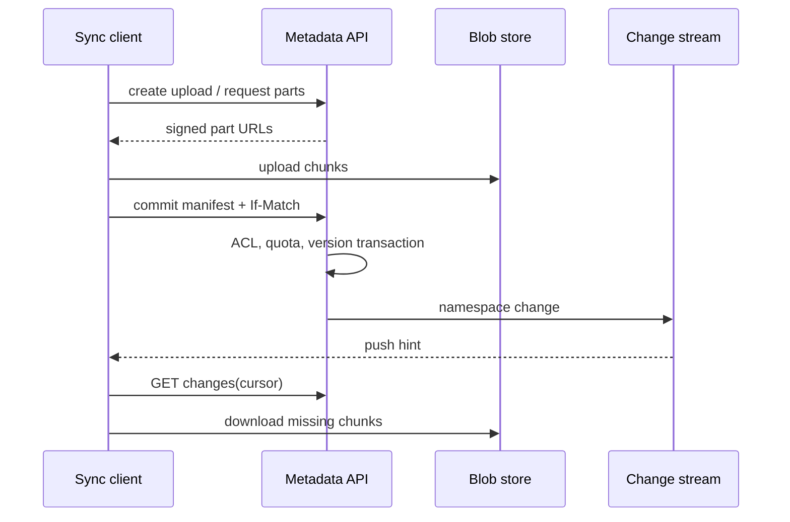
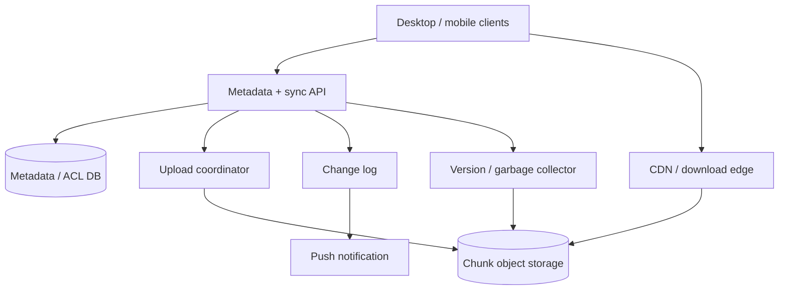

# Design a distributed file storage system (Dropbox/Drive-style)


<!-- question-variants:v1 -->

## Expected question

"Design a distributed file storage system (Dropbox/Drive-style). How do you upload and sync files, deduplicate storage, resolve conflicts, version content, and enforce sharing permissions?"

## Variant forms

Interviewers often ask the same design with different framing — recognize the archetype:

- "Design Dropbox for 100M users syncing desktop and mobile devices."
- "How would you upload a 20GB file reliably over an unreliable connection?"
- "How do you deduplicate identical file blocks without leaking that another user owns them?"
- "Design conflict handling when two offline users edit the same file."
- "How do you separate metadata scale from blob storage scale?"
- "Design file version history and undelete with retention policies."
- "How do you share a folder with view, comment, and edit permissions?"
- "Our sync clients create retry storms after an outage — how do you protect the service?"

## Where this actually gets asked

Classic storage and synchronization prompt in consumer productivity, enterprise collaboration, and
infrastructure interviews. It distinguishes binary-content handling from namespace metadata. Staff+
depth: content-addressed chunks, transactional metadata commits, per-tenant security, conflict
semantics, garbage collection, and client recovery.

## Requirements

**Functional**
- Upload, download, list, move, delete, restore, and version files/folders.
- Sync changes to a user's devices and shared collaborators.
- Resume multipart uploads and deduplicate chunks where policy permits.
- Share resources with ACLs and audit access.

**Non-functional**
- Large files transfer efficiently and survive retry/reconnect.
- File namespace metadata is strongly consistent enough for rename and ACL correctness.
- Blob durability is high; downloads are low latency via cache/CDN.
- Users never read unauthorized files; deletion, retention, and legal hold are enforceable.

## Core entities

- **File node**: node_id, parent_id, name, owner, current_version, type, deleted_at.
- **File version**: version_id, node_id, manifest_id, creator, created_at, etag.
- **Manifest**: ordered chunk hashes, sizes, encryption metadata, total size.
- **Chunk**: content hash, object key, ref_count, checksum, storage class.
- **ACL grant**: resource_id, principal, role, inherited_from, expiry.
- **Change cursor**: account/device, monotonically ordered namespace changes.

## API / interface

```http
POST /v1/uploads
{ "parent_id":"fld_1", "name":"plan.pdf", "size":8388608, "sha256":"..." }
→ 201 { "upload_id":"up_1", "parts":[{"part":1,"url":"signed-object-url"}] }

POST /v1/uploads/up_1/commit
If-Match: "version-14"
{ "manifest":{"chunks":[{"hash":"a1...","size":4194304},{"hash":"b2...","size":4194304}]} }
→ 201 { "node_id":"file_4", "version_id":"v_15", "cursor":"c_998" }
→ 409 version_conflict

GET /v1/changes?cursor=c_998
→ 200 { "changes":[...], "next_cursor":"c_1021" }
```

Staff+ callout: direct upload URLs may bypass the API data path, but final manifest commit must
revalidate authorization, checksums, quota, and the expected namespace version.

## Data Flow

The client chunks and uploads content directly to object storage, then atomically commits a manifest
to the metadata service. A change log fans updates to devices; clients use cursors to repair missed
push messages.



## High-level design

Maps to **functional** requirements: metadata is a transactional namespace service, blobs are
immutable objects, and the sync service distributes ordered change metadata. ACL checks occur before
minting every signed download/upload URL.



Deep dives below target **non-functional** requirements (durability, sync correctness, security,
cost, and failure recovery).

## Deep dive 1: chunks, manifests, and deduplication

Use fixed chunks (for simple parallel upload) or content-defined chunks (better dedup after insertions,
more CPU). Hash every chunk and store a file as an immutable manifest. A 1GB file with 4MB chunks has
256 chunk references, manageable for a manifest row/object. Upload only hashes the server reports as
missing; validate a checksum after storage.

Global cross-tenant dedup can reveal existence ("does this hash already exist?") and complicate key
rotation. Prefer per-tenant dedup or convergent encryption only after a clear threat model. Reference
counting must be transactional with manifest commits or repaired by offline mark-and-sweep; never
delete a blob merely because one retry says it is unreferenced.

## Deep dive 2: metadata, versioning, and conflicts

Metadata needs conditional writes: rename and ACL changes serialize through a node/version revision,
while blobs remain immutable. Each commit makes a new file version, preserving prior manifests for
restore and audit. A versioned path lets a failed client retry idempotently by upload/session id.

For opaque binaries, do not promise automatic merge: preserve both versions as a conflict copy and
surface it. For office-style collaborative documents, delegate to an OT/CRDT editing service and
store snapshots here. Offline clients submit their base version; if it is stale, return a conflict
instead of last-write-wins data loss.

## Deep dive 3: synchronization and sharing ACLs

Append a per-namespace change record with monotonic cursor after each metadata transaction. Push is
only a hint; clients poll `changes(cursor)` on reconnect, apply idempotently, and periodically take
a full snapshot if a cursor expires. Back off with jitter after regional recovery to avoid millions
of client reconnects.

Evaluate ACL inheritance at the metadata service and include a short-lived, resource-scoped signed
URL only after authorization. Do not put a bearer download URL in an indefinitely cacheable public
response. ACL changes must revoke future URL minting immediately; existing URLs have short TTLs.
Audit share, download, and external-link events.

## Deep dive 4: durability, deletion, and operations

Object storage replicates chunks across failure domains; the metadata database uses replicas and
point-in-time recovery. Commit is acknowledged only after required chunk durability and metadata
transaction succeed. Orphan chunks from interrupted uploads receive a TTL and are later swept.

Soft-delete moves a node to trash; retention policy decides when metadata/manifests become eligible
for GC. Legal hold overrides user deletion. Track logical bytes, physical bytes, dedup ratio, upload
resume success, change-log lag, and conflict rate. In 45 minutes, explicitly split metadata from
blobs and describe conflict behavior before discussing smart prefetch.

## What's expected at each level

- **Mid-level:** file DB, upload/download endpoint, object store.
- **Senior:** multipart upload, metadata vs blob separation, sync notifications, version history.
- **Staff+:** manifests/chunks, conditional commits, cursor repair, dedup privacy, ACL URL boundary,
  GC and retention, conflict semantics.
- **Principal:** global residency, enterprise compliance, migration/storage economics, and product
  semantics across files, collaborative docs, and external sharing.

## Follow-up questions to expect

- "Why not store files directly in the relational database?" (Blob cost, IO, backups, and scale.)
- "How do you handle a partially uploaded file?" (Uncommitted chunks are invisible and TTL-cleaned.)
- "Can you deduplicate encrypted files?" (Only with deliberate key/encryption trade-offs.)
- "What does a rename look like during offline sync?" (Conditional metadata update; conflict if stale.)

## Related

- [06 Collaborative document editing](06-collaborative-document-editing.md)
- [07 Distributed cache / CDN](07-distributed-cache-cdn-layer.md)
- [04 Distributed job scheduler](04-distributed-job-scheduler-task-queue.md)
- [05 Distributed unique ID generator](05-distributed-unique-id-generator.md)
