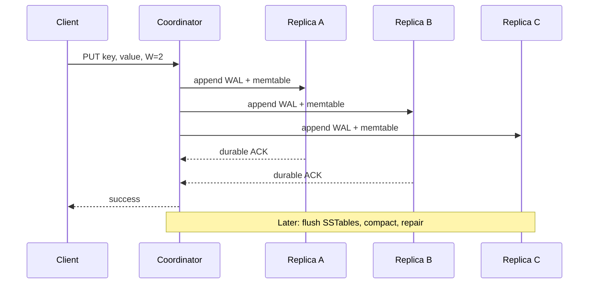
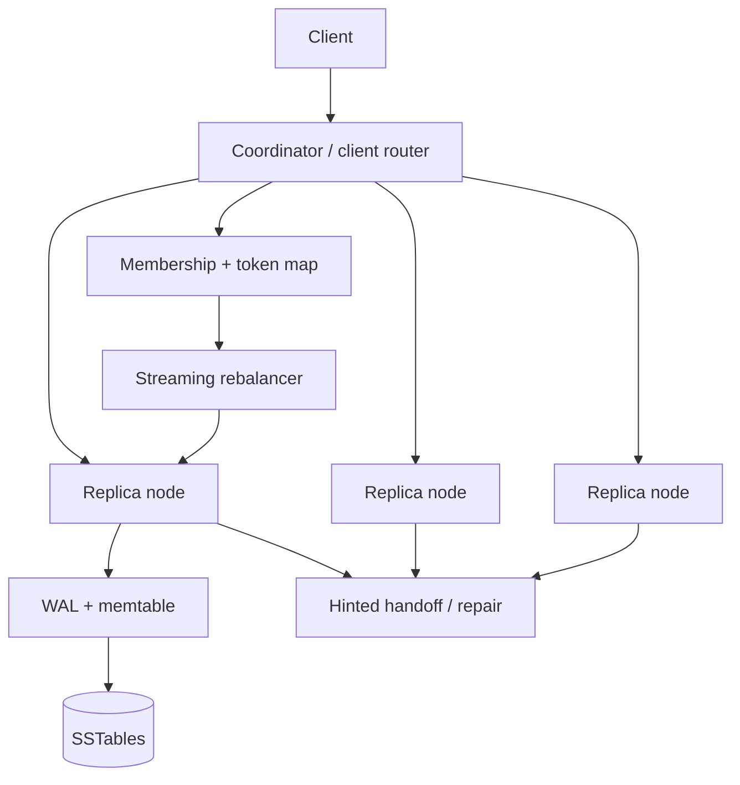

# Design a distributed key-value store


<!-- question-variants:v1 -->

## Expected question

"Design a distributed key-value store. How do you partition and replicate data, choose consistency guarantees, handle node failures, and compact storage at scale?"

## Variant forms

Interviewers often ask the same design with different framing — recognize the archetype:

- "Design a Dynamo/Cassandra-style key-value store for billions of keys."
- "How do you distribute keys when nodes are continuously added and removed?"
- "Design a store that remains writable during a data-center partition."
- "How do quorum reads and writes trade latency for consistency?"
- "What happens when a replica is down during a write?"
- "How do you prevent tombstones from resurrecting deleted values?"
- "Design compaction for an LSM-backed storage engine."
- "Why is this not simply a distributed cache?"

## Where this actually gets asked

Foundational infrastructure prompt in databases, storage, and platform interviews. It is deliberately
broader than a cache/CDN design: data is durable, replicas recover correctness, and clients need
documented consistency semantics. Staff+ depth: partition lifecycle, anti-entropy, conflict policy,
tail latency, and operational controls.

## Requirements

**Functional**
- Put, get, delete, and optionally range/scan within a partition.
- Persist data across process and node failures.
- Replicate each key to configurable replicas and rebalance when membership changes.
- Expose consistency levels (eventual, quorum, or linearizable for selected operations).

**Non-functional**
- Scale horizontally to billions of keys and high mixed read/write throughput.
- Remain available through individual node failures; survive zone failure with appropriate placement.
- Bound data loss and stale-read behavior explicitly, not by implication.
- Recover disk space and read performance through compaction without halting writes.

## Core entities

- **Partition token**: hash range / virtual-node identifier and current replica set.
- **Record**: key, value or tombstone, version/vector clock, TTL, checksum.
- **Replica state**: node, partition, epoch, log/SSTable position, health.
- **Hint**: intended replica, mutation, expiry, delivery status.
- **Membership epoch**: immutable ring/configuration version.
- **Repair digest**: key-range hash tree used for anti-entropy.

## API / interface

```http
PUT /v1/kv/orders/o_491?consistency=QUORUM
If-Version: 18
{ "value":{"status":"paid"}, "ttl_seconds":86400 }
→ 200 { "version":"19:us-east-1a" }
→ 409 version_conflict | 503 insufficient_replicas

GET /v1/kv/orders/o_491?consistency=ONE
→ 200 { "value":{"status":"paid"}, "version":"19:us-east-1a" }

DELETE /v1/kv/orders/o_491?consistency=QUORUM
→ 204
```

Staff+ callout: document whether `QUORUM` means `R + W > N` for a single stable replica set, and
that it does not alone make multi-key operations serializable or protect against sloppy routing.

## Data Flow

A coordinator routes the key to the current virtual-node replica set, writes a durable local log at
each replica, and returns once the requested acknowledgements arrive. Reads consult enough replicas
for the requested consistency and repair stale copies asynchronously or inline.



## High-level design

Maps to **functional** requirements: routing/membership selects replicas, the storage engine persists
local data, and background services converge replicas. The system is not a cache: disk durability,
repair, tombstones, and backup are first-class.



Deep dives below target **non-functional** requirements (availability, consistency, recovery, storage
amplification, and operational safety).

## Deep dive 1: partitioning and replica placement

Hash the key onto a consistent-hash ring with many virtual nodes per physical node, so adding a node
moves only adjacent token ranges and smooths skew. Rendezvous hashing is a credible alternative when
membership is modest and weighted placement matters. Keep a versioned membership epoch; coordinators
must not write blindly to a stale ring during rebalance.

Replicate `N=3` across distinct zones where possible. A hot key still concentrates on one logical
partition, so use application-level bucketing or a different data model for unbounded hot counters.
During streaming, read/write from both old and new owners or use a handoff epoch; do not declare the
move complete until data is copied and repairs verify it.

## Deep dive 2: CAP, quorum, and conflicts

Under a network partition, a Dynamo-style store chooses availability and partition tolerance for
eventual-consistency writes; it may return divergent siblings. With `N=3, W=2, R=2`, `R + W > N`
normally overlaps one replica and reduces stale reads, but tail latency rises and failures can make
the request unavailable. Linearizable operations need a leader/consensus group per shard, sacrificing
some availability during leader election.

| Model | Good for | Trade-off |
|---|---|---|
| Eventual / last-write-wins | carts, telemetry | conflict/lost-update risk |
| Quorum | many durable records | latency and still limited transaction scope |
| Consensus leader | balances, leases | lower write availability / throughput |

Use version vectors or conditional versions for writes that cannot safely resolve by timestamp. Do
not claim CAP means "choose two"; partitions are unavoidable and the real decision is behavior then.

## Deep dive 3: storage engine and compaction

Writes append to a WAL then a memtable; flush produces sorted immutable SSTables. Reads check
memtables, bloom filters, indexes, and a bounded number of SSTables. Size-tiered compaction minimizes
write amplification for write-heavy workloads; leveled compaction controls read amplification at more
rewrite cost. Throttle compaction so it cannot starve foreground IO, but monitor backlog because
unbounded SSTables destroy tail reads.

Deletes are tombstones replicated like values. Retain them longer than maximum replica/hint outage;
otherwise an old replica can resurrect deleted data during repair. TTL expiry also yields tombstones,
so a high TTL churn workload needs capacity planning and compaction observability.

## Deep dive 4: hinted handoff, repair, and failure modes

When an intended replica is down, a healthy node stores a bounded hint and later delivers it. Hints
improve short-outage availability but are not a substitute for anti-entropy. Periodic Merkle-tree
repair compares ranges and streams missing records; run incrementally to avoid saturating the cluster.
Backups/snapshots protect against logical bugs and correlated deletion, which replication does not.

If a coordinator times out, the write may have reached some replicas; retry with a mutation id so
replicas deduplicate. Apply overload shedding before queueing unbounded writes. In 45 minutes, state
the desired consistency per use case, then explain repair; do not conflate this durable store with
the cache/CDN in entry 07.

## What's expected at each level

- **Mid-level:** hash keys, replicate, read from a replica.
- **Senior:** consistent hashing, replication factor, quorum arithmetic, failure detection.
- **Staff+:** membership epochs/rebalance, consistency contract, conflict resolution, LSM compaction,
  tombstones, hinted handoff versus repair, backup and overload behavior.
- **Principal:** product-wide data classification, multi-region consistency tiers, migration strategy,
  operator experience, and cost/SLO governance.

## Follow-up questions to expect

- "How is this different from Redis?" (Durability, replica repair, and consistency are core here.)
- "Can W+R>N guarantee latest reads?" (Only with assumptions; failures, sloppy quorum, and conflicts matter.)
- "How do you support range scans?" (Range partitioning or local sorted keys; hashes make global scans hard.)
- "Why not always use consensus?" (Cost, availability, and throughput must match the data invariant.)

## Related

- [07 Distributed cache / CDN](07-distributed-cache-cdn-layer.md)
- [05 Distributed unique ID generator](05-distributed-unique-id-generator.md)
- [04 Distributed job scheduler](04-distributed-job-scheduler-task-queue.md)
- [01 Distributed rate limiter](01-distributed-rate-limiter.md)
