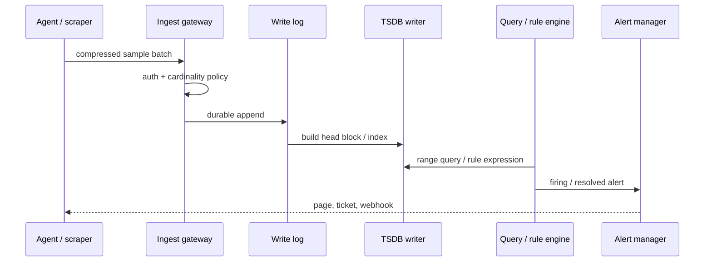
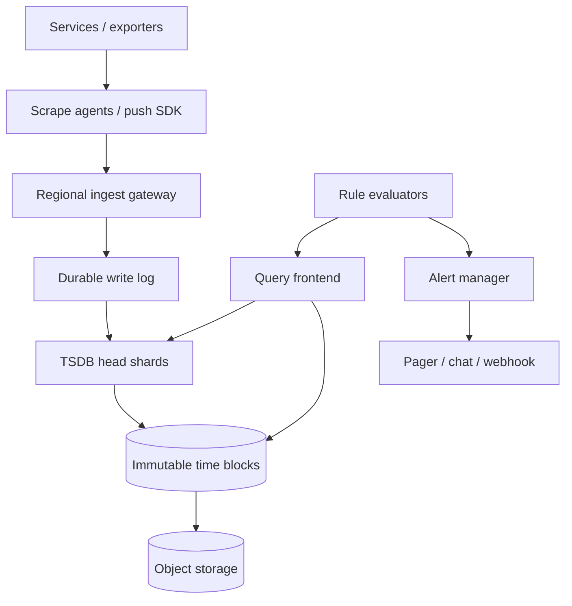

# Design a metrics and monitoring system


<!-- question-variants:v1 -->

## Expected question

"Design a metrics and monitoring system. How do you ingest high-volume time series, control cardinality, aggregate efficiently, query dashboards, and evaluate alerts reliably?"

## Variant forms

Interviewers often ask the same design with different framing — recognize the archetype:

- "Design a Prometheus/Datadog-style monitoring platform for thousands of services."
- "How do you ingest 10M metric samples per second without exploding storage cost?"
- "Our metrics system falls over when customers add request_id as a label — what do you do?"
- "Design scrape versus push collection for short-lived jobs and services."
- "How do you evaluate an alert every minute when raw samples are late or missing?"
- "Design dashboards that query a month of data without scanning every raw point."
- "How do you provide multi-tenant isolation and usage limits for observability?"
- "Our alert manager pages everyone during a regional outage — architect deduplication and routing."

## Where this actually gets asked

Frequent observability/platform design prompt for SRE, infrastructure, and Staff+ application roles.
The important distinction is that metrics are bounded-dimensional numeric streams, not arbitrary logs
or traces. Staff+ depth: cardinality budgets, rollups/retention, alert correctness under late data,
and protecting the monitoring system during the incident it must explain.

## Requirements

**Functional**
- Ingest timestamped metric samples with name, value, labels, tenant, and type.
- Query/filter/aggregate time series for dashboards and APIs.
- Evaluate threshold, rate, and recording-rule alerts; route/deduplicate notifications.
- Support service discovery and both scrape and push collection where appropriate.

**Non-functional**
- Sustain high write volume and fan-in while keeping recent queries interactive.
- Prevent unbounded cardinality, label abuse, and noisy tenants from exhausting resources.
- Preserve alert reliability through partial ingestion/query failures and late samples.
- Apply retention/downsampling, tenant isolation, and access control without losing operability.

## Core entities

- **Series identity**: tenant, metric name, normalized sorted label set, fingerprint.
- **Sample**: series fingerprint, timestamp, value, write sequence.
- **Label index**: label name/value → series IDs for a time block.
- **Rule**: expression, evaluation interval, `for` duration, owner, severity.
- **Alert instance**: rule + deduplicated labels, state, pending_since, last_value.
- **Silence / route**: matcher, duration, receiver, escalation policy.

## API / interface

```http
POST /v1/remote-write
X-Tenant-ID: acme
{ "series":[{"name":"http_requests_total","labels":{"service":"api","code":"200"},
             "samples":[[1720000000,42]]}] }
→ 204

GET /v1/query_range?query=sum(rate(http_requests_total{service="api"}[5m]))&start=...&end=...&step=60
→ 200 { "resultType":"matrix", "result":[...] }

POST /v1/rules
{ "expr":"error_rate > 0.05", "for":"10m", "severity":"page" }
→ 201 { "rule_id":"r_7" }
```

Staff+ callout: reject or relabel dangerous dimensions at ingestion. A `request_id`, email, trace ID,
or unbounded URL path creates one series per event and cannot be repaired by a faster database.

## Data Flow

Agents batch/compress samples to regional ingest gateways. The gateway authenticates, enforces label
and cardinality policy, appends to a write-ahead log, and asynchronously builds time blocks/indexes.
Rule evaluators query the same read path, then a notifier handles alert lifecycle and delivery.



## High-level design

Maps to **functional** requirements: separate ingestion, TSDB storage, query/rule evaluation, and
notification routing so an expensive dashboard cannot block collection or paging.



Deep dives below target **non-functional** requirements (ingestion scale, cardinality, query cost,
alert correctness, and incident resilience).

## Deep dive 1: collection and ingestion

Pull/scrape lets the platform discover target health and avoids exposing a central receiver to every
service; it is ideal for long-running workloads. Push handles ephemeral jobs, mobile/edge, and
network boundaries, but needs identity, buffering, and a way to detect silently dead senders. Many
systems use both with a remote-write protocol.

At 10M samples/sec, batch at agents, delta/compress timestamps and values, shard by tenant plus
series fingerprint, and acknowledge only after a replicated/ durable write-log append. Keep a short
in-memory head for recent reads; flush sorted time blocks to object storage. Rate-limit tenants before
the writer queue grows without bound; local agent WALs buffer short receiver outages.

## Deep dive 2: cardinality explosion

Each unique metric-name-plus-label-set is a series. `http_requests_total{service,method,status}` is
bounded; adding `user_id` or `request_id` turns millions of events into millions of active indexes,
RAM objects, WAL entries, and alert candidates. Enforce per-tenant budgets for active series, label
values, bytes/sec, and query cost. Provide usage dashboards and a reject reason so teams can fix
instrumentation rather than silently lose data.

| Signal | Use for | Avoid as metric label |
|---|---|---|
| service, region, status | aggregate health | unbounded user/request IDs |
| route template | endpoint rate | raw URL/query string |
| build version | rollout correlation | timestamp or commit per request |

For high-cardinality questions, use traces/logs sampled by correlation ID; do not force metrics to
be an event database.

## Deep dive 3: TSDB queries, retention, and aggregation

Store samples in time-partitioned, compressed blocks with a label inverted index. Query frontends
split long ranges by time shard, fan out, merge, and cache common dashboard results. Record rules
precompute expensive expressions (for example, service-level error rate) into new bounded series.

Retain raw 10-second data for days, 1-minute rollups for weeks, and hourly rollups for months—values
depend on product and compliance. Downsampling loses peaks, so alerts and incident drill-down must
use raw retention. Set query time/series limits, partial-result semantics, and fair scheduling; a
single `.*` dashboard should not cause an outage.

## Deep dive 4: alert evaluation and failure modes

Evaluate rules on a fixed schedule with lookback to tolerate minor ingestion delay. Track `pending`
for the configured `for` duration before firing; distinguish no data, stale series, and zero. Dedup
by rule plus stable labels, group related alerts, inhibit symptom alerts when a root cause is firing,
and route by ownership/severity. A notification retry must not create a new alert instance.

Run alert evaluators and storage across zones; cache last known state and make the alert manager
durable. During regional loss, alert on monitoring pipeline health but avoid paging thousands of
downstream services independently. In 45 minutes, make cardinality policy and alert state explicit
before proposing anomaly-detection ML.

## What's expected at each level

- **Mid-level:** collect counters/gauges, store timestamps, show a dashboard and threshold alert.
- **Senior:** agent batching, TSDB shards, labels, retention, Alertmanager-style routing.
- **Staff+:** cardinality governance, write/query isolation, rollups, late-data semantics, alert
  lifecycle, multi-tenant limits, and monitoring-system failure behavior.
- **Principal:** organization-wide instrumentation contracts, SLO policy, cost allocation, and a
  migration path across logs/traces/metrics without tool sprawl.

## Follow-up questions to expect

- "Why scrape instead of push?" (Discovery/health versus ephemeral/network-bound workloads.)
- "How do you alert on absent data?" (Explicit absent/staleness rules, not assumed zero.)
- "What labels are safe?" (Low-cardinality, bounded dimensions with an owner.)
- "Can you aggregate across tenants?" (Only with explicit authorization and privacy policy.)

## Related

- [04 Distributed job scheduler](04-distributed-job-scheduler-task-queue.md)
- [01 Distributed rate limiter](01-distributed-rate-limiter.md)
- [07 Distributed cache / CDN](07-distributed-cache-cdn-layer.md)
- [08 Notification system](08-notification-system.md)
