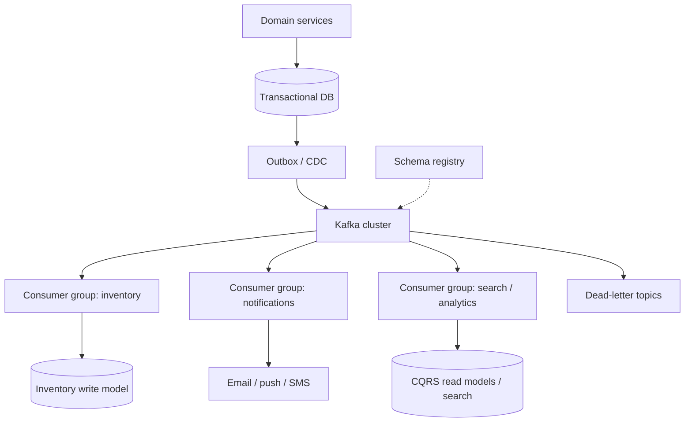

# Design an event-driven architecture with Kafka


<!-- question-variants:v1 -->

## Expected question

"Design an event-driven architecture using Kafka (or a similar log). How do producers and consumers stay decoupled, preserve per-entity ordering, choose delivery semantics, avoid dual-write bugs, and handle failures, lag, and schema change?"

## Variant forms

Interviewers often ask the same design with different framing — recognize the archetype:

- "Design an order / inventory / payment pipeline that communicates via events, not synchronous RPC."
- "When would you choose Kafka over RabbitMQ or SQS — and when would you not?"
- "How do partitions, keys, and consumer groups give you ordering and parallelism?"
- "Explain at-most-once, at-least-once, and exactly-once — what do you actually ship in production?"
- "Our service writes to Postgres and publishes to Kafka — how do you prevent lost or duplicated domain events?"
- "Design a saga for checkout: choreography vs orchestration, and compensating actions."
- "How do Event Sourcing and CQRS relate to Kafka — and when are they overkill?"
- "Consumer lag spiked during a rebalance storm — how do you diagnose and harden the system?"

## Where this actually gets asked

High-frequency classic for backend, platform, data, and Staff+ loops wherever microservices,
streaming, or async workflows appear. Public prep sources (system-design guides, Kafka interview
compilations for 2025–2026) converge on the same cluster of probes: log vs queue, partition key
choice, consumer groups, delivery semantics, outbox/CDC, saga, schema evolution, DLQ, and lag.
Company-specific "leaked question" attributions are noisy in SEO content; treat this as a
well-established archetype grounded in how Kafka actually works (append-only partitioned log,
independent consumer offsets, retention/replay) rather than a single named company's interview
script. Adjacent prompts in this repo ([08 Notification](08-notification-system.md),
[14 Payments](14-payment-processing-system.md), [04 Job scheduler](04-distributed-job-scheduler-task-queue.md))
use queues/outbox pieces; this entry is the dedicated EDA/Kafka deep dive.

## Requirements

**Functional**
- Producers publish domain facts (events) and/or directed work (commands) to named topics.
- Multiple independent consumer groups process the same stream at their own pace (inventory,
  notifications, analytics, audit).
- Preserve ordering where the business requires it (usually per aggregate / entity id).
- Support replay, backfill, and new consumers bootstrapping from retained history.
- Coordinate multi-service workflows without distributed 2PC (saga / compensation).

**Non-functional**
- High write throughput with horizontal scale via partitions; no single broker SPOF for the log.
- Explicit delivery contract: default at-least-once + idempotent handlers; escalate to stronger
  guarantees only where side effects demand it.
- Survive broker loss, consumer crashes, poison messages, rebalances, and partial downstream outages.
- Evolve event schemas without breaking old or new consumers.
- Operability: lag SLOs, DLQ, tracing (`event_id` / correlation id), and clear ownership per topic.

## Core entities

- **Event**: immutable fact (`event_id`, `type`, `aggregate_id`, `occurred_at`, `payload`, `schema_version`).
- **Topic / partition**: named stream; partition is the ordered append-only unit of parallelism.
- **Producer**: chooses key → partition; configures acks / idempotence / transactions.
- **Consumer group**: set of consumers sharing partition assignment; one partition → one member.
- **Offset**: per-group progress cursor within a partition (committed after successful handling).
- **Outbox / CDC relay**: durable bridge from DB transaction to the log (dual-write fix).
- **Dead-letter topic (DLT)**: quarantine for poison / non-retryable failures after policy exhausts.

## API / interface

Events are the interface. Prefer a versioned envelope over ad-hoc JSON blobs:

```http
# Logical produce (SDK / gateway), not a public REST contract for every domain write
POST /internal/events
{
  "topic": "orders.events",
  "key": "order_491",
  "event": {
    "event_id": "evt_01J...",
    "type": "OrderCreated",
    "aggregate_id": "order_491",
    "occurred_at": "2026-07-23T20:00:00Z",
    "schema_version": 3,
    "payload": { "customer_id":"c_9", "total_cents":4999, "currency":"USD" }
  }
}
→ 202 { "topic":"orders.events", "partition":7, "offset":1048821 }
```

Staff+ callout: distinguish **commands** (imperative, directed, may be rejected) from **events**
(facts that already happened; consumers decide independently). Mixing them without naming the
contract is a common interview failure mode.

## Data Flow

A write-side service persists its state and an outbox row in one DB transaction. A relay publishes
to Kafka. Independent consumer groups read, handle side effects idempotently, and commit offsets.
Failures retry with backoff; poison messages go to a DLT with an operator path.

```mermaid
sequenceDiagram
  participant API as Order API
  participant DB as Order DB + outbox
  participant Relay as Outbox / CDC relay
  participant K as Kafka topic
  participant Inv as Inventory group
  participant Nfy as Notify group
  API->>DB: INSERT order + outbox (same txn)
  Relay->>DB: claim unpublished outbox rows
  Relay->>K: Produce OrderCreated (key=order_id)
  K-->>Inv: poll / process / commit offset
  K-->>Nfy: poll / process / commit offset
  Note over Inv,Nfy: Independent offsets; replay possible within retention
```

## High-level design

Maps to **functional** requirements: Kafka is the durable fan-out backbone; services own their
write models; projections and side-effect workers are separate consumer groups. Prefer outbox or
CDC over "write DB then produce" in application code.



Deep dives below target **non-functional** requirements (ordering/scale, delivery, dual-write,
sagas, operability).

## Deep dive 1: partitions, keys, ordering, and consumer groups

Kafka is a distributed **commit log**, not a task queue that deletes messages on ack. Retention
(time or size; optionally log-compacted for keyed latest-value topics) lets multiple groups and
future services read the same history.

| Concept | Interview-ready fact |
|---|---|
| Partition | Ordered, immutable log shard — unit of parallelism and ordering |
| Key | Same key → same partition → per-key order; bad keys create hot partitions |
| Consumer group | Each partition assigned to ≤1 member in the group; max useful parallelism ≈ partition count |
| Independent groups | Inventory and notifications each see every event; offsets are per group |

Choose partition count from target throughput and consumer parallelism, with headroom for growth;
increasing partitions later does not rehash historical key→partition mapping the way people hope.
For entity workflows (orders, accounts), key by `order_id` / `account_id`. For pure throughput with
no order needs, null keys / round-robin is fine — say so explicitly.

Rebalances (member join/leave/crash) pause consumption briefly and can cause "rebalance storms" if
session timeouts, slow `poll` processing, or frequent deploys churn membership. Mitigations:
static membership / cooperative sticky assignors, process records within `max.poll.interval`,
scale partitions thoughtfully, and avoid doing heavy work while holding the consumer loop hostage.

## Deep dive 2: delivery semantics (what you actually ship)

| Semantic | How it roughly arises | Honest use |
|---|---|---|
| At-most-once | Commit/ack before side effect, or fire-and-forget produce | Metrics/logs where loss is OK |
| At-least-once | Produce with retries; process then commit offset | Default for business events |
| Exactly-once | Idempotent producer + transactions (read-process-write) and/or idempotent business effects | Narrow paths; still not "exactly once every side effect in the universe" |

Staff+ answer interviewers want: **end-to-end exactly-once across email, cards, and third parties
does not exist**. What exists is (a) Kafka EOS for the Kafka↔Kafka / transactional boundary, and
(b) **effectively-once business outcomes** via idempotency keys, dedupe stores, and upserts.
Prefer at-least-once + idempotent consumers unless you have a measured need for transactional
produce/consume.

Producer durability knobs matter: `acks=all` with a sane `min.insync.replicas`, idempotent producer
(`enable.idempotence=true`) to kill producer-retry duplicates, and careful retry/backoff. Consumer:
manual commit after side effects succeed; on retryable failure, do not advance the offset; on poison
messages, DLT + skip according to policy (never silently drop money-moving events).

## Deep dive 3: dual-write, outbox, and CDC

The classic bug: `BEGIN; UPDATE orders; COMMIT;` then `kafka.produce(...)` — process crashes and
the event is lost — or produce succeeds and DB rolls back and you emit a lie. Fixes:

1. **Transactional outbox** — same DB transaction writes business row + outbox row; a relay
   publishes and marks published (or deletes). At-least-once publish → consumers must be idempotent.
2. **CDC** (e.g. Debezium) — treat the DB WAL as the source of truth and derive topics; still need
   schema discipline and tombstone/delete semantics.
3. **Listen to yourself** — only emit after commit, accept rare loss, or use inbox patterns on the
   other side — usually weaker than outbox for domain events.

Pair with an **inbox / processed_events** table on the consumer keyed by `event_id` (or
aggregate+version) so redelivery is a no-op. For Kafka Streams-style read-process-write into another
topic, transactional APIs can atomically commit offsets + output records — still wrap external side
effects carefully.

## Deep dive 4: sagas, CQRS, event sourcing — use with judgment

**Saga** replaces 2PC across services: a sequence of local transactions with compensations.

| Style | Strength | Weakness |
|---|---|---|
| Choreography | Few services, simple happy path, less central coupling | Hard to see the whole graph; cyclic event chatters |
| Orchestration | Explicit state machine, easier timeouts/compensions/visibility | Orchestrator ownership and availability become critical |

Compensations are semantic undos (release inventory, refund) — not time travel. Make them
idempotent. Delay irreversible steps (send gift email) until the saga is safe to complete.

**CQRS** separates write model from denormalized read models updated by consumers — great when read
shapes diverge and scale differently; overkill for a single CRUD service.

**Event sourcing** stores the append-only decision log as the source of truth and rebuilds state by
replay (+ snapshots). Powerful for audit/temporal queries; costly for casual domains (debugging,
migrations, PII redaction, snapshot strategy). Many teams want "events for integration" without
full event-sourced aggregates — say that out loud.

## Deep dive 5: schemas, lag, DLQ, and failure modes

- **Schema evolution**: registry + Avro/Protobuf/JSON Schema; prefer additive compatible changes;
  version the envelope; never silently reinterpret fields.
- **Consumer lag**: alert on lag age and lag messages; causes include slow handlers, underscaled
  consumers, hot partitions, downstream dependency latency, or GC/stop-the-world. Fix the bottleneck
  before blindly adding consumers past partition count.
- **DLT / retry topics**: bounded retries with jitter; quarantine poison payloads; include failure
  reason headers; define who pages on DLT depth.
- **Idempotency vs ordering**: per-key order does not remove duplicates; duplicates do not remove
  the need for per-key order when state machines care.
- **Kafka vs RabbitMQ/SQS**: choose Kafka for durable multi-subscriber streams, replay, and high
  throughput event buses; choose a classic queue for task dispatch, complex routing, or simpler
  ops when you do not need a log. Wrong tool is a Staff- level smell.

## What's expected at each level

- **Mid-level:** topics, producers/consumers, basic async fan-out diagram.
- **Senior:** partitions/keys/groups, at-least-once + idempotency, retries/DLQ, lag awareness.
- **Staff+:** outbox/CDC dual-write fix, saga choice, schema evolution, rebalance/lag operations,
  honest EOS story, and when *not* to use Kafka or event sourcing.
- **Principal:** org-wide event taxonomy/ownership, multi-tenant or multi-region stream strategy,
  compatibility policy, and cost/retention governance for the log as a platform.

## Follow-up questions to expect

- "How do you pick the partition key?" (Entity id for order; watch hot keys like `tenant=1`.)
- "What if a consumer is down for a day?" (Retention must cover the outage; lag catch-up plan.)
- "How do you test consumers?" (Contract tests on schemas; deterministic handlers; testcontainers /
  embedded cluster for integration; golden event fixtures.)
- "Is the outbox synchronous with the user request?" (User waits on DB commit; publish is async
  via relay — bound the publish delay with metrics.)

## Related

- [08 Notification system](08-notification-system.md)
- [14 Payment processing](14-payment-processing-system.md)
- [04 Distributed job scheduler / task queue](04-distributed-job-scheduler-task-queue.md)
- [17 Metrics and monitoring](17-metrics-monitoring-system.md)
- [../coding/09-design-inmemory-pubsub.md](../coding/09-design-inmemory-pubsub.md)
- [../coding/19-idempotent-event-consumer.md](../coding/19-idempotent-event-consumer.md)
