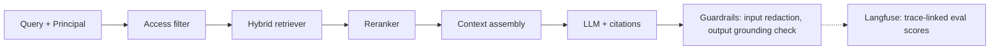

# Design a governed RAG platform for enterprise documents

## The question, as it might actually be asked

"Design a retrieval-augmented generation system for an enterprise knowledge base. Employees
across different departments and clearance levels need to ask questions and get grounded,
cited answers — but a support engineer should never see a document only Legal is allowed to
read, even if the retrieval system thinks it's the best-matching document for their query."

## Real system

[enterprise_rag_platform](https://github.com/vpeetla-ai/enterprise_rag_platform) — a working
reference implementation, not a diagram-only design.

## The trade-off most candidates get wrong

The instinctive design is: retrieve the top-k most relevant chunks, generate an answer, *then*
check whether the caller was allowed to see what got cited. That ordering is backwards. If
access control runs after ranking, an unauthorized document can still leak into the LLM's
context window even if the final citation gets redacted — the model has already read it, and a
sufficiently leading follow-up question can extract it anyway.

**Real decision (ADR-002, "authorization before ranking"):** `AccessPolicy` filters chunks by
the caller's `Principal` (tenant, groups, clearance) *before* they ever reach the retriever's
scoring step. An unauthorized chunk is never scored, never reranked, never assembled into
context — it's as if it doesn't exist for that query. This is table stakes for regulated
industries and the single most commonly-missed detail in system-design interviews on this topic.

## The second trade-off: what "governed" actually costs

Access-before-ranking is only as trustworthy as the `Principal` it's given. The reference
implementation's `Principal` (`tenant_id`, `groups`, `clearance`) is **client-asserted** — the
API trusts whatever the request body claims, the same way many early-stage RAG systems do.

**Real decision (ADR-0004, api-auth-and-principal-trust):** an API-key gate was added to close
"anyone can call this API at all" — but that's a different guarantee from "anyone can claim any
identity in the request body." A real deployment must derive `Principal` from a verified
identity token (JWT/OIDC claims), never trust it from the request. The reference implementation
documents this gap explicitly in its risk register rather than silently pretending
access-before-ranking is a complete guarantee on its own — a real architect's job is knowing
which guarantee you actually have, not just which one you designed for.

## The third trade-off: what proves a chunk should be trusted

**Real decision (ADR-0005, ingestion-data-contract-and-lineage):** ingestion rejects documents
with no owner, no source URI, or near-empty content — a real 422, not a silent accept. Every
chunk carries a real content hash and ingestion timestamp, preserved through every
transformation (entity tagging, graph expansion, the optional Qdrant-backed persistent store).
Discovered while building this: three separate places in the codebase reconstructed a chunk
object explicitly and would have silently dropped lineage fields back to defaults — caught by
writing a test that reconstructed each path and asserted lineage survived.

## What would be different if the constraints changed

- **If this needed multi-region compliance (data residency):** the in-memory retriever
  wouldn't scale; you'd need per-region vector store instances with a routing layer keyed on
  tenant residency, not just tenant ID.
- **If query volume were 100x higher:** the access filter still runs first, but you'd want it
  pushed into the vector store's own filtering (e.g., Qdrant's payload-based pre-filtering)
  rather than filtering the retriever's full candidate set in application code.
- **If Principal trust were the top priority over cost:** you'd add OIDC/JWT verification
  before anything else — cheaper to build, more valuable to fix first, than any retrieval
  quality improvement.

## Related

- [ADR-002: Authorization before ranking](https://github.com/vpeetla-ai/ai-architecture-portfolio/blob/main/adr/ADR-002-authorization-before-ranking-rag.md)
- [enterprise_rag_platform ADR-0004: API auth and principal trust](https://github.com/vpeetla-ai/enterprise_rag_platform/blob/main/docs/adr/0004-api-auth-and-principal-trust.md)
- [enterprise_rag_platform ADR-0005: Ingestion data contract + lineage](https://github.com/vpeetla-ai/enterprise_rag_platform/blob/main/docs/adr/0005-ingestion-data-contract-and-lineage.md)
