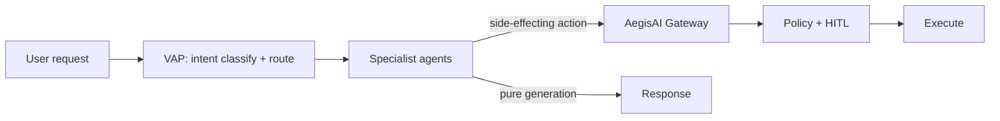

# Design a multi-agent orchestrator

## The question, as it might actually be asked

"Design a system where a user's request gets routed to the right specialist agent — research,
content generation, code review, whatever — and the results get assembled into one coherent
response. How do you decide which agent handles what, and how do agents talk to each other?"

## Real system

[venkat-ai-platform (VAP)](https://github.com/vpeetla-ai/venkat-ai-platform) — a LangGraph-based
router with specialist workers, plus a second, separate governance layer
([AegisAI](https://github.com/vpeetla-ai/aegisai-enterprise-agent-platform)) that most designs
conflate with orchestration.

## The trade-off most candidates get wrong

The instinctive design merges "who decides what to do" and "who's allowed to do it" into one
system — one big agent framework that both routes work and enforces policy. That coupling looks
simpler at first but breaks down: orchestration logic changes constantly (new specialist agents,
new routing intents, new LangGraph nodes), while governance logic needs to change *rarely* and
*auditably* (policy changes are compliance events, not routine deploys).

**Real decision (ADR-001, orchestration-vs-governance-split):** VAP owns orchestration —
routing, specialist delegation, response assembly. AegisAI owns governance — policy decisions,
human-in-the-loop approval, signed audit — as a genuinely separate system, not a module inside
VAP. Side-effecting actions (anything that isn't "generate text back to the user") get routed
through AegisAI's gateway regardless of which orchestrator triggered them.

## The trade-off in real agent-to-agent communication

Most system-design answers wave their hands at "agents communicate via an API." The real
question is: does that API follow any actual protocol convention, or is it just ad hoc HTTP?

**Real decision (ADR-013, bidirectional MCP + real A2A discovery):** VAP exposes a genuine A2A
(Agent-to-Agent) discovery surface — `GET /orchestrators/{id}/agent-card` returns what an
orchestrator can do before anyone invokes it. A separate consumer repo
([AegisLoop](https://github.com/vpeetla-ai/aegisloop-agentops-workbench)) originally delegated
missions to VAP by guessing the target orchestrator from a hardcoded map and POSTing straight to
`/run` — a working integration, but not actually using the A2A protocol surface that already
existed. The fix: call the real agent-card endpoint first, and only proceed if that discovery
succeeds. Small change, but the difference between "two services that happen to talk to each
other" and "a genuine protocol handshake."

## What would be different if the constraints changed

- **If specialist agents needed to run on different infrastructure (e.g., a GPU-bound model
  serving cluster):** the in-process LangGraph delegation used internally would need to become
  real network calls between services — which is exactly what the VAP↔AegisLoop A2A wiring
  above already demonstrates as a pattern, just not yet applied to VAP's *own* internal
  specialists.
- **If governance policy needed per-tenant customization:** AegisAI's policy engine (OPA-based,
  with a builtin fallback) already supports this shape — the separation from VAP is what makes
  per-tenant policy changes safe to ship without touching orchestration code at all.

## Related

- [ADR-001: Orchestration vs governance split](https://github.com/vpeetla-ai/ai-architecture-portfolio/blob/main/adr/ADR-001-orchestration-vs-governance-split.md)
- [ADR-013: Bidirectional MCP + real A2A discovery](https://github.com/vpeetla-ai/ai-architecture-portfolio/blob/main/adr/ADR-013-mcp-exposure-and-real-a2a-delegation.md)
