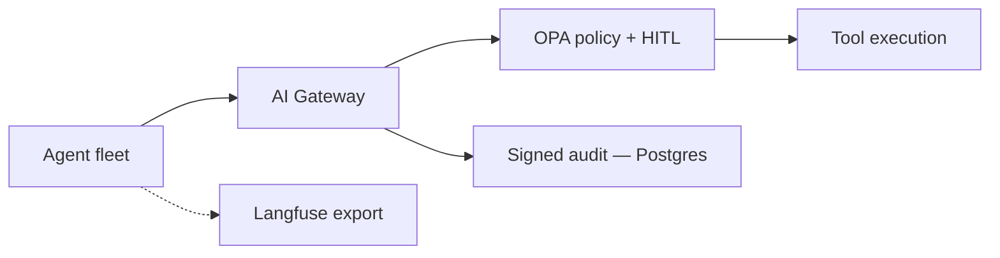

# Design an agent governance control plane

## The question, as it might actually be asked

"Your company has a dozen AI agents doing real work — issuing refunds, updating CRM records,
pushing code changes. How do you prevent an agent from doing something catastrophic, and how
do you prove to an auditor what actually happened?"

## Real system

[aegisai-enterprise-agent-platform](https://github.com/vpeetla-ai/aegisai-enterprise-agent-platform) —
"Monitor → Govern → Remediate," a runtime control plane in front of production agents, not
another agent framework.

## The trade-off most candidates get wrong

The instinctive design puts policy checks *inline* in each agent's code — "before this agent
calls the refund API, check if it's allowed to." That scales badly: every new agent
reimplements the check, and there's no single place to see what any agent is allowed to do
across the whole fleet.

**Real decision:** a gateway SDK all agents call through, so every side-effecting tool call
passes through the same policy engine and the same audit trail regardless of which agent or
which orchestrator triggered it (see [system-design/02](02-design-a-multi-agent-orchestrator.md)
for how this connects to VAP). Side-effecting calls above a risk threshold require human
approval before execution — not optional, not agent-configurable.

## The trade-off in "fail open vs. fail closed"

**Real decision:** OPA (the declarative policy engine) is advisory, not a hard dependency — if
OPA itself is unavailable, the system falls back to a builtin policy simulator rather than
blocking every agent action. This is a real, disclosed trade-off: availability over strict
enforcement when the *enforcement mechanism itself* is down, not when a policy says no. A
system-design interview answer that says "always fail closed" without qualification is missing
this nuance — the right default depends on whether the failure is in the policy answer or in
the policy *engine*.

## The trade-off in exposing this to external tools (MCP)

**Real decision (aegisai ADR-0005, MCP tool exposure):** the gateway already gated *outbound*
MCP tool calls (an agent calling out to an external MCP server like GitHub or Slack) — but had
no way to expose the platform's *own* governed capabilities (registry, budget, kill-switch,
orchestrator runs) as MCP tools an external client like Claude Code could call. Adding that
outbound-exposure surface meant every external MCP call still routes through the same governed
core — `run_website_build` over MCP calls the exact same orchestrator object an HTTP caller
would, with the same FinOps metering and kill-switch enforcement. The design principle: a new
protocol surface should be a thin adapter over existing governed logic, never a second,
parallel path that could accidentally bypass it.

## What would be different if the constraints changed

- **If regulatory audit requirements tightened (SOC2, financial services):** the audit signing
  (currently local HMAC) would need to move to a cloud HSM/KMS-backed signing key — already
  flagged as the enterprise recommendation in the platform's own posture endpoint, not a
  hypothetical gap discovered here.
- **If agent count grew from a dozen to hundreds:** the policy engine's per-call OPA evaluation
  would need caching/batching; the audit trail (currently Postgres) would need partitioning by
  tenant and time window to keep query performance predictable.

## Related

- [ADR-004: Gateway + HITL for side effects](https://github.com/vpeetla-ai/ai-architecture-portfolio/blob/main/adr/ADR-004-gateway-hitl-side-effects.md)
- [aegisai ADR-0003: Orchestrator auth gate](https://github.com/vpeetla-ai/aegisai-enterprise-agent-platform/blob/main/adr/0003-orchestrator-auth-gate.md)
- [aegisai ADR-0005: MCP tool exposure](https://github.com/vpeetla-ai/aegisai-enterprise-agent-platform/blob/main/adr/0005-mcp-tool-exposure.md)
